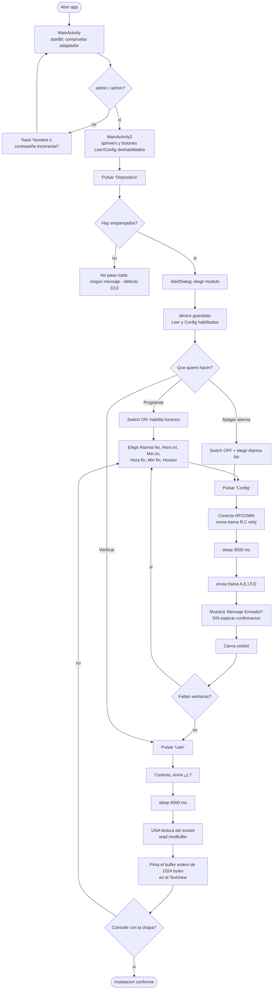
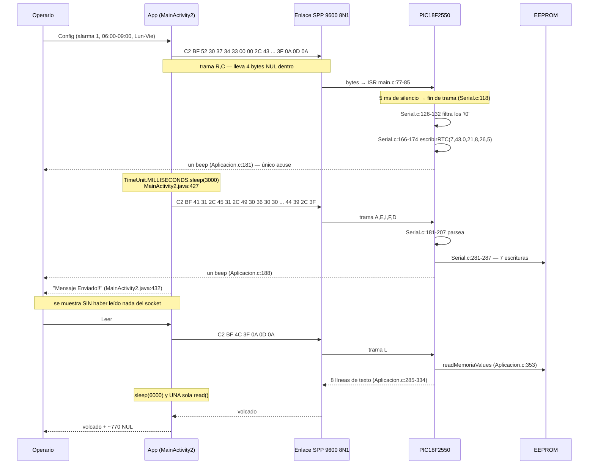
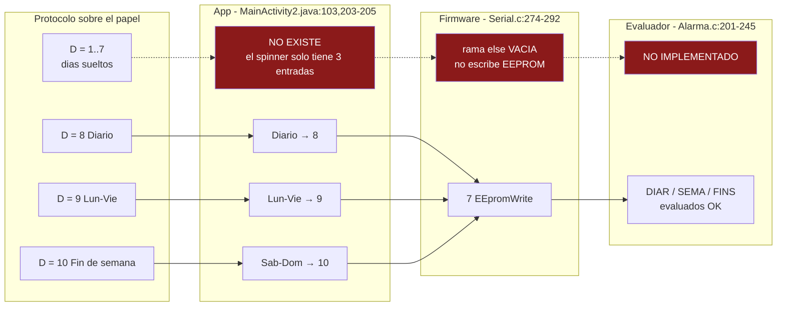
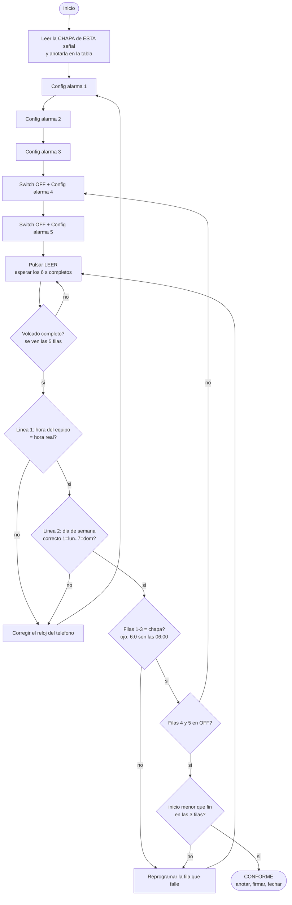

# APP MÓVIL Y CONTRATO DE TRAMAS — Baliza «30 CUANDO ACTIVADA»

**Ámbito.** Este documento cubre la aplicación Android `BalizaV10` y el protocolo serie que la une con el firmware del PIC18F2550. **No** cubre Bluetooth como tecnología (emparejamiento, HC-05/HC-06, permisos de runtime, alcance): eso está en `BLUETOOTH.md`.

**Premisa.** El hardware ya está fabricado y es fijo. Aquí no se proponen cambios de hardware.

---

## 0. Por qué importa cada comprobación de este documento

La baliza hace titilar la luz de una señal vial que dice «30 CUANDO ACTIVADA» en zona escolar. **Cuando la luz titila, el límite de 30 km/h está vigente.** El horario en que debe titilar va impreso en una chapa atornillada a la señal:

| Ventana | Inicio | Fin |
|---|---|---|
| 1 | 06:00 | 09:00 |
| 2 | 11:30 | 13:30 |
| 3 | 15:00 | 16:30 |

Si la app graba un horario distinto del que dice la chapa, **la señal miente a los conductores**: o bien el límite figura vigente cuando no lo es, o bien los niños cruzan sin que la señal esté activa. La app no confirma nada de lo que envía (§4.9). Por eso todo el procedimiento de campo (§5) se apoya en pedir el volcado al equipo y compararlo contra la chapa, no en lo que la app dice en pantalla.

**Inventario de ficheros analizados**

| Fichero | Líneas | Rol |
|---|---|---|
| `1 Firmware/Doc Aplicativo Movil/BalizaV10/app/src/main/java/com/example/balizav10/MainActivity.java` | 149 | Pantalla de login |
| `1 Firmware/Doc Aplicativo Movil/BalizaV10/app/src/main/java/com/example/balizav10/MainActivity2.java` | 536 | Pantalla de programación + toda la lógica de trama y socket |
| `.../res/layout/activity_main.xml` | 47 | Layout login |
| `.../res/layout/activity_main2.xml` | 161 | Layout programación |
| `.../main/AndroidManifest.xml` | 25 | Permisos y actividades |
| `.../app/build.gradle` | 47 | SDK y dependencias |
| `1 Firmware/Doc mplabx/18f2550_baliza_ V1.X/Serial.h` | 116 | **Definición de los identificadores del protocolo** |
| `.../Serial.c` | 564 | Parser de trama y escritura a EEPROM |
| `.../Aplicacion.c` | 409 | `readDevide()` — la respuesta en texto |
| `.../Alarma.c` | ~520 | Evaluación de días y horas |
| `.../main.c`, `.../UART.h` | — | ISR de recepción, 9600 8N1 |

---

## 1. Qué hace la app, pantalla por pantalla

La app tiene **dos actividades** (`AndroidManifest.xml:15-22`). No hay fragments, ni servicios, ni base de datos, ni persistencia de ningún tipo.

### 1.1 `MainActivity` — login

Layout `activity_main.xml`. Tres controles:

| Control | ID | Fichero:línea | Qué hace |
|---|---|---|---|
| `EditText` Nombre | `idEditTxName` | `activity_main.xml:21-33` | Texto libre |
| `EditText` Contraseña | `idEditTxtPass` | `activity_main.xml:35-46` | `inputType="textPassword"` |
| `Button` ENTRAR | `idBtEntrar` | `activity_main.xml:9-19` | Valida y pasa a `MainActivity2` |

**Al arrancar** (`MainActivity.java:41`) se llama `startBt()` (`MainActivity.java:56-75`), que:

- si no hay adaptador Bluetooth → Toast «Este Dispositivo no soporta Bluetooth» y `return` (`MainActivity.java:59-63`);
- si el Bluetooth está apagado → Toast «EL Bluetooth esta Apagado» y lanza el intent `ACTION_REQUEST_ENABLE` (`MainActivity.java:64-69`);
- si está encendido → Toast «EL Bluetooth esta Encendido» (`MainActivity.java:72`).

El `onActivityResult` que debería reaccionar a esa petición **está comentado entero** (`MainActivity.java:103-118`). La app nunca se entera de si el usuario aceptó encender el Bluetooth.

**Al pulsar ENTRAR** (`MainActivity.java:45-52` → `changeActivity2()`, `MainActivity.java:120-147`):

```java
if(sName.equals("admin"))
    if(sPass.equals("admin"))   →  startActivity(MainActivity2)
```

Credenciales **cableadas en el código**: `admin` / `admin` (`MainActivity.java:127,129`). Cualquier otra combinación da Toast «Nombre o contraseña Incorrecta!!». Los campos se limpian siempre (`MainActivity.java:144-145`).

El login **no protege nada**: no cifra, no autentica contra el equipo, no impide que otra app cualquiera se conecte al mismo módulo Bluetooth y mande las mismas tramas. Es un adorno.

### 1.2 `MainActivity2` — programación

Layout `activity_main2.xml`. Toda la funcionalidad real está aquí.

**Controles**

| Control | ID | Definido en | Valores | Poblado en |
|---|---|---|---|---|
| `TextView` salida | `idTxtViewOut` | `activity_main2.xml:33-41` | 305dp × 291dp, **sin scroll** | `MainActivity2.java:86` |
| `Button` Dispositivo | `idBtnDispositivo` | `activity_main2.xml:10-20` | — | `MainActivity2.java:87` |
| `Button` Leer | `idBtnLeer` | `activity_main2.xml:22-31` | arranca deshabilitado | `MainActivity2.java:88,128` |
| `Button` Config | `idBtnConf` | `activity_main2.xml:43-52` | arranca deshabilitado | `MainActivity2.java:89,129` |
| `Switch` ON-OFF | `idSwEn` | `activity_main2.xml:74-82` | — | `MainActivity2.java:90` |
| `Spinner` Alarma No | `idSpNoAlarm` | `activity_main2.xml:65-72` | `1,2,3,4,5` | `MainActivity2.java:100,111` |
| `Spinner` Hora inicio | `idSpHourInit` | `activity_main2.xml:95-102` | 23 horas (**falta "02"**) | `MainActivity2.java:101,112` |
| `Spinner` Min inicio | `idSpMinInit` | `activity_main2.xml:104-111` | `00,05,…,55` (paso 5) | `MainActivity2.java:102,113` |
| `Spinner` Hora fin | `idSpHourEnd` | `activity_main2.xml:124-131` | mismo array, **falta "02"** | `MainActivity2.java:101,115` |
| `Spinner` Min fin | `idSpMinEnd` | `activity_main2.xml:133-140` | `00,05,…,55` | `MainActivity2.java:102,116` |
| `Spinner` Horario | `idSpHorario` | `activity_main2.xml:153-160` | `Diario`, `Lun-Vie`, `Sab-Dom` | `MainActivity2.java:103,118` |

**Estado inicial** (`MainActivity2.java:120-129`): los cinco spinners de hora/minuto/horario están **deshabilitados**, y los botones `Leer` y `Config` también. Sólo `Dispositivo` y el spinner de nº de alarma y el switch están activos.

**Qué ocurre al tocar cada control**

| Acción | Manejador | Efecto |
|---|---|---|
| Switch ON | `MainActivity2.java:132-158` | `bOnOffAlarm = true`; habilita los 5 spinners de horario |
| Switch OFF | `MainActivity2.java:147-155` | `bOnOffAlarm = false`; deshabilita los 5 spinners |
| **Dispositivo** | `MainActivity2.java:226-234` → `querypaired()` `:278-323` | Lista los emparejados en un `AlertDialog`; al elegir uno, guarda `device`, pone el nombre en el botón y **habilita `Leer` y `Config`** (`:309-314`) |
| **Leer** | `MainActivity2.java:236-245` | `bReadConf = false` → `startClient()` → envía `¿L?` y espera el volcado |
| **Config** | `MainActivity2.java:161-223` | `bReadConf = true`; construye **dos** tramas (reloj y configuración) y las envía → `startClient()` |

**Qué construye el botón Config**, en orden (`MainActivity2.java:166-221`):

1. `bReadConf = true` (`:166`).
2. Toma la hora del **teléfono** con `SimpleDateFormat("HHmm ddMMyy-u")` (`:169-171`) y arma la trama de reloj+calendario (`:182`).
3. Si el switch está ON (`:194-209`): lee los seis spinners, traduce la etiqueta de horario a código numérico (`:203-205`) y arma `¿A…,E1,I…,F…,D…,?`.
4. Si el switch está OFF (`:210-216`): arma sólo `¿A…,E0,?`.
5. `startClient()` (`:221`) lanza un hilo que abre el socket RFCOMM, manda, y cierra.

**Sólo se programa una alarma por pulsación.** El nº de alarma es un único `Spinner` (`:196`). Para las tres ventanas de la chapa hacen falta **tres pulsaciones de Config**, y cada una abre y cierra su propia conexión y **reenvía la hora del reloj**.

### 1.3 Diagrama de flujo del usuario



---

## 2. EL CONTRATO DE TRAMAS

Esta es la sección principal. **El protocolo no está definido en ningún sitio salvo en el propio código de los dos extremos.** No hay fichero de especificación, ni constantes compartidas, ni tests. Si uno de los dos lados cambia un carácter, el comando **se pierde en silencio**: no hay error, ni reintento, ni NAK. La app dirá «Mensaje Enviado!!» exactamente igual.

### 2.1 Capa física y trama

| Parámetro | Valor | Dónde |
|---|---|---|
| Velocidad | 9600 baudios | `main.c:117` (`UART_init_baud(9600)`), `UART.h:14` (`SPBRG = 129`, BRGH=1 @20 MHz) |
| Formato | 8 bits, sin paridad, 1 stop | `UART.h:11-17` |
| Perfil Bluetooth | SPP, UUID `00001101-0000-1000-8000-00805F9B34FB` | `MainActivity2.java:42` |
| Buffer RX firmware | 40 bytes | `Serial.h:24` (`SIZE_BUFFER_RX1`) |
| Buffer TX firmware | 45 bytes | `Serial.h:25`, `Aplicacion.h:117` (`char bufferTx[45]`) |
| Buffer RX app | 1024 bytes | `MainActivity2.java:413` |

**Delimitación de trama.** No hay longitud ni checksum. El firmware detecta el **fin de trama por silencio en la línea**:

- Cada byte recibido entra por la ISR (`main.c:77-85`): se guarda con `receiverUart1()` (`Serial.c:74-77`), se pone `serial1.flagRx = true` y **se resetea `anaT1.uiCnt = 0`** (`main.c:84`).
- La tarea `taskAnalizaUart1` corre cada 1 ms (`Serial.h:21`, `Serial.c:96-98`) e incrementa `anaT1.uiCnt`. Cuando llega a 5 sin que haya entrado ningún byte (`Serial.c:118`), da la trama por terminada.

Es decir: **≈5 ms de silencio = fin de trama**. A 9600 baudios un carácter dura 1,04 ms, así que el criterio es sólido siempre que el módulo Bluetooth entregue la trama de corrido. Consecuencia práctica: **no se pueden encadenar dos comandos sin pausa entre ellos** — de ahí el `sleep(3000)` de la app (§4.5).

### 2.2 Tabla del contrato — identificador por identificador

| ID | Significado | Definido en firmware | **La app lo escribe en** | **El firmware lo lee en** | Terminador que espera el firmware |
|---|---|---|---|---|---|
| `0xBF` | Inicio de trama (`INIT_FRAME`) | `Serial.h:27` | `MainActivity2.java:182` (reloj), `:208` y `:214` (config), `:408` (lectura) — como literal Java `¿` | `Serial.c:148` `strstr(bufferRx, INIT_FRAME)` | — |
| `?` | Fin de trama (`END_FRAME`) | `Serial.h:28` | `MainActivity2.java:182, 208, 214, 408` | `Serial.c:171` (usado como terminador del campo `C`) | — |
| `A` | Nº de alarma (`ID_NUM_ALARM`), 1..5 | `Serial.h:29` | `MainActivity2.java:208, 214` | `Serial.c:181` (detección), `Serial.c:184` (`extraerValue`) | `,` |
| `E` | Alarma habilitada (`ID_ENC_ALARM`), 0/1 | `Serial.h:30` | `MainActivity2.java:208` (`E1`), `:214` (`E0`) | `Serial.c:186` (detección), `Serial.c:189` (`extraerValue`) | `,` |
| `I` | Hora de inicio (`ID_INIT_ALARM`), `HHMM` | `Serial.h:31` | `MainActivity2.java:208` | `Serial.c:199` (`extraerFrame`) → `Serial.c:200` (`extraerHora`) | `,` |
| `F` | Hora de fin (`ID_END_ALARM`), `HHMM` | `Serial.h:32` | `MainActivity2.java:208` | `Serial.c:202` (`extraerFrame`) → `Serial.c:203` (`extraerHora`) | `,` |
| `D` | Días (`ID_DAY_ALARM`), 1..10 | `Serial.h:33` | `MainActivity2.java:208` (valor decidido en `:203-205`) | `Serial.c:205` (`extraerFrame`) → `Serial.c:207` (`atoi`) | `,` |
| `R` | Reloj (`ID_RELOJ`), `HHMM` | `Serial.h:34` | `MainActivity2.java:182` | `Serial.c:166` (detección), `Serial.c:168` (`extraerFrame`) → `:169` (`extraerHora`) | `,` |
| `C` | Calendario (`ID_CALENDAR`), `DDMMYY-w` | `Serial.h:35` | `MainActivity2.java:182` | `Serial.c:171` (`extraerFrame`) → `:172` (`extraerCalendar`) | `?` |
| `,` | Separador (`ID_COMA`) | `Serial.h:36` | `MainActivity2.java:182, 208, 214` | `Serial.c:168, 184, 189, 199, 202, 205` (como argumento `end`) | — |
| `L` | Volcado / leer equipo (`ID_READ_DEV`) | `Serial.h:37` | `MainActivity2.java:408` | `Serial.c:160` | — |

**Notas críticas sobre el contrato:**

1. **El orden de comprobación importa.** `Serial.c:160-220` evalúa en este orden: `L` → `R` → `A`. La comprobación es `strstr()` sobre **toda** la trama, no una posición fija. Si alguna vez una trama contuviera una `L` en cualquier posición (por ejemplo un nombre de equipo, un checksum en hexadecimal, un identificador nuevo), el firmware la interpretaría como petición de volcado y **descartaría el resto**. Hoy no ocurre porque ninguna de las tres tramas contiene `L`, `R` cruzada, ni `A` en la de reloj — pero es por casualidad, no por diseño.
2. **Después de `D` hay que poner una coma.** El firmware busca `D` y lee hasta la primera `,` (`Serial.c:205`). Por eso la app escribe `,D8,?` y no `,D8?` (`MainActivity2.java:208`). Si alguien "limpia" esa coma que parece sobrante, `extraerFrame` seguirá leyendo memoria más allá del `?` hasta encontrar una coma cualquiera en la RAM del PIC → días basura grabados en EEPROM, o bucle infinito.
3. **`extraerValue` y `extraerFrame` no comprueban NULL** (`Serial.c:462, 484`). El firmware sólo verifica que existan `A` y `E` (`Serial.c:181, 186`) antes de ir a buscar `I`, `F` y `D`. Si un byte se pierde en el aire y desaparece la `I`, `strstr` devuelve `NULL`, el bucle arranca en la dirección `0x0001` y recorre RAM hasta topar con una coma. Resultado: horas arbitrarias grabadas en EEPROM sin ningún aviso. Es el peor caso del contrato.
4. **`receiverUart1` no comprueba el límite del buffer** (`Serial.c:76`: `serial1.bufferRx[serial1.ucCntRX++] = *dest;`). Más de 40 bytes seguidos sin pausa sobrescriben memoria contigua. Las tramas actuales miden 25-27 bytes, con margen — pero el margen es de 13 bytes, no de un orden de magnitud.
5. **`transmitUart1` envía un byte NUL de más** (`Serial.c:61`: `for(int x = 0; x <= ucCntTx1; x++)`, `<=` en lugar de `<`). Cada línea de la respuesta lleva un `0x00` pegado al final. Esto es relevante para lo que ve la app en pantalla (§2.7).

### 2.3 Trama: **programar una alarma**

Ejemplo real: alarma 1, de 06:00 a 09:00, lunes a viernes.

Construcción en la app (`MainActivity2.java:208`):

```java
sFrameConf = "¿A"+numAlarm+",E1,I"+sHouri+sMini+",F"+sHourE+sMinE+",D"+sAlarmD+",?\n\r";
```

Y se emite con `out.println(sFrameConf)` (`MainActivity2.java:429`), que **añade además el separador de línea de la plataforma** (`\n` en Android).

Bytes en el cable, uno a uno:

| # | Hex | ASCII | Papel |
|---|---|---|---|
| 1 | `C2` | — | **sobrante de UTF-8** (ver §4.4) |
| 2 | `BF` | `¿` | `INIT_FRAME` — lo que el firmware busca |
| 3 | `41` | `A` | `ID_NUM_ALARM` |
| 4 | `31` | `1` | nº de alarma |
| 5 | `2C` | `,` | separador |
| 6 | `45` | `E` | `ID_ENC_ALARM` |
| 7 | `31` | `1` | habilitada |
| 8 | `2C` | `,` | separador |
| 9 | `49` | `I` | `ID_INIT_ALARM` |
| 10-13 | `30 36 30 30` | `0600` | hora inicio HHMM |
| 14 | `2C` | `,` | separador |
| 15 | `46` | `F` | `ID_END_ALARM` |
| 16-19 | `30 39 30 30` | `0900` | hora fin HHMM |
| 20 | `2C` | `,` | separador |
| 21 | `44` | `D` | `ID_DAY_ALARM` |
| 22 | `39` | `9` | código de días = Lun-Vie |
| 23 | `2C` | `,` | **coma obligatoria: terminador del campo D** |
| 24 | `3F` | `?` | `END_FRAME` |
| 25 | `0A` | LF | del literal `"\n\r"` |
| 26 | `0D` | CR | del literal `"\n\r"` |
| 27 | `0A` | LF | **añadido por `println()`** |

Total **27 bytes**. Nótese que `?` **no es el último byte**: van tres bytes de relleno detrás y en orden invertido (LF antes que CR). El firmware sobrevive porque usa `strstr` sobre subcadenas, no posiciones.

Ruta de proceso en el firmware:

```
ISR main.c:77-85  →  serial1.bufferRx
  ↓ 5 ms de silencio (Serial.c:118)
Serial.c:126-132  copia filtrando '\0'  →  anaT1.bufferRx
  ↓
Serial.c:148  strstr(bufferRx, 0xBF)  → ST_ANALYSIS_ANA1
  ↓
Serial.c:160  ¿hay 'L'?  no
Serial.c:166  ¿hay 'R'?  no
Serial.c:181  ¿hay 'A'?  SÍ → ucNumAlarm = 1
Serial.c:186  ¿hay 'E'?  SÍ → ucEncAlarm = 1
Serial.c:199-203  extrae I=06:00 y F=09:00
Serial.c:205-207  extrae D → ulDayAlarm = 9
  ↓  ST_WAIT_ANA1
Serial.c:274  ¿8 < 9 < 11?  SÍ
Serial.c:281-287  7 escrituras a EEPROM (alarma 1)
Serial.c:417  flagEventalarm = true
  ↓
Aplicacion.c:183-189  readMemoriaValues() + ala.flagUpdate + un beep
  ↓
Alarma.c:59-94  vuelca memo → ala1..ala5
```

**El beep del equipo (`Aplicacion.c:188`, `oneBeep()`) es el único acuse de recibo que existe, y es acústico, no digital.** La app no lo ve.

### 2.4 Trama: **apagar una alarma**

Construcción (`MainActivity2.java:214`):

```java
sFrameConf = "¿A"+numAlarm+",E0,?\n\r";
```

Bytes (alarma 3):

| # | Hex | ASCII |
|---|---|---|
| 1-2 | `C2 BF` | `¿` (0xBF es el delimitador real) |
| 3-4 | `41 33` | `A3` |
| 5 | `2C` | `,` |
| 6-7 | `45 30` | `E0` |
| 8 | `2C` | `,` |
| 9 | `3F` | `?` |
| 10-12 | `0A 0D 0A` | LF CR LF |

Total **12 bytes**.

Proceso: `Serial.c:189` extrae `E=0` → `Serial.c:192` `if(!anaT1.ucEncAlarm)` → `ST_WAIT_ANA1` → `Serial.c:239-242` `ala3.flagAlarm = false` y `EEpromWrite(ADDRESS_EN_ALA3, 0)`.

**Sólo se borra el flag de habilitación.** Las horas y el día siguen en EEPROM (direcciones `0x12`-`0x15`, `Aplicacion.h:72-76`). Por eso en el volcado una alarma apagada sigue mostrando sus horas antiguas junto a `OFF` (§2.7). No es un fallo, pero confunde en campo: ver horas en el volcado no significa que la alarma esté activa; hay que mirar la columna `On`.

### 2.5 Trama: **poner en hora** (reloj + calendario)

Construcción (`MainActivity2.java:169-182`):

```java
simpleDateFormat = new SimpleDateFormat("HHmm ddMMyy-u");
Date = simpleDateFormat.format(calendar.getTime());   //  ej. "0743 210826-5"
char bufferHour[]  = new char[6];    // ← 6 posiciones
char bufferCalen[] = new char[10];   // ← 10 posiciones
Date.getChars(0,4,  bufferHour,  0); // ← rellena 4 → quedan 2 a '\0'
Date.getChars(5,13, bufferCalen, 0); // ← rellena 8 → quedan 2 a '\0'
sFrameHourCal = "¿R"+ String.valueOf(bufferHour)+",C"+String.valueOf(bufferCalen)+"?\n\r";
```

El campo `-u` de `SimpleDateFormat` es el día de la semana numérico **1 = lunes … 7 = domingo**, que coincide exactamente con `Alarma.h:13-19` (`LUNE 1` … `DOMI 7`). Ésa es la única parte del contrato que está alineada por diseño y no por accidente.

Bytes en el cable para el viernes 21/08/2026 a las 07:43:

| # | Hex | ASCII | Papel |
|---|---|---|---|
| 1-2 | `C2 BF` | `¿` | inicio (el firmware ve el `BF`) |
| 3 | `52` | `R` | `ID_RELOJ` |
| 4-7 | `30 37 34 33` | `0743` | HHMM |
| **8-9** | **`00 00`** | — | **dos NUL: huecos de `bufferHour[6]`** |
| 10 | `2C` | `,` | separador |
| 11 | `43` | `C` | `ID_CALENDAR` |
| 12-19 | `32 31 30 38 32 36 2D 35` | `210826-5` | DD MM YY - díaSemana |
| **20-21** | **`00 00`** | — | **dos NUL: huecos de `bufferCalen[10]`** |
| 22 | `3F` | `?` | `END_FRAME` |
| 23-25 | `0A 0D 0A` | LF CR LF | relleno |

Total **25 bytes, cuatro de ellos NUL dentro de la trama**.

El firmware sobrevive por una única línea (`Serial.c:126-132`):

```c
char x = 0;
for(char i = 0; i <= SIZE_BUFFER_RX1; i++)
{
    if(serial1.bufferRx[i] != '\0')      // ←←← EL PARCHE
    {
        anaT1.bufferRx[x++] = serial1.bufferRx[i];
    }
}
```

Ese `if` es lo único que impide que `strstr()` corte la trama en el byte 8 y que el equipo nunca reciba la fecha. Ver §4.2.

Proceso: `Serial.c:166` detecta `R` → `:168` extrae `0743` entre `R` y `,` → `:169` `extraerHora` → 7 y 43 → `:171` extrae `210826-5` entre `C` y `?` → `:172` `extraerCalendar` → día 21, mes 8, año 26, díaSem 5 → `:174` `escribirRTC(7, 43, 0, 21, 8, 26, 5)`.

**Los segundos se fuerzan a 0** (`Serial.c:174`, tercer argumento literal). Cada pulsación de Config resetea los segundos del RTC.

### 2.6 Trama: **pedir volcado**

Construcción (`MainActivity2.java:408`): `String sTramaLeer = "¿L?\n\r";`

| # | Hex | ASCII |
|---|---|---|
| 1-2 | `C2 BF` | `¿` |
| 3 | `4C` | `L` |
| 4 | `3F` | `?` |
| 5-7 | `0A 0D 0A` | LF CR LF |

Total **7 bytes**. `Serial.c:160` → `serial1.flagEventoRead = true` → `Aplicacion.c:172-177` → un beep y `readDevide()`.

### 2.7 La **respuesta**: qué genera `readDevide()`

`Aplicacion.c:285-334`. Son **ocho llamadas separadas** a `transmitUart1()`, cada una con su propio `sprintf` sobre `ap.bufferTx[45]`:

| Llamada | Línea | Formato | Contenido |
|---|---|---|---|
| 1 | `Aplicacion.c:292-293` | `"%d:%d:%d\n\r"` | hora actual del RTC |
| 2 | `Aplicacion.c:296-297` | `"%d/%d/%d-%d\n\r\n\r\n\r"` | fecha + día de semana |
| 3 | `Aplicacion.c:300-301` | literal | cabecera de la tabla |
| 4 | `Aplicacion.c:306-307` | `" 1   - %d:%d   - %d:%d  - %s - %s\n\r"` | alarma 1 |
| 5 | `Aplicacion.c:312-313` | ídem | alarma 2 |
| 6 | `Aplicacion.c:318-319` | ídem | alarma 3 |
| 7 | `Aplicacion.c:324-325` | ídem | alarma 4 |
| 8 | `Aplicacion.c:330-331` | ídem + `\n\r` extra | alarma 5 |

Los valores salen de `memo.*`, que se llena leyendo la **EEPROM real** (`readMemoriaValues()`, `Aplicacion.c:353-408`), refrescada al arrancar (`Aplicacion.c:144`) y tras cada evento de alarma (`Aplicacion.c:186`). **Por tanto el volcado es una lectura verdadera de lo grabado, no un eco de lo que la app mandó.** Ése es el motivo por el que el procedimiento de §5 es fiable.

Traducciones:

| Función | Línea | Regla |
|---|---|---|
| `convOnOff` | `Aplicacion.c:345-351` | `!=0` → `"ON"`, `0` → `"OFF"` |
| `convStringDayWeek` | `Aplicacion.c:336-343` | `8` → `"Dia"`, `9` → `"LV"`, **cualquier otra cosa** → `"SD"` |

⚠ **`convStringDayWeek` no distingue el 10 de un valor corrupto.** Una EEPROM con basura (código 3, 200, 0xFF…) imprime `SD` igual que un fin de semana legítimo (`Aplicacion.c:342`, rama `else` sin comprobar). En campo, `SD` significa «fin de semana **o** día corrupto». Si la chapa dice Lun-Vie y el volcado dice `SD`, no se sabe si es que se grabó fin de semana o si el dato está roto — en ambos casos hay que reprogramar.

**Ejemplo realista de la respuesta completa** — equipo con las tres ventanas de la chapa programadas Lun-Vie, alarmas 4 y 5 apagadas, consultado el viernes 21/08/2026 a las 07:43:12:

```
7:43:12
21/8/26-5


No -    Ini    -   Fin    - On - Dias

 1   - 6:0   - 9:0  - ON - LV
 2   - 11:30   - 13:30  - ON - LV
 3   - 15:0   - 16:30  - ON - LV
 4   - 0:0   - 0:0  - OFF - Dia
 5   - 0:0   - 0:0  - OFF - Dia

```

Detalles del formato que hay que conocer para no interpretarlo mal:

- **No hay relleno con ceros**: `%d` (`Aplicacion.c:306`), no `%02d`. Las 06:00 se imprimen `6:0`, no `06:00`. **`9:0` son las 09:00, no las 9:00 y algo.**
- Los saltos son `\n\r` (LF antes que CR), no `\r\n`.
- **Cada una de las 8 líneas lleva un byte `0x00` pegado al final**, por el `<=` de `Serial.c:61`. Son ocho NUL invisibles repartidos por la respuesta.
- Al arrancar el equipo (no como respuesta a `L`) emite además `\n\rBALIZA ALARMA V1.0\n\r\n\r` (`Aplicacion.c:147`). Si se conecta justo tras un reset, esa línea puede aparecer mezclada.
- Longitud total ≈ **230-250 bytes**.

En el `TextView` de la app, a esa respuesta se le añaden **~770 caracteres NUL** más, por el defecto D6 (§4.6).

### 2.8 Mapa del contrato



---

## 3. La codificación de los días

### 3.1 Los códigos que define el protocolo

`Alarma.h:13-23`:

| Código | Constante | Significado |
|---|---|---|
| 1 | `LUNE` | Lunes |
| 2 | `MART` | Martes |
| 3 | `MIER` | Miércoles |
| 4 | `JUEV` | Jueves |
| 5 | `VIER` | Viernes |
| 6 | `SABA` | Sábado |
| 7 | `DOMI` | Domingo |
| 8 | `DIAR` | Diariamente |
| 9 | `SEMA` | Lunes a viernes |
| 10 | `FINS` | Fin de semana |

### 3.2 Lo que ofrece la app: sólo 8, 9 y 10

`MainActivity2.java:103`:

```java
String [] sOPtionHorario = {"Diario", "Lun-Vie", "Sab-Dom"};
```

`MainActivity2.java:203-205`:

```java
if(sAlarmD == "Diario")  sAlarmD = "8";
else if(sAlarmD == "Lun-Vie") sAlarmD = "9";
else sAlarmD = "10";
```

**Comprobado: la app no tiene ninguna vía para emitir los códigos 1..7.** El spinner sólo tiene tres entradas y la cascada de `if` sólo produce `"8"`, `"9"` o `"10"`.

### 3.3 Lo que hace el firmware con 1..7: nada

`Serial.c:274` (alarma 1; idéntico en `:305`, `:335`, `:365`, `:394` para las alarmas 2-5):

```c
if((anaT1.ulDayAlarm > 7) && (anaT1.ulDayAlarm < 11))
{
    ala1.flagDayAlar = false;
    ...
    EEpromWrite(ADDRESS_EN_ALA1, 1);       // ← 7 escrituras
    ...
}
else
{
    // si esta personalizada          ← Serial.c:289-292: RAMA VACÍA
}
```

Con un código 1..7 el firmware:

1. **Sí** pone `ala1.flagAlarm = true` y copia las horas a RAM (`Serial.c:264-269`), porque eso ocurre **antes** del `if` del rango.
2. **No** escribe nada en EEPROM (la rama `else` está vacía, `Serial.c:289-292`).
3. Emite `flagEventalarm = true` (`Serial.c:417`) → `Aplicacion.c:183-188` llama a `readMemoriaValues()` y pone `ala.flagUpdate = true` → `Alarma.c:59-94` **sobrescribe `ala1` con los valores viejos de la EEPROM**.
4. Da un beep (`Aplicacion.c:188`) exactamente igual que en un caso correcto.

**Resultado neto: el comando se acepta, suena el beep, y no cambia nada.** El equipo queda con la programación anterior y el operario cree que la ha cambiado.

Y aunque se llegara a grabar `flagDayAlar = 1`, `Alarma.c:241-244` dice:

```c
else
{
    //NO IMPLEMENTADO
    //si la alarma es personalizada
}
```

— ni siquiera se llegaría a `ST_CHECK_HOUR1`, así que la alarma **nunca se dispararía**. El campo `unsigned char bufferDayAlar[8]` de `Alarma.h:59`, previsto para guardar los días sueltos, **no se escribe ni se lee en ninguna parte del firmware**.

### 3.4 Conclusión

Hay una parte del protocolo que **existe en el papel** (`Serial.h:33` documenta un campo `D`, `Alarma.h:13-19` define siete constantes de día) **y no existe en ninguno de los dos extremos**: la app no puede pedirlo, el firmware no lo persiste, y el evaluador de alarmas no lo evalúa.



---

## 4. DEFECTOS DE LA APP

Cada defecto lleva su `archivo:línea`, qué le pasa al operario, y cómo se arregla. Están ordenados por gravedad operativa.

---

### D1 — Falta la hora «02» en las listas de hora ⚠

**Dónde:** `MainActivity2.java:101`

```java
String [] sOptionHour = {"00", "01", "03", "04", "05", "06", "07", "08", "09", "10",
                         "11", "12", "13", "14", "15", "16", "17", "18", "19", "20",
                         "21", "22", "23"};
```

**Verificado:** 23 entradas. Falta `"02"` entre `"01"` y `"03"`.

**Alcance — afecta también a la hora de fin.** El mismo array alimenta un único `ArrayAdapter` (`MainActivity2.java:107`) que se asigna a **los dos** spinners de hora:

- `spHourInit.setAdapter(adapterSHour);` → `MainActivity2.java:112`
- `spHourEnd.setAdapter(adapterSHour);` → `MainActivity2.java:115`

Por tanto **no se puede programar ni un inicio ni un fin a las 02:xx**.

**Qué le pasa al usuario:** el desplazamiento no se nota — el spinner enseña una lista continua y creíble. Quien busque las 02:00 verá 01:00 y 03:00 seguidas y probablemente escoja una de las dos, o dé por hecho que se equivocó al mirar. No hay ningún aviso.

Para la chapa de esta instalación (06:00, 09:00, 11:30, 13:30, 15:00, 16:30) **el defecto no impide nada**. Pero deja fuera cualquier configuración nocturna: apagados a las 02:00, escuelas con jornada nocturna, o el uso de la baliza para otra señalización.

**Arreglo:** insertar `"02"` en su sitio. Mejor aún, generar el array:

```java
String[] sOptionHour = new String[24];
for (int h = 0; h < 24; h++) sOptionHour[h] = String.format(Locale.US, "%02d", h);
```

y crear **dos** `ArrayAdapter` distintos, uno por spinner.

---

### D2 — Se envían bytes NUL dentro de la trama; el firmware tiene el parche y nadie lo sabe ⚠⚠

**Dónde:** `MainActivity2.java:174-182`

```java
char bufferHour[]  = new char[6];    // ← 6, y sólo se rellenan 4
char bufferCalen[] = new char[10];   // ← 10, y sólo se rellenan 8

Date.getChars(0,4,  bufferHour,  0); // posiciones 4 y 5 quedan a '\u0000'
Date.getChars(5,13, bufferCalen, 0); // posiciones 8 y 9 quedan a '\u0000'

sFrameHourCal = "¿R"+ String.valueOf(bufferHour)+",C"+String.valueOf(bufferCalen)+"?\n\r";
```

`char[]` en Java se inicializa a `'\u0000'`. `String.valueOf(char[])` construye la cadena con **todas** las posiciones del array, incluidos los huecos. La trama de reloj sale con **cuatro bytes `0x00` incrustados** (posiciones 8-9 y 20-21 del §2.5).

**Por qué el equipo no se rompe.** Cuando la trama pasa del buffer de recepción al buffer de análisis, `Serial.c:126-132` copia carácter a carácter **saltándose los `'\0'`**:

```c
for(char i = 0; i <= SIZE_BUFFER_RX1; i++)
{
    if(serial1.bufferRx[i] != '\0')          // ←←← ESTA LÍNEA
        anaT1.bufferRx[x++] = serial1.bufferRx[i];
}
```

Sin ese `if`, `anaT1.bufferRx` contendría `¿R0743` seguido de un terminador, y `strstr(bufferRx, "C")` (`Serial.c:171`) devolvería `NULL`. Con `ptrData = NULL`, `extraerFrame` arrancaría en `NULL+1` y leería memoria arbitraria del PIC hasta topar con un `?`. La fecha del equipo quedaría en cualquier valor.

**Ésta es la trampa más peligrosa de todo el sistema:** el firmware lleva un parche silencioso para un defecto de la app, sin un solo comentario que lo explique. Ese `if` parece una limpieza de buffer trivial. **Quien lo "optimice" a un `memcpy` o a un `strncpy` rompe todas las balizas del parque**, y el síntoma será que la fecha y el día de la semana se corrompen — es decir, que las alarmas `Lun-Vie` se disparan en días equivocados. Un fallo que nadie relacionará con un `memcpy`.

**Arreglo (en la app, que es donde está el defecto):**

```java
sFrameHourCal = "¿R" + Date.substring(0,4) + ",C" + Date.substring(5,13) + "?\n\r";
```

**Arreglo mínimo mientras tanto (en el firmware):** poner un comentario grande sobre `Serial.c:128` explicando que ese filtro es obligatorio porque la app emite NUL. Y añadir un test de regresión de trama.

---

### D3 — Comparación de cadenas con `==` en la traducción de días ⚠⚠

**Dónde:** `MainActivity2.java:203-205`

```java
if(sAlarmD == "Diario")  sAlarmD = "8";
else if(sAlarmD == "Lun-Vie") sAlarmD = "9";
else sAlarmD = "10";
```

`==` sobre `String` compara **referencias**, no contenido.

**¿Funciona hoy? Sí, y por una cadena de casualidades:**

1. `sOPtionHorario` (`MainActivity2.java:103`) se inicializa con **literales** `"Diario"`, `"Lun-Vie"`, `"Sab-Dom"`. Los literales de cadena van al *constant pool* de la clase y están **internados**: hay una única instancia por literal en toda la JVM.
2. `ArrayAdapter` guarda ese mismo array por referencia; `getSelectedItem()` (`MainActivity2.java:201`) devuelve **el mismo objeto** que está en el array.
3. `String.toString()` devuelve `this`, no una copia.
4. El literal `"Diario"` de la línea 203 está en el mismo *constant pool* de la misma clase → **es la misma referencia**.

Resultado: `sAlarmD == "Diario"` es `true` hoy. Funciona por accidente de implementación del compilador, no por corrección del código.

**Por qué es una bomba de relojería.** Cualquiera de estos cambios, todos ellos inocentes y todos ellos habituales, la hace estallar:

| Cambio inocente | Por qué rompe |
|---|---|
| Mover las etiquetas a `res/values/strings.xml` y usar `getResources().getStringArray()` | Las cadenas de recursos se construyen en runtime desde el `.arsc`; **no están internadas** → `==` es `false` |
| Traducir la app o retocar una etiqueta («Lun–Vie» con guion largo, «Lun-Vie » con espacio) | El literal de la línea 204 deja de coincidir |
| Sustituir el `ArrayAdapter` por uno personalizado que formatee el texto | Devuelve un `String` nuevo |
| Leer la selección con `spHorario.getSelectedItem().toString().trim()` | `trim()` devuelve `this` sólo si no hay nada que recortar; en cuanto lo haya, objeto nuevo |
| Cargar los horarios desde un fichero, SharedPreferences o un servidor | Ninguna cadena leída en runtime está internada |
| Concatenar en runtime (`"Lun" + "-" + variable`) | Concatenación no constante → objeto nuevo |

**Qué pasa exactamente cuando estalla.** Los dos `if` fallan y se ejecuta el `else` de la línea 205:

> **`sAlarmD = "10"` → código 10 → `FINS` → fin de semana.**

Es decir: **cualquier alarma que se programe cae por defecto a “sábados y domingos”**. La señal escolar dejaría de titilar de lunes a viernes — exactamente en los días en que hay niños — y titilaría el fin de semana, cuando el colegio está vacío. Y el volcado del equipo lo mostraría como `SD`, que es un valor legítimo y no llama la atención salvo que se compare con la chapa.

Peor: el `else` es **el destino por defecto**, no un caso de error. No hay `throw`, ni log, ni Toast. El fallo es completamente silencioso en ambos extremos.

**Arreglo:**

```java
switch (sAlarmD) {
    case "Diario":  sAlarmD = "8";  break;
    case "Lun-Vie": sAlarmD = "9";  break;
    case "Sab-Dom": sAlarmD = "10"; break;
    default: throw new IllegalStateException("Horario desconocido: " + sAlarmD);
}
```

Mejor todavía: no comparar textos. Usar `spHorario.getSelectedItemPosition()` (0/1/2) y un array paralelo `{"8","9","10"}`, de modo que la etiqueta visible y el código del protocolo queden desacoplados.

---

### D4 — El delimitador de inicio viaja en UTF-8: dos bytes donde el firmware espera uno ⚠

**Dónde:**
- Firmware: `Serial.h:27` → `#define INIT_FRAME "\xBF"` — verificado por volcado hexadecimal del fichero: el byte es `BF` a secas (fichero en codificación de un byte, Latin-1/CP1252).
- App: `MainActivity2.java:182, 208, 214, 408` → el literal Java `"¿"`. Verificado por volcado del `.java`: los bytes de la línea 182 son `22 C2 BF 52 22` = `"` `0xC2` `0xBF` `R` `"`. El fichero fuente está en UTF-8 y `gradle.properties:9` fija `-Dfile.encoding=UTF-8`, así que `javac` lo decodifica correctamente como el carácter U+00BF (`¿`).
- Serialización: `MainActivity2.java:419`

```java
PrintWriter out = new PrintWriter(new BufferedWriter(new OutputStreamWriter(socket.getOutputStream())), true);
```

`OutputStreamWriter` **sin charset explícito** usa el charset por defecto. En Android el charset por defecto es siempre **UTF-8**. U+00BF en UTF-8 son **dos bytes: `0xC2 0xBF`**.

**Por qué funciona igualmente.** El firmware no compara el primer byte con `0xBF`; hace `strstr(anaT1.bufferRx, INIT_FRAME)` (`Serial.c:148`), es decir, busca la **subcadena** de un byte `"\xBF"` en cualquier posición. La encuentra en el índice 1, detrás del `0xC2` sobrante. Devuelve un puntero no nulo → la trama se acepta. El `0xC2` inicial queda ahí, ignorado, y ninguna de las extracciones posteriores lo mira, porque todas usan `strstr` y no offsets fijos.

**Cuándo deja de funcionar:**

| Cambio | Consecuencia |
|---|---|
| El firmware pasa a comprobar la posición: `if(anaT1.bufferRx[0] == 0xBF)` | El byte 0 es `0xC2` → **ninguna trama se acepta jamás**. La app seguirá diciendo «Mensaje Enviado!!». |
| El firmware parsea con offsets fijos desde el inicio de trama | Todos los campos se desplazan un byte |
| Alguien reabre `MainActivity2.java` en un editor que lo guarde en **CP1252/Latin-1** y no se toca `gradle.properties` | El byte suelto `0xBF` **no es UTF-8 válido**; `javac` lo sustituye por U+FFFD, que en UTF-8 son `EF BF BD` → **no hay ningún `0xBF` en el cable** → todos los comandos se ignoran en silencio. Éste es el escenario realista y el más peligroso. |
| Alguien "arregla" `Serial.h:27` reescribiendo el fichero en UTF-8 | El `#define` pasa a ser la cadena de dos bytes `C2 BF`; `strstr` seguiría funcionando **sólo** si la app sigue emitiendo los dos bytes. Los dos extremos quedan acoplados a una codificación de fichero fuente, que es lo peor que puede pasarle a un protocolo. |
| Un módulo Bluetooth con filtro de 7 bits o traducción de caracteres | Se pierde el `0xBF` |

Además, el `0xC2` **consume un byte** del buffer de 40 (`Serial.h:24`) en cada trama.

**Arreglo:** dejar de mandar texto para los bytes de control. En la app, escribir el delimitador como byte crudo:

```java
OutputStream os = socket.getOutputStream();
os.write(0xBF);
os.write(cuerpoDeLaTrama.getBytes(StandardCharsets.US_ASCII));
os.write('?');
os.flush();
```

Y en el firmware, verificar `anaT1.bufferRx[0] == 0xBF` **sólo después** de haber hecho ese cambio en la app, nunca antes. **Los dos cambios van juntos o no va ninguno.**

---

### D5 — Esperas fijas con el hilo dormido

**Dónde:** `MainActivity2.java:427` y `MainActivity2.java:444`

```java
out.println(sFrameHourCal);
TimeUnit.MILLISECONDS.sleep(3000);   // ← entre reloj y configuración
out.println(sFrameConf);
```

```java
out.println(sTramaLeer);
mkmsg("Esperando Mensaje ...\n\r\n\r");
TimeUnit.MILLISECONDS.sleep(6000);   // ← esperando la respuesta
mmInStream = socket.getInputStream();
numBytes = mmInStream.read(mmBuffer);
```

**Los 3000 ms.** Son necesarios porque el firmware no tiene cola de comandos: hay un único `serial1.bufferRx` (`Serial.h:49`), un único `anaT1.bufferRx` (`Serial.h:60`) y una única máquina de estados (`Serial.c:100-424`). Mientras la trama de reloj se procesa — que incluye una escritura I²C al DS1307 (`Serial.c:174`) — cualquier byte que llegue se sigue metiendo en `serial1.bufferRx` por la ISR.

- **Si el equipo tarda más de 3 s** (arrancando, en `ST_READ_MEMO_AP` con su espera de 200 ciclos, `Aplicacion.c:90`; ocupado en `ST_READ_VOLT_AP`; o con la EEPROM en medio de una escritura), la segunda trama entra en un buffer que aún no se ha vaciado. Las dos tramas se concatenan y `strstr` encuentra `R` **antes** que `A` (`Serial.c:166` va antes que `:181`) → **se procesa la trama de reloj otra vez y la configuración de la alarma se descarta**. Beep normal, «Mensaje Enviado!!» normal, alarma sin programar.
- **Si el equipo responde antes** (el caso normal), simplemente se pierden ~3 segundos por pulsación. Con tres ventanas y tres rondas, unos 9 segundos de espera en balde, más las conexiones.

**Los 6000 ms.** `readDevide()` emite ~240 bytes; a 9600 baudios son ~250 ms de cable, más la latencia de la máquina de estados (≈5 ms de detección de fin de trama + hasta 10 ms del ciclo de `taskAplicacion`, `Aplicacion.h:22`). El equipo empieza a contestar en bastante menos de un segundo. **Los 6 s no esperan a la respuesta: esperan a que la respuesta se acumule entera en el buffer de recepción de Android**, para que la única `read()` del defecto D6 la devuelva de una vez.

Es decir, **el `sleep(6000)` es una pieza estructural disfrazada de espera**. Si alguien lo baja a 1 s «porque la app va lenta», la lectura devolverá sólo el primer trozo y **el volcado saldrá truncado** — probablemente sin las alarmas 3, 4 y 5. Y el operario compararía contra la chapa un volcado incompleto.

**Si el equipo tardara más de 6 s en empezar a contestar**, la `read()` bloquearía de todos modos (es bloqueante), así que no se perdería la respuesta; pero el resto de la respuesta que llegue **después** de esa primera lectura sí se pierde, porque el `finally` cierra el socket (`MainActivity2.java:463`).

**Arreglo:** sustituir las esperas por un bucle de lectura con marca de fin. Como el firmware termina el volcado con `\n\r\n\r` (`Aplicacion.c:330`), se puede leer hasta ver esa marca o hasta agotar un tiempo máximo:

```java
socket.setSoTimeout(...);   // no disponible en BluetoothSocket: usar un hilo lector con timeout
ByteArrayOutputStream acc = new ByteArrayOutputStream();
long t0 = System.currentTimeMillis();
while (System.currentTimeMillis() - t0 < 8000) {
    int n = mmInStream.read(mmBuffer);
    if (n <= 0) break;
    acc.write(mmBuffer, 0, n);
    String s = acc.toString("US-ASCII");
    if (s.contains(" 5   -")) break;    // última línea del volcado
}
```

Y para la secuencia reloj→config, esperar el beep no sirve (es acústico): lo correcto es **mandar reloj, pedir `L`, comprobar la hora, mandar la config, pedir `L` otra vez** — o, mejor, añadir un ACK al protocolo (§7).

---

### D6 — Una sola lectura del socket, y se pinta el buffer entero ⚠

**Dónde:** `MainActivity2.java:446-449`

```java
mmInStream = socket.getInputStream();
numBytes = mmInStream.read(mmBuffer);      // ← UNA sola vez
String dato = new String(mmBuffer);        // ← el array COMPLETO de 1024
mkmsg((dato + "\n"));
```

Dos defectos en tres líneas:

**(a) Una sola lectura.** `InputStream.read(byte[])` devuelve **lo que haya disponible en ese instante**, no `mmBuffer.length`. `readDevide()` (`Aplicacion.c:285-334`) emite la respuesta en **ocho llamadas `transmitUart1()` separadas**, cada una bloqueando hasta vaciar el registro de transmisión (`Serial.c:64`). Sobre el cable son ocho ráfagas espaciadas de ~20-40 ms cada una.

¿Puede una sola lectura devolverlas todas? **En la práctica, casi siempre sí — pero sólo gracias al `sleep(6000)` previo**: cuando la app por fin lee, la pila RFCOMM de Android ya tiene los ~240 bytes acumulados en su buffer local, y una única `read()` los entrega juntos. **No está garantizado.** Si el módulo fragmenta la entrega, si el equipo se retrasa, si la respuesta creciera por encima de la MTU de RFCOMM, o si alguien acorta el `sleep`, la primera `read()` devuelve sólo el primer fragmento y **el resto se descarta al cerrar el socket en el `finally` (`MainActivity2.java:463`)**.

**Qué se ve en pantalla si eso pasa:** un volcado cortado a mitad, sin ningún aviso. Por ejemplo:

```
7:43:12
21/8/26-5


No -    Ini    -   Fin    - On - Dias

 1   - 6:0   - 9:0  - ON - LV
 2   - 11:30   - 13
```

El operario ve las alarmas 1 y 2 correctas, no ve las 3, 4 y 5, y **no hay nada que le diga que falta texto**. La firma «se cortó» y «no está programado» son indistinguibles.

**(b) `new String(mmBuffer)` en vez de `new String(mmBuffer, 0, numBytes)`.** `numBytes` se asigna en la línea 447 y **no se usa nunca**: es una variable muerta. La cadena se construye con los 1024 bytes del array, de los cuales sólo ~240 tienen contenido. Los **~780 restantes son `0x00`** y se añaden al `TextView`. Además, `new String(byte[])` decodifica con el charset por defecto; la respuesta es ASCII puro así que aquí no rompe, pero es otra dependencia implícita del charset.

**Qué le pasa al usuario:** al volcado le siguen cientos de caracteres nulos. Según la fuente del sistema se renderizan como nada, como espacios o como cuadraditos `□`. En el segundo caso el `TextView` (305×291 dp, **sin `ScrollView`**, `activity_main2.xml:33-41`) se llena de basura. En cualquier caso el resultado es feo e ilegible justo en la pantalla que sirve para verificar la instalación.

**Arreglo:**

```java
ByteArrayOutputStream acc = new ByteArrayOutputStream();
int n;
while ((n = mmInStream.read(mmBuffer)) > 0) {
    acc.write(mmBuffer, 0, n);
    if (acc.toString("US-ASCII").contains(" 5   -")) break;
}
String dato = acc.toString("US-ASCII").replace("\u0000", "");
mkmsg(dato + "\n");
```

Y envolver `idTxtViewOut` en un `ScrollView`, o darle `android:scrollbars="vertical"` y `setMovementMethod(new ScrollingMovementMethod())`.

---

### D7 — Sólo se programa UNA alarma por pulsación, y cada pulsación reenvía la hora ⚠

**Dónde:** `MainActivity2.java:196` (`spNoAlarm.getSelectedItem()`), `:208` y `:214` (una sola `sFrameConf`), `:423-434` (una trama de reloj + una de config por conexión).

El nº de alarma es un único `Spinner`. Cada pulsación de **Config** programa **una** alarma y, además, **siempre** manda antes la trama de reloj (`MainActivity2.java:425`), esté o no el switch activado.

**Consecuencia para el procedimiento de campo.** Para dejar la señal conforme a la chapa (tres ventanas) hacen falta, como mínimo:

| Ronda | Acción | Tramas enviadas | Duración aprox. |
|---|---|---|---|
| 1 | Alarma 1 = 06:00-09:00 Lun-Vie | reloj + config | conexión + 3 s + cierre |
| 2 | Alarma 2 = 11:30-13:30 Lun-Vie | reloj + config | conexión + 3 s + cierre |
| 3 | Alarma 3 = 15:00-16:30 Lun-Vie | reloj + config | conexión + 3 s + cierre |
| 4 | Alarma 4 = OFF | reloj + config | conexión + 3 s + cierre |
| 5 | Alarma 5 = OFF | reloj + config | conexión + 3 s + cierre |
| 6 | **Leer** para verificar | `L` | conexión + 6 s + cierre |

**Seis conexiones RFCOMM completas** (abrir socket, `connect()`, enviar, `close()`), no una. Cada ronda es una oportunidad independiente de que falle el emparejamiento o se pierda una trama, y **ninguna de las cinco primeras confirma nada**.

Las rondas 4 y 5 no son opcionales: si el equipo viene de otra instalación o de pruebas, las alarmas 4 y 5 pueden traer horarios heredados que harían titilar la señal fuera de la chapa. **Hay que apagarlas explícitamente y comprobarlo en el volcado.**

Efecto secundario del reenvío de reloj: **el RTC se pone en hora cinco veces**, y cada vez los segundos se fuerzan a 0 (`Serial.c:174`). Si el reloj del teléfono está mal (zona horaria, hora manual, teléfono sin red), esa hora errónea se graba en el equipo y **toda la programación se desplaza**, aunque el volcado de alarmas coincida perfectamente con la chapa. Por eso el procedimiento de §5 obliga a comprobar también la primera línea del volcado.

**Arreglo:** un botón «Programar todo» que, sobre una única conexión, envíe la trama de reloj y luego las cinco tramas `A1..A5` con pausas entre ellas, y termine pidiendo `L` y mostrando el volcado. La app ya tiene toda la lógica; sólo falta el bucle y una pantalla que permita editar las cinco filas.

---

### D8 — Sin acuse de recibo: «Mensaje Enviado!!» no significa nada ⚠⚠⚠

**Dónde:** `MainActivity2.java:429-432`

```java
out.println(sFrameConf);        //se envia la trama de config
out.flush();
mkmsg("Mensaje Enviado!!\n\r\n\r");
```

En la rama de configuración **no se lee nada del socket**. `mmInStream` se declara en la línea 411 y sólo se usa en la rama de lectura (línea 446). El mensaje se muestra siempre que se haya llegado a esa línea.

Y hay una segunda capa: **`PrintWriter` no lanza excepciones**. Se traga cualquier `IOException` y la deja en un flag interno que hay que consultar con `checkError()` — cosa que el código nunca hace. Si el módulo se desconecta a mitad del envío, `out.println()` no falla, `out.flush()` no falla, y la app anuncia «Mensaje Enviado!!» igual.

**Qué le pasa al usuario.** Un comando perdido es **indistinguible** de un comando aplicado. Todas estas situaciones producen exactamente la misma pantalla:

- La trama llegó y se grabó bien.
- La trama llegó pero con el código de días caído a 10 por el defecto D3.
- La trama llegó truncada y `extraerFrame` grabó horas basura (§2.2 nota 3).
- La segunda trama se solapó con la primera y se descartó (defecto D5).
- El módulo se desconectó justo después del `connect()` y no llegó ni un byte.
- El delimitador `0xBF` no llegó y el firmware ignoró la trama entera (defecto D4).

En todas: **«Mensaje Enviado!!»**.

El equipo **sí** confirma, pero por un canal que la app no lee: un pitido del zumbador (`Aplicacion.c:188`, `oneBeep()`). En una instalación a 4 m de altura, con tráfico, con la tapa cerrada, ese beep puede no oírse.

**Cómo se comprueba de verdad — el único método válido:**

1. Programar la alarma (Config).
2. **Pulsar «Leer»** → envía `¿L?` (`MainActivity2.java:408`).
3. El equipo relee la EEPROM (`readMemoriaValues()`, `Aplicacion.c:353-408`) y emite el volcado (`readDevide()`, `Aplicacion.c:285-334`).
4. **Comparar campo por campo contra la chapa atornillada.**

Esto funciona porque el volcado no es un eco: sale de la EEPROM, que es exactamente lo que el evaluador de alarmas usará (`Alarma.c:59-94`). Procedimiento completo en §5.

**Arreglo del protocolo (requiere tocar el firmware):** que `Serial.c` responda `¿OK,A1?` o `¿ERR?` tras procesar cada trama, y que la app lea esa respuesta antes de mostrar cualquier mensaje de éxito. Mientras eso no exista, **cambiar el texto** «Mensaje Enviado!!» por «Trama emitida — pulse LEER para verificar», que es literalmente lo que ha pasado.

---

### D9 — Permisos del manifiesto y `targetSdkVersion 30`

**Dónde:** `AndroidManifest.xml:5-6` y `app/build.gradle:12`

Lo que **declara**:

```xml
<uses-permission android:name="android.permission.BLUETOOTH" />
<uses-permission android:name="android.permission.BLUETOOTH_ADMIN" />
```

Lo que **le falta**:

| Permiso | Para qué | Desde |
|---|---|---|
| `ACCESS_FINE_LOCATION` | Descubrimiento de dispositivos | Android 6 (API 23) |
| `BLUETOOTH_CONNECT` | `getBondedDevices()`, `createRfcommSocket…()`, `connect()` | Android 12 (API 31) |
| `BLUETOOTH_SCAN` | Descubrimiento | Android 12 (API 31) |

`build.gradle:12` fija `targetSdkVersion 30`, `compileSdkVersion 30` (`:6`), `minSdkVersion 16` (`:11`). Con `targetSdk 30`, Android 12+ aplica el modelo de permisos heredado y las llamadas siguen funcionando. **El día que alguien suba `targetSdkVersion` a 31 o más sin añadir `BLUETOOTH_CONNECT`, `getBondedDevices()` (`MainActivity2.java:280`) y `socket.connect()` (`MainActivity2.java:384`) lanzarán `SecurityException`** — que en el `connect()` ni siquiera está capturada (el `catch` es de `IOException`, `MainActivity2.java:386`).

Y `targetSdk 30` es hoy insuficiente para publicar en Google Play, así que esa subida es cuestión de tiempo. La app tampoco pide **ningún** permiso en runtime: no hay una sola llamada a `requestPermissions()` en todo el proyecto.

**Diagnóstico completo de emparejamiento y permisos: ver `BLUETOOTH.md`.**

---

### D10 — `socket.connect()` puede lanzar NPE no capturada y matar el hilo

**Dónde:** `MainActivity2.java:356-364` y `:380-386`

```java
try { tmp = device.createRfcommSocketToServiceRecord(MainActivity2.MY_UUID); }
catch (IOException e) { mkmsg("Client connection failed: " + e.getMessage() + "\n"); }
socket = tmp;                    // ← si hubo excepción, socket queda a null
...
try { socket.connect(); }        // ← NullPointerException
catch (IOException e) { ... }    // ← sólo captura IOException
```

Si `createRfcommSocketToServiceRecord` falla (falta de permiso en API 31+, adaptador apagado, dispositivo inválido), `socket` queda a `null` y `socket.connect()` lanza `NullPointerException`. El `catch` es de `IOException`, así que **no la captura**: el hilo muere con excepción no gestionada. El usuario ve un mensaje suelto y luego nada — o un cierre de la app, según el manejador por defecto.

**Arreglo:** `if (socket == null) { mkmsg("No se pudo crear el socket\n"); return; }` antes de la línea 384, y ampliar el `catch` a `Exception`.

---

### D11 — Mensaje de error contradictorio al fallar la conexión

**Dónde:** `MainActivity2.java:386-400` y `:471-474`

Cuando `connect()` lanza `IOException`, el código imprime «Connect failed», cierra el socket y hace **`socket = null`** (`MainActivity2.java:392`). Después, el `if (socket != null)` de la línea 403 falla y se ejecuta el `else` de la línea 471:

```java
mkmsg("Made connection, but socket is null\n");
```

**El usuario ve, en una conexión que nunca se estableció:**

```
Connect failed
Made connection, but socket is null
```

La segunda línea afirma lo contrario de la primera, y está en inglés. En campo, con el operario tratando de averiguar por qué no programa, esto invita a diagnósticos equivocados.

**Arreglo:** distinguir «no se pudo conectar» de «se conectó pero el socket es nulo» con un flag, y traducir los mensajes.

---

### D12 — No hay validación de que la hora de fin sea posterior a la de inicio ⚠

**Dónde:** ausencia de comprobación en `MainActivity2.java:194-209`. La trama se construye con lo que digan los spinners, sin comparar `sHouri+sMini` contra `sHourE+sMinE`.

En el firmware, `Alarma.c:421-450` (y sus gemelos `ST_CHECK_HOUR2..5`) evalúa dos condiciones independientes:

```c
if(rtc.hor == ala1.hourInit) if(rtc.min == ala1.minInit) ap.flagAlarm = true;
if(rtc.hor == ala1.hourEnd)  if(rtc.min == ala1.minEnd)  ap.flagAlarm = false;
```

Dos consecuencias:

- **Rango invertido** (p. ej. inicio 09:00, fin 06:00, un dedo mal puesto en el spinner): la luz se enciende a las 09:00 y no se apaga hasta las 06:00 del día siguiente. **La señal anuncia límite de 30 km/h toda la noche.** Nada en la app ni en el volcado lo señala como error; el volcado mostrará ` 1   - 9:0   - 6:0  - ON - LV`, que hay que leer con atención para ver que está al revés.
- **Inicio igual a fin**: los dos `if` se cumplen en el mismo minuto y, como el de fin va después, gana `false`. **La alarma nunca enciende.** Silencioso.

Además, `ap.flagAlarm` vive sólo en RAM (`Aplicacion.h:115`). El evaluador **sólo compara el minuto exacto de inicio y de fin**; no hay ninguna comprobación de «¿estoy dentro de la ventana?». Por tanto, **si el equipo se reinicia o pierde alimentación dentro de una ventana activa, la señal queda apagada hasta el inicio de la ventana siguiente** — hasta 2,5 horas de señal muerta con el colegio en marcha, sin que nadie se entere.

**Arreglo (app):** validar en `onClick` antes de construir la trama, y mostrar un `AlertDialog` bloqueante si el rango es inválido. **Arreglo (firmware, fuera del alcance de este documento pero anotado):** que `ST_CHECK_HOUR*` evalúe pertenencia al intervalo en lugar de coincidencia exacta de minuto.

---

### D13 — Sin dispositivos emparejados, el botón «Dispositivo» no hace absolutamente nada

**Dónde:** `MainActivity2.java:278-323`

```java
Set<BluetoothDevice> pairedDevices = mBluetoothAdapter.getBondedDevices();
if (pairedDevices.size() > 0)
{
    ...  AlertDialog ...
}
// ← no hay else
```

No hay rama `else`. Si no hay emparejados —o si el Bluetooth está apagado, en cuyo caso `getBondedDevices()` devuelve un conjunto vacío— **el botón no produce ninguna reacción visible**: ni diálogo, ni Toast, ni mensaje en el `TextView`. `Leer` y `Config` siguen deshabilitados y el operario no sabe por qué.

Nótese que la `MainActivity` sí tiene ese Toast («no hay bluetooth Emparejado», `MainActivity.java:99`) pero está en un método `querypaired()` que **nunca se llama**: la única invocación está comentada (`MainActivity.java:73`) y el `onActivityResult` que la llamaría también (`MainActivity.java:113`, dentro del bloque comentado `:103-118`).

**Arreglo:** añadir el `else` con un mensaje explícito que distinga «Bluetooth apagado» de «no hay equipos emparejados», y remitir al procedimiento de `BLUETOOTH.md`.

---

### D14 — `MainActivity.startBt()` declara una variable local que tapa el campo

**Dónde:** `MainActivity.java:19` y `MainActivity.java:58`

```java
public class MainActivity extends AppCompatActivity {
    BluetoothAdapter mBluetoothAdapter = null;              // ← línea 19: el campo
    ...
    public void startBt() {
        BluetoothAdapter mBluetoothAdapter = BluetoothAdapter.getDefaultAdapter();  // ← línea 58: LOCAL
```

La línea 58 declara una variable **local** con el mismo nombre. El campo de la línea 19 nunca se asigna y **queda a `null` para siempre**. `querypaired()` (`MainActivity.java:78-101`) usa el campo en la línea 81 → `NullPointerException` garantizada.

Hoy no revienta porque `querypaired()` es código muerto en esta actividad (D13). Es una mina: en cuanto alguien descomente `MainActivity.java:73` para «arreglar» el flujo de arranque, la app se cierra al entrar.

**Arreglo:** quitar el tipo de la línea 58 (`mBluetoothAdapter = BluetoothAdapter.getDefaultAdapter();`).

---

### D15 — Carrera de datos: los campos de trama se escriben en el hilo de UI y se leen en el hilo del socket

**Dónde:** `MainActivity2.java:71-74` (campos), `:166, 182, 208, 214, 241` (escrituras desde la UI), `:423, 425, 429` (lecturas desde `ConnectThread`)

```java
public boolean bReadConf = false;
public String sFrameHourCal = "";
public String sFrameConf = "";
```

Ninguno es `volatile` ni está sincronizado. `bReadConf` decide si el hilo manda configuración o petición de lectura (`MainActivity2.java:423`). Si el operario pulsa **Config** e inmediatamente después **Leer** (o al revés), el hilo en vuelo puede leer el valor recién cambiado por el otro botón.

**Qué le pasa al usuario:** pulsa Config, se impacienta, pulsa Leer, y **el hilo de Config toma la rama de lectura**: no se programa nada y no aparece ni «Mensaje Enviado!!». O al revés: dos conexiones simultáneas al mismo módulo, una de las cuales fallará con `Connect failed` (los módulos SPP admiten una sola conexión).

Tampoco hay ningún bloqueo de los botones mientras hay una conexión en curso.

**Arreglo:** pasar los datos como parámetros del constructor de `ConnectThread` en lugar de por campos compartidos, y deshabilitar `btnRead`/`btConf` mientras el hilo está activo, rehabilitándolos en el `finally`.

---

### D16 — Rotar el teléfono pierde toda la configuración en curso

**Dónde:** `AndroidManifest.xml:15` (`<activity android:name=".MainActivity2">` sin `configChanges`), `MainActivity2.java:46` (campo `device`), `MainActivity2.java:76-258` (`onCreate` sin `onSaveInstanceState`)

No hay `android:configChanges`, ni `onSaveInstanceState()`, ni `ViewModel`. Al girar el teléfono la actividad se destruye y se recrea: `device` vuelve a `null`, `btnRead` y `btConf` vuelven a deshabilitados (`:128-129`), los spinners vuelven a su primer valor y a deshabilitados (`:121-125`), y el `TextView` de salida se vacía.

En campo, con el teléfono en la mano subido a una escalera, es un escenario perfectamente normal. **Y peor**: el `ConnectThread` que quedó corriendo sigue vivo y su `Handler` (`MainActivity2.java:260-266`) escribe en el `TextView` de la actividad destruida — fuga de memoria y mensajes que nunca se ven.

**Arreglo:** guardar la dirección MAC del dispositivo elegido y el estado de los spinners en `onSaveInstanceState`, o declarar `android:configChanges="orientation|screenSize"`.

---

### D17 — Márgenes absolutos: en pantallas pequeñas los botones caen fuera

**Dónde:** `activity_main2.xml:16` (`android:layout_marginTop="580dp"` para el botón Dispositivo), `activity_main.xml:15` y `:41` (`550dp` para ENTRAR y para el campo de contraseña)

Todo el layout está posicionado con márgenes absolutos desde el borde superior dentro de un `ConstraintLayout`, sin cadenas ni `guidelines` proporcionales. La fila de botones **Dispositivo / Leer / Config** arranca a 580 dp del borde superior.

Un teléfono con menos de ~620 dp de altura útil (pantallas de 5", o cualquier teléfono en horizontal) deja esa fila **por debajo del borde visible**, y no hay `ScrollView` que permita alcanzarla. La app queda inutilizable: se ven los spinners pero no hay forma de pulsar ningún botón.

**Arreglo:** envolver el contenido en un `ScrollView` y sustituir los márgenes absolutos por cadenas (`layout_constraintVertical_chainStyle`) o `Guideline` porcentuales.

---

### D18 — El `TextView` de salida no tiene scroll

**Dónde:** `activity_main2.xml:33-41` — `layout_width="305dp"`, `layout_height="291dp"`, sin `android:scrollbars`, sin `ScrollView`, y sin `setMovementMethod()` en el código.

El volcado son 9 líneas de texto, que caben justas. Pero con los ~770 caracteres NUL añadidos por D6, más los mensajes que la app va acumulando con `append()` (`MainActivity2.java:263`), el contenido puede exceder la caja **sin ninguna forma de desplazarlo**. Justo en la pantalla que sirve para verificar la instalación.

**Arreglo:** `ScrollView` alrededor, o `android:scrollbars="vertical"` + `txtVoutput.setMovementMethod(new ScrollingMovementMethod())`.

---

### D19 — Credenciales cableadas y sin ninguna protección real del equipo

**Dónde:** `MainActivity.java:127` y `:129` — `sName.equals("admin")`, `sPass.equals("admin")`.

Las credenciales están en el `.dex` en claro (verificable con `strings classes.dex`). Pero, sobre todo, **el login no protege el equipo**: el protocolo no tiene autenticación de ningún tipo (`Serial.c:148-220` acepta cualquier trama bien formada). Cualquiera con un terminal SPP genérico y este documento puede reprogramar el horario de una señal vial desde la acera.

La única barrera real es el emparejamiento Bluetooth y su PIN, que **se trata en `BLUETOOTH.md`**.

**Arreglo (app):** quitar el login o sustituirlo por algo que sí aporte. **Arreglo (protocolo):** añadir un campo de clave o un código rodante a la trama de configuración. Ambos exigen tocar el firmware.

---

### D20 — Defectos menores confirmados

| # | Dónde | Qué |
|---|---|---|
| a | `MainActivity2.java:447` | `numBytes` se asigna y **nunca se usa** (consecuencia de D6) |
| b | `MainActivity2.java:499-534` | La clase `ConnectAsyncTask` está completa y **nunca se instancia**; su `catch` (`:518-521`) está vacío. Código muerto con un `AsyncTask` deprecado |
| c | `MainActivity2.java:330` | `new Thread(new ConnectThread(device)).start()` — `ConnectThread` ya **es** un `Thread`; se crean dos objetos hilo para ejecutar uno. Funciona (por `Runnable`) pero desorienta |
| d | `MainActivity2.java:353` | `txtVoutput.setText("")` dentro del **constructor** de `ConnectThread`. Funciona porque el constructor corre en el hilo de UI; si alguien mueve la construcción a un hilo, `CalledFromWrongThreadException` |
| e | `MainActivity.java:33`, `MainActivity2.java:82` | `getSupportActionBar()` puede devolver `null`; se desreferencia sin comprobar |
| f | `MainActivity2.java:54` | Campo llamado `Date`, que tapa el nombre del tipo `java.util.Date` |
| g | `MainActivity2.java:23-38` | Diez imports sin usar (`BufferedReader`, `InputStreamReader`, `Array`, `Log`, …) y `import android.os.AsyncTask;` **duplicado** (líneas 10 y 38) |
| h | `MainActivity2.java:107,112,115` | Un único `ArrayAdapter` compartido por dos `Spinner` distintos |
| i | `MainActivity2.java:102` | Los minutos van de 5 en 5. Los horarios de la chapa son representables, pero cualquier ajuste fino (p. ej. 07:52) es imposible |
| j | `MainActivity2.java:182,208,214,408` | `out.println()` añade un `\n` a tramas que **ya** terminan en `"\n\r"` → 3 bytes de relleno por trama, y el `?` deja de ser el último byte |
| k | `MainActivity2.java:419` | `PrintWriter` con autoflush oculta errores de E/S; `checkError()` nunca se consulta (ver D8) |
| l | `app/build.gradle:11-12` | `minSdkVersion 16` frente a `targetSdkVersion 30` — un salto de 14 versiones sin ninguna comprobación de API en el código |
| m | `AndroidManifest.xml:9` | `android:allowBackup="true"` por defecto |
| n | `app/build.gradle` | No hay `signingConfig` en el bloque `release` (`:19-24`) → ver §6 |

---

## 5. Cómo se comprueba que un horario quedó grabado de verdad

**Regla:** «Mensaje Enviado!!» no es prueba de nada (D8). La única evidencia válida es el volcado, porque sale de la EEPROM (`readMemoriaValues()`, `Aplicacion.c:353-408`), que es lo mismo que usa el evaluador de alarmas (`Alarma.c:59-94`).

### 5.1 Procedimiento

1. **Leer la chapa atornillada a esta señal.** No la de otra instalación, no la del plano, no la que se recuerda. **La que está atornillada a este poste.** Anotarla en la tabla de §5.3.
2. Programar las alarmas 1 a 3 con las tres ventanas (una pulsación de **Config** por ventana, D7).
3. **Apagar explícitamente las alarmas 4 y 5**: switch OFF, nº de alarma 4 → Config; nº de alarma 5 → Config. Si el equipo viene de otra instalación puede traer horarios heredados.
4. **Pulsar «Leer»** y esperar los 6 segundos completos. No tocar nada durante la espera.
5. Del volcado, verificar **en este orden**:

   **a) Primera línea — la hora del equipo** (`Aplicacion.c:292`). Formato `H:M:S` sin ceros a la izquierda. **Debe coincidir con la hora real local, con un minuto de margen.** Si no coincide, el reloj del teléfono estaba mal cuando se pulsó Config y **toda la programación está desplazada**, aunque el resto del volcado sea perfecto. Corregir la hora del teléfono y repetir desde el paso 2.

   **b) Segunda línea — fecha y día de la semana** (`Aplicacion.c:296`). Formato `D/M/AA-w`, con **w: 1=lunes … 7=domingo**. Si el día de la semana está mal, las alarmas `LV` se dispararán en días equivocados.

   **c) Las cinco filas de alarma** (`Aplicacion.c:306-331`). Formato:
   ```
    N   - HH:MM   - HH:MM  - ON/OFF - Dia/LV/SD
   ```
   Con estas advertencias de lectura:
   - **No hay ceros a la izquierda**: `6:0` son las **06:00** y `9:0` son las **09:00** (`%d`, no `%02d`).
   - `Dia` = todos los días (código 8), `LV` = lunes a viernes (9), `SD` = fin de semana (10) **o dato corrupto** (`Aplicacion.c:342`, rama `else` sin validar).
   - Una alarma en `OFF` **conserva sus horas antiguas** en el volcado (§2.4). Sólo cuenta la columna `On`.
   - Verificar que **inicio < fin** en cada fila (D12).

6. **Si el volcado sale truncado** (menos de 5 filas de alarma, o se corta a mitad de línea), **no interpretarlo**: repetir el paso 4. Un volcado incompleto es indistinguible de una alarma sin programar (D6).
7. **Sólo si las cinco filas coinciden con lo anotado en §5.3, la instalación es conforme.** Si falla una sola, volver al paso 2 para esa alarma y repetir la verificación completa desde el paso 4.
8. Anotar en la tabla, firmar y fechar.

### 5.2 Diagrama del procedimiento



### 5.3 Tabla de campo — rellenar en la instalación

**Instalación:** ______________________________________  **Fecha:** ____ / ____ / ________

**Equipo (nombre Bluetooth / MAC):** ______________________________________

**Operario:** ______________________________________

**A) Reloj y calendario** — primeras dos líneas del volcado

| Comprobación | Lo que dice el volcado | Valor real | ¿Coincide? |
|---|---|---|---|
| Hora del equipo (`H:M:S`) | ______________ | ______________ | ☐ Sí ☐ No |
| Fecha (`D/M/AA`) | ______________ | ______________ | ☐ Sí ☐ No |
| Día de semana (`-w`, 1=lun … 7=dom) | ______________ | ______________ | ☐ Sí ☐ No |

**B) Alarmas** — comparar contra la chapa **atornillada a esta señal**

| Nº | Chapa: inicio | Chapa: fin | Chapa: días | Volcado: `Ini` | Volcado: `Fin` | Volcado: `On` | Volcado: `Dias` | ¿Coincide? |
|---|---|---|---|---|---|---|---|---|
| 1 | ____:____ | ____:____ | ____________ | ____:____ | ____:____ | ☐ON ☐OFF | ☐Dia ☐LV ☐SD | ☐ Sí ☐ No |
| 2 | ____:____ | ____:____ | ____________ | ____:____ | ____:____ | ☐ON ☐OFF | ☐Dia ☐LV ☐SD | ☐ Sí ☐ No |
| 3 | ____:____ | ____:____ | ____________ | ____:____ | ____:____ | ☐ON ☐OFF | ☐Dia ☐LV ☐SD | ☐ Sí ☐ No |
| 4 | — no usada — | | | ____:____ | ____:____ | ☐**OFF** | | ☐ Sí ☐ No |
| 5 | — no usada — | | | ____:____ | ____:____ | ☐**OFF** | | ☐ Sí ☐ No |

**C) Comprobaciones finales**

| | |
|---|---|
| ☐ | El volcado llegó **completo** (se ven las 5 filas y la línea en blanco final) |
| ☐ | En las filas 1-3, la hora de **inicio es anterior** a la de fin |
| ☐ | Las filas 4 y 5 están en **OFF** |
| ☐ | Ninguna fila usada muestra `SD` cuando la chapa dice Lun-Vie |
| ☐ | Se oyó el **beep** del equipo tras cada pulsación de Config |

**Volcado literal recibido** (transcribir o fotografiar la pantalla):

```
________________________________________________
________________________________________________
________________________________________________
________________________________________________
________________________________________________
________________________________________________
________________________________________________
________________________________________________
```

**Resultado:** ☐ CONFORME  ☐ NO CONFORME — **Firma:** ______________________

---

## 6. Cómo se compila la app

### 6.1 Versiones declaradas

| Elemento | Valor | Fichero:línea |
|---|---|---|
| Gradle wrapper | **6.5** | `gradle/wrapper/gradle-wrapper.properties:6` |
| Android Gradle Plugin | **4.1.0** | `build.gradle:8` |
| `compileSdkVersion` | **30** (Android 11) | `app/build.gradle:6` |
| `buildToolsVersion` | **30.0.3** | `app/build.gradle:7` |
| `minSdkVersion` | **16** (Android 4.1) | `app/build.gradle:11` |
| `targetSdkVersion` | **30** | `app/build.gradle:12` |
| `versionCode` / `versionName` | 1 / "1.0" | `app/build.gradle:13-14` |
| `applicationId` | `com.example.balizav10` | `app/build.gradle:10` |
| Java source/target | **1.8** | `app/build.gradle:26-27` |
| Nombre del proyecto | `BalizaV1.0` | `settings.gradle:2` |
| Encoding del build | UTF-8 | `gradle.properties:9` |
| AndroidX / Jetifier | activados | `gradle.properties:17-18` |

**JDK necesario:** AGP 4.1 con Gradle 6.5 requiere **JDK 8 o JDK 11**. Con JDK 17 o superior **el build falla**. Ésta es la primera barrera práctica para compilar hoy.

### 6.2 Dependencias

`app/build.gradle:41-46`:

```gradle
implementation 'androidx.appcompat:appcompat:1.3.1'
implementation 'com.google.android.material:material:1.3.0'
implementation 'androidx.constraintlayout:constraintlayout:2.0.4'
testImplementation 'junit:junit:4.+'
androidTestImplementation 'androidx.test.ext:junit:1.1.2'
androidTestImplementation 'androidx.test.espresso:espresso-core:3.3.0'
```

**Hay un bloque de dependencias comentado** (`app/build.gradle:33-40`) con versiones más modernas de las mismas seis bibliotecas (`appcompat:1.4.1`, `material:1.5.0`, `constraintlayout:2.1.3`, `test.ext:junit:1.1.3`, `espresso:3.4.0`). Alguien intentó subirlas y volvió atrás — **`appcompat:1.4.1` exige `compileSdkVersion 31`**, y `compileSdkVersion` sigue en 30 (`:6`). Si se descomenta ese bloque sin subir también `compileSdkVersion`, el build falla con el error clásico *«Dependency requires compileSdkVersion 31 or later»*. **Es una trampa: el bloque comentado parece una mejora lista para activar y no lo es.**

### 6.3 Lo que impide compilar hoy, tal cual está el repositorio

| Problema | Dónde | Cómo se resuelve |
|---|---|---|
| **`jcenter()` está cerrado** (sólo lectura desde 2021, con caídas y sin artefactos nuevos) | `build.gradle:5` y `:17` | Sustituir por `mavenCentral()`. Todas las dependencias listadas están en `google()` o en Maven Central |
| **`local.properties` apunta a un SDK de otra máquina**: `sdk.dir=C:\Users\marco\AppData\Local\Android\Sdk` | `local.properties:8` | Corregir la ruta, o borrar el fichero y dejar que `ANDROID_HOME` lo resuelva |
| **JDK 17+ incompatible** con Gradle 6.5 / AGP 4.1 | `gradle-wrapper.properties:6`, `build.gradle:8` | Compilar con JDK 11 (`org.gradle.java.home` o `JAVA_HOME`) |
| Faltan `platforms;android-30` y `build-tools;30.0.3` | `app/build.gradle:6-7` | `sdkmanager "platforms;android-30" "build-tools;30.0.3"` |
| **No hay `signingConfig`** en el bloque `release` | `app/build.gradle:19-24` | `gradlew assembleRelease` genera un APK **sin firmar**, no instalable. El APK del repositorio se firmó a mano desde Android Studio (§6.5) |

### 6.4 Comandos

```bash
cd "D:\@Proyect\Baliza\1 Firmware\Doc Aplicativo Movil\BalizaV10"

gradlew.bat assembleDebug      # depuración, firmado con la clave debug
gradlew.bat assembleRelease    # release SIN FIRMAR (ver arriba)
gradlew.bat clean
```

**Dónde queda el APK:**

| Variante | Ruta |
|---|---|
| Debug | `app/build/outputs/apk/debug/app-debug.apk` |
| Release (sin firmar) | `app/build/outputs/apk/release/app-release-unsigned.apk` |

Nota: el directorio `app/build/` **no está en el repositorio** (`.gitignore`); sólo existe `app/release/`, que es la salida del asistente de Android Studio.

### 6.5 Los APK que hay en el repositorio

| Ruta | Tamaño | MD5 |
|---|---|---|
| `1 Firmware/Doc Aplicativo Movil/Apk/Baliza.apk` | 3 152 096 B | `29c55e308b68a7c72014d34bf213cbe0` |
| `1 Firmware/Doc Aplicativo Movil/BalizaV10/app/release/Baliza.apk` | 3 152 096 B | `29c55e308b68a7c72014d34bf213cbe0` |

**Son el mismo fichero byte a byte.** Uno es copia del otro.

Comprobaciones hechas sobre el APK:

- Contiene un solo `classes.dex` (4 194 500 B) y 692 entradas.
- **Firmado sólo con esquema v2**: existe el bloque `APK Signing Block 42`, pero **no hay `META-INF/MANIFEST.MF` ni `.RSA`/`.SF`** (firma v1). Consecuencia: aunque `minSdkVersion` sea 16 (`app/build.gradle:11`), **este APK no se instala en Android 6.0 ni anterior**, porque la verificación v2 llegó con Android 7.0. El `minSdkVersion` declarado y el APK real no dicen lo mismo.
- El `.dex` contiene las cadenas del código fuente actual — `,E1,I`, `,E0,?`, `HHmm ddMMyy-u`, `Diario`, `Lun-Vie`, `Sab-Dom`, `Mensaje Enviado!!`, `Esperando Mensaje ...` — **lo que confirma que el APK corresponde a este código y que todos los defectos de §4 están en el binario distribuido.**
- `output-metadata.json` declara `versionCode 1`, `versionName "1.0"`, `outputFile "app-release.apk"` — el fichero se renombró a mano a `Baliza.apk`.

**No hay keystore en el repositorio.** Sin él no se puede firmar una actualización con la misma clave, y una app firmada con clave distinta **no se puede instalar encima**: hay que desinstalar la anterior primero, con lo que se pierde cualquier dato local (aquí no hay ninguno, pero el operario tiene que saberlo).

---

## 7. Resumen de riesgos, por gravedad

| # | Defecto | Consecuencia sobre la señal | Estado hoy |
|---|---|---|---|
| D8 | Sin acuse de recibo | Un horario no grabado es **indistinguible** de uno grabado. La chapa puede mentir sin que nadie lo sepa | **Activo siempre** |
| D3 | `==` en la traducción de días | Al menor cambio, **todas** las alarmas caen a fin de semana: la señal no titila de lunes a viernes | Latente |
| D2 | NUL en la trama + parche oculto en el firmware | Quien limpie `Serial.c:128` corrompe la fecha de **todas** las balizas | Latente |
| D12 | Sin validar inicio < fin | Rango invertido → señal activa toda la noche; iguales → nunca se activa | **Activo** |
| D4 | Delimitador en UTF-8 (2 bytes) | Reguardar el `.java` en otra codificación → todos los comandos se ignoran en silencio | Latente |
| D6 | Una sola lectura + buffer entero | Volcado truncado sin aviso → se verifica contra datos incompletos | Marginal (lo tapa el `sleep`) |
| D5 | Esperas fijas | Reducir el `sleep` rompe D6; ampliar la carga del PIC rompe la secuencia de dos tramas | Latente |
| D7 | Una alarma por pulsación | 6 conexiones por instalación; olvidar apagar las alarmas 4/5 deja horarios heredados | **Activo** |
| D1 | Falta la hora "02" | No afecta a esta chapa; bloquea cualquier horario nocturno | **Activo** |
| D9 | Permisos y `targetSdk 30` | Subir el `targetSdk` sin añadir permisos rompe la app entera → ver `BLUETOOTH.md` | Latente |
| D13-D18 | UI: sin feedback, sin scroll, márgenes fijos, carreras, rotación | La app queda inutilizable o muda en situaciones normales de campo | **Activo** |

---

## 8. Preguntas abiertas

Lo que no se puede determinar leyendo el código:

1. **¿Cuánto tarda realmente el firmware en volver a `ST_ESPERA_ANA1` tras procesar la trama de reloj?** Depende del tiempo de la escritura I²C al DS1307 (`Serial.c:174` → `DS1307.c:60`) y de si `taskAplicacion` está en `ST_READ_VOLT_AP`. Sin medirlo no se puede saber si el `sleep(3000)` de `MainActivity2.java:427` tiene margen de sobra o va justo. **Hay que medirlo con analizador lógico en la línea RX del PIC.**
2. **¿En cuántos paquetes RFCOMM entrega el módulo Bluetooth los ~240 bytes de `readDevide()`?** De ello depende si la única `read()` de `MainActivity2.java:447` devuelve el volcado completo o sólo el primer fragmento. **Hay que capturarlo con un HCI snoop log en el teléfono.**
3. **¿Existe el keystore con que se firmó `Baliza.apk`?** No está en el repositorio. Sin él no hay actualizaciones instalables sobre la versión desplegada.
4. **¿Qué versión del firmware hay realmente cargada en los equipos en campo?** El `.hex` del repositorio (`18f2550_baliza__V1.X.production.hex`) es de octubre de 2025, pero nada garantiza que coincida con lo que hay en cada baliza instalada. Si algún equipo lleva un firmware anterior, el contrato de tramas de §2 puede no aplicar.
5. **¿El módulo Bluetooth pasa los bytes `0x00` y `0xC2` sin alterarlos?** Todo el análisis de §2 lo da por supuesto. Un módulo configurado en modo AT, con filtro de 7 bits o con traducción de caracteres invalidaría a la vez D2 y D4. **Verificable con un adaptador USB-serie en la línea RX del PIC.**
6. **¿Se puede acortar el `sleep(6000)`?** Sólo si antes se arregla D6. La dependencia no está documentada en ningún sitio del código.
7. **¿Cuál es la altura útil mínima de pantalla en los teléfonos que usan los operarios?** Determina si D17 (botones fuera de pantalla) es un problema real o teórico en este parque de dispositivos.
8. **¿Con qué frecuencia se reinician los equipos en campo?** Determina la gravedad real de la pérdida de `ap.flagAlarm` en RAM (D12): cada reinicio dentro de una ventana activa deja la señal apagada hasta la ventana siguiente.

---

*Documento generado a partir del código fuente en `D:\@Proyect\Baliza\1 Firmware\`. Todas las afirmaciones están referenciadas a `fichero:línea`. Para emparejamiento Bluetooth, módulos HC-05/HC-06 y permisos de runtime, ver `BLUETOOTH.md`. Para el hardware de la tarjeta, ver `HARDWARE.md`.*
