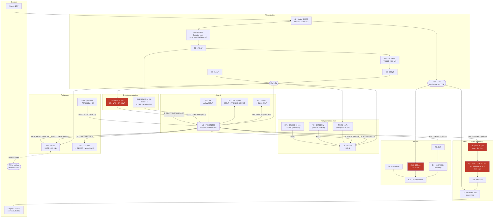

# Baliza SR30 — Documentación de hardware

**Tarjeta:** `BALIZA_SR30` · **Título del esquemático:** "Tarjeta Control Baliza" · **Rev:** V1.0 · **Empresa:** IT VIAL SAS · **Autor:** Ing. Freiman Parga
**Ficheros fuente analizados:**

| Fichero | Ruta |
|---|---|
| Esquemático | `D:\@Proyect\Baliza\2 Hardware tarjeta\balizaSR30.kicad_sch` (KiCad 8.0, `version 20231120`) |
| PCB | `D:\@Proyect\Baliza\2 Hardware tarjeta\balizaSR30.kicad_pcb` (KiCad 8.0.1) |
| BOM | `D:\@Proyect\Baliza\2 Hardware tarjeta\Lista de componentes Baliza.xls` (hoja `Baliza_SR30`) |
| Gerbers | `D:\@Proyect\Baliza\2 Hardware tarjeta\gerbers_baliza\` (generados 2025-06-24) |
| Firmware | `D:\@Proyect\Baliza\1 Firmware\Doc mplabx\18f2550_baliza_ V1.X\` |

> **Método:** toda la información eléctrica de este documento se ha extraído parseando las S-expressions de `.kicad_sch` y `.kicad_pcb` y reconstruyendo la netlist por geometría (posición de pines contra extremos de hilo, uniones y etiquetas). La reconstrucción resolvió **el 100 % de los pines** de los 41 componentes sobre puntos de conexión válidos, por lo que la netlist que aparece aquí es la del fichero, no una lectura del PDF.

---

## 0. ⚠️ HALLAZGOS CRÍTICOS — leer antes de fabricar o modificar

Cinco defectos hacen que la tarjeta **no funcione como espera el firmware actual**. Tres de ellos son de hardware y no se arreglan recompilando.

| # | Hallazgo | Referencia | Consecuencia |
|---|---|---|---|
| **C1** | **El buzzer está en RC1, el firmware lo ataca en RC0.** El neto `BUZZER` va a `U1` pin 12 (`RC1`); el firmware define `ON_BUZZER = LATCbits.LATC0` (`Buzzer.h:24`). En `Buzzer.c:162` está **comentada** la línea correcta `//TRISCbits.TRISC1 = 0;` y activa la incorrecta `TRISCbits.TRISC0 = 0;` (`Buzzer.c:163`). | `balizaSR30.kicad_sch:11443` (BZ1), `:10283` (U1) | **El buzzer nunca suena.** Además RC0 es el neto `BUTTON`: el firmware convierte en salida un pin que en la placa tiene pull-up (R4 10 K) y un pulsador (SW1) a través de D2. **Si se pulsa SW1 con LATC0=1, la salida del PIC queda cortocircuitada a GND a través de D2** (sólo limitada por la impedancia de salida del puerto). Riesgo de destrucción del pin. |
| **C2** | **El buzzer no puede sonar aunque se arregle C1: R15 = 100 kΩ está en serie con él.** Camino: `+12V → R15 (100k) → BZ1.1 → BZ1.2 → Q4(C) → Q4(E) → GND`. Corriente máxima = 12 V / 100 kΩ = **120 µA**. | `balizaSR30.kicad_sch:9096` (R15), `:11443` (BZ1) | Un buzzer magnético necesita 20–30 mA; uno piezo con oscilador interno, 3–10 mA. Con 120 µA **no emite sonido audible**. Además la polaridad está invertida: el pin marcado `+` de BZ1 es el que va al colector (lado bajo) y el `-` al lado de alimentación. |
| **C3** | **AN3 (sensor de temperatura) está deshabilitado por configuración del ADC.** El LM35 (`U5`) entra en `U1` pin 5 = `RA3/AN3` por el neto `S_TEMP`. El firmware ejecuta `ADCON1bits.PCFG = 0b1011` (`main.c:175`), que en el PIC18F2550 deja **sólo AN0, AN1 y AN2 como analógicas**; AN3 queda como E/S digital. Aun así `Aplicacion.c:227` llama a `ADC_read(3)`. | `balizaSR30.kicad_sch:10139` (U5), `main.c:175` | La lectura de temperatura **no está especificada por Microchip** (canal seleccionado sobre un pin no configurado como analógico) y el buffer digital de entrada queda activo con una tensión analógica encima. La temperatura que reporte el equipo no es fiable. |
| **C4** | **La fórmula de temperatura es incorrecta para un LM35 por un factor 10.** `Aplicacion.c:228-229` calcula `T = (ADC·5/1024)·10`. El LM35 entrega **10 mV/°C**, luego `T[°C] = V·100`. | `main.c` / `Aplicacion.c:227-229` | La temperatura mostrada es **la décima parte** de la real (25 °C se leería como 2,5). |
| **C5** | **La puerta del MOSFET de potencia recibe sólo 3,4 V.** `R8` (2,2 k) en serie desde RC2 y `R9` (4,7 k) de puerta a masa forman un divisor: `Vgs = 5 V · 4,7/(2,2+4,7) = 3,41 V`. `Q2` está en el BOM como **`Q_NMOS_GDS`**, un símbolo genérico **sin referencia de fabricante**. | `balizaSR30.kicad_sch:7847` (Q2), `:10703` (R8), `:12060` (R9) | Con un MOSFET estándar (p. ej. IRF540N, Vgs(th) hasta 4 V) **no conduce**, o conduce en zona lineal y se destruye. Sólo funciona con un MOSFET *logic-level* y aun así 3,4 V está por debajo de la Vgs a la que se especifica el Rds(on). |

Además, dos hallazgos que sí funcionan correctamente y conviene **no tocar**:

- ✅ El **divisor de medida de tensión es correcto**: R13 = 100 k / R14 = 20 k → factor 6, exactamente el que aplica el firmware (§6).
- ✅ El **LED de vida es activo a nivel bajo** y el firmware lo trata así (`ON_LED_LIVE → LATA0 = 0`). Coincide (§5).

---

## 1. Qué es la tarjeta

`BALIZA_SR30` es una tarjeta de control de baliza/alarma temporizada de **77,0 × 90,0 mm**, dos capas, tecnología mixta (todos los componentes de agujero pasante en la cara superior y todos los SMD en la cara inferior). Se alimenta de un **único raíl de 12 V nominales** por un conector Molex KK-396 de 2 vías (`J2`, serigrafiado **FUENTE / 12V / GND**), del que deriva un raíl de 5 V mediante un regulador lineal `LM78M05` (`U3`) precedido de un diodo Schottky en serie `1N5822` (`D3`) que hace de protección de polaridad inversa. El cerebro es un **PIC18F2550 en DIP-28** (`U1`) a 20 MHz que: mantiene la hora en un **RTC DS1307** (`U4`) por I²C con cristal de 32,768 kHz y pila de respaldo de 20 mm; conversa a 9600 baudios con un **módulo Bluetooth HC-06** (`U2`) montado en cabecera de 6 pines; parpadea un **LED de vida** (`D1`); acciona un **buzzer** (`BZ1`) por transistor `MMBT3904` (`Q4`); y conmuta la salida de potencia **CLUSTER** por un MOSFET de canal N en TO-220 (`Q2`) en configuración de lado bajo, sacada al exterior por un segundo Molex KK-396 (`J3`, serigrafiado **CLUSTER**). Mide además la tensión de entrada por divisor resistivo hacia AN1 y la temperatura por un **LM35** (`U5`) hacia AN3. Al exterior expone tres conectores: `J2` (alimentación 12 V), `J3` (salida cluster) y `J1` (cabecera ICSP de 5 pines, compatible pin a pin con PICkit 3/4). Hay un pulsador local `SW1`.

---

## 2. Lista de componentes (BOM) reconstruida del esquemático

41 componentes reales (más 36 símbolos de alimentación `#PWR*`, que no son componentes físicos).

### 2.1 Alimentación y protección

| Ref | Valor | Footprint | Función | Línea |
|---|---|---|---|---|
| J2 | `FUENTE` (Conn_01x02_Male) | `Connector_Molex:Molex_KK-396_5273-02A_1x02_P3.96mm_Vertical` | Entrada de alimentación. Pin 1 = `+12V`, Pin 2 = `GND` | `:10907` |
| D3 | `1N5822` | `Diode_THT:D_DO-201AD_P15.24mm_Horizontal` | Schottky 3 A/40 V en serie: **protección de polaridad inversa** del raíl `VCC` | `:12262` |
| C3 | `470uF` | `Capacitor_THT:CP_Radial_D8.0mm_P2.50mm` | Condensador de entrada del regulador (neto `VCC`) | `:11512` |
| U3 | `LM78M05_TO220` | `Package_TO_SOT_THT:TO-220-3_Horizontal_TabDown` | Regulador lineal 5 V / 500 mA. VI=`VCC`, VO=`+5V` | `:8359` |
| C4 | `220uF` | `Capacitor_THT:CP_Radial_D8.0mm_P2.50mm` | Condensador de salida del regulador (neto `+5V`) | `:11373` |
| C6 | `0.1uF` | `Capacitor_SMD:C_0805_2012Metric` | Desacoplo de `+5V` — el **único** cerámico de alimentación de la placa | `:10773` |

### 2.2 Microcontrolador y reloj

| Ref | Valor | Footprint | Función | Línea |
|---|---|---|---|---|
| U1 | `PIC18F2550-ISP` | `Package_DIP:DIP-28_W7.62mm` | MCU principal | `:10283` |
| Y1 | `20M` | `Crystal:Crystal_HC18-U_Vertical` | Cristal principal 20 MHz (coincide con `_XTAL_FREQ 20000000` y `FOSC = HS`) | `:11582` |
| C1, C2 | `22pF` | `Capacitor_SMD:C_0805_2012Metric` | Condensadores de carga de Y1 (`OSC2`, `OSC1`) | `:11043`, `:9935` |
| R2 | `10k` | `Resistor_SMD:R_1206_3216Metric` | Pull-up de `MCLR` a `+5V` | `:7451` |
| J1 | `Conn_01x05_Male` | `Connector_PinHeader_2.54mm:PinHeader_1x05_P2.54mm_Vertical` | ICSP: 1=`MCLR/VPP`, 2=`+5V`, 3=`GND`, 4=`PGD`, 5=`PGC` | `:11717` |

### 2.3 RTC

| Ref | Valor | Footprint | Función | Línea |
|---|---|---|---|---|
| U4 | `DS1307_` | `digikey-footprints:DIP-8_W7.62mm` | Reloj de tiempo real I²C | `:8054` |
| Y2 | **`37Khz`** ⚠ | `Crystal:Crystal_AT310_D3.0mm_L10.0mm_Horizontal` | Cristal del RTC. **El valor es erróneo: el DS1307 exige 32,768 kHz, CL = 12,5 pF** | `:8565` |
| BT1 | `Battery_Cell` | `Battery:BatteryHolder_Keystone_103_1x20mm` | Portapilas de 20 mm (CR2032). `+` → `VBAT` de U4 | `:9235` |
| R5, R6 | `4.7k` | `Resistor_SMD:R_1206_3216Metric` | **Pull-ups de `SDA` y `SCL` a `+5V`** — presentes y de valor correcto | `:9026`, `:9660` |

> Y2 **no lleva condensadores de carga y eso es correcto**: el DS1307 los integra y su hoja de datos prohíbe expresamente añadirlos.

### 2.4 Comunicación serie / Bluetooth

| Ref | Valor | Footprint | Función | Línea |
|---|---|---|---|---|
| U2 | `HC06_Module` | `HC06:HC06` (librería propia) | Módulo Bluetooth SPP. 1=`STATE` (NC), 2=`RXD`←`MCU_TX`, 3=`TXD`→`MCU_RX`, 4=`GND`, 5=`VCC`←`+5V`, 6=`EN` (NC) | `:9578` |

### 2.5 Indicación y entrada de usuario

| Ref | Valor | Footprint | Función | Línea |
|---|---|---|---|---|
| D1 | `LED` (sin part number) | `LED_THT:LED_D3.0mm` | LED de vida. **Cátodo a RA0**, ánodo a R1 → activo a nivel bajo | `:8223` |
| R1 | `330R` | `Resistor_SMD:R_1206_3216Metric` | Limitadora de D1 (≈9,4 mA con Vf 1,9 V) | `:10634` |
| SW1 | `SW_Push` | `Button_Switch_THT:SW_PUSH_6mm_H4.3mm` | Pulsador local a `GND` | `:12396` |
| R3 | `10K` | `Resistor_SMD:R_1206_3216Metric` | Pull-up del nodo del pulsador | `:10069` |
| D2 | `1N4007` | `Diode_THT:D_DO-41_SOD81_P7.62mm_Horizontal` | Diodo de desacoplo entre el nodo del pulsador y el neto `BUTTON` (K en SW1, A en `BUTTON`) | `:10566` |
| R4 | `10K` | `Resistor_SMD:R_1206_3216Metric` | Pull-up del neto `BUTTON` (RC0) | `:10213` |

### 2.6 Etapa del buzzer

| Ref | Valor | Footprint | Función | Línea |
|---|---|---|---|---|
| BZ1 | `Buzzer` (sin part number) | `Buzzer_Beeper:Buzzer_12x9.5RM7.6` | Buzzer de 12 mm | `:11443` |
| Q4 | `MMBT3904` | `Package_TO_SOT_SMD:SOT-23` | NPN, conmutador de lado bajo del buzzer. Ic máx 200 mA | `:9371` |
| R11 | `2.2k` | `Resistor_SMD:R_1206_3216Metric` | Resistencia de base de Q4 (Ib ≈ 1,8 mA) | `:8430` |
| R12 | `4.7k` | `Resistor_SMD:R_1206_3216Metric` | Base a masa (apagado seguro) | `:9865` |
| R15 | **`100k`** ⚠ | `Resistor_SMD:R_1206_3216Metric` | **En serie entre `+12V` y el buzzer — ver hallazgo C2** | `:9096` |
| D4 | `D` (sin part number) | `Diode_THT:D_A-405_P7.62mm_Horizontal` | Diodo de rueda libre en paralelo con BZ1. Orientación correcta (K al lado de alimentación) | `:7985` |

### 2.7 Etapa de salida CLUSTER

| Ref | Valor | Footprint | Función | Línea |
|---|---|---|---|---|
| Q2 | **`Q_NMOS_GDS`** ⚠ | `Package_TO_SOT_THT:TO-220-3_Horizontal_TabDown` | MOSFET N de potencia, conmutación de lado bajo. **Sin referencia de fabricante** | `:7847` |
| R8 | `2.2k` | `Resistor_SMD:R_1206_3216Metric` | Serie de puerta desde RC2 | `:10703` |
| R9 | `4.7k` | `Resistor_SMD:R_1206_3216Metric` | Puerta a masa | `:12060` |
| R16 | `0R` | `Resistor_SMD:R_2010_5025Metric` | Puente de 0 Ω entre el drenador de Q2 y `J3` pin 2 | `:9302` |
| J3 | `FUENTE` (etiqueta) / serigrafía **CLUSTER** | `Connector_Molex:Molex_KK-396_5273-02A_1x02_P3.96mm_Vertical` | Salida de potencia. Pin 1 = `+12V` (crudo), Pin 2 = drenador de Q2 | `:10975` |

### 2.8 Medida analógica

| Ref | Valor | Footprint | Función | Línea |
|---|---|---|---|---|
| R13 | `100k` | `Resistor_SMD:R_1206_3216Metric` | Rama superior del divisor de tensión (`VCC` → `S_VOLT`) | `:9166` |
| R14 | `20k` | `Resistor_SMD:R_1206_3216Metric` | Rama inferior (`S_VOLT` → `GND`) | `:11859` |
| C5 | `0.1uF` | `Capacitor_SMD:C_0805_2012Metric` | Filtro del nodo `S_VOLT` | `:9795` |
| D5 | `5.1V` (Zener) | `Diode_THT:D_DO-34_SOD68_P7.62mm_Horizontal` | Recorte de `S_VOLT` a 5,1 V (protección de AN1) | `:10497` |
| U5 | `LM35-LP` | `Package_TO_SOT_THT:TO-92L_Inline_Wide` | Sensor de temperatura analógico, 10 mV/°C | `:10139` |
| C7 | `0.1uF` | `Capacitor_SMD:C_0805_2012Metric` | Filtro de `S_TEMP` — **directamente en la salida del LM35, ver §10** | `:12597` |

### 2.9 Contraste con `Lista de componentes Baliza.xls`

Se leyó la hoja `Baliza_SR30` (32 filas, columnas `Reference / Value / Footprint / Qty`) con `xlrd`.

**Resultado del cotejo: valores y footprints coinciden 1:1 con el esquemático en las 31 líneas, y la suma de cantidades (41) coincide con el número de componentes del esquemático (41).** Es una exportación automática de KiCad, no una lista revisada a mano. Discrepancias y carencias detectadas:

| # | Discrepancia / carencia | Detalle |
|---|---|---|
| 1 | **`J2,J3` tienen la celda `Value` vacía** en el .xls | En el esquemático ambos llevan `Value = "FUENTE"`, y además la serigrafía de la PCB llama `CLUSTER` a J3. Tres nombres distintos para el mismo conector. |
| 2 | **`Q2` figura como `Q_NMOS_GDS`** | No es una referencia comprable. Es el nombre del símbolo genérico de KiCad. **Nadie puede comprar este componente con esta lista.** Y la elección importa (hallazgo C5: sólo sirve un *logic-level*). |
| 3 | **`D4` figura como `D`** | Diodo sin referencia. Footprint A-405 (DO-35/DO-204AH). |
| 4 | **`D1` figura como `LED`** | Sin color, sin Vf, sin corriente nominal. R1 = 330 Ω asume Vf ≈ 1,9 V (rojo/ámbar); con un LED azul/blanco (Vf 3,0–3,4 V) la corriente baja a ~5 mA. |
| 5 | **`BZ1` figura como `Buzzer`** | No indica si es magnético o piezo, ni si lleva oscilador interno, ni tensión de trabajo. Es exactamente la información que hace falta para dimensionar R15 (hallazgo C2). |
| 6 | **`Y2` figura como `37Khz`** | **Valor erróneo.** El DS1307 sólo funciona con 32,768 kHz. Un cristal de "37 kHz" no existe como producto estándar. Quien compre por esta lista no compra nada, o compra mal. |
| 7 | **`C3` (470 µF) y `C4` (220 µF) sin tensión de trabajo** | C3 está en `VCC` (12 V). Necesita ≥ 25 V. La lista no lo dice. |
| 8 | **`U2 = HC06_Module` con footprint de librería propia `HC06:HC06`** | No identifica la variante del módulo (HC-06 desnudo vs. placa portadora tipo ZS-040/JY-MCU). Es determinante: ver §10, riesgo R7. |
| 9 | **`SW1`, `BT1`, `U3`, `D3` sin fabricante ni referencia** | Comprables por descripción, pero no trazables. |
| 10 | **Huecos en la numeración de referencias** | No existen `R7`, `R10`, `Q1`, `Q3`. Indica componentes eliminados en revisiones anteriores sin renumerar. No es un error, pero rompe la trazabilidad contra revisiones antiguas. |

**Conclusión:** el .xls no contradice al esquemático, pero **no es un BOM de compra**. Seis líneas (Q2, D4, D1, BZ1, Y2, U2) no se pueden pedir tal como están, y una de ellas (Y2) está directamente mal.

---

## 3. Diagrama de bloques



---

## 4. Alimentación

### 4.1 Cadena completa

```
J2.1 (+12V, Molex KK-396)
  └─► D3 · 1N5822 (Schottky 3A/40V, ánodo en +12V, cátodo en VCC)   ← protección de polaridad inversa
        └─► neto VCC
              ├─► C3 · 470 µF electrolítico (VCC → GND)
              ├─► R13 · 100k  → divisor de medida (§6)
              └─► U3.1 (VI) · LM78M05, TO-220
                    └─► U3.3 (VO) ─► neto +5V
                          ├─► C4 · 220 µF electrolítico
                          ├─► C6 · 0,1 µF cerámico 0805
                          ├─► U1.20 (VDD)  · PIC18F2550
                          ├─► U1.6  (RA4)  ⚠ pin de E/S atado a +5V (§10 R5)
                          ├─► U2.5  (VCC)  · HC-06
                          ├─► U4.8  (VCC)  · DS1307
                          ├─► U5.1  (+VS)  · LM35
                          ├─► J1.2         · ICSP
                          └─► R1, R2, R3, R4, R5, R6 (pull-ups / limitadora LED)

J2.1 (+12V) también va DIRECTAMENTE, sin pasar por D3, a:
  ├─► J3.1  · pin 1 del conector CLUSTER (alimentación de la carga externa)
  └─► R15   · rama del buzzer
```

### 4.2 Raíles

| Raíl | Tensión | Origen | Consumidores |
|---|---|---|---|
| `+12V` | 12 V nominales (sin regular, sin filtrar, sin proteger) | `J2.1` directo | `J3.1` (carga externa), `R15` (buzzer), ánodo de `D3` |
| `VCC` | ≈ `+12V` − Vf(D3) ≈ 11,6–11,7 V | tras `D3` | `C3`, `U3.1`, `R13` |
| `+5V` | 5 V ±4 % (tolerancia del 78M05) | `U3.3` | PIC, DS1307, HC-06, LM35, pull-ups, ICSP |
| `+3V3` (nombre engañoso) | **3,0 V reales** — es la pila CR2032, no un raíl | `BT1.1` | únicamente `U4.3` (VBAT del DS1307) |

> El símbolo de potencia `+3.3V` aplicado a una pila de litio de 3,0 V es un error de documentación: sugiere un raíl de 3,3 V regulado que no existe en la placa. Cualquiera que lea el esquemático buscará un LDO de 3V3 y no lo encontrará.

### 4.3 Condensadores de desacoplo — inventario completo

| Cap | Valor | Neto | Ubicación PCB | Comentario |
|---|---|---|---|---|
| C3 | 470 µF | `VCC` (entrada regulador) | `(128,15 · 67,90)` cara sup. | OK como bulk |
| C4 | 220 µF | `+5V` (salida regulador) | `(138,45 · 67,90)` cara sup. | OK como bulk |
| C6 | 0,1 µF | `+5V` | `(134,45 · 106,45)` cara inf. | **A 2,77 mm de U1.20 (VDD) y 2,84 mm de U1.19 (VSS)** — correcto para ese par |
| C5 | 0,1 µF | `S_VOLT` | — | filtro de señal, no desacoplo |
| C7 | 0,1 µF | `S_TEMP` | — | filtro de señal, no desacoplo |
| C1, C2 | 22 pF | `OSC1`/`OSC2` | — | carga del cristal, no desacoplo |

**Sólo hay un condensador de desacoplo en toda la placa (C6).** Ver §10 para las consecuencias.

### 4.4 Protecciones — presentes y AUSENTES

| Protección | ¿Está? | Detalle |
|---|---|---|
| **Polaridad inversa** | ✅ **PARCIAL** | `D3` (1N5822) en serie protege `VCC`, el 7805 y todo lo que cuelga de `+5V`. **PERO `J3.1` y `R15` cuelgan de `+12V` crudo, antes de D3.** Con la fuente invertida, la carga del cluster y la rama del buzzer quedan expuestas a −12 V; además `J3.1` pasa a −12 V y el diodo de cuerpo de `Q2` conduce desde GND hacia el drenador, poniendo el retorno de la carga a través del MOSFET. |
| **Fusible** | ❌ **NO HAY** | No existe ningún fusible, PTC ni polyfuse en el esquemático. Un cortocircuito en la carga del cluster no tiene ningún elemento que lo limite salvo la fuente externa. |
| **TVS / supresor de transitorios** | ❌ **NO HAY** | Ningún TVS, MOV ni varistor en `+12V`. En una baliza alimentada de una batería de vehículo o de una línea larga, los transitorios llegan íntegros al 1N5822 (40 V de VRRM) y al MOSFET. |
| **Zener de recorte en `S_VOLT`** | ✅ SÍ | `D5` (5,1 V) protege AN1 |
| **Rueda libre en el buzzer** | ✅ SÍ | `D4` en paralelo con `BZ1`, cátodo hacia el lado de alimentación (orientación correcta) |
| **Rueda libre en la salida CLUSTER** | ❌ **NO HAY** | Ver §8 |
| **Filtrado / protección ESD en las líneas que salen (J2, J3)** | ❌ **NO HAY** | Sin ferritas, sin condensadores de paso, sin diodos de sujeción |
| **Brown-out reset** | ❌ **DESACTIVADO POR FIRMWARE** | `#pragma config BOR = OFF` (`main.h:23`). No hay supervisor externo. El PIC puede quedar en estado indefinido si el raíl de 5 V cae lentamente. |
| **Watchdog** | ❌ **DESACTIVADO** | `#pragma config WDT = OFF` (`main.h:28`) |

### 4.5 Estimación de consumo

| Consumidor | Corriente típica @5 V | Corriente pico |
|---|---|---|
| U1 · PIC18F2550, 20 MHz HS, ADC + MSSP + EUSART activos | ≈ 11 mA | ≈ 15 mA |
| U2 · HC-06 (emparejado / en reposo) | ≈ 8 mA | ≈ 40 mA (inquiry/emparejamiento) |
| U4 · DS1307 (VCC activo) | ≈ 1,2 mA | 1,5 mA |
| U5 · LM35 | 60 µA | 90 µA |
| D1 · LED vida (R1 = 330 Ω, ciclo 5/200 = 2,5 %) | ≈ 0,25 mA medios | 9,4 mA |
| Pull-ups I²C R5/R6 (4,7 k) durante niveles bajos | ≈ 0–2 mA | 2 mA |
| Base de Q4 (R11) cuando suena el buzzer | 0 | 1,8 mA |
| Puerta de Q2 (R8+R9) con CLUSTER activo | 0 | 0,72 mA |
| **Total raíl +5V** | **≈ 21 mA** | **≈ 70 mA** |

| Consumidor en `+12V`/`VCC` | Corriente |
|---|---|
| Divisor R13+R14 (120 kΩ sobre VCC) | 97 µA |
| R15 (rama del buzzer, 100 kΩ sobre 12 V) | 120 µA |
| Entrada del 7805 (≈ salida + Iq 4 mA) | 25–75 mA |
| Carga del cluster por J3 | **indeterminada** — no está definida en el proyecto |

**Disipación de U3 (LM78M05, TO-220 sin disipador, θJA ≈ 62 °C/W):**

- Con 12 V de entrada y 70 mA: `P = (12 − 5) × 0,070 = 0,49 W` → ΔT ≈ **+30 °C**. Aceptable.
- Con 24 V de entrada (si la baliza se alimentara de 24 V) y 70 mA: `P = 1,33 W` → ΔT ≈ **+82 °C**. **No admisible sin disipador.**
- Margen de caída: el LM78M05 necesita `Vin ≥ 7 V`. Restando D3, la tarjeta deja de regular por debajo de **≈ 7,3 V** en J2. Durante un arranque de motor (caída a 6 V) el raíl de 5 V se colapsa y el PIC se resetea de forma no controlada (BOR está desactivado).

---

## 5. Correlación pin a pin con el firmware ⭐

Firmware: `D:\@Proyect\Baliza\1 Firmware\Doc mplabx\18f2550_baliza_ V1.X\`

| Pin PIC | Nombre en el esquemático | Neto | Qué hay conectado | Qué hace el firmware | ¿Coincide? |
|---|---|---|---|---|---|
| **1** | `Vpp/MCLR/RE3` | `MCLR` | `R2` 10 k a `+5V` + `J1.1` (ICSP) | `#pragma config MCLRE = ON` (`main.h:35`) → MCLR habilitado | ✅ **SÍ** |
| **2** | `RA0/AN0` | `LED_LIVE` | Cátodo de `D1`; ánodo → `R1` 330 Ω → `+5V` → **LED activo a nivel BAJO** | `TRISA0 = 0` (`LedLive.c:101`); `ON_LED_LIVE = LATA0 = 0`, `OFF = 1` (`LedLive.h:26-27`) | ✅ **SÍ** — la polaridad invertida del firmware es la correcta para este cableado |
| **3** | `RA1/AN1` | `S_VOLT` | Divisor `R13` 100 k / `R14` 20 k desde `VCC`, con `C5` 0,1 µF y zener `D5` 5V1 | `ADC_read(1)` (`Aplicacion.c:211`). `PCFG=0b1011` habilita AN0–AN2 → **AN1 sí es analógica** | ✅ **SÍ** |
| **4** | `RA2/AN2/Vref−` | — | **Sin conectar** (marcador `no_connect` en el esquemático) | `PCFG=0b1011` lo declara **analógico** pero nunca se lee | ⚠ Entrada analógica habilitada y flotante (§10 R11) |
| **5** | `RA3/AN3/Vref+` | `S_TEMP` | Salida de `U5` (LM35) + `C7` 0,1 µF | `ADC_read(3)` (`Aplicacion.c:227`) — pero `PCFG=0b1011` deja **AN3 como E/S DIGITAL** (`main.c:175`) | ❌ **NO — hallazgo C3.** El firmware lee un canal que él mismo dejó configurado como digital |
| **6** | `RA4/T0CKI/C1OUT` | `+5V` | **Atado directamente al raíl de 5 V, sin resistencia** | Nunca se configura ni se escribe (queda entrada tras reset) | ⚠ Funciona hoy, pero es una E/S digital cortocircuitada a VDD (§10 R5) |
| **7** | `RA5/AN4/SS/HLVDIN` | `GND` | **Atado directamente a masa, sin resistencia** | Nunca se configura ni se escribe | ⚠ Ídem, cortocircuitada a VSS (§10 R5) |
| **8** | `VSS` | `GND` | Plano/pistas de masa | — | ✅ SÍ (pero sin cerámico propio, §10 R2) |
| **9** | `OSC1/CLKI` | `OSC1` | `Y1` 20 MHz + `C2` 22 pF | `#pragma config FOSC = HS`, `_XTAL_FREQ 20000000` (`main.h:17,76`) | ✅ **SÍ** |
| **10** | `RA6/OSC2/CLKO` | `OSC2` | `Y1` 20 MHz + `C1` 22 pF | Ídem | ✅ **SÍ** |
| **11** | `RC0/T1OSO/T13CKI` | **`BUTTON`** | `R4` 10 k a `+5V` + `D2` (ánodo) hacia el nodo de `SW1` | **`TRISCbits.TRISC0 = 0` → lo pone como SALIDA** y lo usa como buzzer: `ON_BUZZER = LATC0 = 1` (`Buzzer.c:163`, `Buzzer.h:24`) | ❌ **NO — hallazgo C1.** El firmware convierte en salida el pin del pulsador. Con SW1 pulsado y LATC0=1, la salida queda a masa vía D2 |
| **12** | `RC1/T1OSI/CCP2` | **`BUZZER`** | `R11` 2,2 k → base de `Q4` (MMBT3904) → `BZ1` | **`//TRISCbits.TRISC1 = 0;` está COMENTADA** (`Buzzer.c:162`). El pin queda como entrada y nunca se acciona | ❌ **NO — hallazgo C1.** El buzzer real no se ataca nunca |
| **13** | `RC2/CCP1` | `CLUSTER` | `R8` 2,2 k → puerta de `Q2`, con `R9` 4,7 k a masa | `TRISCbits.TRISC2 = 0` (`Cluster.c:113`); `ON_CLUSTER = LATC2 = 1`, `OFF = 0` (`Cluster.h:15-16`) | ✅ **SÍ** (el mapeo del pin es correcto; la etapa de potencia tiene otro problema, §8) |
| **14** | `VUSB` | — | **Sin conectar** (`no_connect`) | `#pragma config VREGEN = OFF` (`main.h:25`) → regulador USB desactivado. USB no se usa | ✅ **SÍ**, coherente |
| **15** | `RC4/D−/VM` | — | **Sin conectar** (`no_connect`) | No se usa | ✅ SÍ |
| **16** | `RC5/D+/VP` | — | **Sin conectar** (`no_connect`) | No se usa | ✅ SÍ |
| **17** | `RC6/TX/CK` | `MCU_TX` | `U2.2` (RXD del HC-06) | `TRISC6 = 0` (salida), EUSART, `SPBRG=32`, `BRGH=0` (`UART.h:26-38`) | ✅ **SÍ**. Baudios reales = 20 MHz/(64·33) = **9469 bd** → error −1,4 % frente a 9600. Dentro de tolerancia |
| **18** | `RC7/RX/DT/SDO` | `MCU_RX` | `U2.3` (TXD del HC-06) | `TRISC7 = 1` (entrada), `CREN=1`, `RCIE=1` (`UART.h:28,38,41`) | ✅ **SÍ** |
| **19** | `VSS` | `GND` | Masa | — | ✅ SÍ |
| **20** | `VDD` | `+5V` | Salida del 78M05 + `C6` 0,1 µF a 2,77 mm | — | ✅ SÍ |
| **21** | `RB0/AN12/SDI/SDA` | `SDA` | `U4.5` (DS1307) + `R5` 4,7 k a `+5V` | `TRISBbits.RB0 = PIN_IN` (`I2C.c:11`), MSSP maestro I²C `SSPM=0b1000`, 100 kHz (`I2C.c:16,20`) | ✅ **SÍ**. `ADCON1 = 0x0F` en `main.c:115` neutraliza el `PBADEN = ON` de `main.h:33` antes de inicializar el I²C |
| **22** | `RB1/AN10/SCK/SCL` | `SCL` | `U4.6` (DS1307) + `R6` 4,7 k a `+5V` | `TRISBbits.RB1 = PIN_IN` (`I2C.c:12`) | ✅ **SÍ** |
| **23** | `RB2/AN8/INT2` | — | **Sin conectar** (`no_connect`) | No se usa | ✅ SÍ |
| **24** | `RB3/AN9/CCP2` | — | **Sin conectar** (`no_connect`) | No se usa | ✅ SÍ |
| **25** | `RB4/AN11/KBI0` | — | **Sin conectar** (`no_connect`) | No se usa | ✅ SÍ |
| **26** | `RB5/KBI1/PGM` | — | **Sin conectar** (`no_connect`) | `#pragma config LVP = OFF` (`main.h:39`) → PGM no se usa. Correcto dejarlo libre | ✅ SÍ |
| **27** | `RB6/KBI2/PGC` | `PGC` | `J1.5` (ICSP) | Programación | ✅ SÍ |
| **28** | `RB7/KBI3/PGD` | `PGD` | `J1.4` (ICSP) | Programación | ✅ SÍ |

### 5.1 Verificación específica solicitada

| Verificación | Resultado |
|---|---|
| **LATA0 → LED de vida** | ✅ RA0 (pin 2) = neto `LED_LIVE` → cátodo de D1. Activo bajo, coincide con `ON_LED_LIVE = LATA0 = 0` |
| **LATC0 → buzzer** | ❌ **FALLA.** RC0 (pin 11) = neto `BUTTON` (pulsador SW1 + pull-up R4). El buzzer está en RC1 (pin 12) |
| **LATC2 → salida cluster** | ✅ RC2 (pin 13) = neto `CLUSTER` → R8 → puerta de Q2 |
| **RC6/RC7 → UART TX/RX** | ✅ RC6 = `MCU_TX` → HC-06 RXD; RC7 = `MCU_RX` ← HC-06 TXD. Sin cruce |
| **SCL/SDA del MSSP → DS1307** | ✅ RB1/SCL (pin 22) y RB0/SDA (pin 21) van directamente a U4.6 y U4.5, con pull-ups R6/R5 de 4,7 k a +5 V |
| **AN1 (`ADC_read(1)`, tensión)** | ✅ RA1 (pin 3) = `S_VOLT`. `PCFG=0b1011` la habilita como analógica |
| **AN3 (`ADC_read(3)`, temperatura)** | ❌ **FALLA.** RA3 (pin 5) = `S_TEMP` ← LM35. **`PCFG=0b1011` deja AN3 como digital.** Confirmado contra el propio comentario del código: `//Entradas Analogicas a0, a1, a2` (`main.c:175`) |
| **MCLR** | ✅ Pin 1, pull-up R2 10 k a +5 V y salida al ICSP J1.1. `MCLRE = ON` |

### 5.2 Diagnóstico del hallazgo C1 — la evidencia

El propio código conserva la huella del cambio:

```c
// Buzzer.c:161-165
void pinConfBuzzer(void)
{
    //TRISCbits.TRISC1 = 0;     ← LA LÍNEA CORRECTA, COMENTADA
    TRISCbits.TRISC0 = 0;       ← la línea que se dejó activa
}
```

`RC1` es exactamente el pin al que va el neto `BUZZER` en el esquemático. Alguien cambió `TRISC1` por `TRISC0` (y `LATC1` por `LATC0` en `Buzzer.h:24-25`) y **el esquemático nunca se actualizó**, o bien el cambio fue un error. La corrección de firmware es de dos líneas; ninguna corrección de firmware arregla, en cambio, el hallazgo C2 (R15 = 100 k).

---

## 6. Divisor de medida de tensión — ✅ CORRECTO

**Firmware** (`Aplicacion.c:211-214`):

```c
ap.fVolt = ADC_read(1);
ap.fVolt = (5.0/1024) * ap.fVolt;   // ADC → voltios en el pin
ap.fVolt = (ap.fVolt * 6) + 0.3;    // factor de divisor + compensación de diodo
ap.fVolt = ap.fVolt * 10;           // escala a decivoltios
```

**Hardware** (netlist del esquemático, `:9166` y `:11859`):

```
VCC ──[ R13 = 100 kΩ ]──┬── S_VOLT ── U1.3 (RA1/AN1)
                        ├── C5 0,1 µF ── GND
                        ├── D5 (zener 5V1, cátodo aquí) ── GND
                        └──[ R14 = 20 kΩ ]── GND
```

**Comprobación del factor:**

```
Ganancia del divisor = R14 / (R13 + R14) = 20k / 120k = 1/6
Factor de reconstrucción necesario = (R13 + R14) / R14 = 120k / 20k = 6,000
Factor aplicado por el firmware                        = 6
```

**El factor 6 corresponde exactamente a las resistencias montadas.** La medida de batería es correcta.

**El término `+ 0,3`** compensa la caída del Schottky `D3` (1N5822), ya que el divisor cuelga de `VCC` (después de D3) y no de `+12V` (antes). Con la corriente típica del conjunto (25–75 mA) la Vf del 1N5822 está en 0,30–0,40 V, así que la constante es razonable. No es exacta a todas las cargas (a 25 mA es ~0,30 V, a 75 mA ~0,38 V), lo que introduce un error de hasta **±0,08 V**.

**Resolución y errores:**

| Parámetro | Valor |
|---|---|
| LSB del ADC | 5 V / 1024 = 4,88 mV |
| LSB referido a la entrada | 4,88 mV × 6 = **29,3 mV** |
| Lectura a 12,0 V de entrada | S_VOLT = (12,0 − 0,3) × 1/6 = 1,95 V → ADC ≈ 399 |
| Fondo de escala (ADC = 1023) | 5,00 × 6 + 0,3 = **30,3 V** |
| Error por tolerancia del 78M05 (Vref = VDD, `VCFG = 0b00`) | **±4 %** → ±0,48 V a 12 V |
| Error por tolerancia de R13/R14 (si son ±1 %) | ±1,2 % adicional |
| Impedancia de fuente vista por el ADC | R13‖R14 = **16,7 kΩ**, frente a los **2,5 kΩ máximos** que exige la hoja de datos del PIC18F2550. Mitigado por C5 (0,1 µF ≫ Chold 25 pF), que actúa como depósito de carga. Aceptable en DC, pero fuera de especificación formal |

> **Conclusión:** el factor 6 es correcto; el error dominante es la tolerancia del 7805 usado como referencia del ADC (±4 %). Si se quiere una medida de batería fiable a mejor del 1 %, hay que usar una referencia de tensión, no VDD.

---

## 7. Sensor de temperatura — ❌ FÓRMULA INCORRECTA

**Componente identificado:** `U5 = LM35-LP`, footprint `Package_TO_SOT_THT:TO-92L_Inline_Wide` (`balizaSR30.kicad_sch:10139`). Es un **LM35 en encapsulado TO-92**, sensor analógico de precisión, **no** un termistor.

**Conexionado:**

| Pin U5 | Neto | Va a |
|---|---|---|
| 1 (`+VS`) | `+5V` | Raíl de 5 V |
| 2 (`Vout`) | `S_TEMP` | `U1.5` (RA3/AN3) y `C7` (0,1 µF a GND) |
| 3 (`GND`) | `GND` | Masa |

**Firmware** (`Aplicacion.c:227-229`):

```c
ap.fTemp = ADC_read(3);
ap.fTemp = (5.0/1024) * ap.fTemp;   // ADC → voltios
ap.fTemp = ap.fTemp * 10;           // ← FACTOR 10
```

**Lo que exige un LM35:**

```
Salida del LM35 = 10 mV/°C  →  T[°C] = V × 100
El firmware aplica            T      = V × 10
```

**La fórmula está mal por un factor de 10 exacto.** A 25 °C el LM35 entrega 250 mV; el firmware calcularía `0,250 × 10 = 2,5`. Si la intención era enviar décimas de grado (como hace con la tensión, que multiplica por 10 al final para dar decivoltios), el factor tendría que ser **1000**, no 10.

**Problemas adicionales de este bloque:**

1. **AN3 está deshabilitado** (hallazgo C3). Aunque se corrija la fórmula, el canal no está configurado como analógico.
2. **C7 (0,1 µF) está directamente en la salida del LM35.** La hoja de datos del LM35 advierte que el amplificador de salida sólo tolera **50 pF** de carga capacitiva; con cargas mayores hay que interponer una resistencia serie (típicamente 75 Ω) o usar la red R-C recomendada. **100 nF = 100 000 pF, 2000 veces el límite.** Es una causa clásica de oscilación de la salida del LM35, que se manifiesta como lecturas erráticas.
3. **El LM35 en configuración de una sola alimentación no puede medir por debajo de 0 °C** (necesita una resistencia de −VS o un raíl negativo). Para una baliza de exterior en clima frío, el rango medible arranca en +2 °C.
4. **Resolución:** con Vref = 5 V y 10 bits, el LSB es 4,88 mV = **0,49 °C**, y sólo se usa el 30 % del fondo de escala (0–1,5 V para 0–150 °C).
5. **El LM35 en TO-92 soldado a la placa mide la temperatura de la propia placa**, no la del ambiente ni la del interior de la carcasa. Está colocado en `(112,95 · 97,85)`, a 34 mm del regulador U3 y a 29 mm de Q2, lo que es aceptable, pero sigue midiendo cobre.

---

## 8. Etapa de salida "CLUSTER"

### 8.1 Topología

```
U1.13 (RC2) ──[ R8 = 2,2 kΩ ]──┬── puerta (G) de Q2
                               └──[ R9 = 4,7 kΩ ]── GND

Q2 = MOSFET canal N, TO-220-3, símbolo Q_NMOS_GDS (SIN REFERENCIA)
   Fuente (S)  ── GND
   Drenador (D) ──[ R16 = 0 Ω, 2010 ]── J3.2

J3.1 ── +12V  (crudo, ANTES de D3)
J3.2 ── drenador de Q2 vía R16
```

Es un **conmutador de lado bajo (low-side)**: la carga se conecta entre `J3.1` (+12 V) y `J3.2` (retorno conmutado a masa por el MOSFET). La serigrafía superior muestra `CLUSTER` en `(104,75 · 126,05)` y un `+` en `(112,05 · 131,25)`, junto a `J3` en `(112,075 · 128,03)`.

### 8.2 Qué conmuta: análisis

| Aspecto | Valor / hallazgo |
|---|---|
| **Elemento de conmutación** | MOSFET de canal N en TO-220 (`Q2`). **No** hay relé, **no** hay optoacoplador, **no** hay driver de puerta. |
| **Referencia del MOSFET** | ⚠ **DESCONOCIDA.** El esquemático y el .xls llevan `Q_NMOS_GDS`, el símbolo genérico de KiCad. No es un componente comprable. |
| **Tensión de puerta** | `Vgs = 5 V × R9/(R8+R9) = 5 × 4,7/6,9 = ` **3,41 V** ⚠ El divisor R8/R9 atenúa la salida de 5 V del PIC. |
| **Consecuencia** | Un MOSFET estándar (IRF540N, IRF640, …) tiene Vgs(th) de hasta 4 V: **con 3,41 V no conmuta**, o entra en zona lineal y se destruye por disipación. Sólo funciona con un **MOSFET *logic-level*** (IRLZ44N, IRL540N, IRLB8721…), y aun así 3,41 V queda por debajo de los 4,5–5 V a los que se especifica su Rds(on), por lo que la resistencia de conducción real será mayor que la de catálogo. |
| **Por qué existe R8/R9** | R9 es un *pull-down* de puerta correcto (mantiene el MOSFET apagado mientras el PIC arranca con los puertos en alta impedancia). El error es haber dejado R8 en serie: con R8 = 0 Ω (o un valor pequeño como 100 Ω) y R9 = 10 k, la puerta recibiría los 5 V íntegros. |
| **Velocidad de conmutación** | La red R8+R9 en paralelo con la Ciss del MOSFET da una constante de τ ≈ 1,5 kΩ × Ciss. Con un IRLZ44N (Ciss ≈ 1700 pF) → τ ≈ 2,6 µs. Suficiente para conmutación ON/OFF lenta (el firmware usa periodos de décimas de segundo, `PERIOD_CLUSTER 10`), pero inaceptable para PWM. |
| **Diodo de rueda libre** | ❌ **NO EXISTE.** El neto del drenador (`Net-(Q2-D)`) sólo contiene `Q2.2` y `R16.1`; el neto de `J3.2` sólo contiene `J3.2` y `R16.2`. **No hay ningún diodo entre `J3.2` y `+12V`.** Si la carga tiene componente inductiva (un relé externo, un motor, una bobina, un cable largo), el pico de apertura sólo lo absorbe el avalanchado del MOSFET. |
| **Contraste con la etapa del buzzer** | El buzzer sí tiene rueda libre (`D4`). En la etapa de potencia, que es la que realmente lo necesita, **no la hay**. |

### 8.3 Corriente y tensión máximas

| Límite | Valor | Origen |
|---|---|---|
| **Tensión de trabajo** | 12 V nominales; sin TVS ni supresor, cualquier transitorio de la fuente llega íntegro al drenador | `+12V` sin protección (§4.4) |
| **Conector J3 (Molex KK-396 / 5273)** | ≈ 5 A por contacto | Especificación de la serie |
| **R16 (0 Ω en 2010)** | Un puente de 0 Ω en 2010 se especifica típicamente para **2–3 A** y ~0,75 W. **Es el cuello de botella más estrecho de todo el camino.** | `balizaSR30.kicad_sch:9302` |
| **Pista del drenador (`Net-(Q2-D)`, 1,4 mm)** | 3,05 A a ΔT=10 °C / 4,14 A a ΔT=20 °C | IPC-2221, cobre externo 35 µm |
| **Pista `J3.2` (1,4 mm)** | Ídem | |
| **Alimentación `+12V` hasta J3.1** | tramos de 2,5 mm (60,7 mm de longitud), 1,5 mm (20,1 mm) y **1,0 mm (27,3 mm)** → limitada por el tramo de 1,0 mm a **2,39 A** a ΔT=10 °C | `balizaSR30.kicad_pcb` |
| **Retorno de masa** | Sólo pistas de 1,0 mm (388 mm de longitud) y tramos de 0,8 mm y **0,6 mm** → **1,65 A** en el peor tramo | Ver §10, riesgo R8 |
| **MOSFET Q2** | Indeterminado (sin referencia) | — |

> **Corriente máxima recomendable de la salida CLUSTER, tal como está la placa: 1,5 A.** El límite lo fija el tramo de masa de 0,6 mm y el puente de 0 Ω en 2010, no el MOSFET ni el conector.

### 8.4 Qué carga se supone conectada

**No consta en ningún fichero del proyecto.** Ni el esquemático, ni el .xls, ni la serigrafía, ni el firmware especifican la carga. El nombre "cluster" y el contexto (baliza vial de IT VIAL SAS) sugieren un conjunto de lámparas/LED de señalización de 12 V. El firmware la acciona con una máquina de estados de destello (`Cluster.c`, estados `ST_HIGH_CL`, `ST_LOW_CL`, `ST_LOW_SLOW_CL`, periodo base `PERIOD_CLUSTER = 10`).

**Esto es una pregunta abierta bloqueante** (ver §12): sin saber la corriente y la naturaleza (resistiva/inductiva) de la carga no se puede elegir Q2 ni decidir si hace falta el diodo de rueda libre.

---

## 9. La PCB

### 9.1 Datos del fichero `balizaSR30.kicad_pcb`

| Parámetro | Valor | Origen |
|---|---|---|
| **Capas de cobre** | **2** (`F.Cu` = 0, `B.Cu` = 31) | nodo `layers` |
| **Espesor de placa** | **1,6 mm** | `(general (thickness 1.6))` |
| **Apilado** | Serigrafía sup. / pasta sup. / máscara sup. 0,01 mm / **F.Cu 35 µm** / dieléctrico FR4 1,51 mm (εr 4,5, tanδ 0,02) / **B.Cu 35 µm** / máscara inf. 0,01 mm / pasta inf. / serigrafía inf. | nodo `setup > stackup` |
| **Dimensiones (Edge.Cuts)** | X: 102,85 → 179,85 mm · Y: 55,05 → 145,05 mm → **77,00 × 90,00 mm** (6930 mm²) | `Edge.Cuts` (rectángulo cerrado de 4 segmentos) |
| **Acabado superficial** | `"Finish": "None"` — **no especificado** | `balizaSR30-job.gbrjob` |
| **Reglas de diseño declaradas** | PadToPad 0,2 · PadToTrack 0,2 · TrackToTrack 0,2 · **MinLineWidth 0,6** · TrackToRegion 1,2 · RegionToRegion 1,2 (mm) | `.gbrjob` |

### 9.2 Tecnología: mixta, y estrictamente separada por caras

| Cara | Componentes | Tecnología |
|---|---|---|
| **F.Cu (superior)** | `BT1, BZ1, C3, C4, D1, D2, D3, D4, D5, J1, J2, J3, Q2, SW1, U1, U2, U3, U4, U5, Y1, Y2` (21) | **100 % THT** (`attr through_hole`) |
| **B.Cu (inferior)** | `C1, C2, C5, C6, C7, Q4, R1, R2, R3, R4, R5, R6, R8, R9, R11, R12, R13, R14, R15, R16` (20) | **100 % SMD** (`attr smd`) — resistencias 1206 y 2010, condensadores 0805, un SOT-23 |

Es el patrón clásico "THT arriba, SMD abajo en la cara de soldadura": se puede montar por ola o por reflow selectivo en la cara inferior más soldadura manual/ola en la superior.

### 9.3 Enrutado — **todo en una sola capa**

| Métrica | Valor |
|---|---|
| Segmentos de pista en `B.Cu` | **309** |
| Segmentos de pista en `F.Cu` | **0** |
| **Vías** | **0** |
| Gerber `F_Cu.gbr` | 0 trazos (`D01`), 0 regiones (`G36`), sólo **86 flashes de pad** (`D03`) |
| Gerber `B_Cu.gbr` | 5338 trazos, 10 regiones rellenas |

**La cara superior no lleva ni una pista ni un plano: sólo los anillos de los pads de agujero pasante.** Todo el enrutado, los 41 componentes SMD y el plano de masa comparten la cara inferior. Es un diseño de una cara "disfrazado" de dos caras (necesita agujeros metalizados para conectar los pads THT de arriba con el cobre de abajo, y por eso el taladro es PTH).

### 9.4 Anchos de pista

| Ancho | Segmentos | Capacidad IPC-2221 (35 µm, externa) |
|---|---|---|
| **0,600 mm** ← mínimo | 12 | 1,65 A (ΔT 10 °C) / 2,24 A (ΔT 20 °C) |
| 0,800 mm | 24 | 2,03 A / 2,76 A |
| 1,000 mm | 226 | 2,39 A / 3,24 A |
| 1,200 mm | 6 | 2,73 A / 3,70 A |
| 1,400 mm | 15 | 3,05 A / 4,14 A |
| 1,500 mm | 20 | 3,21 A / 4,35 A |
| 2,500 mm | 6 | 4,65 A / 6,30 A |

**Ancho mínimo usado: 0,6 mm (24 mil)**, coincidente con el `MinLineWidth` declarado en el `.gbrjob`. Es una regla muy holgada — cualquier fabricante la produce sin recargo — y refleja que el diseño no tiene zonas densas.

Distribución por neto (longitud total en cada ancho):

| Neto | Anchos usados |
|---|---|
| `+12V` | 1,00 mm : 27,3 mm · 1,50 mm : 20,1 mm · **2,50 mm : 60,7 mm** |
| `+5V` | 1,00 : 85,4 · 1,20 : 29,9 · 1,40 : 33,4 · 1,50 : 9,8 mm |
| `GND` | **0,60 : 12,5** · 0,80 : 40,4 · 1,00 : 388,4 mm |
| `VCC` | 1,00 : 22,2 · 1,50 : 22,4 mm |
| `Net-(Q2-D)` (drenador cluster) | 1,40 : 8,3 mm |
| `Net-(J3-Pin_2)` (salida cluster) | 1,40 : 8,7 mm |
| `CLUSTER` (puerta) | 0,80 : 3,8 mm |
| `Net-(Q2-G)` | 0,80 : 16,4 mm |
| `SDA` / `SCL` | 1,00 : 15,8 / 29,8 mm |
| `S_VOLT` / `S_TEMP` | 1,00 : 20,6 / 16,7 mm |
| `OSC1` / `OSC2` | 1,00 : 10,3 / 10,9 mm |

### 9.5 Plano de masa — presente pero fragmentado y en la misma capa que todo

Hay **una zona `GND` en `B.Cu`**, rellenada, con `min_thickness = 0,5 mm`, `clearance = 1,2 mm`, `thermal_gap = 0,508 mm` y `thermal_bridge_width = 0,508 mm` (alivios térmicos por defecto).

| Isla | Vértices | Área |
|---|---|---|
| 1 (principal) | 4099 | **3629,1 mm²** |
| 2 | 187 | 59,6 mm² |
| 3 | 260 | 55,6 mm² |
| 4 | 98 | 9,3 mm² |
| 5 | 58 | 9,1 mm² |
| 6 | 85 | 8,4 mm² |
| 7 | 130 | 8,0 mm² |
| 8 | 46 | 5,0 mm² |
| 9 | 50 | 2,4 mm² |
| 10 | 16 | 0,9 mm² |
| **Total** | | **3787,4 mm² = 54,7 % de la placa** |

**Interpretación:** el 96 % del cobre de masa está en una isla única y grande, lo cual es bueno. Pero:

- **No hay plano en `F.Cu`.** Toda la referencia de masa vive en la misma capa que las 309 pistas de señal, que la trocean.
- Las **9 islas secundarias (158 mm² en total)** son cobre huérfano: si alguna no toca ningún pad de GND ni ninguna pista, es cobre flotante que actúa como antena. Con `clearance = 1,2 mm` (muy grande) y `min_thickness = 0,5 mm`, el relleno se retira mucho de las pistas y se fragmenta con facilidad.
- El retorno de masa de la etapa de potencia (Q2) comparte pistas con el retorno analógico de `S_VOLT` y `S_TEMP`. Ver riesgo R8 en §10.

### 9.6 Taladros

**PTH** (`balizaSR30-PTH.drl`) — 86 agujeros, 10 herramientas:

| Herramienta | Ø (mm) | Uso probable |
|---|---|---|
| T1 | 0,500 | — |
| T2 | 0,750 | — |
| T3 | 0,800 | Mayoría de pads THT (37) |
| T4 | 0,900 | — |
| T5 | 0,962 | Cabeceras |
| T6 | 1,000 | DIP / cristales (15) |
| T7 | 1,100 | Electrolíticos (10) |
| T8 | 1,500 | — |
| T9 | 1,600 | — |
| T10 | 1,800 | Molex KK-396 (4) |

**NPTH** (`balizaSR30-NPTH.drl`) — 6 agujeros:

| Ø | Cantidad | Posiciones | Uso |
|---|---|---|---|
| 3,500 mm | 2 | `(123,85 · −140,79)`, `(162,69 · −62,35)` | Fijación de la aleta de los TO-220 (`Q2` y `U3`) |
| 4,300 mm | 4 | `(108,85 · −61,05)`, `(108,85 · −139,05)`, `(172,85 · −61,05)`, `(172,85 · −139,05)` | **Taladros de montaje** — patrón rectangular de **64,0 × 78,0 mm** |

### 9.7 Contraste con `gerbers_baliza\` — comprobación de completitud

| Capa necesaria | Fichero | ¿Presente? | Tamaño | Contenido verificado |
|---|---|---|---|---|
| Cobre superior | `balizaSR30-F_Cu.gbr` | ✅ | 9 136 B | 86 pads, **0 pistas, 0 regiones** |
| Cobre inferior | `balizaSR30-B_Cu.gbr` | ✅ | 165 682 B | 5338 trazos, 10 regiones (plano GND) |
| Máscara superior | `balizaSR30-F_Mask.gbr` | ✅ | 5 189 B | — |
| Máscara inferior | `balizaSR30-B_Mask.gbr` | ✅ | 7 732 B | — |
| Serigrafía superior | `balizaSR30-F_Silkscreen.gbr` | ✅ | 73 404 B | — |
| Serigrafía inferior | `balizaSR30-B_Silkscreen.gbr` | ✅ | 36 278 B | — |
| Contorno de placa | `balizaSR30-Edge_Cuts.gbr` | ✅ | 713 B | Rectángulo cerrado 77,00 × 90,00 mm |
| Taladro metalizado | `balizaSR30-PTH.drl` | ✅ | 2 332 B | 86 agujeros, formato Excellon métrico absoluto |
| Taladro no metalizado | `balizaSR30-NPTH.drl` | ✅ | 516 B | 6 agujeros |
| Fichero de trabajo | `balizaSR30-job.gbrjob` | ✅ | 2 832 B | Declara 2 capas, 1,6 mm, 77,1 × 90,1 mm |
| Pasta superior | `balizaSR30-F_Paste.gbr` | ✅ | 468 B | **Vacío (0 aperturas)** — correcto, no hay SMD arriba |
| Pasta inferior | `balizaSR30-B_Paste.gbr` | ✅ | 14 400 B | 241 operaciones ⚠ ver abajo |

**✅ El juego de gerbers está COMPLETO para fabricar la placa desnuda.** Están las dos caras de cobre, ambas máscaras, ambas serigrafías, el contorno y los dos ficheros de taladro (PTH y NPTH separados, como debe ser).

**⚠ Defectos detectados en el juego de gerbers:**

1. **`B_Paste.gbr` contiene texto de logotipo como aberturas de pasta.** El `.kicad_pcb` tiene un `gr_text` con el contenido `'IT VIAL SASnitvial.comn 22-10-22'` colocado en la capa **`B.Paste`** en `(166,35 · 119,35)`. De las 241 operaciones del fichero, sólo ~40 corresponden a los pads SMD reales; el resto son los trazos del texto. **Si se encarga un stencil, se cortará el texto en la lámina y se depositará pasta de soldadura con forma de letras sobre laminado desnudo.** Hay que borrar ese texto o moverlo a `B.SilkS` antes de pedir stencil.
2. **La serigrafía tiene los saltos de línea rotos.** El texto `'IT VIAL SASnitvial.comn 22-10-22'` aparece dos veces (en `F.SilkS` en `(111,35 · 109,25)` y en `B.Paste`). Debería leerse `IT VIAL SAS` / `itvial.com` / `22-10-22`; los `\n` se han convertido en la letra `n` literal. **Se fabricará serigrafiado tal cual: "IT VIAL SASnitvial.comn 22-10-22".**
3. **`"Finish": "None"`** en el `.gbrjob`: no se especifica acabado superficial. El fabricante aplicará HASL por defecto.
4. **`"Revision": "rev?"`** en el `.gbrjob`: el proyecto no tiene revisión asignada (el esquemático sí: V1.0). Sin control de revisión en el juego de fabricación no hay forma de saber qué versión llegó al fabricante.
5. **No se exportaron** fichero de posiciones (`.pos`) para montaje automático, plano de taladros (drill map), ni plano de fabricación. No son imprescindibles para la placa desnuda, sí lo son si se contrata el montaje.

**Contenido del `.rar`:** `gerbers_baliza_2025_06_24.rar` (66 460 B) contiene exactamente los mismos 12 ficheros. Es el paquete listo para subir a un fabricante.

---

## 10. Revisión de diseño — problemas y riesgos

Ordenados por severidad. Los cinco críticos ya están en §0; aquí van todos, incluidos los críticos con su referencia cruzada.

### 🔴 Críticos (impiden el funcionamiento)

| Id | Riesgo | Referencia / neto | Detalle y acción |
|---|---|---|---|
| **R1** | Buzzer en el pin equivocado | Neto `BUZZER` → `U1` pin 12 (RC1); firmware ataca RC0 | Hallazgo **C1**. Corregir firmware: `Buzzer.h:24-25` → `LATC1`, `Buzzer.c:162-163` → `TRISC1 = 0`. **Y comprobar que nada más use RC0**, porque ahí está el pulsador |
| **R2** | Cortocircuito potencial del pin RC0 | Netos `BUTTON` / `GND` vía `D2`, `SW1` | Mientras el firmware ponga RC0 como salida, pulsar SW1 con LATC0=1 pone la salida del PIC a masa a través de D2 (0,7 V de caída). Corriente limitada sólo por la impedancia de salida del puerto — por encima del máximo de 25 mA por pin |
| **R3** | Buzzer con 100 kΩ en serie | `R15` (`:9096`), neto entre `+12V` y `BZ1.1` | Hallazgo **C2**. Corriente máxima 120 µA. Sustituir R15 por el valor correcto una vez se conozca el buzzer (típicamente 0 Ω o 100–330 Ω), **y** verificar la polaridad de BZ1: el pin `+` está en el lado del colector |
| **R4** | Puerta del MOSFET con 3,41 V | `R8` (`:10703`) / `R9` (`:12060`) | Hallazgo **C5**. Poner R8 = 0 Ω (o 100 Ω) y R9 = 10 kΩ → Vgs = 4,95 V. Y **definir la referencia de Q2**, obligatoriamente *logic-level* |
| **R5** | Canal AN3 deshabilitado por el propio firmware | `main.c:175` vs `U1` pin 5 (`S_TEMP`) | Hallazgo **C3**. Cambiar `PCFG` a `0b1010` (AN0–AN3 analógicas) o `0b0000`. Verificar que eso no rompa nada más en PORTA |

### 🟠 Altos (fallo de campo o daño a componentes)

| Id | Riesgo | Referencia / neto | Detalle y acción |
|---|---|---|---|
| **R6** | **Sin diodo de rueda libre en la salida CLUSTER** | Netos `Net-(Q2-D)` y `Net-(J3-Pin_2)` | Los netos del drenador y de `J3.2` contienen sólo `Q2.2`/`R16.1` y `R16.2`/`J3.2`. **No hay diodo hacia `+12V`.** Si la carga es un relé, un motor o simplemente un cable largo (inductancia parásita), cada apertura genera un pico que sólo absorbe el avalanchado del MOSFET. **Añadir un Schottky (p. ej. SS34) entre `J3.2` (ánodo) y `+12V` (cátodo).** |
| **R7** | **HC-06 alimentado a 5 V y con RXD atacado a 5 V** | `U2.5` ← `+5V`; `U2.2` (RXD) ← `MCU_TX` (RC6, salida CMOS 5 V) | El chip HC-06 desnudo trabaja a 3,3 V. Las placas portadoras comunes (ZS-040 / JY-MCU) llevan LDO y aceptan 3,6–6 V en VCC, **pero su pin RXD sigue siendo de 3,3 V y su hoja de datos exige un divisor desde un TX de 5 V**. Aquí `RC6` ataca `RXD` directamente, sin resistencia. Es la causa típica de mortalidad prematura del módulo. **Añadir un divisor 1k/2k en `MCU_TX`, o una resistencia serie de 1 kΩ como mínimo.** El sentido contrario (TXD 3,3 V → RC7) sí funciona: VIH del PIC a 5 V es 0,25·VDD+0,8 = 2,05 V |
| **R8** | **El retorno de potencia comparte pistas con el retorno analógico** | Neto `GND`: 388 mm a 1,0 mm, 40 mm a 0,8 mm, **12,5 mm a 0,6 mm** | La corriente de la carga del cluster vuelve por la fuente de `Q2` a las mismas pistas de masa que referencian `S_VOLT`, `S_TEMP` y el VSS del PIC. Con 1 A y un tramo de 0,6 mm × 35 µm × 12,5 mm, la caída óhmica es ≈ 10 mV, que a 29,3 mV/LSB en la medida de tensión ya es visible; con corrientes conmutadas y transitorios el ruido inyectado es mucho mayor. **Ensanchar el retorno de Q2 a ≥ 2,5 mm y llevarlo directamente al pad de masa de `J2` sin pasar por la zona del PIC** |
| **R9** | **`+12V` de `J3.1` y `R15` no están protegidos contra polaridad inversa** | `J3.1`, `R15.1`, `J2.1` (todos en `+12V`, antes de `D3`) | `D3` sólo protege el ramal del regulador. Con la fuente invertida, `J3.1` queda a −12 V y el diodo de cuerpo de `Q2` conduce. **Mover `J3.1` y `R15.1` al neto `VCC` (después de D3)**, o poner el diodo/MOSFET de protección en la entrada de `J2` |
| **R10** | **No hay fusible ni TVS en la entrada** | `J2` | §4.4. En una baliza vial alimentada de batería/línea larga, la ausencia de TVS deja al 1N5822 (VRRM = 40 V) y al MOSFET expuestos a transitorios de carga (load dump). **Añadir un TVS bidireccional o unidireccional de 18–24 V y un polyfuse en `J2.1`** |
| **R11** | **`RA4` atado a `+5V` y `RA5` atado a `GND`, sin resistencia** | `U1` pines 6 y 7 | Son E/S digitales bidireccionales cortocircuitadas a un raíl. Hoy no da problemas porque el firmware nunca configura TRISA4/TRISA5 (quedan como entradas tras reset). **Cualquier futura línea `TRISA = 0x00` o `LATA = ...` provoca un cortocircuito directo del driver de salida al raíl.** Es una bomba de relojería para el siguiente que toque el firmware. **Añadir una resistencia de 1–10 kΩ en serie, o dejar los pines al aire** |
| **R12** | **DS1307 sin condensador de desacoplo** | `U4.8` (`+5V`) | El condensador más cercano a `U4.8` está **a 16,19 mm** (es `C6`, que sirve al PIC). La hoja de datos del DS1307 (circuito típico de aplicación) exige 0,1 µF en VCC. Sin él, cualquier transitorio en `+5V` puede corromper los registros del RTC o disparar el flag de oscilador parado. **Añadir un 0,1 µF 0805 junto a `U4` pines 8-4** |

### 🟡 Medios

| Id | Riesgo | Referencia / neto | Detalle |
|---|---|---|---|
| **R13** | **Condensadores de carga del cristal a 10 mm del PIC** | `C1` ↔ `U1.10`: **10,27 mm** · `C2` ↔ `U1.9`: **10,11 mm** · `C1.1`/`C2.1` ↔ `U1.8` (VSS): **13,85 / 12,17 mm** | El propio cristal `Y1` sí está cerca (6,42 / 6,65 mm de OSC1/OSC2), pero los 22 pF están en la **cara opuesta** y a 10 mm, con el retorno de masa a 12–14 mm. El bucle del oscilador es de más de 20 mm de perímetro. En un oscilador HS de 20 MHz esto degrada el margen de arranque, aumenta la sensibilidad al ruido y radia el reloj. **Reubicar C1/C2 pegados al cristal, con su masa unida al pin 8 del PIC** |
| **R14** | **C7 (0,1 µF) directamente en la salida del LM35** | `C7` (`:12597`), neto `S_TEMP` | §7, punto 2. Excede en 2000× la carga capacitiva que admite el LM35. **Interponer una resistencia serie de 75–1000 Ω entre `U5.2` y el nodo `S_TEMP`** |
| **R15** | **Un solo condensador de desacoplo en toda la placa** | `C6` (`:10773`) | Sirve al par VDD(20)/VSS(19) a 2,8 mm — correcto. Pero `U1.8` (el otro VSS) queda a **6,60 mm** sin cerámico propio, el HC-06 no tiene ninguno, el DS1307 tampoco (R12) y el 78M05 tampoco. **La hoja de datos del LM78M05 pide 0,33 µF cerámico en la entrada y 0,1 µF en la salida; en la placa sólo hay electrolíticos (C3 470 µF, C4 220 µF)** — un electrolítico no sustituye a un cerámico a alta frecuencia (ESR/ESL) y el 78M05 puede oscilar |
| **R16** | **Impedancia de fuente del divisor 6,7× por encima del máximo del ADC** | `R13`‖`R14` = **16,7 kΩ** vs. 2,5 kΩ máx. | Mitigado por `C5`. Aceptable en DC, pero fuera de especificación. Si se quisiera muestrear rápido habría que bajar el divisor a 10 k/2 k |
| **R17** | **Vref del ADC = VDD del 78M05 (±4 %)** | `ADCON1bits.VCFG = 0b00` (`main.c:174`) | Toda la precisión de la medida de batería está limitada por la tolerancia del regulador. ±0,48 V a 12 V |
| **R18** | **Sin plano de masa en la cara superior; todo el enrutado en una capa** | `F.Cu`: 0 pistas, 0 regiones | §9.3. Se desaprovecha por completo la segunda capa de una placa que ya se paga como de dos caras. Un plano sólido en `F.Cu` costaría cero y resolvería R8, R13 y parte de R15 |
| **R19** | **BOR y WDT desactivados** | `main.h:23` (`BOR = OFF`), `main.h:28` (`WDT = OFF`) | Sin supervisor externo ni brown-out, un descenso lento del raíl de 5 V (arranque de motor, §4.5) deja el PIC en estado indeterminado sin resetear. Sin watchdog, un bloqueo del bucle principal es permanente. En un equipo de seguridad vial esto es relevante |
| **R20** | **Batería del RTC sin diodo de aislamiento** | `BT1.1` → neto `+3V3` → `U4.3` (VBAT) | **Es correcto y deliberado**: el DS1307 conmuta internamente entre VCC y VBAT y su hoja de datos muestra la pila conectada directamente a VBAT sin diodo. No es un defecto. **Lo que sí hay que verificar es que se monte una pila NO recargable (CR2032)**: el DS1307 no carga la pila, así que una recargable se descargaría sin recuperarse |

### 🟢 Bajos / cosméticos

| Id | Riesgo | Referencia | Detalle |
|---|---|---|---|
| **R21** | Cristal del RTC rotulado `37Khz` | `Y2` (`:8565`) | Debe ser 32,768 kHz, CL 12,5 pF. Error de documentación que se propaga al .xls |
| **R22** | Símbolo `+3.3V` usado para una pila de 3,0 V | `#PWR0113`, neto `+3V3` | §4.2. Induce a error |
| **R23** | `J3` con `Value = "FUENTE"` en el esquemático pero serigrafía `CLUSTER` | `J3` (`:10975`) | Tres nombres para el mismo conector (`FUENTE` en el esquemático, vacío en el .xls, `CLUSTER` en la placa). **Riesgo real de conectar la fuente de 12 V a la salida del cluster**, porque ambos conectores son idénticos (mismo Molex KK-396 de 2 vías, mismo pin 1 = +12 V) y están en el mismo borde de la placa (X = 112,075), separados sólo 52 mm en Y. Si alguien invierte los dos conectores, la fuente entra por `J3.2` al drenador del MOSFET |
| **R24** | Serigrafía con `\n` literales | `gr_text` en `F.SilkS` `(111,35 · 109,25)` y en `B.Paste` `(166,35 · 119,35)` | Se serigrafiará `IT VIAL SASnitvial.comn 22-10-22` |
| **R25** | Texto en la capa `B.Paste` | `(166,35 · 119,35)` | §9.7 punto 1. Contamina el stencil |
| **R26** | `STATE` y `EN` del HC-06 sin conectar | `U2.1`, `U2.6` | Sin `STATE` el firmware no sabe si hay alguien conectado por Bluetooth (tendría que deducirlo del tráfico). Sin `EN`/`KEY` no se puede forzar el modo AT ni reiniciar el módulo por software. Son dos pines gratis en el PIC (hay 7 libres) |
| **R27** | `SQW/OUT` del DS1307 sin conectar | `U4.7` | No hay tic de 1 Hz por hardware. El firmware sondea por I²C, lo cual funciona, pero pierde la posibilidad de una base de tiempo precisa por interrupción |
| **R28** | 9 islas de cobre huérfanas en el plano `GND` | 158 mm² en total | §9.5. Cobre potencialmente flotante. Revisar en KiCad con "islas huérfanas: eliminar" |
| **R29** | `D2` (1N4007) usado como diodo de señal | `D2` (`:10566`) | Un rectificador de 1000 V/1 A en DO-41 para desacoplar un pulsador. Funciona, pero es un componente sobredimensionado y caro en un circuito donde bastaría un 1N4148 SMD |
| **R30** | `R16` = 0 Ω 2010 en el camino de potencia | `R16` (`:9302`) | §8.3. Es el eslabón más débil del camino de corriente (≈2 A). Si es un puente de depuración, sustituirlo por cobre; si es un punto de medida de corriente, documentarlo |

---

## 11. Fabricación

### 11.1 Qué hay en `gerbers_baliza\`

12 ficheros generados por KiCad 8.0.1 el **2025-06-24 15:43:58 −05:00**, más el `.rar` con los mismos 12. Ver la tabla completa en §9.7.

### 11.2 El fichero `.gbrjob`

`balizaSR30-job.gbrjob` es el fichero de trabajo Gerber X2/RS-274X que describe el conjunto al fabricante:

```json
"GeneralSpecs": { "ProjectId": { "Name": "balizaSR30", "Revision": "rev?" },
                  "Size": { "X": 77.1, "Y": 90.1 },
                  "LayerNumber": 2, "BoardThickness": 1.6, "Finish": "None" }
"DesignRules": [{ "Layers": "Outer", "PadToPad": 0.2, "PadToTrack": 0.2,
                  "TrackToTrack": 0.2, "MinLineWidth": 0.6,
                  "TrackToRegion": 1.2, "RegionToRegion": 1.2 }]
```

Declara correctamente los 9 ficheros gerber con su `FileFunction` (Copper L1 Top / Copper L2 Bot / SolderPaste / Legend / SolderMask / Profile) y el apilado completo con espesores. **Nota:** los ficheros de taladro (`.drl`) no aparecen en `FilesAttributes` — es el comportamiento normal de KiCad, pero hay que asegurarse de subir los dos `.drl` junto con el resto.

### 11.3 Qué haría falta para mandarla a fabricar HOY, tal cual

**La placa desnuda se puede fabricar hoy mismo sin tocar nada.** El juego está completo y las reglas (0,2 mm de aislamiento, 0,6 mm de pista mínima, taladro mínimo 0,5 mm, 2 capas, 1,6 mm) están dentro de las capacidades estándar y sin recargo de cualquier fabricante.

Especificación a dar al fabricante (no está en los ficheros, hay que decidirla):

| Parámetro | Valor a especificar | Estado en el fichero |
|---|---|---|
| Capas | 2 | ✅ declarado |
| Dimensiones | 77,0 × 90,0 mm | ✅ en `Edge_Cuts` |
| Espesor | 1,6 mm | ✅ declarado |
| Material | FR-4, Tg estándar | ✅ en el apilado |
| Cobre | 35 µm (1 oz) ambas caras | ✅ en el apilado |
| **Acabado superficial** | **⚠ HAY QUE ELEGIRLO** — `"Finish": "None"`. HASL sin plomo o ENIG | ❌ no especificado |
| **Color de máscara y serigrafía** | ⚠ hay que elegirlo (no está en los ficheros) | ❌ no especificado |
| Taladro mínimo | 0,5 mm | ✅ en `PTH.drl` |
| Vías | Ninguna (0 vías en el diseño) | ✅ |
| **Revisión** | **⚠ `"rev?"`** — asignar `V1.0` antes de enviar | ❌ |

**Antes de fabricar, corregir (coste cero, 10 minutos en KiCad):**

1. **Borrar o mover el `gr_text` de la capa `B.Paste`** en `(166,35 · 119,35)` — si no, el stencil sale con letras (§9.7 punto 1).
2. **Arreglar los `\n` de la serigrafía** en los dos `gr_text` de `IT VIAL SAS` (§9.7 punto 2). Se serigrafiará mal si no.
3. **Poner la revisión** en el título del proyecto para que el `.gbrjob` no diga `rev?`.
4. **Diferenciar `J2` y `J3` en la serigrafía.** Ambos son Molex KK-396 de 2 vías idénticos, ambos con +12 V en el pin 1, en el mismo borde. Añadir a la serigrafía de `J3` algo inequívoco (`SALIDA CLUSTER`) y a `J2` (`ENTRADA 12V`) — riesgo R23.
5. **Eliminar las islas huérfanas** del plano GND (riesgo R28).

**Antes de montar la primera unidad, decidir:**

6. **La referencia de `Q2`** — sin ella no se puede comprar la placa (hallazgo C5 / riesgo R4). Debe ser *logic-level*, y si además se corrige R8 a 0 Ω, cualquier MOSFET de puerta lógica de 30–60 V y Rds(on) < 50 mΩ sirve.
7. **La referencia y tipo de `BZ1`** — de ella depende el valor correcto de `R15` (hallazgo C2 / riesgo R3).
8. **La variante de `U2` (HC-06)** — módulo desnudo (3,3 V, se destruye a 5 V) o placa portadora con LDO (riesgo R7).
9. **La tensión de trabajo de `C3` (470 µF, va a 12 V → mínimo 25 V) y `C4` (220 µF, va a 5 V → mínimo 10 V)**, ausentes del BOM.
10. **`Y2` = 32,768 kHz CL 12,5 pF**, no "37 kHz".

**Si se contrata también el montaje**, hay que exportar además: fichero de posiciones (`.pos` / centroid), plano de fabricación con el patrón de taladros, y un BOM con referencias de fabricante — que hoy **no existe** (§2.9).

---

## 12. Preguntas abiertas

Todo lo siguiente **no se puede determinar de los ficheros del proyecto**. Va formulado como pregunta porque inventar un valor aquí acabaría en una placa fabricada mal.

### Sobre componentes sin referencia

1. **¿Qué MOSFET es `Q2`?** El símbolo es `Q_NMOS_GDS` (genérico de KiCad) y el footprint `TO-220-3_Horizontal_TabDown`. Con el divisor R8/R9 actual la puerta ve 3,41 V. **¿Es un MOSFET *logic-level*?** Si es un IRF540N o similar, la salida CLUSTER no funciona.
2. **¿Qué buzzer es `BZ1`?** El footprint es `Buzzer_12x9.5RM7.6` (12 mm, paso 7,6 mm). **¿Es magnético o piezoeléctrico? ¿Lleva oscilador interno? ¿A qué tensión trabaja: 5 V o 12 V?** De la respuesta depende el valor correcto de `R15` (hoy 100 kΩ) y si el montaje actual está simplemente mal dimensionado o además mal concebido.
3. **¿Qué diodo es `D4`?** Símbolo `D`, footprint A-405 (DO-35). Está como rueda libre del buzzer. ¿1N4148?
4. **¿Qué LED es `D1`?** `R1 = 330 Ω` desde 5 V asume Vf ≈ 1,9 V (rojo/ámbar). **¿Es rojo? Si es azul o blanco (Vf 3,0–3,4 V) la corriente cae a ~5 mA y el indicador de vida apenas se verá en exterior.**
5. **¿Qué variante de HC-06 es `U2`?** El footprint es una librería propia (`HC06:HC06`) de 6 pines THT. **¿Módulo desnudo de 3,3 V, o placa portadora tipo ZS-040/JY-MCU con LDO?** Determina si alimentarlo a 5 V lo destruye (riesgo R7).
6. **¿Qué tensión de trabajo tienen `C3` (470 µF) y `C4` (220 µF)?** No consta en el .xls. C3 cuelga de 12 V.

### Sobre la aplicación

7. **¿Qué carga se conecta a `J3` (CLUSTER)?** Ningún fichero del proyecto la define. **¿Qué corriente consume? ¿Es resistiva (lámparas/LED) o inductiva (relé, motor)?** Sin esta respuesta no se puede: (a) elegir `Q2`, (b) decidir si el diodo de rueda libre ausente (riesgo R6) es un defecto crítico o sólo recomendable, (c) validar si los 1,5 A que soporta el camino de cobre bastan.
8. **¿De qué se alimenta realmente la tarjeta?** ¿12 V de una batería de vehículo (con transitorios de load dump y caídas de arranque a 6 V), o una fuente de 12 V regulada? Determina si la ausencia de TVS (riesgo R10) y la ausencia de BOR (riesgo R19) son aceptables.
9. **¿La temperatura del LM35 se usa para algo?** `ap.fTemp` se calcula en `Aplicacion.c:227-229` pero **no se transmite ni se compara con nada en ninguna parte del firmware**. Lo mismo ocurre con `ap.fVolt`. **¿Es funcionalidad prevista y no terminada, o código muerto?** Si es código muerto, los hallazgos C3 y C4 no afectan a la operación actual.

### Sobre las decisiones de diseño

10. **¿Por qué `RA4` está atado a `+5V` y `RA5` a `GND`?** No hay resistencia en serie ni nota en el esquemático. ¿Es una decisión deliberada (fijar el estado de pines no usados) o un error de conexión?
11. **¿Qué función tenía `R16` (0 Ω en 2010) en el camino de potencia?** ¿Es un puente de depuración, un punto de corte para medir la corriente del cluster, o un placeholder para una resistencia de sensado que nunca se puso?
12. **¿Por qué el esquemático llama `FUENTE` tanto a `J2` como a `J3`,** cuando la serigrafía llama `CLUSTER` a `J3`? ¿Es un copiar-pegar sin corregir, o `J3` tuvo otra función en una revisión anterior?
13. **¿Existió una revisión previa con `R7`, `R10`, `Q1` y `Q3`?** Los huecos en la numeración sugieren componentes eliminados. **¿Alguno de ellos era el diodo de rueda libre del cluster (riesgo R6) o un divisor en la línea `MCU_TX` (riesgo R7)?**
14. **¿Se pretendía usar el `RC0` como buzzer y el `RC1` como algo distinto en una revisión de placa posterior?** El firmware tiene la línea de RC1 comentada, lo que sugiere un cambio intencionado que la placa nunca acompañó. **¿Qué versión es la buena: la placa o el firmware?**
15. **¿Se ha llegado a fabricar y probar esta placa?** Si el buzzer funciona en una unidad real, entonces mi lectura de la netlist de `R15`/`BZ1` (hallazgo C2) merece contrastarse con una unidad física — aunque el fichero es inequívoco: `R15.1` está en `+12V` y `R15.2` en el neto de `BZ1.1`, en netos distintos tanto en el esquemático como en la PCB.

---

## Anexo A — Netlist completa reconstruida del esquemático

| Neto | Nodos |
|---|---|
| `+12V` | `D3.2(A)`, `J2.1`, `J3.1`, `R15.1` |
| `+3V3` (pila) | `BT1.1(+)`, `U4.3(VBAT)` |
| `+5V` | `C4.1`, `C6.1`, `J1.2`, `R1.1`, `R2.1`, `R3.1`, `R4.1`, `R5.1`, `R6.1`, `U1.20(VDD)`, `U1.6(RA4)`, `U2.5(VCC)`, `U3.3(VO)`, `U4.8(VCC)`, `U5.1(+VS)` |
| `VCC` | `C3.1`, `D3.1(K)`, `R13.1`, `U3.1(VI)` |
| `GND` | `BT1.2`, `C1.1`, `C2.1`, `C3.2`, `C4.2`, `C5.2`, `C6.2`, `C7.2`, `D5.2(A)`, `J1.3`, `J2.2`, `Q2.3(S)`, `Q4.2(E)`, `R9.2`, `R12.2`, `R14.2`, `SW1.1`, `U1.19(VSS)`, `U1.7(RA5)`, `U1.8(VSS)`, `U2.4`, `U3.2`, `U4.4`, `U5.3` |
| `MCLR` | `J1.1`, `R2.2`, `U1.1(MCLR)` |
| `LED_LIVE` | `D1.1(K)`, `U1.2(RA0/AN0)` |
| `S_VOLT` | `C5.1`, `D5.1(K)`, `R13.2`, `R14.1`, `U1.3(RA1/AN1)` |
| `S_TEMP` | `C7.1`, `U1.5(RA3/AN3)`, `U5.2(Vout)` |
| `OSC1` | `C2.2`, `U1.9`, `Y1.1` |
| `OSC2` | `C1.2`, `U1.10`, `Y1.2` |
| `BUTTON` | `D2.2(A)`, `R4.2`, `U1.11(RC0)` |
| `BUZZER` | `R11.1`, `U1.12(RC1)` |
| `CLUSTER` | `R8.1`, `U1.13(RC2)` |
| `MCU_TX` | `U1.17(RC6)`, `U2.2(RXD)` |
| `MCU_RX` | `U1.18(RC7)`, `U2.3(TXD)` |
| `SDA` | `R5.2`, `U1.21(RB0)`, `U4.5(SDA)` |
| `SCL` | `R6.2`, `U1.22(RB1)`, `U4.6(SCL)` |
| `PGC` | `J1.5`, `U1.27(RB6)` |
| `PGD` | `J1.4`, `U1.28(RB7)` |
| *(sin nombre)* puerta Q2 | `Q2.1(G)`, `R8.2`, `R9.1` |
| *(sin nombre)* drenador Q2 | `Q2.2(D)`, `R16.1` |
| *(sin nombre)* salida cluster | `J3.2`, `R16.2` |
| *(sin nombre)* base Q4 | `Q4.1(B)`, `R11.2`, `R12.1` |
| *(sin nombre)* buzzer lado alim. | `BZ1.1(−)`, `D4.1(K)`, `R15.2` |
| *(sin nombre)* buzzer lado colector | `BZ1.2(+)`, `D4.2(A)`, `Q4.3(C)` |
| *(sin nombre)* ánodo LED | `D1.2(A)`, `R1.2` |
| *(sin nombre)* nodo pulsador | `D2.1(K)`, `R3.2`, `SW1.2` |
| *(sin nombre)* X1 RTC | `U4.1(X1)`, `Y2.1` |
| *(sin nombre)* X2 RTC | `U4.2(X2)`, `Y2.2` |
| *(un solo nodo)* | `U1.4(RA2)`ᴺᶜ, `U1.14(VUSB)`ᴺᶜ, `U1.15(RC4)`ᴺᶜ, `U1.16(RC5)`ᴺᶜ, `U1.23(RB2)`ᴺᶜ, `U1.24(RB3)`ᴺᶜ, `U1.25(RB4)`ᴺᶜ, `U1.26(RB5)`ᴺᶜ, `U2.1(STATE)`, `U2.6(EN)`, `U4.7(SQW/OUT)` |

ᴺᶜ = marcado con `no_connect` en el esquemático (intencional). `U2.1`, `U2.6` y `U4.7` **no** llevan marcador de no-conexión: quedan simplemente al aire.

---

*Documento generado por análisis directo de `balizaSR30.kicad_sch`, `balizaSR30.kicad_pcb`, `Lista de componentes Baliza.xls`, `gerbers_baliza\` y el código fuente en `18f2550_baliza_ V1.X\`. Todos los valores citados proceden de esos ficheros; nada está inferido de los PDF ni supuesto.*
