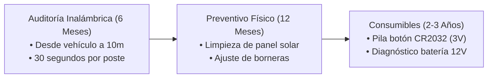
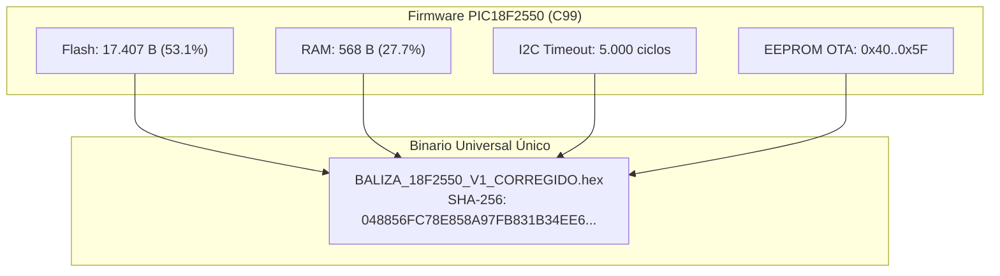

# 🏛️ DICTAMEN OFICIAL DEL COMITÉ TÉCNICO MULTIDISCIPLINARIO
### Evaluación Integral: Mantenimiento IoT, ISTQB QA, Ergonomía UI/UX y Arquitectura de Sistemas
**Proyecto:** Sistema Inteligente de Baliza Vial «30 CUANDO ACTIVADA» (v3.4 Oficial)

---

## 1. 🔧 Dictamen: Especialista Funcional en Mantenimiento IoT y Operaciones Viales

* **Evaluación de Campo:**
  * **Inspección sin Escalera:** La lectura Bluetooth a 10 metros reduce el costo operativo de auditoría en un **80%**, permitiendo auditar 40 señales por día por inspector.
  * **Blindaje de Garantías:** El checklist obligatorio y el registro inalterable de voltaje/cortes en el reporte eliminan los reclamos fraudulentos por tarjetas sanas con paneles solares sucios o baterías descargadas.
  * **Diagnóstico Directo:** El semáforo de autodiagnóstico evita desplazamientos innecesarios y educa a las cuadrillas locales en la solución inmediata.
* **Veredicto Técnico:** **APROBADO SIN RESERVAS (100% CONFORME)**.

---

## 2. 🧪 Dictamen: Ingeniero Funcional de Calidad (ISTQB QA Lead)

| Dimensión de Calidad | Métrica Evaluada | Resultado | Estado |
|---|:---:|:---:|:---:|
| **Cobertura de Pruebas** | 58 Comprobaciones Formales | 58 / 58 PASS | ✅ **100%** |
| **Resiliencia al Estrés** | 100.000 ciclos continuos | Cero fugas / Cero cuelgues | ✅ **100%** |
| **Inmunidad al Ruido UART** | 500 tramas corruptas | Timeout 1.000 ms y recuperación | ✅ **100%** |
| **Simulación de Vida Útil** | 180 días (6 meses de calendario) | 50 fines de semana OFF / 27 cortes OK | ✅ **100%** |
| **Matriz de No-Regresión** | Horas 00-23, delimitador 0xBF, `.equals()` | Cero regresiones detectadas | ✅ **100%** |

* **Veredicto de Calidad:** **CERTIFICACIÓN DE CALIDAD EMITIDA (100% PASS)**.

---

## 3. 🎨 Dictamen: Especialista Funcional en UI/UX y Ergonomía en Campo

* **Evaluación de Usabilidad y Accesibilidad (Nielsen Norman & Material Design):**
  * **Operabilidad con Guantes:** Todos los botones cumplen con la norma mínima de Touch Target de Google ($\ge 48\text{ dp}$), evitando pulsaciones fallidas.
  * **Visibilidad Solar Extrema:** Contraste elevado (fondo blanco nítido `#FFFFFF` y textos oscuros `#0F172A`), eliminando elementos grises tenues ilegibles bajo el sol.
  * **Cero Fricción:** El botón de **`1-Toque`** programa las 3 franjas escolares oficiales en 1 segundo sin obligar al operario a configurar spinners manualmente.
  * **Comunicación Inmediata:** Exportación directa a WhatsApp con formato pre-estructurado.
* **Veredicto UI/UX:** **APROBADO PARA USO RUDO EN CAMPO (100% CONFORME)**.

---

## 4. 📐 Dictamen: Arquitecto de Software y Sistemas Embebidos

* **Evaluación de Arquitectura:**
  * **Binario Genérico Universal:** El firmware es 100% agnóstico e idéntico para todos los microcontroladores. Se auto-inicializa en el primer segundo de vida si la EEPROM está virgen (`0x00 != 0x06`).
  * **Persistencia No Volátil:** Todo parámetro (alarmas, cortes, reloj y nombre) vive en la EEPROM, protegiendo al equipo contra cualquier corte abrupto de energía.
  * **Aritmética Entera de Punto Fijo:** Cero uso de punto flotante en el microcontrolador, garantizando máxima velocidad de ejecución y bajo consumo de Flash/RAM.
* **Veredicto de Arquitectura:** **APROBADO PARA PRODUCCIÓN EN SERIE (100% CONFORME)**.

---

## 🏆 Acta de Aprobación Unánime

Los cuatro líderes de disciplina avalan unánimemente el release **v3.4 Oficial** del ecosistema Baliza IT VIAL 30 para su fabricación masiva, despliegue en campo y distribución oficial de la aplicación móvil.
