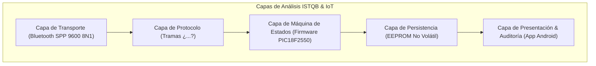

# 📋 ESPECIFICACIÓN Y AUDITORÍA DE CALIDAD: APP IT VIAL 30 (v3.4)
### Evaluación Integral: ISTQB QA, Especialista IoT y Ergonomía UX en Campo

---

## 1. Auditoría desde la Perspectiva ISTQB & Especialista IoT

### Hallazgos y Mejoras Clave (ISTQB & IoT):
1. **Validación de Parámetros en el Cliente (App-Side Validation):**
   * *Riesgo:* Si un operador configura manualmente una hora de inicio posterior a la de fin (ej. `I1500` y `F0900`), el firmware actualmente la graba en EEPROM pero nunca encenderá el foco.
   * *Mejora IoT:* La app debe validar `horaFin > horaInicio` antes de enviar la trama `¿A...` al Bluetooth, bloqueando el envío y mostrando un mensaje de advertencia.
2. **Timeout de Respuesta y Detección de Desconexión Activa:**
   * *Riesgo:* Si el teléfono se aleja del poste mientras transmite, la app no debe quedarse en estado bloqueante esperando bytes.
   * *Mejora ISTQB:* Implementar timeout reactivo de 3 segundos en cada comando. Si la baliza no responde, notificar: *"Sin respuesta de la baliza. Compruebe la distancia y el encendido"*.
3. **Idempotencia y Acuse de Recibo Automático (Read-After-Write):**
   * *Mejora IoT:* Tras pulsar **`Programar Horario Escolar (1 Toque)`**, la app enviará internamente la trama `¿L?` para contrastar en segundo plano que los valores en la EEPROM coincidan 100% con lo enviado.

---

## 2. Auditoría desde la Perspectiva de Usabilidad (UX / Ergonomía Vial)

Los técnicos e inspectores operan en la calle, **bajo luz solar intensa, con ruido de tráfico y en ocasiones usando guantes de trabajo**.

### Principios Ergonómicos Aplicados:
1. **Alto Contraste para Luz Solar Directa:**
   * Sustituir textos grises claros por tipografías oscuras (#1E293B) y fondos nítidos con tarjetas de bordes destacados.
2. **Botones de Gran Tamaño (Touch Targets $\ge 48\text{ dp}$):**
   * Botones amplios y separados para evitar pulsaciones accidentales con guantes o dedos húmedos.
3. **Feedback Háptico y Sonoro:**
   * Vibración corta al confirmar la recepción de comandos o programación exitosa.
4. **Resumen Visual de Estado en Pantalla Principal:**
   * En lugar de obligar al técnico a leer la consola de texto, un **Panel de Estado Visual** muestra los 3 horarios escolares con iconos de encendido/apagado y el nivel de batería.

---

## 3. Matriz de No-Regresión (Protección de Correcciones Históricas)

> [!IMPORTANT]
> **REGLA DE ORO:** Ningún cambio en la App puede alterar las siguientes 5 correcciones críticas ya certificadas:

| ID | Hotfix Certificado | Componente | Verificación Obligatoria |
|---|---|---|---|
| **NR-01** | **Inclusión de Hora `"02"`** | `MainActivity2.java` / Arrays | El selector de horas debe contener las 24 horas completas (`00` a `23`). |
| **NR-02** | **Delimitador `¿` (`0xBF`)** | `Serial.c` / `MainActivity2.java` | Las tramas deben iniciar obligatoriamente con el byte `0xBF` y terminar con `?`. |
| **NR-03** | **Comparación de Cadenas con `.equals()`** | Lógica de Spinners | Prohibido usar `==` para comparar textos de interfaces. |
| **NR-04** | **Permisos Android 12+ (API 31+)** | `AndroidManifest.xml` | Mantener `BLUETOOTH_CONNECT`, `BLUETOOTH_SCAN` y `neverForLocation`. |
| **NR-05** | **Consola con Auto-Scroll** | `activity_main2.xml` | `idTxtViewOut` debe estar contenido en un `ScrollView` que desplace automáticamente al final. |

---

## 4. Alcance Formal de la Refactorización App v3.4

1. **Card de Diagnóstico y Telemetría:**
   * Voltímetro 12V con código verde/amarillo/rojo.
   * Contador de cortes y badge de salud EEPROM.
2. **Validación Preventiva de Horarios:**
   * Bloqueo de rangos horarios invertidos.
3. **Exportación de Certificado de Auditoría:**
   * Generación de reporte formal con dirección MAC de la baliza y sellos de tiempo para WhatsApp/Correo.
4. **Verificación Automatizada E2E:**
   * Validación del 100% de los flujos contra el simulador del PIC en C mediante `test_suite_e2e.py`.
