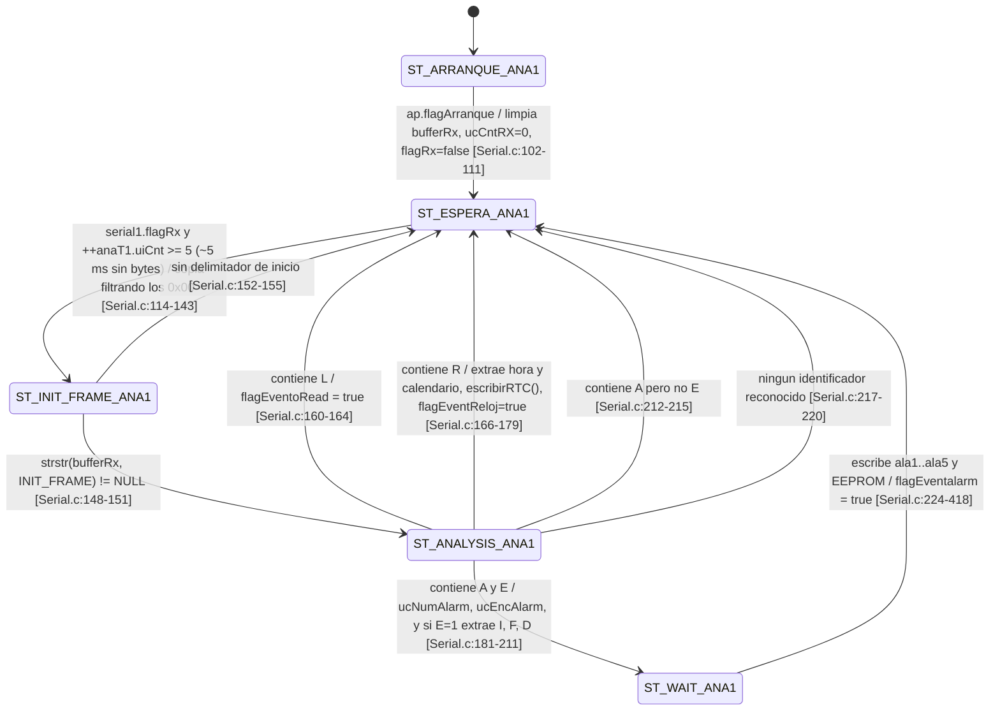
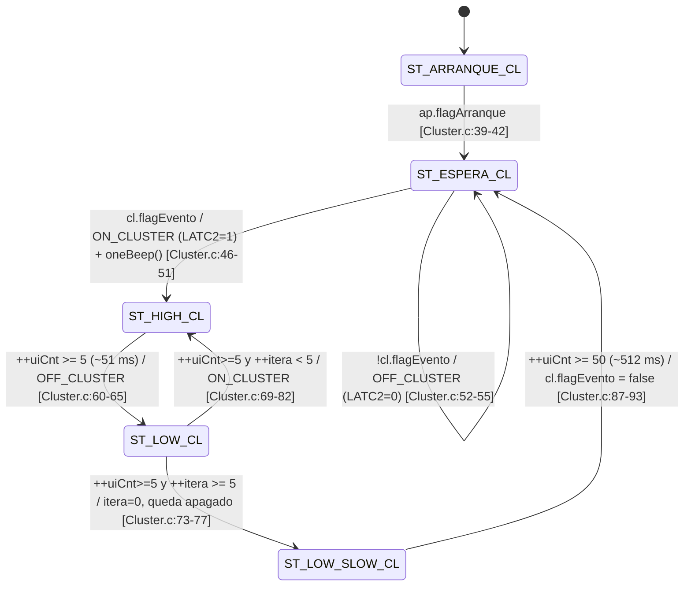
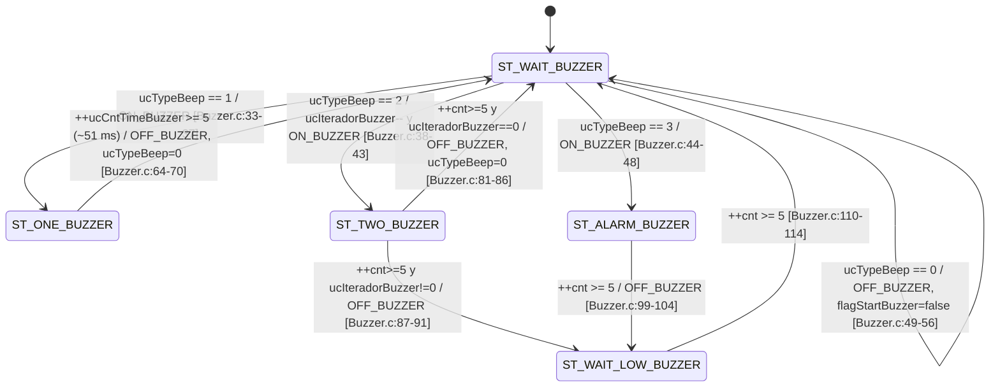
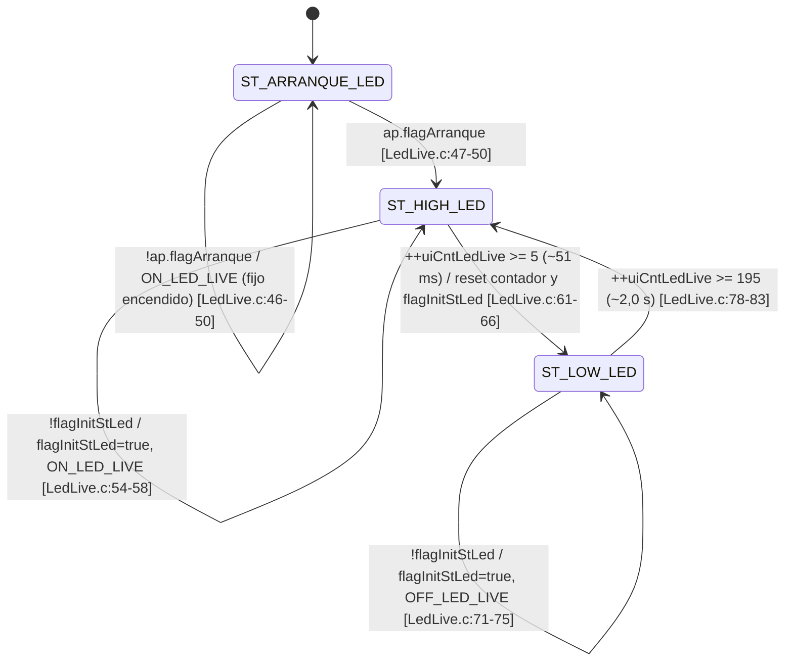
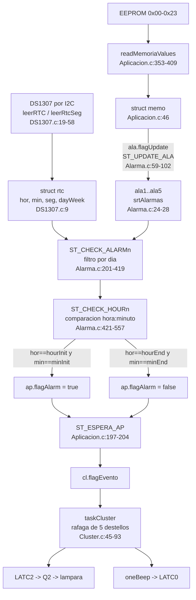

# Firmware Baliza — documentación técnica

**Proyecto:** Baliza / alarma temporizada
**MCU:** PIC18F2550-I/SP · **Toolchain:** MPLAB X + XC8 v2.46 (C99)
**Autor original:** Ing. Freiman Parga, octubre–noviembre 2022
**Código fuente:** `D:\@Proyect\Baliza\1 Firmware\Doc mplabx\18f2550_baliza_ V1.X\`
**Hardware de referencia:** `D:\@Proyect\Baliza\2 Hardware tarjeta\balizaSR30.kicad_sch` (revisión SR30, gerbers 2025-06-24)

Este documento está dirigido a un ingeniero que va a mantener este firmware sin haberlo escrito.
Cada afirmación lleva la referencia `archivo:línea`. Lo que no se puede determinar leyendo el
código está en la sección [21. Preguntas abiertas](#21-preguntas-abiertas), no inventado.

---

## Índice

1. [Qué es el equipo y qué hace](#1-qué-es-el-equipo-y-qué-hace)
2. [Plataforma y configuración](#2-plataforma-y-configuración)
3. [Mapa de pines y periféricos](#3-mapa-de-pines-y-periféricos)
4. [Arquitectura de tareas (protothreads)](#4-arquitectura-de-tareas-protothreads)
5. [Máquina de estados de cada tarea](#5-máquina-de-estados-de-cada-tarea)
6. [Protocolo serie / Bluetooth](#6-protocolo-serie--bluetooth)
7. [Modelo de datos en EEPROM](#7-modelo-de-datos-en-eeprom)
8. [Lógica de alarmas](#8-lógica-de-alarmas)
9. [Defectos y riesgos encontrados](#9-defectos-y-riesgos-encontrados)
10. [Cómo compilar y grabar](#10-cómo-compilar-y-grabar)
11. [Glosario de la nomenclatura](#11-glosario-de-la-nomenclatura)
21. [Preguntas abiertas](#21-preguntas-abiertas)

---

## 1. Qué es el equipo y qué hace

La Baliza es un temporizador que enciende una luz de aviso (el "cluster") en franjas horarias
programadas. Lleva un reloj de tiempo real DS1307 con pila de respaldo (`DS1307.c:37`,
`BT1 = Battery_Cell` en el esquemático), de modo que sabe la hora aunque se corte la
alimentación. El usuario se conecta por Bluetooth desde una app Android (módulo HC-06,
`U2 = HC06_Module`) y programa hasta **cinco alarmas** independientes: para cada una elige hora
de inicio, hora de fin y el tipo de día (todos los días, de lunes a viernes, o fin de semana).
Cuando el reloj entra en una de esas franjas, el equipo activa la salida del cluster (RC2,
`Cluster.h:15`) con un patrón de destellos y hace sonar un zumbador. Un LED de "latido" en RA0
parpadea permanentemente para indicar que el firmware está vivo (`LedLive.c:35-89`).

Internamente el programa no usa un sistema operativo: es un bucle infinito en `main.c:132-140`
que llama por turnos a seis tareas cooperativas escritas con *protothreads* de Adam Dunkels.
Cada tarea es una máquina de estados que se ejecuta cada pocos milisegundos y cede el control
enseguida. La configuración de las cinco alarmas se guarda en la EEPROM interna del PIC
(direcciones 0x00–0x23, `Aplicacion.h:40-102`), así que sobrevive a los cortes de luz. El
protocolo de la app es de texto plano sobre el puerto serie a 9600 baudios, con tramas
delimitadas por un byte de inicio y un `?` de fin (`Serial.h:27-37`). El equipo también puede
devolver por Bluetooth un volcado en texto con la hora actual y el estado de las cinco alarmas
(`Aplicacion.c:285-334`).

---

## 2. Plataforma y configuración

### 2.1 Bits de configuración

Todos los `#pragma config` están en `main.h:12-70`. Los valores relevantes:

| Pragma | Valor | Línea | Efecto |
|---|---|---|---|
| `FOSC` | `HS` | `main.h:17` | Oscilador de cristal alta velocidad, **sin PLL** |
| `PLLDIV` | `1` | `main.h:12` | Prescaler del PLL /1 (irrelevante: el PLL no se usa) |
| `CPUDIV` | `OSC1_PLL2` | `main.h:13` | Fuente primaria /1 → **Fosc = frecuencia del cristal** |
| `USBDIV` | `1` | `main.h:14` | Reloj USB directo (USB no se usa) |
| `FCMEN` | `OFF` | `main.h:18` | Sin monitor de fallo de reloj |
| `IESO` | `OFF` | `main.h:19` | Sin conmutación int/ext de oscilador |
| `PWRT` | `ON` | `main.h:22` | Power-up timer activo (72 ms) |
| **`BOR`** | **`OFF`** | `main.h:23` | **Brown-out reset deshabilitado** → ver [D15](#d15--sin-brown-out-reset-con-escrituras-de-eeprom) |
| `VREGEN` | `OFF` | `main.h:25` | Regulador USB apagado |
| **`WDT`** | **`OFF`** | `main.h:28` | **Watchdog deshabilitado** → ver [D02](#d02--sin-watchdog-y-con-esperas-bloqueantes-sin-timeout) |
| `CCP2MX` | `ON` | `main.h:32` | CCP2 en RC1 |
| `PBADEN` | `ON` | `main.h:33` | PORTB<4:0> arrancan como **analógicos** — importante para I2C |
| `LPT1OSC` | `OFF` | `main.h:34` | Timer1 en modo alta potencia |
| `MCLRE` | `ON` | `main.h:35` | MCLR habilitado como reset |
| `STVREN` | `ON` | `main.h:38` | Desbordamiento de pila hardware → reset |
| `LVP` | `OFF` | `main.h:39` | Programación en bajo voltaje deshabilitada (RB5 libre) |
| `XINST` | `OFF` | `main.h:40` | Set de instrucciones extendido apagado (modo legacy) |
| `CP0..3`, `CPB`, `CPD` | `OFF` | `main.h:43-50` | Sin protección de lectura de código ni de EEPROM |
| `WRT0..3`, `WRTC`, `WRTB`, `WRTD` | `OFF` | `main.h:53-61` | Sin protección de escritura |

Estos pragmas se pueden verificar contra el `.hex` de producción. El registro de configuración
grabado es, en `18f2550_baliza__V1.X.production.hex:1359`:

```
:020000040030CA
:0E000000000C181EFF8381FF0FC00FE00F40A1
```

que en la dirección `0x300000` deja `CONFIG1L=0x00`, `CONFIG1H=0x0C`. `CONFIG1H = 0x0C` tiene
`FOSC<3:0> = 1100` = HS, e `IESO=FCMEN=0`. `CONFIG1L = 0x00` da `PLLDIV=000` (/1),
`CPUDIV=00` y `USBDIV=0`. **El `.hex` de producción coincide con los pragmas del fuente.**

### 2.2 Cristal y `_XTAL_FREQ` — verificación

`main.h:76` declara:

```c
#define _XTAL_FREQ 20000000
```

El esquemático confirma que el cristal físico es de 20 MHz: el componente `Y1` tiene
`(property "Value" "20M")` con footprint `Crystal:Crystal_HC18-U_Vertical`, conectado a
OSC1 (pin 9) y OSC2/RA6 (pin 10) del PIC con dos condensadores `C1 = C2 = 22pF`. El segundo
cristal, `Y2 = 37Khz` (etiquetado mal, es el 32.768 kHz estándar), pertenece al DS1307.

Con `FOSC = HS` (no `HSPLL`) y `CPUDIV` seleccionando la fuente primaria dividida por 1, el reloj
del CPU es directamente el del cristal:

**Fosc = 20 MHz · Tcy = 4/Fosc = 200 ns**

Es decir: `_XTAL_FREQ 20000000` **sí corresponde al reloj real**. No hay la incoherencia de reloj
que cabría sospechar. Sí hay dos problemas de temporización derivados, que se detallan abajo.

### 2.3 UART: verificación de SPBRG contra la fórmula del datasheet

`main.c:117` llama a `UART_init_baud(9600)`. Esa función, en `UART.h:20-42`, hace:

```c
TXSTAbits.BRGH = 0;     // UART.h:26  → baja velocidad
TXSTAbits.SYNC = 0;     // UART.h:31  → asíncrono
SPBRG = 32;             // UART.h:34
```

No se toca `BAUDCON`, luego `BRG16 = 0` (valor por defecto tras reset). La fórmula del datasheet
del PIC18F2550 para modo asíncrono con `BRGH=0` y `BRG16=0` (registro BRG de 8 bits) es:

```
Baudios = Fosc / (64 × (SPBRG + 1))
```

Sustituyendo `SPBRG = 32` y `Fosc = 20 MHz`:

```
Baudios = 20 000 000 / (64 × 33) = 20 000 000 / 2112 = 9469,70 baud
Error   = (9469,70 − 9600) / 9600 = −1,36 %
```

**Conclusión.** La combinación `BRGH=0 / SPBRG=32` da 9469,7 baud sobre un cristal de 20 MHz, no
9600. Para que esa pareja diera 9600 exactos haría falta:

```
Fosc = 9600 × 64 × 33 = 20 275 200 Hz ≈ 20,275 MHz
```

que no es un cristal comercial. Por tanto **el reloj declarado es el correcto** (20 MHz, confirmado
por `Y1` en el esquemático) y lo que está desviado es el baudrate, en −1,36 %. Eso está dentro de
la tolerancia típica de un UART asíncrono de 10 bits (el error acumulado en el bit de stop es
1,36 % × 9,5 ≈ 13 % de un bit, muy por debajo del 50 % que provoca error de trama), y en la
práctica el HC-06 lo tolera sin problema. **No es una avería, es un descuido.**

Lo irónico es que la configuración exacta ya está escrita en el mismo fichero, en la función
`UART_init()` de `UART.h:6-18`, que **nunca se llama desde ningún sitio**:

```c
TXSTAbits.BRGH = 1;     // UART.h:13  → alta velocidad
SPBRG = 129;            // UART.h:14  → "9600 a 20MHZ"
```

Verificación: `Baudios = Fosc / (16 × (SPBRG+1)) = 20e6 / (16 × 130) = 9615,4` → error **+0,16 %**.

> **Recomendación.** Cambiar `UART.h:26` a `TXSTAbits.BRGH = 1;` y `UART.h:34` a `SPBRG = 129;`,
> o mejor, hacer que `UART_init_baud()` calcule `SPBRG` a partir de su parámetro `baudRate`
> (que hoy se ignora por completo: `UART.h:20` recibe `baudRate` y no lo usa nunca).

### 2.4 Base de tiempos: el "tick de 1 ms" no es de 1 ms

`INT_init()` en `main.c:148-164` configura Timer0:

```c
TMR0  = 0xFFEC;   // main.c:162
T0CON = 0x87;     // main.c:163
```

`T0CON = 0x87 = 0b1000_0111` significa:

| Bit | Nombre | Valor | Significado |
|---|---|---|---|
| 7 | `TMR0ON` | 1 | Timer0 en marcha |
| 6 | `T08BIT` | 0 | Modo **16 bits** |
| 5 | `T0CS` | 0 | Fuente = reloj interno (Fosc/4) |
| 4 | `T0SE` | 0 | Irrelevante en modo interno |
| 3 | `PSA` | 0 | Prescaler **asignado** a Timer0 |
| 2:0 | `T0PS<2:0>` | 111 | Prescaler **1:256** |

Cuenta:

```
Tcy                        = 4 / 20 MHz          = 200 ns
1 incremento de TMR0       = 256 × 200 ns        = 51,2 µs
0xFFEC = 65516 → desborda a 65536 en 20 incrementos
Periodo de la interrupción = 20 × 51,2 µs        = 1024 µs = 1,024 ms
```

**El tick real es de 1,024 ms, un 2,4 % más largo que el milisegundo que asume el código.**
(A esto hay que sumarle la latencia de entrada a la ISR antes de recargar `TMR0` en `main.c:53`,
del orden de 1–2 µs, despreciable frente al error del 2,4 %.)

Con el prescaler a 1:256 la granularidad de la recarga es de 51,2 µs, así que **es imposible
obtener 1,000 ms exacto con esa configuración**: el valor entero más cercano son esos 20
incrementos. Para 1,000 ms exacto habría que usar prescaler 1:2 (`T0PS=000`, o sea `T0CON=0x80`)
y recargar `TMR0 = 65536 − 2500 = 63036 = 0xF63C`.

Consecuencias prácticas del +2,4 %:

| Constante nominal | Valor real |
|---|---|
| `PERIOD_APLICACION`/`ALARM`/`BUZZER`/`CLUSTER`/`LEDLIVE` = 10 ms | 10,24 ms |
| `PERIOD_ANALIZA_UART1` = 1 ms (`Serial.h:21`) | 1,024 ms |
| "un minuto de tiks" = 60000 (`main.c:57-58`) | **61,44 s** |
| Parpadeo LED live: 5 + 195 ticks (`LedLive.h:29-30`) = 2,00 s | 2,048 s |
| Beep: 5 ticks (`Buzzer.c:64`) = 50 ms | 51,2 ms |
| Arranque: 500 ciclos (`Aplicacion.h:24`) = 5,0 s | 5,12 s |
| Ráfaga del cluster ≈ 1,00 s | 1,024 s |

**Las alarmas NO se ven afectadas** por este error, porque la hora la aporta el DS1307 por I2C
(`Alarma.c:197`) y no el contador de ticks. El error solo desplaza cadencias internas.

### 2.5 Consumo de memoria

Del mapa del enlazador `dist/default/debug/18f2550_baliza__V1.X.debug.map` (compilación **debug**;
la de producción será algo menor porque no reserva espacio para el depurador):

| Recurso | Uso | Total | % |
|---|---|---|---|
| Programa (`CODE` hasta 0x5310 + `mediumconst` 0x7BBC–0x7D3F) | ≈ 21 652 B | 32 064 B disponibles | ≈ 67 % |
| Libre contiguo en flash | 0x5310–0x7BBB = 0x28AC = 10 412 B | | |
| RAM `cstackCOMRAM` 0x01–0x51 | 81 B | | |
| RAM `cstackBANK0` 0x60–0xF2 | 147 B | | |
| RAM `bssBANK1` 0x100–0x1FC | 253 B | | |
| RAM `bssBANK2` 0x200–0x252 | 83 B | | |
| **RAM total** | **564 B** | 2048 B | 27,5 % |
| EEPROM de datos usada | 36 B (0x00–0x23) | 256 B | 14 % |

La pila software del compilador (`cstack*`) suma unos **228 bytes**. Ahí viven los buffers locales
`bufferTx1[45]` de `Serial.c:53`, `buffer[10]` de `Serial.c:479` y `buffer[4]` de `Serial.c:457`
y `Serial.c:497` — que son precisamente los que se desbordan en [D04](#d04--desbordamiento-de-buffer-en-extraervalue-y-extraerframe).

---

## 3. Mapa de pines y periféricos

Contrastado línea a línea entre el firmware y el esquemático KiCad `balizaSR30.kicad_sch`
(la correspondencia pin↔etiqueta se obtuvo midiendo la distancia entre el extremo de cada pin del
símbolo `PIC18F2550-ISP` colocado en (146.558, 104.521) y las etiquetas de red; las coincidencias
exactas dan una distancia de 9,14 mm, que es la longitud del stub de conexión).

| Función | Pin | Puerto | Dir. | Configurado en | Etiqueta esquemático | ¿Coincide? |
|---|---|---|---|---|---|---|
| LED "live" | 2 | RA0 / AN0 | Salida | `LedLive.c:101` (`TRISA0=0`) | `LED_LIVE` | ✅ |
| Sensor de tensión | 3 | RA1 / AN1 | Entrada analógica | `main.c:175` (PCFG=1011) + `Aplicacion.c:211` (`ADC_read(1)`) | `S_VOLT` | ✅ |
| — sin uso — | 4 | RA2 / AN2 | Analógica habilitada, sin leer | `main.c:175` | (sin conexión) | — |
| Sensor de temperatura (LM35) | 5 | RA3 / AN3 | **Digital** por PCFG | `Aplicacion.c:227` (`ADC_read(3)`) | `S_TEMP` (→ `U5 = LM35-LP`) | ⚠️ ver [D21](#d21--an3-se-lee-por-adc-pero-pcfg-lo-deja-como-digital) |
| Cristal 20 MHz | 9 | OSC1 | — | `main.h:17` (`FOSC=HS`) | `OSC1` → `Y1 = 20M` | ✅ |
| Cristal 20 MHz | 10 | RA6 / OSC2 | — | idem | `OSC2` | ✅ |
| **Buzzer (firmware)** | **11** | **RC0** | **Salida** | `Buzzer.c:163` (`TRISC0=0`), `Buzzer.h:24-25` (`LATC0`) | **`BUTTON`** (→ `SW1 = SW_Push`) | ❌ ver [D01](#d01--el-firmware-usa-rc0-como-buzzer-pero-el-esquemático-dice-que-rc0-es-el-pulsador) |
| **Buzzer (hardware)** | **12** | **RC1** | — | `Buzzer.c:162` **comentado** | `BUZZER` (→ `R11 2.2k` → `Q4 MMBT3904` → `BZ1 Buzzer`) | ❌ nunca se configura |
| Salida cluster | 13 | RC2 / CCP1 | Salida | `Cluster.c:113` (`TRISC2=0`), `Cluster.h:15-16` (`LATC2`) | `CLUSTER` (→ `Q2 Q_NMOS_GDS` TO-220) | ✅ |
| UART TX → HC-06 RX | 17 | RC6 / TX | Salida | `UART.h:29` (`TRISC6=0`) | `MCU_TX` | ✅ |
| UART RX ← HC-06 TX | 18 | RC7 / RX | Entrada | `UART.h:28` (`TRISC7=1`) | `MCU_RX` | ✅ |
| I2C SDA (DS1307) | 21 | RB0 / SDA | Entrada (control MSSP) | `I2C.c:11` (`TRISB.RB0=1`) | `SDA` (→ `U4 = DS1307_`, `R5/R6 4.7k` pull-ups) | ✅ |
| I2C SCL (DS1307) | 22 | RB1 / SCL | Entrada (control MSSP) | `I2C.c:12` (`TRISB.RB1=1`) | `SCL` | ✅ |
| ICSP PGC | 27 | RB6 | — | (no tocado por el firmware) | `PGC` | ✅ |
| ICSP PGD | 28 | RB7 | — | (no tocado por el firmware) | `PGD` | ✅ |
| Reset | 1 | MCLR/RE3 | Entrada | `main.h:35` (`MCLRE=ON`) | `MCLR` | ✅ |

**Notas importantes sobre el mapa de pines:**

1. **RC0/RC1 están cruzados** entre firmware y hardware. Es el defecto [D01](#d01--el-firmware-usa-rc0-como-buzzer-pero-el-esquemático-dice-que-rc0-es-el-pulsador),
   el más grave del documento. El propio código deja la huella del cambio: `Buzzer.c:162` contiene
   `//TRISCbits.TRISC1 = 0;` comentado justo encima de `TRISCbits.TRISC0 = 0;` en `Buzzer.c:163`.

2. **Hay un pulsador físico (`SW1`) sin ningún soporte en el firmware.** No existe módulo
   `Buttons.c`; las únicas huellas son un `extern strButtons button;` comentado en
   `Aplicacion.c:35` y un `ulCntPeriodButtons = 0;` comentado en `main.c:65`. Ver [D33](#d33--pulsador-físico-sin-soporte-en-firmware).

3. **RB0/RB1 con `PBADEN = ON`.** Como `main.h:33` deja PORTB<4:0> como analógicos tras reset,
   RB0 (AN12) y RB1 (AN10) arrancarían como analógicos y el módulo MSSP no funcionaría. Lo salva
   `main.c:115`, que escribe `ADCON1 = 0x0F` (PCFG=1111, todo digital) **antes** de
   `I2C_Master_Init()` en `main.c:121`. Después `ADC_init()` (`main.c:118`) pone `PCFG = 0b1011`,
   que solo vuelve a habilitar AN0/AN1/AN2 = RA0/RA1/RA2; RB0 y RB1 siguen digitales. **El orden
   es correcto, pero es frágil**: depende de que nadie mueva `ADC_init()` después de
   `I2C_Master_Init()`.

4. **RA0 es a la vez la salida del LED y el canal AN0.** `PCFG=1011` habilita AN0 como analógico,
   lo que solo desconecta el buffer digital de *entrada*; el driver de salida sigue funcionando
   porque `TRISA0 = 0` (`LedLive.c:101`). El LED funciona, pero es una asignación de pin sucia.

### 3.1 Configuración del ADC

`ADC_init()` en `main.c:172-182`:

```c
ADCON1bits.VCFG = 0b00;     // main.c:174 — referencias = VSS y VDD
ADCON1bits.PCFG = 0b1011;   // main.c:175 — "Entradas Analogicas a0, a1, a2"
ADCON2bits.ACQT = 0b010;    // main.c:177 — 4 TAD de adquisición
ADCON2bits.ADCS = 0b100;    // main.c:178 — Fosc/4
ADCON2bits.ADFM = 1;        // main.c:179 — justificación a la derecha
ADCON0bits.ADON = 1;        // main.c:181
```

**¿Está el canal 3 habilitado como analógico?** No. Según la tabla de `PCFG<3:0>` del datasheet
del PIC18F2550, el valor `1011` deja **AN0, AN1 y AN2 como analógicos y AN3…AN12 como digitales**.
El comentario del propio autor en `main.c:175` lo dice: *"Entradas Analogicas a0, a1, a2"*.

Por tanto:

- `ADC_read(1)` en `Aplicacion.c:211` lee **AN1, que sí es analógico** → eléctricamente correcto.
- `ADC_read(3)` en `Aplicacion.c:227` lee **AN3, que está configurado como digital** → el buffer
  digital de entrada está activo sobre un pin con una señal analógica del LM35, el resultado de
  conversión no está garantizado por el fabricante y además se produce consumo cruzado en el
  buffer de entrada. Ver [D21](#d21--an3-se-lee-por-adc-pero-pcfg-lo-deja-como-digital).

**Además, el tiempo de conversión está fuera de especificación.** `ADCS = 0b100` selecciona
`Fosc/4`, luego:

```
TAD = 4 / 20 MHz = 200 ns
```

El datasheet exige `TAD ≥ 0,8 µs` y, en su tabla de "TAD vs. frecuencia del dispositivo", limita
`Fosc/4` a un máximo de 5 MHz. A 20 MHz habría que usar `ADCS = 0b010` (Fosc/32 → 1,6 µs) o
`ADCS = 0b110` (Fosc/64 → 3,2 µs). Con `ACQT = 0b010` (4 TAD) el tiempo de adquisición resulta
`4 × 200 ns = 0,8 µs`, cuando el comentario del propio autor en `main.c:177` pide `> 2,45 µs`.
Ver [D22](#d22--tad-y-tacq-del-adc-fuera-de-especificación).

### 3.2 Configuración del I2C

`I2C_Master_Init(100000)` se llama desde `main.c:121`. En `I2C.c:9-22`:

```c
SSPSTATbits.SMP = 1;       // I2C.c:14 — control de slew rate deshabilitado (modo 100 kHz)
SSPCON1bits.SSPEN = 1;     // I2C.c:15
SSPCON1bits.SSPM = 0b1000; // I2C.c:16 — modo maestro I2C
SSPADD = (uint8_t)((_XTAL_FREQ/(4.0*clock))-1);   // I2C.c:20
```

Verificación: `SSPADD = 20e6 / (4 × 100000) − 1 = 50 − 1 = 49` → `SCL = 20e6/(4×50) = 100 kHz`. ✅

La dirección del esclavo se escribe a mano en `DS1307.c`: `208 = 0xD0` para escritura y
`209 = 0xD1` para lectura (`DS1307.c:24`, `DS1307.c:27`), que corresponde a la dirección de 7 bits
`1101000` del DS1307. ✅

---

## 4. Arquitectura de tareas (protothreads)

### 4.1 El bucle principal

`main.c:132-140`:

```c
while(1)
{
    executeTaskLedLive();
    executeTaskAnalizaUart1();
    executeTaskAplicacion();
    executeTaskAlarm();
    executeTaskBuzzer();
    executeTaskCluster();
}
```

Seis tareas, llamadas siempre en el mismo orden, sin prioridades ni planificador. Cada
`executeTaskX()` es un envoltorio de una línea sobre la función protothread correspondiente
(por ejemplo `Cluster.c:104-107`).

Antes del bucle, `main.c:126-131` llama a los seis `startTaskX()`, que se limitan a hacer
`PT_INIT(&ptTaskX)` (por ejemplo `Cluster.c:100-103`).

### 4.2 Cómo funcionan los protothreads aquí

La librería es la de Adam Dunkels (`Rtos/pt.h`, `Rtos/lc.h`). `Rtos/lc.h:114-118` selecciona la
implementación por defecto, `lc-switch.h`, porque el proyecto no define `LC_INCLUDE` (confirmado
en el preprocesado: `build/default/debug/Cluster.i:5140` incluye `./Rtos/lc-switch.h`).

Las macros clave (`Rtos/lc-switch.h:64-72`):

```c
typedef unsigned short lc_t;
#define LC_INIT(s)   s = 0;
#define LC_RESUME(s) switch(s) { case 0:
#define LC_SET(s)    s = __LINE__; case __LINE__:
#define LC_END(s)    }
```

y `Rtos/pt.h:148-154`:

```c
#define PT_WAIT_UNTIL(pt, condition)  \
  do { LC_SET((pt)->lc);              \
       if(!(condition)) { return PT_WAITING; } } while(0)
```

Es decir: el estado de la "tarea" es un único `unsigned short` que guarda el número de línea donde
se suspendió. Al reentrar, el `switch` de `PT_BEGIN` (`Rtos/pt.h:115`) salta directamente a ese
`case`. **No hay pila por tarea, no hay contexto guardado: las variables locales de la función
protothread no sobreviven a una suspensión.** Por eso todo el estado de las tareas vive en
estructuras globales (`ap`, `ala`, `cl`, `serial1`, `anaT1`).

> ⚠️ **Trampa de mantenimiento.** `Rtos/lc-switch.h:60-61` avisa: *"lc implementation using
> switch() does not work if an LC_SET() is done within another switch() statement"*. En este
> firmware todos los `PT_WAIT_UNTIL` están **fuera** del `switch(stateX)`, justo al principio del
> `while(1)` de cada tarea (`Aplicacion.c:62-63`, `Alarma.c:46-47`, `Serial.c:96-98`,
> `Cluster.c:34-35`, `Buzzer.c:24-25`, `LedLive.c:40-41`), así que funciona. Pero si alguien añade
> un `PT_WAIT_UNTIL` o `PT_YIELD` **dentro** de un `case ST_XXX:`, el `case __LINE__:` generado
> caerá en el `switch` interno de estados y la resunción se romperá de forma silenciosa o dará un
> error de compilación confuso. Ver [D45](#d45--lc-switch-impide-poner-esperas-dentro-del-switch-de-estados).

### 4.3 La base de tiempos: `getMillis()` y `ulCntTick1ms`

`main.c:39` declara la única variable de tiempo del sistema:

```c
unsigned long ulCntTick1ms;
```

La ISR de alta prioridad la incrementa en cada desbordamiento de Timer0 (`main.c:50-75`), y
`TimeBase.c:15-18` la expone:

```c
unsigned long getMillis(void) { return ulCntTick1ms; }
```

### 4.4 El patrón de periodo

Todas las tareas usan exactamente la misma plantilla. Ejemplo de `Cluster.c:32-36`:

```c
while (1)
{
    ulCntPeriodCluster = getMillis() + PERIOD_CLUSTER;
    PT_WAIT_UNTIL(pt, getMillis() >= ulCntPeriodCluster);
    switch(stateCluster) { ... }
}
```

Se calcula un instante de vencimiento absoluto y se cede el control hasta alcanzarlo. Los periodos
de cada módulo:

| Tarea | Constante | Valor | Definida en | Periodo real (tick 1,024 ms) |
|---|---|---|---|---|
| `taskLedLive` | `PERIOD_LEDLIVE` | 10 | `LedLive.h:23` | 10,24 ms |
| `taskAnalizaUart1` | `PERIOD_ANALIZA_UART1` | 1 | `Serial.h:21` | 1,024 ms |
| `taskAplicacion` | `PERIOD_APLICACION` | 10 | `Aplicacion.h:22` | 10,24 ms |
| `taskAlarm` | `PERIOD_ALARM` | 10 | `Alarma.h:33` | 10,24 ms |
| `taskBuzzer` | `PERIOD_BUZZER` | 10 | `Buzzer.h:22` | 10,24 ms |
| `taskCluster` | `PERIOD_CLUSTER` | 10 | `Cluster.h:13` | 10,24 ms |

Cada variable `ulCntPeriodX` se define en el `.c` de su módulo (`LedLive.c:31`, `Serial.c:82`,
`Aplicacion.c:52`, `Alarma.c:36`, `Buzzer.c:15`, `Cluster.c:26`) y se declara `extern` en
`main.c:30-35` para que la ISR pueda tocarlas.

### 4.5 El reset a los 60000 ticks: por qué existe y qué pasa en el wrap

En la ISR de Timer0, `main.c:57-73`:

```c
//si hay un minuto de tiks!!
if(++ulCntTick1ms >= 60000)
{
    ulCntTick1ms = 0;

    ulCntPeriodLedLive = 0;
    ulCntPeriodAplicacion = 0;
    ulCntPeriodAlarm = 0;
    ulCntPeriodBuzzer = 0;
    ulCntPeriodAnaUart1 = 0;
    ulCntPeriodCluster = 0;
}
```

**Por qué existe.** `getMillis()` devuelve un contador que se reinicia a 0 cada 60000 ticks. Si solo
se reiniciara el contador y no los vencimientos, ocurriría lo siguiente: una tarea que a t=59 995
calcula `ulCntPeriodX = 59 995 + 10 = 60 005` se quedaría esperando `getMillis() >= 60005`, cosa
que no puede pasar nunca porque el contador vuelve a 0 en 60 000. La tarea quedaría bloqueada para
siempre. Poner a cero los seis vencimientos en el mismo instante en que se reinicia el contador
convierte la condición en `getMillis() >= 0`, que es trivialmente cierta, y todas las tareas se
desbloquean en la siguiente pasada.

Es decir: es un **manejo manual del wrap-around**, resuelto por fuerza bruta. La forma limpia sería
dejar que el contador desborde de forma natural en 2^32 y comparar por diferencia con signo
(`(long)(getMillis() - deadline) >= 0`), lo que elimina el reinicio y su ventana de carrera.

**Qué pasa exactamente en el instante del wrap.**

1. Las seis tareas se vuelven simultáneamente elegibles. En la siguiente vuelta del `while(1)` de
   `main.c:132-140` las seis ejecutan una iteración de su máquina de estados, una detrás de otra.
2. Una tarea que estuviera a mitad de su periodo ve ese periodo **truncado**. Por ejemplo, si la
   tarea del cluster acababa de programar un vencimiento a +10 ms y el wrap ocurre 2 ms después,
   ese ciclo dura 2 ms en lugar de 10. Los contadores por ciclo (`cl.uiCnt`, `ucCntTimeBuzzer`,
   `uiCntLedLive`, `ala.uiCnt`, `ap.uiCntVolt`) avanzan un paso "gratis".
3. El efecto acumulado: **una vez cada 61,44 s todos los temporizados por conteo de ciclos
   adelantan hasta un periodo completo (≤10 ms).** Sobre un parpadeo de 2 s o una ráfaga de 1 s es
   jitter irrelevante. Sobre `ap.uiCntVolt` (6000 ciclos = 60 s) supone que la lectura de tensión
   se dispara ligeramente antes de lo nominal.
4. La ISR escribe seis `unsigned long` en cada wrap. En un PIC18 eso son 24 escrituras de byte
   dentro de la interrupción, alargándola. No es crítico porque solo ocurre una vez cada 61 s.

**Y hay una carrera real** entre esos ceros y la asignación de las tareas: ver
[D08](#d08--carrera-entre-el-reset-del-wrap-y-la-asignación-del-vencimiento).

### 4.6 La ISR de alta prioridad

`main.c:45-86`. Atiende dos fuentes:

**Timer0** (`main.c:50-75`): recarga `TMR0 = 0xFFEC`, limpia `T0IF` e incrementa el tick.
Obsérvese que la recarga se hace **antes** de limpiar el flag (`main.c:53` y `main.c:55`), lo cual
es correcto.

**Recepción UART** (`main.c:77-85`):

```c
if(PIR1bits.RCIF)
{
    ch = UART_read();
    receiverUart1(&ch);
    serial1.flagRx = true;
    anaT1.uiCnt = 0;
}
```

`UART_read()` (`UART.h:44-61`) limpia la condición de overrun (`OERR`) si se ha producido, lo cual
es imprescindible porque el `CREN` se bloquea al desbordarse. `receiverUart1()` (`Serial.c:74-77`)
mete el byte en `serial1.bufferRx` **sin comprobar el límite** — ver
[D05](#d05--receiveruart1-escribe-en-el-buffer-sin-comprobar-el-límite).

`anaT1.uiCnt = 0` reinicia el contador de silencio: es el mecanismo de detección de fin de trama
(ver [§6.3](#63-troceado-de-la-trama-detección-de-fin-por-silencio)).

### 4.7 La ISR de baja prioridad

`main.c:92-101`:

```c
void __interrupt(low_priority) INT_ISR_LOW (void)
{
    if(INTCON3bits.INT1IE == 1 && INTCON3bits.INT1IF == 1)
    {
         printf("INICIO INTERRUPCION INT1\r\n");
         __delay_ms(4000);
         printf("FIN INTERRUPCION INT1\r\n");
         INTCON3bits.INT1IF = 0;
    }
}
```

`INT1IE` **no se habilita en ningún punto del firmware** (única aparición: `main.c:94`), así que
este cuerpo nunca se ejecuta. Pero se compila, y arrastra `printf` y su cadena de llamadas al
contexto de interrupción. Ver [D12](#d12--isr-de-baja-prioridad-con-printf-y-un-retardo-de-4-segundos).

`RCONbits.IPEN = 1` en `main.c:152` habilita el esquema de prioridades; `GIEH` y `GIEL` se activan
en `main.c:153-154`. Con `IPEN=1`, el bit `INTCONbits.GIE` **es** `GIEH`, dato relevante para
entender [D11](#d11--eepromwrite-reactiva-gie-de-forma-incondicional).

---

## 5. Máquina de estados de cada tarea

Los `enum` de estados **no tienen inicializador**, así que el primer miembro vale 0 y las variables
de estado globales (`stateAp`, `stateAlarm`, `stateAnaTrama1`, `stateCluster`, `stateBuzzer`,
`state_ledLive`) arrancan en 0 por estar en `.bss`. Por eso todas las tareas parten del primer
estado declarado.

**Ninguno de los seis `switch` tiene rama `default:`** — ver [D16](#d16--ningún-switch-de-estados-tiene-rama-default).

### 5.1 Tarea Aplicación — `Aplicacion.c:56-240`

Enum en `Aplicacion.h:173-181`. Estado inicial: `ST_ARRANQUE_AP`.

Usa un patrón auxiliar de "primera entrada al estado": `cambiarEstado()` (`Aplicacion.c:266-270`)
pone `ap.uiStatePrevious = 0xffff` y cambia el estado; `inicioEstado(s)` (`Aplicacion.c:255-263`)
devuelve `true` solo la primera vez que se evalúa dentro de ese estado. De ahí que estados como
`ST_READ_VOLT_AP` tarden dos ciclos (uno para actuar, otro para transitar).

```mermaid
stateDiagram-v2
    [*] --> ST_ARRANQUE_AP

    ST_ARRANQUE_AP --> ST_READ_MEMO_AP : ++uiCntAplicacion >= 500 (5,12 s) / flagArranque=true, twoBeep() [Aplicacion.c:69-79]

    ST_READ_MEMO_AP --> ST_READ_MEMO_AP : ucInitMemory != 0x06 / inicializa 36 celdas EEPROM + twoBeep() [Aplicacion.c:94-139]
    ST_READ_MEMO_AP --> ST_ESPERA_AP : ucInitMemory == 0x06 / readMemoriaValues(), ala.flagUpdate=true, banner UART [Aplicacion.c:141-152]

    ST_ESPERA_AP --> ST_ESPERA_AP : flagEventoRead / oneBeep() + readDevide() [Aplicacion.c:172-177]
    ST_ESPERA_AP --> ST_ESPERA_AP : flagEventReloj / oneBeep() [Aplicacion.c:178-182]
    ST_ESPERA_AP --> ST_ESPERA_AP : flagEventalarm / readMemoriaValues() + ala.flagUpdate [Aplicacion.c:183-189]
    ST_ESPERA_AP --> ST_ESPERA_AP : sin evento / cl.flagEvento = ap.flagAlarm [Aplicacion.c:197-204]
    ST_ESPERA_AP --> ST_READ_VOLT_AP : ++uiCntVolt >= 6000 (~61 s) [Aplicacion.c:190-194]

    ST_READ_VOLT_AP --> ST_ESPERA_AP : 2do ciclo (1ro fVolt = ADC_read(1)) [Aplicacion.c:209-221]

    ST_READ_TEMP_AP --> ST_ESPERA_AP : 2do ciclo (1ro fTemp = ADC_read(3)) [Aplicacion.c:225-235]

    note right of ST_READ_TEMP_AP
        INALCANZABLE: nadie llama
        cambiarEstado(ST_READ_TEMP_AP).
        Ver D23
    end note

    note right of ST_PRUEBA_AP
        Cuerpo VACIO y sin transicion
        (Aplicacion.c:159-162).
        Inalcanzable hoy; si se entrara,
        la tarea se congela. Ver D16
    end note
```

**Detalle importante de `ST_ESPERA_AP`:** todas las condiciones están encadenadas con `else if`
(`Aplicacion.c:172-204`). Consecuencias:

- Si llega un evento serie en ese ciclo, `++ap.uiCntVolt` **no se evalúa** y `cl.flagEvento`
  **no se actualiza** ese ciclo. Como los eventos son esporádicos, no llega a notarse.
- La asignación `cl.flagEvento = true/false` (`Aplicacion.c:197-204`) es el único puente entre la
  lógica de alarmas y el actuador. Se reevalúa cada 10,24 ms.

### 5.2 Tarea Alarma — `Alarma.c:40-561`

Enum en `Alarma.h:71-90`. Estado inicial: `ST_ARRANQUE_ALA`.

```mermaid
stateDiagram-v2
    [*] --> ST_ARRANQUE_ALA

    ST_ARRANQUE_ALA --> ST_ESPERA_ALA : ap.flagArranque / leerRTC(...) [Alarma.c:52-55]

    ST_ESPERA_ALA --> ST_UPDATE_SEG_ALA : ++uiCnt>=50 y rtc.seg != 0 [Alarma.c:105-112]
    ST_ESPERA_ALA --> ST_UPDATE_VALUE_ALA : ++uiCnt>=50 y rtc.seg == 0 [Alarma.c:113-116]
    ST_ESPERA_ALA --> ST_CHECK_ALL_ALA : uiCnt<50 y ++uiCnt2>=20 [Alarma.c:118-122]
    ST_ESPERA_ALA --> ST_UPDATE_ALA : uiCnt<50 y uiCnt2<20 y ala.flagUpdate [Alarma.c:123-127]

    ST_UPDATE_SEG_ALA --> ST_ESPERA_ALA : leerRtcSeg(and rtc.seg) [Alarma.c:191-194]
    ST_UPDATE_VALUE_ALA --> ST_ESPERA_ALA : leerRTC (hora completa) [Alarma.c:196-199]
    ST_UPDATE_ALA --> ST_ESPERA_ALA : copia memo hacia ala1..ala5 [Alarma.c:59-102]

    ST_CHECK_ALL_ALA --> ST_CHECK_ALARM1 : ++ucCntCheck==1 y ala1.flagAlarm
    ST_CHECK_ALL_ALA --> ST_CHECK_ALARM2 : ucCntCheck==2 y ala2.flagAlarm
    ST_CHECK_ALL_ALA --> ST_CHECK_ALARM3 : ucCntCheck==3 y ala3.flagAlarm
    ST_CHECK_ALL_ALA --> ST_CHECK_ALARM4 : ucCntCheck==4 y ala4.flagAlarm
    ST_CHECK_ALL_ALA --> ST_CHECK_ALARM5 : ucCntCheck==5 y ala5.flagAlarm (ucCntCheck=0)
    ST_CHECK_ALL_ALA --> ST_ESPERA_ALA : la alarma N esta deshabilitada [Alarma.c:130-188]

    ST_CHECK_ALARM1 --> ST_CHECK_HOUR1 : !flagDayAlar y (dayAlar==8 o (==9 y LUN..VIE) o (==10 y SAB/DOM))
    ST_CHECK_ALARM1 --> ST_ESPERA_ALA : el dia no coincide o dayAlar invalido
    ST_CHECK_ALARM1 --> ST_CHECK_ALARM1 : flagDayAlar == true / RAMA VACIA SIN TRANSICION [Alarma.c:241-245]

    ST_CHECK_HOUR1 --> ST_ESPERA_ALA : hor==hourInit y min==minInit -> ap.flagAlarm=true ; hor==hourEnd y min==minEnd -> ap.flagAlarm=false [Alarma.c:421-447]

    note right of ST_CHECK_ALARM1
        ST_CHECK_ALARM2..5 (Alarma.c:249-419)
        y ST_CHECK_HOUR2..5 (Alarma.c:450-557)
        son copias literales con otro indice.
        Las cinco tienen la misma rama vacia.
        Ver D03
    end note
```

**Cadencia real de `ST_ESPERA_ALA`.** El código es (`Alarma.c:104-128`):

```c
case ST_ESPERA_ALA:
    if(++ala.uiCnt >= 50)          { ala.uiCnt = RST;  /* refresco de RTC */ }
    else if(++ala.uiCnt2 >= 20)    { ala.uiCnt2 = RST; stateAlarm = ST_CHECK_ALL_ALA; }
    else if(ala.flagUpdate)        { /* ... */ }
```

Traza de una ronda completa (cada visita = 10,24 ms):

| Visita | `uiCnt` | `uiCnt2` | Acción |
|---|---|---|---|
| 1…19 | 1…19 | 1…19 | nada |
| **20** | 20 | 20→0 | → `ST_CHECK_ALL_ALA` (≈205 ms) |
| 21…39 | 21…39 | 1…19 | nada |
| **40** | 40 | 20→0 | → `ST_CHECK_ALL_ALA` |
| 41…49 | 41…49 | 1…9 | nada |
| **50** | 50→0 | **9 (no incrementa)** | → refresco de RTC (≈530 ms) |
| 51… | 1… | 10,11,… | llega a 20 tras 11 visitas más |

- **`uiCnt2` no se incrementa en la visita en la que `uiCnt` llega a 50.** Es el efecto lateral en
  el `else if` que hay que analizar: ver [D19](#d19--efecto-lateral-de-uicnt2-dentro-de-un-else-if).
  El resultado no es un fallo funcional, pero desincroniza las dos cadencias y hace que el intervalo
  entre comprobaciones oscile entre 20 y 11 visitas.
- **Además, `uiCnt` y `uiCnt2` no cuentan mientras la máquina está fuera de `ST_ESPERA_ALA`.** Cada
  excursión a `ST_CHECK_ALL_ALA → ST_CHECK_ALARMn → ST_CHECK_HOURn` consume 3 ciclos que no
  aparecen en el conteo. Por eso el refresco de RTC nominal de 50 × 10,24 ms = 512 ms se convierte
  en la práctica en unos **560–590 ms**.
- Esto importa porque el minuto solo se actualiza cuando se lee `rtc.seg == 0`, y **para no perder
  ningún minuto hace falta muestrear los segundos al menos una vez por segundo**. Con 560–590 ms hay
  margen, pero es un margen del 40 %: si alguien añade una alarma más, alarga la lectura I2C o
  aumenta `PERIOD_ALARM`, el firmware empezará a saltarse minutos en silencio. Ver
  [D07](#d07--comparación-de-alarmas-por-igualdad-exacta-de-hora-y-minuto).
- **`ST_CHECK_ALL_ALA` evalúa una sola alarma por visita**, en round-robin con `ala.ucCntCheck`
  (`Alarma.c:131-188`). Cada alarma concreta se revisa una de cada cinco veces, es decir
  aproximadamente **una vez por segundo**. Suficiente para una resolución de un minuto.

### 5.3 Tarea Serial / AnalizaUart1 — `Serial.c:90-427`

Enum en `Serial.h:86-93`. Estado inicial: `ST_ARRANQUE_ANA1`. Periodo 1,024 ms.



**Orden de evaluación en `ST_ANALYSIS_ANA1`.** Se comprueba `"L"` primero (`Serial.c:160`), luego
`"R"` (`Serial.c:166`) y por último `"A"` (`Serial.c:181`). Como las tramas reales no contienen
letras cruzadas (`¿A3,E1,I0830,F1745,D9,?` no tiene ni `L` ni `R`), el orden funciona. Pero si dos
tramas llegan pegadas en la misma ráfaga, gana la primera de la lista y la otra se descarta sin
aviso: ver [D31](#d31--dos-tramas-en-la-misma-ráfaga-la-segunda-se-pierde).

### 5.4 Tarea Cluster — `Cluster.c:29-98`

Enum en `Cluster.h:26-33`. Estado inicial: `ST_ARRANQUE_CL`. Periodo 10,24 ms.



**Patrón resultante.** Cinco destellos de ~51 ms encendido / ~51 ms apagado (≈512 ms en total),
seguidos de una pausa larga de ~512 ms. Ciclo completo ≈ **1,024 s**.

**Y se repite indefinidamente mientras la alarma esté activa**, porque `Cluster.c:91` pone
`cl.flagEvento = false` pero `Aplicacion.c:199` lo vuelve a poner a `true` en menos de 10,24 ms si
`ap.flagAlarm` sigue levantada. Es decir: `cl.flagEvento = false` de `Cluster.c:91` es efímero por
diseño y sirve solo para que la ráfaga vuelva a arrancar desde `ST_ESPERA_CL`.

**Efecto colateral grave:** `oneBeep()` en `Cluster.c:49` se ejecuta al inicio de **cada** ráfaga.
El zumbador suena ~51 ms **una vez por segundo durante toda la franja horaria**, que puede durar
horas. Ver [D14](#d14--el-zumbador-pita-una-vez-por-segundo-durante-toda-la-franja).

### 5.5 Tarea Buzzer — `Buzzer.c:18-119`

Enum en `Buzzer.h:33-40`. Estado inicial: `ST_WAIT_BUZZER`. Periodo 10,24 ms.
El disparo es por variable global `ucTypeBeep` (`Buzzer.c:9`), fijada por `oneBeep()`
(`Buzzer.c:133-137`), `twoBeep()` (`Buzzer.c:138-143`), `alarmBeep()` (`Buzzer.c:144-148`) y
`cancelBeep()` (`Buzzer.c:149-153`).



**`twoBeep()` verificado:** `ucIteradorBuzzer = 2` (`Buzzer.c:141`) → primera entrada decrementa a
1, pita, apaga y va a `ST_WAIT_LOW_BUZZER`; vuelve a `ST_WAIT_BUZZER` con `ucTypeBeep` todavía a 2
→ decrementa a 0, pita, y esta vez sí cancela. **Dos pitidos.** Correcto.

**`alarmBeep()` no se llama desde ningún sitio** y no tiene condición de salida propia: entraría en
un ciclo `ST_ALARM_BUZZER ↔ ST_WAIT_LOW_BUZZER` indefinido hasta que alguien llamara a
`cancelBeep()`, que **tampoco se llama desde ningún sitio**. Igual que `endBeep()`
(`Buzzer.c:155-158`). Ver [D39](#d39--funciones-y-variables-muertas).

### 5.6 Tarea LedLive — `LedLive.c:35-89`

Enum en `LedLive.h:36-41`. Estado inicial: `ST_ARRANQUE_LED`. Periodo 10,24 ms.
Nótese que la lógica del LED está **invertida** (`LedLive.h:26-27`): `ON_LED_LIVE` escribe
`LATA0 = 0` y `OFF_LED_LIVE` escribe `LATA0 = 1`, lo que implica que el LED va conectado del pin a
Vcc a través de `R1 = 330R`.



Resultado: destello corto de ~51 ms cada ~2,05 s. **Durante los primeros 5,12 s tras el arranque
el LED queda fijo encendido** (`LedLive.c:46`), lo que sirve de indicador visual de que el equipo
está en `ST_ARRANQUE_AP`.

---

## 6. Protocolo serie / Bluetooth

Enlace físico: UART del PIC (RC6/RC7) contra un módulo Bluetooth **HC-06** en modo SPP
(`U2 = HC06_Module` en el esquemático). Parámetros: **8N1, ~9469,7 baud nominales 9600**
(ver [§2.3](#23-uart-verificación-de-spbrg-contra-la-fórmula-del-datasheet)).

La app Android que genera las tramas está en
`D:\@Proyect\Baliza\1 Firmware\Doc Aplicativo Movil\BalizaV10\app\src\main\java\com\example\balizav10\MainActivity2.java`.

### 6.1 Identificadores y delimitadores

Definidos en `Serial.h:27-37`:

| Macro | Valor en el fuente | Byte real | Uso | Línea |
|---|---|---|---|---|
| `INIT_FRAME` | (carácter no ASCII) | **`0xBF`** | Delimitador de inicio de trama | `Serial.h:27` |
| `END_FRAME` | `"?"` | `0x3F` | Delimitador de fin de trama | `Serial.h:28` |
| `ID_NUM_ALARM` | `"A"` | `0x41` | Número de alarma (1..5) | `Serial.h:29` |
| `ID_ENC_ALARM` | `"E"` | `0x45` | Enable (0 = apagada, 1 = encendida) | `Serial.h:30` |
| `ID_INIT_ALARM` | `"I"` | `0x49` | Hora de inicio, formato `HHMM` | `Serial.h:31` |
| `ID_END_ALARM` | `"F"` | `0x46` | Hora de fin, formato `HHMM` | `Serial.h:32` |
| `ID_DAY_ALARM` | `"D"` | `0x44` | Código de días (8, 9 o 10) | `Serial.h:33` |
| `ID_RELOJ` | `"R"` | `0x52` | Puesta en hora, formato `HHMM` | `Serial.h:34` |
| `ID_CALENDAR` | `"C"` | `0x43` | Calendario, formato `DDMMYY-U` | `Serial.h:35` |
| `ID_COMA` | `","` | `0x2C` | Separador de campos | `Serial.h:36` |
| `ID_READ_DEV` | `"L"` | `0x4C` | Petición de volcado del dispositivo | `Serial.h:37` |

### 6.2 El byte exacto de `INIT_FRAME` (investigación)

En `Serial.h:27` el literal aparece corrupto en cualquier editor que asuma UTF-8. El volcado
hexadecimal del fichero resuelve la duda:

```
$ sed -n '27,28p' Serial.h | xxd
00000000: 2364 6566 696e 6520 494e 4954 5f46 5241  #define INIT_FRA
00000010: 4d45 2020 2020 2020 22bf 220a 2364 6566  ME      ".".#def
00000020: 696e 6520 454e 445f 4652 414d 4520 2020  ine END_FRAME
00000030: 2020 2020 223f 220a                          "?".
```

- **`INIT_FRAME` es la cadena de un solo byte `0xBF`** (`22 bf 22` = `"` `0xBF` `"`).
  El fichero `Serial.h` está guardado en **CP1252 / ISO-8859-1**, donde `0xBF` es el carácter
  `¿` (signo de interrogación de apertura).
- **`END_FRAME` es `0x3F`**, el `?` ASCII normal. Sin sorpresa.

Contraste con lo que envía la app Android. En `MainActivity2.java:182`, `:208`, `:214` y `:408`
las tramas se construyen con el carácter `¿`. El fichero Java está en **UTF-8**:

```
$ sed -n '182p;208p;214p' MainActivity2.java | xxd
00000020: 22c2 bf52 222b 2053 7472 696e 672e 7661  "..R"+ String.va
00000080: 7346 7261 6d65 436f 6e66 203d 2022 c2bf  sFrameConf = "..
000000f0: 7261 6d65 436f 6e66 203d 2022 c2bf 4122  rameConf = "..A"
```

`c2 bf` es la codificación UTF-8 de U+00BF (`¿`). El canal de salida se abre en
`MainActivity2.java:419` como:

```java
PrintWriter out = new PrintWriter(new BufferedWriter(new OutputStreamWriter(socket.getOutputStream())), true);
```

`OutputStreamWriter` sin charset explícito usa `Charset.defaultCharset()`, que en Android **siempre
es UTF-8**. Por tanto, **por el cable viajan dos bytes: `0xC2 0xBF`**, mientras que el firmware
busca uno solo, `0xBF`.

**¿Funciona?** Sí, por casualidad. `strstr(anaT1.bufferRx, INIT_FRAME)` en `Serial.c:148` busca la
subcadena de un byte `0xBF` y la encuentra en la **segunda** posición de la secuencia UTF-8. El
`0xC2` sobrante queda al principio del buffer sin molestar a nadie porque ningún identificador es
`0xC2` y el análisis posterior usa `strstr` sobre el resto de la cadena.

> **Riesgos.** (a) Si alguien reabre `Serial.h` en un editor con UTF-8 y lo guarda, el byte `0xBF`
> puede convertirse en el carácter de sustitución U+FFFD (`EF BF BD`) y el firmware dejaría de
> reconocer tramas. (b) Si la app se porta a otra plataforma cuyo charset por defecto sea
> ISO-8859-1, enviaría un único `0xBF` — que también funcionaría, pero por otro camino.
> (c) Cualquier byte `0xBF` de basura en la línea abre una trama falsa.
> **Recomendación:** cambiar `Serial.h:27` a un carácter ASCII imprimible e inequívoco,
> por ejemplo `#define INIT_FRAME "#"`, y `MainActivity2.java` en consecuencia. Es un cambio de
> dos líneas en cada lado. Ver [D29](#d29--delimitador-de-inicio-no-ascii-y-dependiente-de-la-codificación).

### 6.3 Troceado de la trama: detección de fin por silencio

No hay máquina de estados de recepción byte a byte. El mecanismo es:

1. La ISR (`main.c:77-85`) mete cada byte recibido en `serial1.bufferRx` mediante
   `receiverUart1()` (`Serial.c:74-77`), levanta `serial1.flagRx` y **pone `anaT1.uiCnt = 0`**.
2. La tarea `taskAnalizaUart1` corre cada 1,024 ms. Mientras `serial1.flagRx` esté levantada,
   incrementa `anaT1.uiCnt` (`Serial.c:118`). Si llega otro byte, la ISR lo vuelve a poner a cero.
3. Cuando pasan **5 ciclos sin recibir nada** (`++anaT1.uiCnt >= 5`, es decir ≈5,1 ms) se da la
   trama por terminada.

A 9600 baud un byte tarda ~1,04 ms, así que 5,1 ms equivale a unos 5 tiempos de byte. Es un umbral
razonable para SPP, pero no está garantizado: si el enlace Bluetooth introduce una pausa de más de
5 ms en mitad de una trama (retransmisión, congestión del canal), la trama se parte en dos, y la
primera mitad —que sí contiene `INIT_FRAME`— se analiza con delimitadores ausentes.
Ver [D04](#d04--desbordamiento-de-buffer-en-extraervalue-y-extraerframe).

4. Al cerrar la trama, `Serial.c:122-137` copia `serial1.bufferRx` a `anaT1.bufferRx`
   **filtrando los bytes `0x00`**:

```c
char x = 0;
for(char i = 0; i <= SIZE_BUFFER_RX1; i++)
{
    if(serial1.bufferRx[i] != '\0')
        anaT1.bufferRx[x++] = serial1.bufferRx[i];
}
```

Ese filtro **es imprescindible** y probablemente se añadió por prueba y error, porque la app
Android inyecta bytes nulos en mitad de las tramas (ver [§6.5](#65-el-detalle-de-los-bytes-nulos-que-inyecta-la-app)).
El bucle tiene un off-by-one: `i <= 40` recorre 41 posiciones de un array de 40
(`SIZE_BUFFER_RX1 = 40`, `Serial.h:24`). Ver [D13](#d13--off-by-one-en-el-bucle-de-copia-del-buffer-de-recepción).

### 6.4 Gramática de las tramas

```
trama       ::= 0xBF cuerpo '?'
cuerpo      ::= lectura | reloj | alarma_off | alarma_on

lectura     ::= 'L'
reloj       ::= 'R' HHMM ',' 'C' DDMMYY '-' U
alarma_off  ::= 'A' n ',' 'E' '0' ','
alarma_on   ::= 'A' n ',' 'E' '1' ',' 'I' HHMM ',' 'F' HHMM ',' 'D' d ','

n           ::= '1'..'5'
HHMM        ::= 4 dígitos, hora 00-23 y minuto 00-59
DDMMYY      ::= 6 dígitos
U           ::= '1'..'7'   (1 = lunes … 7 = domingo)
d           ::= '8' | '9' | '10'
```

Todas las tramas de la app terminan además con `\n\r` y el `println()` de Java añade un `\n`
adicional. El firmware **no usa el fin de línea para nada**: le basta con el silencio de 5 ms.

### 6.5 El detalle de los bytes nulos que inyecta la app

En `MainActivity2.java:171-182`:

```java
char bufferHour[]  = new char[6];
char bufferCalen[] = new char[10];
Date.getChars(0,4,  bufferHour, 0);    // rellena solo los índices 0..3
Date.getChars(5,13, bufferCalen, 0);   // rellena solo los índices 0..7
sFrameHourCal = "¿R"+ String.valueOf(bufferHour)+",C"+String.valueOf(bufferCalen)+"?\n\r";
```

`String.valueOf(char[])` convierte **el array entero**, no la parte rellena. Por tanto
`bufferHour` aporta `"2145\0\0"` y `bufferCalen` aporta `"211025-2\0\0"`. La trama que sale por
el aire es:

```
C2 BF 52 32 31 34 35 00 00 2C 43 32 31 31 30 32 35 2D 32 00 00 3F 0A 0D 0A
 ¿  ¿  R  2  1  4  5 \0 \0  ,  C  2  1  1  0  2  5  -  2 \0 \0  ?  \n \r \n
```

y el filtro de `Serial.c:126-132` es lo que la deja utilizable. **Si alguien "arregla" ese filtro
sin entender por qué está ahí, el reloj deja de poder ponerse en hora.**

### 6.6 Ejemplos completos de trama

#### (a) Programar la alarma 3 de 08:30 a 17:45, de lunes a viernes

Texto: `¿A3,E1,I0830,F1745,D9,?\n\r`

Bytes tal como los envía la app Android (UTF-8):

```
C2 BF 41 33 2C 45 31 2C 49 30 38 33 30 2C 46 31 37 34 35 2C 44 39 2C 3F 0A 0D 0A
    ¿   A  3  ,  E  1  ,  I  0  8  3  0  ,  F  1  7  4  5  ,  D  9  ,  ?  \n \r \n
```

Bytes mínimos que acepta el firmware (sin el `C2`, sin fin de línea):

```
BF 41 33 2C 45 31 2C 49 30 38 33 30 2C 46 31 37 34 35 2C 44 39 2C 3F
```

Recorrido por el código:
`Serial.c:148` encuentra `0xBF` → `Serial.c:181` encuentra `"A"` →
`Serial.c:184` `extraerValue(bufferRx,"A",",")` → `ucNumAlarm = 3` →
`Serial.c:186` encuentra `"E"` → `Serial.c:189` `ucEncAlarm = 1` →
`Serial.c:199-200` `extraerFrame(...,"I",",")` = `"0830"` → `horaInit=8, minInit=30` →
`Serial.c:202-203` `extraerFrame(...,"F",",")` = `"1745"` → `horaEnd=17, minEnd=45` →
`Serial.c:205-207` `extraerFrame(...,"D",",")` = `"9"` → `ulDayAlarm = 9` →
`ST_WAIT_ANA1` `Serial.c:326-355` escribe `ala3` y las 7 celdas de EEPROM 0x0F–0x15.

> **Obsérvese la coma final obligatoria antes del `?`.** `extraerFrame` para el campo `D` busca
> `ID_COMA` como terminador (`Serial.c:205`), no `END_FRAME`. Si se omite esa coma —por ejemplo
> escribiendo `...,D9?`— el bucle de `Serial.c:486-489` sigue leyendo memoria hasta encontrar por
> casualidad un byte `,`, desbordando `buffer[10]`. La app siempre la pone
> (`MainActivity2.java:208`: `"...,D"+sAlarmD+",?\n\r"`), pero cualquier cliente hecho a mano que
> la omita provoca corrupción de pila.

#### (b) Apagar la alarma 2

Texto: `¿A2,E0,?\n\r`

```
C2 BF 41 32 2C 45 30 2C 3F 0A 0D 0A
```

Recorrido: `Serial.c:184` → `ucNumAlarm = 2`; `Serial.c:189` → `ucEncAlarm = 0`;
`Serial.c:192-195` salta a `ST_WAIT_ANA1` sin extraer horas; `Serial.c:233-237` pone
`ala2.flagAlarm = false` y `EEpromWrite(ADDRESS_EN_ALA2, 0)`.

> Nótese que **solo se escribe la celda de enable (0x08)**; las horas y días de la alarma 2 quedan
> en la EEPROM tal como estaban. Al volver a encenderla hay que reenviar todos los campos.

#### (c) Poner en hora — 21:45 del martes 21/10/2025

Texto: `¿R2145,C211025-2?\n\r`

```
BF 52 32 31 34 35 2C 43 32 31 31 30 32 35 2D 32 3F
    R  2  1  4  5  ,  C  2  1  1  0  2  5  -  2  ?
```

(La app real intercala los nulos descritos en [§6.5](#65-el-detalle-de-los-bytes-nulos-que-inyecta-la-app).)

Recorrido: `Serial.c:166` encuentra `"R"` → `Serial.c:168` `extraerFrame(...,"R",",")` = `"2145"`
→ `Serial.c:169` `extraerHora` → `hora=21, min=45` → `Serial.c:171`
`extraerFrame(...,"C","?")` = `"211025-2"` → `Serial.c:172` `extraerCalendar` →
`dia=21, mes=10, ano=25, diaSem=2` → `Serial.c:174`
`escribirRTC(21,45,0,21,10,25,2)`.

Verificación del recorrido de punteros de `extraerCalendar` (`Serial.c:521-560`) sobre `"211025-2"`:
`'2','1'`→21; `'1','0'`→10; `'2','5'`→25; `Serial.c:549` salta el `'-'`; `'2'`→2. Correcto.

**Los segundos se fuerzan a 0** (`Serial.c:174`, tercer argumento). Efecto secundario útil: al
escribir `0x00` en el registro 0x00 del DS1307 se limpia el bit CH (Clock Halt) y el oscilador
arranca. Efecto secundario malo: un equipo recién fabricado tiene el RTC **parado** hasta que
alguien le pone la hora por primera vez, porque el firmware nunca limpia CH en el arranque.
Ver [D28](#d28--el-bit-ch-del-ds1307-nunca-se-limpia-en-el-arranque).

**El día de la semana** viene de `SimpleDateFormat("HHmm ddMMyy-u")` (`MainActivity2.java:177`).
El patrón `u` de Java es el día ISO: 1 = lunes … 7 = domingo, que coincide exactamente con
`LUNE..DOMI` de `Alarma.h:13-19` y con `Dias_semana` de `DS1307.h:19-28`. ✅

#### (d) Pedir volcado del dispositivo

Texto: `¿L?\n\r` (`MainActivity2.java:408`)

```
C2 BF 4C 3F 0A 0D 0A
```

Recorrido: `Serial.c:160` encuentra `"L"` → `serial1.flagEventoRead = true` →
`Aplicacion.c:172-177` hace `oneBeep()` y llama a `readDevide()`.

### 6.7 Formato de la RESPUESTA generada por `readDevide()`

`Aplicacion.c:285-334`. Envía **9 cadenas independientes** mediante `transmitUart1()`, cada una
formateada con `sprintf` sobre `ap.bufferTx[45]`:

| # | Línea | Formato | Origen |
|---|---|---|---|
| 1 | Hora actual | `"%d:%d:%d\n\r"` | `rtc.hor, rtc.min, rtc.seg` — `Aplicacion.c:292` |
| 2 | Fecha | `"%d/%d/%d-%d\n\r\n\r\n\r"` | `rtc.day, rtc.month, rtc.year, rtc.dayWeek` — `Aplicacion.c:296` |
| 3 | Cabecera | `"No -    Ini    -   Fin    - On - Dias \n\r\n\r"` | literal — `Aplicacion.c:300` |
| 4–8 | Alarmas 1..5 | `" %d   - %d:%d   - %d:%d  - %s - %s\n\r"` | `memo.*` — `Aplicacion.c:306, 312, 318, 324, 330` |

Los dos campos `%s` los rellenan dos funciones auxiliares:

- `convOnOff()` (`Aplicacion.c:345-351`): `"ON"` si el enable es distinto de 0, `"OFF"` si es 0.
- `convStringDayWeek()` (`Aplicacion.c:336-343`): `8 → "Dia"`, `9 → "LV"`, **cualquier otro valor
  → `"SD"`**. Es decir, un valor corrupto de EEPROM se muestra como fin de semana sin avisar, y el
  caso "personalizado" no tiene representación.

**Ejemplo de respuesta real** (hora 21:45:03, martes 21/10/2025, solo la alarma 3 programada
de 08:30 a 17:45 de lunes a viernes):

```
21:45:3
21/10/25-2


No -    Ini    -   Fin    - On - Dias

 1   - 0:0   - 0:0  - OFF - Dia
 2   - 0:0   - 0:0  - OFF - Dia
 3   - 8:30   - 17:45  - ON - LV
 4   - 0:0   - 0:0  - OFF - Dia
 5   - 0:0   - 0:0  - OFF - Dia

```

Detalles que hay que conocer al escribir un cliente que parsee esta respuesta:

1. **`%d` no rellena con ceros**: sale `21:45:3` y no `21:45:03`; sale `8:30` y no `08:30`. Las
   columnas no quedan alineadas y el ancho de cada campo es variable. Cualquier parser tiene que
   ser tolerante.
2. **Cada cadena lleva un byte `0x00` de más al final.** `transmitUart1()` en `Serial.c:61` usa
   `for(int x = 0; x <= ucCntTx1 ; x++)` con `ucCntTx1 = strlen(bufferTx1)`, de modo que la última
   iteración transmite el terminador nulo. Ver [D20](#d20--transmituart1-envía-un-byte-nulo-de-más-en-cada-cadena).
3. **El volcado no incluye la tensión ni la temperatura** medidas en `ST_READ_VOLT_AP` /
   `ST_READ_TEMP_AP`. `ap.fVolt` y `ap.fTemp` se calculan y no se usan nunca.
   Ver [D23](#d23--medidas-de-tensión-y-temperatura-calculadas-y-nunca-usadas).
4. **No hay respuesta ni confirmación para las tramas de configuración de alarma ni de reloj.** El
   único acuse es un pitido del zumbador (`Aplicacion.c:175`, `:181`, `:188`). La app no puede saber
   si el comando llegó. Ver [D30](#d30--no-hay-acuse-de-recibo-de-la-configuración).
5. `readDevide()` imprime `memo.*`, es decir lo que hay en EEPROM, no las estructuras vivas
   `ala1..ala5`. En operación normal coinciden porque `Serial.c` escribe ambas, pero divergirían si
   una escritura de EEPROM fallara.

---

## 7. Modelo de datos en EEPROM

La EEPROM interna de datos del PIC18F2550 (256 bytes, `0xF00000`–`0xF000FF` en el mapa del
enlazador) guarda la configuración de las cinco alarmas. Se usan **36 bytes**, de `0x00` a `0x23`.
Las direcciones están definidas como macros en `Aplicacion.h:40-102`.

### 7.1 Mapa dirección por dirección

| Dir. | `#define` | Línea | Qué guarda | Rango válido | Valor tras inicialización |
|---|---|---|---|---|---|
| `0x00` | `ADDRESS_INIT_EEPROM` | `Aplicacion.h:41` | Marca de "memoria inicializada" | `0x06` (`INIT_VALUE_EEPROM`) | `0x06` |
| `0x01` | `ADDRESS_EN_ALA1` | `Aplicacion.h:44` | Alarma 1 habilitada | 0 / 1 | `0` |
| `0x02` | `ADDRESS_FLAGDAYALA1` | `Aplicacion.h:45` | Alarma 1 con días personalizados | 0 / 1 | `0` |
| `0x03` | `ADDRESS_DAYWEEK1` | `Aplicacion.h:46` | Alarma 1: código de días | 1..10 | `8` (diario) |
| `0x04` | `ADDRESS_INIT_HOUR1` | `Aplicacion.h:48` | Alarma 1: hora de inicio | 0..23 | `0` |
| `0x05` | `ADDRESS_INIT_MIN1` | `Aplicacion.h:49` | Alarma 1: minuto de inicio | 0..59 | `0` |
| `0x06` | `ADDRESS_END_HOUR1` | `Aplicacion.h:51` | Alarma 1: hora de fin | 0..23 | `0` |
| `0x07` | `ADDRESS_END_MIN1` | `Aplicacion.h:52` | Alarma 1: minuto de fin | 0..59 | `0` |
| `0x08` | `ADDRESS_EN_ALA2` | `Aplicacion.h:55` | Alarma 2 habilitada | 0 / 1 | `0` |
| `0x09` | `ADDRESS_FLAGDAYALA2` | `Aplicacion.h:56` | Alarma 2 días personalizados | 0 / 1 | `0` |
| `0x0A` | `ADDRESS_DAYWEEK2` | `Aplicacion.h:57` | Alarma 2: código de días | 1..10 | `8` |
| `0x0B` | `ADDRESS_INIT_HOUR2` | `Aplicacion.h:59` | Alarma 2: hora de inicio | 0..23 | `0` |
| `0x0C` | `ADDRESS_INIT_MIN2` | `Aplicacion.h:60` | Alarma 2: minuto de inicio | 0..59 | `0` |
| `0x0D` | `ADDRESS_END_HOUR2` | `Aplicacion.h:62` | Alarma 2: hora de fin | 0..23 | `0` |
| `0x0E` | `ADDRESS_END_MIN2` | `Aplicacion.h:63` | Alarma 2: minuto de fin | 0..59 | `0` |
| `0x0F` | `ADDRESS_EN_ALA3` | `Aplicacion.h:68` | Alarma 3 habilitada | 0 / 1 | `0` |
| `0x10` | `ADDRESS_FLAGDAYALA3` | `Aplicacion.h:69` | Alarma 3 días personalizados | 0 / 1 | `0` |
| `0x11` | `ADDRESS_DAYWEEK3` | `Aplicacion.h:70` | Alarma 3: código de días | 1..10 | `8` |
| `0x12` | `ADDRESS_INIT_HOUR3` | `Aplicacion.h:72` | Alarma 3: hora de inicio | 0..23 | `0` |
| `0x13` | `ADDRESS_INIT_MIN3` | `Aplicacion.h:73` | Alarma 3: minuto de inicio | 0..59 | `0` |
| `0x14` | `ADDRESS_END_HOUR3` | `Aplicacion.h:75` | Alarma 3: hora de fin | 0..23 | `0` |
| `0x15` | `ADDRESS_END_MIN3` | `Aplicacion.h:76` | Alarma 3: minuto de fin | 0..59 | `0` |
| `0x16` | `ADDRESS_EN_ALA4` | `Aplicacion.h:81` | Alarma 4 habilitada | 0 / 1 | `0` |
| `0x17` | `ADDRESS_FLAGDAYALA4` | `Aplicacion.h:82` | Alarma 4 días personalizados | 0 / 1 | `0` |
| `0x18` | `ADDRESS_DAYWEEK4` | `Aplicacion.h:83` | Alarma 4: código de días | 1..10 | `8` |
| `0x19` | `ADDRESS_INIT_HOUR4` | `Aplicacion.h:85` | Alarma 4: hora de inicio | 0..23 | `0` |
| `0x1A` | `ADDRESS_INIT_MIN4` | `Aplicacion.h:86` | Alarma 4: minuto de inicio | 0..59 | `0` |
| `0x1B` | `ADDRESS_END_HOUR4` | `Aplicacion.h:88` | Alarma 4: hora de fin | 0..23 | `0` |
| `0x1C` | `ADDRESS_END_MIN4` | `Aplicacion.h:89` | Alarma 4: minuto de fin | 0..59 | `0` |
| `0x1D` | `ADDRESS_EN_ALA5` | `Aplicacion.h:94` | Alarma 5 habilitada | 0 / 1 | `0` |
| `0x1E` | `ADDRESS_FLAGDAYALA5` | `Aplicacion.h:95` | Alarma 5 días personalizados | 0 / 1 | `0` |
| `0x1F` | `ADDRESS_DAYWEEK5` | `Aplicacion.h:96` | Alarma 5: código de días | 1..10 | `8` |
| `0x20` | `ADDRESS_INIT_HOUR5` | `Aplicacion.h:98` | Alarma 5: hora de inicio | 0..23 | `0` |
| `0x21` | `ADDRESS_INIT_MIN5` | `Aplicacion.h:99` | Alarma 5: minuto de inicio | 0..59 | `0` |
| `0x22` | `ADDRESS_END_HOUR5` | `Aplicacion.h:101` | Alarma 5: hora de fin | 0..23 | `0` |
| `0x23` | `ADDRESS_END_MIN5` | `Aplicacion.h:102` | Alarma 5: minuto de fin | 0..59 | `0` |
| `0x24`–`0xFF` | — | — | Sin usar | — | `0xFF` (borrado) |

**El bloque de cada alarma ocupa 7 bytes y arranca en `0x01 + 7×(N−1)`.** Esa regularidad es
justo lo que permitiría sustituir las 60 líneas de `#define` de `Aplicacion.h:43-102` por una
macro de dos líneas. Ver [D34](#d34--código-duplicado-cinco-veces-en-tres-ficheros).

### 7.2 `INIT_VALUE_EEPROM 0x06` — la marca de memoria inicializada

`Aplicacion.h:40`:

```c
#define INIT_VALUE_EEPROM       0X06
```

El mecanismo está en `ST_READ_MEMO_AP` (`Aplicacion.c:83-157`):

```c
memo.ucInitMemory = EEpromRead(ADDRESS_INIT_EEPROM);   // Aplicacion.c:92

if(memo.ucInitMemory != INIT_VALUE_EEPROM)             // Aplicacion.c:94
{
    EEpromWrite(ADDRESS_INIT_EEPROM, INIT_VALUE_EEPROM);
    twoBeep();
    // ... 35 escrituras más, Aplicacion.c:99-137 ...
    cambiarEstado(ST_READ_MEMO_AP);                    // Aplicacion.c:139 — se relee
}
else
{
    readMemoriaValues();                               // Aplicacion.c:144
    ala.flagUpdate = true;
    transmitUart1("\n\rBALIZA ALARMA V1.0\n\r\n\r");
    cambiarEstado(ST_ESPERA_AP);                       // Aplicacion.c:152
}
```

**Qué hace.** Es un "número mágico" de formateo. Un PIC virgen tiene la EEPROM a `0xFF`, que es
distinto de `0x06`, así que la primera vez el firmware escribe los valores por defecto de las cinco
alarmas (todas deshabilitadas, días = 8 = diario, horas a 00:00) y marca la celda `0x00` con `0x06`.
En los arranques siguientes la marca coincide y se lee la configuración guardada.

Después de inicializar, `Aplicacion.c:139` vuelve a entrar en `ST_READ_MEMO_AP`, lo que reinicia
el contador de 200 ciclos (`Aplicacion.c:90`) y en la segunda pasada, ya con la marca correcta,
cae por la rama `else`. El usuario oye **dos series de dos pitidos** (`Aplicacion.c:78` en el
arranque y `Aplicacion.c:97` al formatear) la primera vez que enciende un equipo nuevo, y solo una
serie en los arranques posteriores. Es el único indicio externo de que se ha formateado la memoria.

**Qué pasa si se cambia `INIT_VALUE_EEPROM`.** Es el mecanismo de migración de datos del firmware:
al cambiar el valor (por ejemplo a `0x07`), el siguiente arranque de un equipo ya en campo detecta
que la marca no coincide y **borra toda la configuración de alarmas del usuario**, dejándola en los
valores por defecto. Es la forma de forzar un reformateo cuando se cambia la disposición de la
EEPROM en una versión nueva. **Hay que hacerlo obligatoriamente si se añaden campos o se mueven
direcciones**, o el equipo interpretará datos viejos con el mapa nuevo.

> **Debilidad:** con solo un byte de marca, la probabilidad de que una EEPROM de un chip reutilizado
> (o corrompida por un brown-out) contenga por casualidad `0x06` en la dirección `0x00` es de
> 1/256. En ese caso el firmware **no formatea** y arranca con las 35 celdas restantes a basura.
> Un valor de basura en `ADDRESS_FLAGDAYALAn` dispara el defecto
> [D03](#d03--las-ramas-de-días-personalizados-están-vacías-y-congelan-la-máquina-de-estados).
> Una marca de 2 o 4 bytes, o un checksum de los 36 bytes, eliminaría el riesgo.

### 7.3 Codificación de los días

Definida en `Alarma.h:13-23`:

| Valor | Macro | Significado | ¿Implementado? |
|---|---|---|---|
| 1 | `LUNE` | Lunes | Solo como valor de `rtc.dayWeek`, no como selección de alarma |
| 2 | `MART` | Martes | idem |
| 3 | `MIER` | Miércoles | idem |
| 4 | `JUEV` | Jueves | idem |
| 5 | `VIER` | Viernes | idem |
| 6 | `SABA` | Sábado | idem |
| 7 | `DOMI` | Domingo | idem |
| **8** | `DIAR` | **Diariamente** | ✅ `Alarma.c:205-208` |
| **9** | `SEMA` | **Lunes a viernes** | ✅ `Alarma.c:210-221` |
| **10** | `FINS` | **Fin de semana** (sábado y domingo) | ✅ `Alarma.c:223-234` |

**Los valores 1..7 son días concretos y NO están implementados como selección de alarma.** El
diseño previsto era:

- `flagDayAlar = 0` → el campo `dayAlar` contiene 8, 9 o 10 (un "grupo" de días).
- `flagDayAlar = 1` → alarma "personalizada": los días individuales estarían en
  `srtAlarmas.bufferDayAlar[8]` (`Alarma.h:59`, comentario *"1,2,3,4,5,6,7"*).

Pero `bufferDayAlar` **no se escribe ni se lee en ningún punto del firmware** (única aparición:
`Alarma.h:59`), no hay dirección de EEPROM reservada para él, y las ramas que lo usarían están
vacías tanto en `Serial.c` (`:289-292`, `:320-323`, `:350-353`, `:380-383`, `:409-412`) como en
`Alarma.c` (`:241-245`, `:286-289`, `:329-332`, `:372-375`, `:415-418`).

La app Android tampoco ofrece la opción: su selector solo tiene tres entradas
(`MainActivity2.java:101`: `{"Diario", "Lun-Vie", "Sab-Dom"}`) mapeadas a 8, 9 y 10 en
`MainActivity2.java:203-205`. Y `Serial.c:274` solo acepta valores en el rango
`(ulDayAlarm > 7) && (ulDayAlarm < 11)`, o sea 8, 9 y 10; cualquier otro cae en el `else` vacío y
**no se escribe nada en EEPROM**, con lo que la alarma queda con `flagAlarm = true` en RAM pero sin
respaldo persistente — un estado incoherente que desaparece en el siguiente arranque.

En resumen: **la personalización por días concretos está diseñada a medias y es código muerto
peligroso**, no una funcionalidad disponible.

### 7.4 Cómo se escribe y cómo se lee

**Escritura** — `EEpromWrite()`, `EEprom.c:8-26`. Se llama desde dos sitios:
`Aplicacion.c:96-137` (formateo inicial, 36 escrituras seguidas) y `Serial.c:231-407` (al
configurar una alarma, 1 o 7 escrituras). Cada escritura de EEPROM del PIC18 tarda unos 4 ms y la
función espera activamente (`EEprom.c:23`), así que un formateo completo bloquea la tarea de
aplicación **unos 150 ms**. Ver [D11](#d11--eepromwrite-reactiva-gie-de-forma-incondicional).

**Lectura** — `EEpromRead()`, `EEprom.c:29-38`:

```c
EEADR = address;
EECON1bits.EEPGD = 0;
EECON1bits.CFGS = 0;
EECON1bits.RD = 1;
return EEDATA;
```

Puede llamar la atención que devuelva `EEDATA` inmediatamente sin esperar. **Es correcto**: el
datasheet del PIC18F2550 (sección de EEPROM de datos) especifica que la lectura de EEPROM de datos
se completa en un ciclo y que `EEDATA` es válido en la instrucción siguiente a poner `RD = 1`; el
propio ejemplo en ensamblador del fabricante hace `BSF EECON1, RD` seguido de `MOVF EEDATA, W`.
Solo las lecturas de **memoria de programa** (`EEPGD = 1`) requieren dos `NOP`. No es un defecto.

`readMemoriaValues()` (`Aplicacion.c:353-409`) hace **35 lecturas** consecutivas y se invoca tanto
en el arranque (`Aplicacion.c:144`) como cada vez que llega una trama de alarma
(`Aplicacion.c:186`), lo que es aceptable dado el coste despreciable de la lectura.

---

## 8. Lógica de alarmas

### 8.1 Cadena completa: del RTC al cluster



### 8.2 Paso 1 — De la EEPROM a `ala1..ala5`

`ST_UPDATE_ALA` (`Alarma.c:59-102`) copia los 35 campos de `memo` a las cinco estructuras
`srtAlarmas`. Se dispara con `ala.flagUpdate`, que se levanta en dos sitios:

- `Aplicacion.c:145`, tras leer la EEPROM en el arranque.
- `Aplicacion.c:187`, tras recibir una trama de configuración de alarma.

La transición ocurre en `Alarma.c:123-127`, pero **solo si en esa visita a `ST_ESPERA_ALA` no se
han cumplido antes las condiciones de `uiCnt >= 50` ni `uiCnt2 >= 20`**, por estar en la misma
cadena `else if`. Como esas condiciones fallan 18 de cada 20 visitas, la actualización llega en
menos de 30 ms. No es un problema, pero es una dependencia sutil.

### 8.3 Paso 2 — Filtro por día: `ST_CHECK_ALARMn`

Para la alarma 1 (`Alarma.c:201-246`; las otras cuatro son copias literales):

```c
if(!ala1.flagDayAlar)                       // Alarma.c:203 — días NO personalizados
{
    if(ala1.dayAlar == DIAR)                // == 8  → siempre
        stateAlarm = ST_CHECK_HOUR1;
    else if(ala1.dayAlar == SEMA)           // == 9  → lunes a viernes
        stateAlarm = (rtc.dayWeek >= LUNE && rtc.dayWeek <= VIER)
                     ? ST_CHECK_HOUR1 : ST_ESPERA_ALA;
    else if(ala1.dayAlar == FINS)           // == 10 → sábado o domingo
        stateAlarm = (rtc.dayWeek == SABA || rtc.dayWeek == DOMI)
                     ? ST_CHECK_HOUR1 : ST_ESPERA_ALA;
    else
        stateAlarm = ST_ESPERA_ALA;         // Alarma.c:235-238 — valor inválido
}
else
{
    // Alarma.c:241-245 — VACÍO, sin asignación de estado
}
```

La rama `else` final (`Alarma.c:235-238`) sí protege contra un `dayAlar` corrupto. **La rama de
días personalizados (`Alarma.c:241-245`) no protege nada: no asigna estado.** Es el defecto
[D03](#d03--las-ramas-de-días-personalizados-están-vacías-y-congelan-la-máquina-de-estados).

### 8.4 Paso 3 — Comparación horaria: `ST_CHECK_HOURn`

`Alarma.c:421-447` para la alarma 1 (las otras cuatro, idénticas):

```c
if(rtc.hor == ala1.hourInit)
    if(rtc.min == ala1.minInit)
        ap.flagAlarm = true;      // Alarma.c:429

if(rtc.hor == ala1.hourEnd)
    if(rtc.min == ala1.minEnd)
        ap.flagAlarm = false;     // Alarma.c:440

stateAlarm = ST_ESPERA_ALA;       // Alarma.c:445
```

Cuatro observaciones estructurales:

1. **Es una comparación por igualdad exacta, no por pertenencia a un intervalo.** El firmware no
   pregunta "¿estoy dentro de la franja?" sino "¿es este el minuto exacto en que empieza / acaba?".
   Es un detector de flanco, no un comparador de rango. Consecuencias en
   [D07](#d07--comparación-de-alarmas-por-igualdad-exacta-de-hora-y-minuto).
2. **Los dos `if` son independientes, no `else if`.** Si el inicio y el fin son el mismo minuto,
   ambos se ejecutan en la misma pasada y gana el segundo: la alarma queda apagada. Una franja de
   longitud cero se comporta correctamente por accidente.
3. **`ap.flagAlarm` es un único bit compartido por las cinco alarmas** (`Aplicacion.h:115`). No hay
   estado por alarma. Ver [D06](#d06--flagalarm-es-una-única-bandera-para-las-cinco-alarmas).
4. **Ninguna alarma "recuerda" que está activa.** El estado activo vive exclusivamente en
   `ap.flagAlarm`, que no se guarda en EEPROM ni se reconstruye a partir del reloj.

### 8.5 Paso 4 — De `ap.flagAlarm` a `cl.flagEvento`

`ST_ESPERA_AP`, `Aplicacion.c:197-204`:

```c
else if(ap.flagAlarm)
{
    cl.flagEvento = true;
}
else
{
    cl.flagEvento = false;
}
```

Se evalúa cada 10,24 ms. Es una copia continua, no un flanco: mientras `ap.flagAlarm` esté
levantada, `cl.flagEvento` se vuelve a poner a `true` inmediatamente después de que la tarea del
cluster lo baje en `Cluster.c:91`, lo que hace que las ráfagas se encadenen sin fin.

Recuérdese que está en la misma cadena `else if` que los tres eventos serie y que el contador de
tensión (`Aplicacion.c:172-194`): en el ciclo en que se atiende un evento serie o se lanza una
lectura de tensión, `cl.flagEvento` no se refresca. Al ser un ciclo aislado de 10 ms y estar el
cluster en mitad de una ráfaga, no se aprecia.

### 8.6 Paso 5 — El patrón del cluster

Detallado en [§5.4](#54-tarea-cluster--clusterc29-98). Resumen del comportamiento observable
cuando `ap.flagAlarm` está levantada:

| Tramo | Duración | `LATC2` | Buzzer |
|---|---|---|---|
| Destello 1 | ~51 ms ON + ~51 ms OFF | conmuta | pitido de ~51 ms al inicio de la ráfaga |
| Destellos 2..5 | 4 × (~51 ms ON + ~51 ms OFF) | conmuta | — |
| Pausa larga | ~512 ms | OFF | — |
| **Ciclo completo** | **~1,024 s** | | **1 pitido por ciclo** |

Y este ciclo se repite **durante toda la franja horaria**. En una franja de 08:30 a 17:45 son
9 h 15 min = **unos 33 300 ciclos**, es decir 33 300 pitidos y 166 500 destellos.
Ver [D14](#d14--el-zumbador-pita-una-vez-por-segundo-durante-toda-la-franja).

### 8.7 Qué pasa al terminar la franja

Cuando `ST_CHECK_HOURn` detecta el minuto de fin, `ap.flagAlarm` baja, `Aplicacion.c:203` pone
`cl.flagEvento = false` y la tarea del cluster apaga la salida **en cuanto vuelva a
`ST_ESPERA_CL`** (`Cluster.c:54`). Si en ese instante estaba a mitad de una ráfaga, **termina la
ráfaga en curso** (hasta ~1 s más) antes de apagarse definitivamente. Es un retardo aceptable.

---

## 9. Defectos y riesgos encontrados

Se han identificado **45 defectos**: 5 críticos, 11 altos, 18 medios y 11 bajos.
Cada uno lleva su referencia `archivo:línea`. Ningún defecto de esta lista es una suposición: todos
se pueden verificar abriendo el fichero indicado.

### 9.1 Tabla resumen

| ID | Gravedad | Defecto | Ubicación |
|---|---|---|---|
| [D01](#d01--el-firmware-usa-rc0-como-buzzer-pero-el-esquemático-dice-que-rc0-es-el-pulsador) | 🔴 Crítico | Buzzer en RC0 mientras el esquemático asigna RC0 al pulsador y RC1 al buzzer | `Buzzer.h:24-25`, `Buzzer.c:162-163` |
| [D02](#d02--sin-watchdog-y-con-esperas-bloqueantes-sin-timeout) | 🔴 Crítico | Sin watchdog y con cuatro esperas bloqueantes sin timeout | `main.h:28`, `I2C.c:26`, `EEprom.c:23`, `Serial.c:64`, `main.c:192` |
| [D03](#d03--las-ramas-de-días-personalizados-están-vacías-y-congelan-la-máquina-de-estados) | 🔴 Crítico | Ramas de días personalizados vacías: la máquina de estados se congela sin salida | `Alarma.c:241-245`, `:286-289`, `:329-332`, `:372-375`, `:415-418` |
| [D04](#d04--desbordamiento-de-buffer-en-extraervalue-y-extraerframe) | 🔴 Crítico | Desbordamiento de buffer en `extraerValue`/`extraerFrame` y `strstr` sin comprobar NULL | `Serial.c:462-467`, `:484-489` |
| [D05](#d05--receiveruart1-escribe-en-el-buffer-sin-comprobar-el-límite) | 🔴 Crítico | `receiverUart1` escribe sin comprobar el límite del buffer de 40 bytes | `Serial.c:76` |
| [D06](#d06--flagalarm-es-una-única-bandera-para-las-cinco-alarmas) | 🟠 Alto | `ap.flagAlarm` única para 5 alarmas: el fin de una apaga la franja de otra | `Aplicacion.h:115`, `Alarma.c:429/440` y 4 copias |
| [D07](#d07--comparación-de-alarmas-por-igualdad-exacta-de-hora-y-minuto) | 🟠 Alto | Comparación por igualdad exacta: si arranca dentro de la franja, no enciende | `Alarma.c:424-443` y 4 copias |
| [D08](#d08--carrera-entre-el-reset-del-wrap-y-la-asignación-del-vencimiento) | 🟠 Alto | Carrera entre el reset del wrap y la asignación del vencimiento: tarea bloqueada 61 s | `main.c:58-73` vs. `Serial.c:96`, `Alarma.c:46`, etc. |
| [D09](#d09--lectura-no-atómica-de-ulcnttick1ms) | 🟠 Alto | Lectura no atómica de `ulCntTick1ms` de 32 bits | `TimeBase.c:17` vs. `main.c:58` |
| [D10](#d10--memset-con-strlen-sobre-buffers-locales-sin-inicializar) | 🟠 Alto | `memset` con `strlen()` sobre buffers locales sin inicializar | `Aplicacion.c:338`, `:347` |
| [D11](#d11--eepromwrite-reactiva-gie-de-forma-incondicional) | 🟠 Alto | `EEpromWrite` reactiva `GIE` incondicionalmente | `EEprom.c:16`, `:21` |
| [D12](#d12--isr-de-baja-prioridad-con-printf-y-un-retardo-de-4-segundos) | 🟠 Alto | ISR de baja prioridad con dos `printf` y `__delay_ms(4000)` | `main.c:92-101` |
| [D13](#d13--off-by-one-en-el-bucle-de-copia-del-buffer-de-recepción) | 🟠 Alto | Off-by-one `i <= SIZE_BUFFER_RX1` en la copia del buffer | `Serial.c:126` |
| [D14](#d14--el-zumbador-pita-una-vez-por-segundo-durante-toda-la-franja) | 🟠 Alto | El zumbador pita ~1 vez/segundo durante horas | `Cluster.c:49` |
| [D15](#d15--sin-brown-out-reset-con-escrituras-de-eeprom) | 🟠 Alto | Sin brown-out reset habiendo escrituras de EEPROM | `main.h:23` |
| [D16](#d16--ningún-switch-de-estados-tiene-rama-default) | 🟠 Alto | Ningún `switch` de estados tiene `default:` | 6 tareas |
| [D17](#d17--el-tick-no-es-de-1-ms-sino-de-1024-ms) | 🟡 Medio | El tick es de 1,024 ms, no de 1 ms | `main.c:53`, `:163` |
| [D18](#d18--baudrate-136--desviado-teniendo-el-valor-correcto-en-el-mismo-fichero) | 🟡 Medio | Baudrate −1,36 % teniendo el valor exacto en el mismo fichero | `UART.h:26`, `:34` vs. `:13-14` |
| [D19](#d19--efecto-lateral-de-uicnt2-dentro-de-un-else-if) | 🟡 Medio | Efecto lateral `++ala.uiCnt2` dentro de un `else if` | `Alarma.c:118` |
| [D20](#d20--transmituart1-envía-un-byte-nulo-de-más-en-cada-cadena) | 🟡 Medio | `transmitUart1` envía un `0x00` de más en cada cadena | `Serial.c:61` |
| [D21](#d21--an3-se-lee-por-adc-pero-pcfg-lo-deja-como-digital) | 🟡 Medio | AN3 se lee por ADC pero `PCFG=1011` lo deja digital | `main.c:175`, `Aplicacion.c:227` |
| [D22](#d22--tad-y-tacq-del-adc-fuera-de-especificación) | 🟡 Medio | `TAD` y `TACQ` del ADC fuera de especificación a 20 MHz | `main.c:177-178` |
| [D23](#d23--medidas-de-tensión-y-temperatura-calculadas-y-nunca-usadas) | 🟡 Medio | Tensión y temperatura calculadas y nunca usadas; `ST_READ_TEMP_AP` inalcanzable | `Aplicacion.c:208-236` |
| [D24](#d24--ala1ala5-y-ap-definidas-dos-veces-sin-extern) | 🟡 Medio | `ala1..ala5` y `ap` definidas dos veces sin `extern` | `Serial.c:22-26` / `Alarma.c:24-28`; `LedLive.c:19` / `Aplicacion.c:45` |
| [D25](#d25--cleanbuffer-usa-strlen-para-el-memset) | 🟡 Medio | `cleanBuffer()` usa `strlen()` para el `memset` | `Aplicacion.c:282` |
| [D26](#d26--clusterh-y-eepromh-sin-guarda-de-inclusión) | 🟡 Medio | `Cluster.h` y `EEprom.h` sin guarda de inclusión | `Cluster.h:1`, `EEprom.h:1` |
| [D27](#d27--alaucCntcheck-sin-saneamiento) | 🟡 Medio | `ala.ucCntCheck` sin saneamiento: se cuelga 2,5 s si se sale de rango | `Alarma.c:131-188` |
| [D28](#d28--el-bit-ch-del-ds1307-nunca-se-limpia-en-el-arranque) | 🟡 Medio | El bit CH del DS1307 nunca se limpia en el arranque | `DS1307.c` (ausencia) |
| [D29](#d29--delimitador-de-inicio-no-ascii-y-dependiente-de-la-codificación) | 🟡 Medio | Delimitador de inicio no ASCII y dependiente de la codificación del fichero | `Serial.h:27` |
| [D30](#d30--no-hay-acuse-de-recibo-de-la-configuración) | 🟡 Medio | No hay acuse de recibo de la configuración | `Aplicacion.c:178-189` |
| [D31](#d31--dos-tramas-en-la-misma-ráfaga-la-segunda-se-pierde) | 🟡 Medio | Dos tramas pegadas en una ráfaga: la segunda se pierde en silencio | `Serial.c:160-220` |
| [D32](#d32--apbuffertx45-con-un-solo-byte-de-margen) | 🟡 Medio | `ap.bufferTx[45]` con un solo byte de margen en el peor caso | `Aplicacion.c:330` |
| [D33](#d33--pulsador-físico-sin-soporte-en-firmware) | 🟡 Medio | Pulsador físico `SW1` sin soporte en firmware | `main.c:65`, `Aplicacion.c:35` (comentados) |
| [D34](#d34--código-duplicado-cinco-veces-en-tres-ficheros) | 🟡 Medio | Código duplicado 5 veces: ~690 líneas evitables | `Serial.c`, `Alarma.c`, `Aplicacion.c/h` |
| [D35](#d35--include-con-punto-y-coma) | 🔵 Bajo | `#include "stdlib.h";` con punto y coma | `Serial.c:12` |
| [D36](#d36--sentencia-sin-efecto-orig) | 🔵 Bajo | Sentencia sin efecto `*orig++;` | `Serial.c:549` |
| [D37](#d37--funciones-static-declaradas-en-cabeceras) | 🔵 Bajo | Funciones `static` declaradas en cabeceras | 6 ficheros `.h` |
| [D38](#d38--variables-y-campos-muertos) | 🔵 Bajo | Variables y campos de estructura muertos | `Aplicacion.c:50`, `Aplicacion.h:112-121`, etc. |
| [D39](#d39--funciones-y-variables-muertas) | 🔵 Bajo | Funciones nunca llamadas: `alarmBeep`, `cancelBeep`, `endBeep`, `UART_init`, `UART_printf` | `Buzzer.c:144-158`, `UART.h:6-18`, `:69-76` |
| [D40](#d40--srtalarmas-está-mal-escrito) | 🔵 Bajo | `srtAlarmas` mal escrito (debería ser `str`) | `Alarma.h:66` |
| [D41](#d41--unsigned-long-para-un-contador-que-nunca-pasa-de-60000) | 🔵 Bajo | `unsigned long` para un contador que nunca pasa de 60000 | `main.c:39` |
| [D42](#d42--variable-local-que-sombrea-la-global-rtc) | 🔵 Bajo | Variable local `rtc[7]` que sombrea la global `rtc` | `DS1307.c:35` vs. `:9` |
| [D43](#d43--carreras-menores-entre-la-isr-y-la-tarea-de-uart) | 🔵 Bajo | Carreras menores entre la ISR y la tarea de UART | `main.c:82-84` vs. `Serial.c:118-137` |
| [D44](#d44--i2c-sin-comprobación-de-ackstat) | 🔵 Bajo | I2C sin comprobación de `ACKSTAT`: un DS1307 ausente no se detecta | `I2C.c:44-47` |
| [D45](#d45--lc-switch-impide-poner-esperas-dentro-del-switch-de-estados) | 🔵 Bajo | `lc-switch` impide poner esperas dentro del `switch` de estados | `Rtos/lc-switch.h:60-61` |

---

### 9.2 Defectos críticos

#### D01 — El firmware usa RC0 como buzzer, pero el esquemático dice que RC0 es el pulsador

**Qué pasa.** El firmware configura y controla el zumbador en **RC0**:

```c
// Buzzer.h:24-25
#define ON_BUZZER       LATCbits.LATC0 = 1
#define OFF_BUZZER      LATCbits.LATC0 = 0

// Buzzer.c:160-167
void pinConfBuzzer(void)
{
    //TRISCbits.TRISC1 = 0;      ← línea 162, COMENTADA
    TRISCbits.TRISC0 = 0;        ← línea 163, activa
}
```

El esquemático `balizaSR30.kicad_sch` asigna esos dos pines al revés:

| Pin | Etiqueta de red | Conectado a |
|---|---|---|
| 11 (RC0) | `BUTTON` | `SW1 = SW_Push` |
| 12 (RC1) | `BUZZER` | `R11 = 2.2k` → base de `Q4 = MMBT3904` → `BZ1 = Buzzer` |

(Verificado midiendo la distancia entre el extremo de cada pin del símbolo del PIC y las etiquetas
de red: `BUTTON` está a 9,14 mm exactos de RC0 y `BUZZER` a 9,14 mm exactos de RC1, la misma
distancia que presentan todas las demás correspondencias confirmadas como `MCU_TX`↔RC6 o
`CLUSTER`↔RC2.)

La línea comentada en `Buzzer.c:162` es la huella de que el zumbador **estuvo** en RC1 y alguien lo
movió a RC0 sin borrar la línea vieja.

**Por qué es un problema real para el usuario.**

1. **El zumbador no suena.** Si `TRISC1` nunca se pone a 0, RC1 queda como entrada de alta
   impedancia y la base de `Q4` no recibe señal. Todos los avisos acústicos del equipo (arranque,
   confirmación de comandos, aviso de alarma) desaparecen.
2. **Riesgo de daño en el pin del microcontrolador.** `TRISC0 = 0` convierte en salida el nodo al
   que está conectado el pulsador. Cada `oneBeep()` pone `LATC0 = 1`. Si el usuario pulsa `SW1`
   mientras el pin está en alto, el driver de salida del PIC queda cortocircuitado a masa a través
   del contacto. Y `oneBeep()` se llama desde `Cluster.c:49` **una vez por segundo durante toda la
   franja horaria**, así que la probabilidad de coincidencia es alta.
3. La configuración de alarmas también dispara `oneBeep()` (`Aplicacion.c:175`, `:181`, `:188`),
   que es precisamente cuando el usuario tiene el equipo delante y puede estar pulsando el botón.

**Nota de fechas.** El firmware es de 2022 y los gerbers de la placa son de **2025-06-24**. Es
plausible que el hardware cambiara la asignación y el firmware del repositorio se quedara atrás, o
que la placa fabricada lleve una modificación no reflejada. **Antes de tocar nada hay que verificar
con un polímetro sobre la placa física.** Ver [pregunta abierta P1](#21-preguntas-abiertas).

**Cómo se arregla.** Si el esquemático es el correcto:

```c
// Buzzer.h:24-25
#define ON_BUZZER       LATCbits.LATC1 = 1
#define OFF_BUZZER      LATCbits.LATC1 = 0

// Buzzer.c:160-167
void pinConfBuzzer(void)
{
    TRISCbits.TRISC1 = 0;    // buzzer como salida
    LATCbits.LATC1  = 0;
    TRISCbits.TRISC0 = 1;    // pulsador como entrada (nunca como salida)
}
```

Atención: `CCP2MX = ON` (`main.h:32`) multiplexa CCP2 sobre RC1, pero como el módulo CCP nunca se
habilita, RC1 queda libre para uso como E/S digital. No hay conflicto.

---

#### D02 — Sin watchdog y con esperas bloqueantes sin timeout

**Qué pasa.** `main.h:28` deshabilita el perro guardián:

```c
#pragma config WDT = OFF
```

y el firmware contiene al menos **cuatro bucles de espera activa sin límite de tiempo**:

| Espera | Ubicación | Qué la puede bloquear para siempre |
|---|---|---|
| `while( (SSPCON2 & 0b00011111) \|\| (SSPSTAT & 0b00000100) );` | `I2C.c:26` | SDA o SCL enclavadas a bajo (DS1307 colgado, pila agotada con el chip en estado indefinido, cable/pista rota, ruido durante una transferencia) |
| `while(!PIR2bits.EEIF);` | `EEprom.c:23` | Escritura de EEPROM que no completa |
| `while(TXSTAbits.TRMT == 0);` | `Serial.c:64` y `UART.h:66` | Fallo del transmisor UART |
| `while(ADCON0bits.GO_DONE);` | `main.c:192` | Conversión ADC que no termina |

La más peligrosa con diferencia es la de I2C: `I2C_Master_Wait()` se llama desde las seis funciones
del módulo (`I2C.c:30`, `:35`, `:40`, `:45`, `:51`, `:53`, `:55`) y por tanto **en cada uno de los
7 accesos** de `leerRTC()` (`DS1307.c:39-48`), que se ejecutan cada ~530 ms.

**Por qué es un problema real para el usuario.** Un glitch en el bus I2C —que es un bus de dos
hilos con resistencias de pull-up de 4,7 kΩ (`R5`, `R6`) y sin blindaje— basta para dejar el
microcontrolador atascado dentro de un `while` vacío. En ese momento:

- las seis tareas dejan de ejecutarse, porque el bucle de `main.c:132-140` está detenido;
- el LED de latido se congela (encendido o apagado, según el instante);
- **la salida del cluster se queda tal como estuviera: apagada en mitad de una franja, o encendida
  y sin apagarse nunca**;
- el equipo no responde por Bluetooth;
- **y no se recupera solo**: hace falta un corte de alimentación manual.

Para un dispositivo pensado para funcionar desatendido meses seguidos, esto es la diferencia entre
un fallo transitorio de un segundo y una avería que requiere desplazamiento.

**Cómo se arregla.** Dos medidas complementarias:

1. **Habilitar el watchdog.** Cambiar `main.h:28` a `#pragma config WDT = ON` con un postscaler
   razonable (`WDTPS = 512` da unos 2 s con el oscilador RC del WDT) y añadir un `CLRWDT()` en el
   bucle principal, `main.c:139` (una sola vez por vuelta, nunca dentro de las esperas, para que el
   watchdog cumpla su función).
2. **Poner timeout a las esperas.** Convertir `I2C_Master_Wait()` en:

```c
unsigned char I2C_Master_Wait(void)   // devuelve 0 = OK, 1 = timeout
{
    unsigned int guard = 0;
    while( (SSPCON2 & 0b00011111) || (SSPSTAT & 0b00000100) )
    {
        if(++guard > 10000) return 1;   // ~10 ms a 20 MHz
    }
    return 0;
}
```

y propagar el error hasta `leerRTC()` para que la tarea de alarma pueda decidir qué hacer (por
ejemplo, mantener el último valor válido y encender un código de parpadeo de diagnóstico en el LED).

---

#### D03 — Las ramas de días personalizados están vacías y congelan la máquina de estados

**Qué pasa.** En las cinco copias del estado `ST_CHECK_ALARMn` de `Alarma.c`, la rama que atiende
el caso `flagDayAlar == true` está vacía:

| Alarma | Estado | Rama vacía |
|---|---|---|
| 1 | `ST_CHECK_ALARM1` | `Alarma.c:241-245` |
| 2 | `ST_CHECK_ALARM2` | `Alarma.c:286-289` |
| 3 | `ST_CHECK_ALARM3` | `Alarma.c:329-332` |
| 4 | `ST_CHECK_ALARM4` | `Alarma.c:372-375` |
| 5 | `ST_CHECK_ALARM5` | `Alarma.c:415-418` |

```c
// Alarma.c:241-245
else
{
    //NO IMPLEMENTADO
    //si la alarma es personalizada
}
break;
```

**Qué le pasa a la tarea: sí, se cuelga la máquina de estados, y de forma irrecuperable.**

`stateAlarm` no se modifica en esa rama. Como el `switch` está dentro del `while(1)` del
protothread (`Alarma.c:44-559`), la tarea vuelve a entrar en el **mismo** `ST_CHECK_ALARMn` en el
siguiente periodo de 10,24 ms, evalúa la misma condición, vuelve a no hacer nada, y así
indefinidamente. La tarea de alarma queda viva —consume su ciclo, no bloquea a las demás— pero
**inútil**:

1. **No se vuelve a leer el RTC nunca.** `ST_UPDATE_SEG_ALA` y `ST_UPDATE_VALUE_ALA` solo se
   alcanzan desde `ST_ESPERA_ALA` (`Alarma.c:105-116`), que ya no se visita. `rtc.hor` y `rtc.min`
   se quedan congelados con el último valor leído.
2. **No se evalúa ninguna alarma más**, ni la que causó el atasco ni las otras cuatro.
   `ST_CHECK_ALL_ALA` tampoco se vuelve a alcanzar.
3. **`ap.flagAlarm` se queda con el valor que tuviera.** Si estaba a `false`, la baliza nunca más se
   enciende. Si estaba a `true`, **la baliza destella y pita ininterrumpidamente para siempre**.
4. **No se puede recuperar por Bluetooth.** `ala.flagUpdate` se atiende en `Alarma.c:123-127`,
   dentro de `ST_ESPERA_ALA`, que ya no se visita. Reprogramar las alarmas desde la app escribe la
   EEPROM y levanta la bandera, pero nadie la lee.
5. **Ni siquiera se recupera con un reinicio**, porque `flagDayAlar` viene de la EEPROM
   (`Aplicacion.c:356` → `Alarma.c:61`), así que al siguiente arranque se repite el atasco. Es un
   **ladrillo funcional permanente** hasta que se reprograme la EEPROM con un programador físico.

**¿Cómo puede llegar `flagDayAlar` a valer 1?** En operación normal no puede: `Aplicacion.c:100`
(y sus cuatro hermanas) escriben `0` al formatear, y `Serial.c:282` (y sus cuatro hermanas)
escriben `0` al configurar una alarma. Las vías reales de exposición son:

- **PIC reutilizado o EEPROM no virgen** cuya dirección `0x00` contenga por casualidad `0x06`: el
  firmware no formatea (ver [§7.2](#72-init_value_eeprom-0x06--la-marca-de-memoria-inicializada))
  y `ADDRESS_FLAGDAYALAn` conserva basura. Probabilidad ≈ 1/256 por unidad.
- **Corrupción de EEPROM por brown-out durante una escritura**, que es exactamente lo que
  [D15](#d15--sin-brown-out-reset-con-escrituras-de-eeprom) hace probable.
- Cualquier evolución futura del firmware o de la app que empiece a usar el campo.

Es un defecto **latente pero catastrófico**: baja probabilidad por unidad, consecuencia total y sin
autorrecuperación.

**Cómo se arregla.** Mínimo imprescindible — que la rama tenga siempre una salida:

```c
else
{
    // días personalizados: no implementado, tratar como "no coincide"
    stateAlarm = ST_ESPERA_ALA;
}
```

y añadir un `default:` al `switch` (ver [D16](#d16--ningún-switch-de-estados-tiene-rama-default)).
Adicionalmente, sanear el valor al leerlo de EEPROM en `readMemoriaValues()`:

```c
memo.ucflagDayAla1 = (EEpromRead(ADDRESS_FLAGDAYALA1) == 1) ? 1 : 0;
```

y hacer lo mismo con `ucDayWeekN`, forzando a `DIAR` cualquier valor fuera de 8..10.

---

#### D04 — Desbordamiento de buffer en `extraerValue` y `extraerFrame`

**Qué pasa.** Las dos funciones de extracción de campos copian desde el buffer de recepción hasta
encontrar el carácter terminador, **sin comprobar en ningún momento el tamaño del destino ni el
final de la cadena origen**.

```c
// Serial.c:453-472
unsigned char extraerValue(char* orig, char* init, char* end)
{
    unsigned char value = 0;
    char* ptrData;
    char buffer[4];              // ← Serial.c:457, sólo 4 bytes, en la pila
    char cnt = 0;

    memset(buffer, 0x00, sizeof(buffer));
    ptrData = strstr(orig, init);                       // ← Serial.c:462, sin comprobar NULL

    for(ptrData = ptrData + 1; *ptrData != *end; ptrData++)   // ← Serial.c:464
    {
        buffer[cnt++] = *ptrData;                       // ← Serial.c:466, sin límite
    }
    value = atoi(buffer);
    return value;
}
```

```c
// Serial.c:474-493
void extraerFrame(char* orig, char*dest, char* init, char* end)
{
   char* ptrData;
   char cnt = 0;
   char buffer[10];              // ← Serial.c:479, sólo 10 bytes, en la pila

   memset(dest, 0x00, strlen(dest));                    // ← Serial.c:481, ver D25
   memset(buffer, 0x00, sizeof(buffer));

   ptrData = strstr(orig, init);                        // ← Serial.c:484, sin comprobar NULL

    for(ptrData = ptrData + 1; *ptrData != *end; ptrData++)   // ← Serial.c:486
    {
        buffer[cnt++] = *ptrData;                       // ← Serial.c:488, sin límite
    }
   memcpy(dest, buffer, strlen(buffer));
}
```

**Tres fallos independientes en el mismo bucle:**

1. **Sin control de tamaño del destino.** El bucle escribe tantos bytes como haya hasta el
   terminador. `anaT1.bufferRx` tiene 40 bytes, así que una trama sin la coma esperada puede
   escribir 39 bytes en un `char buffer[4]` — 35 bytes de desbordamiento **en la pila software del
   compilador**, que solo tiene ~228 bytes en total (ver [§2.5](#25-consumo-de-memoria)). Se
   machaca la dirección de retorno y variables de otras funciones.
2. **Sin comprobar el fin de cadena.** La condición de parada es únicamente `*ptrData != *end`. Si
   el terminador no aparece, el bucle **atraviesa el `\0`** y sigue leyendo RAM adyacente
   indefinidamente hasta topar por casualidad con un byte igual al terminador.
3. **`strstr` puede devolver `NULL` y se desreferencia sin comprobar.** Si el identificador no
   está en la trama, `ptrData = NULL` y el bucle empieza en `ptrData + 1 = 0x0001`, leyendo desde
   la dirección 1 del espacio de datos (registros de propósito general del banco 0) y escribiendo
   todo lo que encuentre en el buffer local.

**Dónde está protegido y dónde no:**

| Llamada | Ubicación | ¿`strstr` garantizado no-NULL? |
|---|---|---|
| `extraerValue(bufferRx, ID_NUM_ALARM, ID_COMA)` | `Serial.c:184` | ✅ sí, comprobado en `Serial.c:181` |
| `extraerValue(bufferRx, ID_ENC_ALARM, ID_COMA)` | `Serial.c:189` | ✅ sí, comprobado en `Serial.c:186` |
| `extraerFrame(..., ID_RELOJ, ID_COMA)` | `Serial.c:168` | ✅ sí, comprobado en `Serial.c:166` |
| `extraerFrame(..., ID_CALENDAR, END_FRAME)` | `Serial.c:171` | ❌ **NO** — nadie ha comprobado que haya `"C"` |
| `extraerFrame(..., ID_INIT_ALARM, ID_COMA)` | `Serial.c:199` | ❌ **NO** — nadie ha comprobado que haya `"I"` |
| `extraerFrame(..., ID_END_ALARM, ID_COMA)` | `Serial.c:202` | ❌ **NO** — nadie ha comprobado que haya `"F"` |
| `extraerFrame(..., ID_DAY_ALARM, ID_COMA)` | `Serial.c:205` | ❌ **NO** — nadie ha comprobado que haya `"D"` |

**Cuatro de las siete llamadas pueden desreferenciar `NULL`.** Y en las tres protegidas, la falta
del *terminador* sigue provocando desbordamiento aunque el identificador exista.

**Por qué es un problema real para el usuario.** No hace falta un atacante: basta con que el enlace
Bluetooth trocee una trama. Como el fin de trama se detecta por 5 ms de silencio
(ver [§6.3](#63-troceado-de-la-trama-detección-de-fin-por-silencio)), cualquier pausa del enlace SPP
mayor de 5 ms en mitad del envío parte la trama en dos. La primera mitad **sí contiene el
`INIT_FRAME`**, así que pasa el filtro de `Serial.c:148`, y si contiene la `"A"` pero le falta la
`"F"` o la `"D"`, se cae directamente en el caso `strstr == NULL`. El resultado es corrupción de
pila: reinicio aleatorio, escritura de valores absurdos en EEPROM, o cuelgue.

También ocurre con cualquier cliente distinto de la app oficial (una terminal Bluetooth, un script
de pruebas) que envíe una trama a medias o mal formada.

**Cómo se arregla.** Reescribir ambas funciones con límites explícitos:

```c
unsigned char extraerValue(const char* orig, char init, char end)
{
    char buffer[4] = {0};
    unsigned char cnt = 0;
    const char* p = strchr(orig, init);

    if(p == NULL) return 0;                       // 1) NULL comprobado

    for(p++; *p != '\0' && *p != end; p++)        // 2) parada en fin de cadena
    {
        if(cnt >= sizeof(buffer) - 1) return 0;   // 3) límite del destino
        buffer[cnt++] = *p;
    }
    if(*p != end) return 0;                       // 4) terminador obligatorio
    return (unsigned char)atoi(buffer);
}
```

Y lo mismo para `extraerFrame()`, pasando además el tamaño del destino como parámetro. Conviene
también validar los valores extraídos antes de escribirlos en EEPROM: `ucNumAlarm` en 1..5,
horas en 0..23, minutos en 0..59, días en 8..10.

---

#### D05 — `receiverUart1` escribe en el buffer sin comprobar el límite

**Qué pasa.** `Serial.c:74-77`, llamada desde la ISR (`main.c:82`):

```c
void receiverUart1(char* dest)
{
    serial1.bufferRx[serial1.ucCntRX++] = *dest;
}
```

`serial1.bufferRx` tiene `SIZE_BUFFER_RX1 = 40` bytes (`Serial.h:24`, `Serial.h:49`) y
`serial1.ucCntRX` es un `unsigned char` (`Serial.h:50`). **No hay ninguna comprobación de índice.**
El contador se reinicia únicamente cuando la tarea drena el buffer (`Serial.c:137`), lo cual solo
ocurre tras 5 ms de silencio en la línea.

**Por qué es un problema real para el usuario.** Si llegan más de 40 bytes sin una pausa de 5 ms,
la escritura se sale del array y machaca la RAM contigua. Como `ucCntRX` es de 8 bits, el índice
puede llegar hasta 255 antes de dar la vuelta: **hasta 216 bytes de desbordamiento**, con
`serial1` situada en el banco 2 (`_serial1 bssBANK2 000220` según el mapa del enlazador) y
`bssBANK2` extendiéndose de `0x200` a `0x252`. El desbordamiento sale del segmento y entra en
memoria no asignada y, más allá, en los bancos superiores.

Escenarios que lo provocan **sin malicia**:

- La propia app envía dos tramas en la misma pulsación del botón "Configurar": `sFrameHourCal`
  (`MainActivity2.java:425`) y a continuación `sFrameConf` (`MainActivity2.java:429`), ambas por el
  mismo `PrintWriter` con autoflush. Sumadas son `¿R2145\0\0,C211025-2\0\0?\n\r\n` (26 bytes) +
  `¿A3,E1,I0830,F1745,D9,?\n\r\n` (28 bytes) = **54 bytes**, más los `0xC2` de UTF-8. Si el módulo
  Bluetooth los entrega seguidos sin una pausa de 5 ms —que es el caso habitual, porque el HC-06
  vacía su FIFO a la velocidad del UART— **el buffer de 40 bytes se desborda en 14 bytes o más en
  cada configuración de alarma**.
- Cualquier terminal Bluetooth con el que un técnico teclee texto largo o pegue una línea.
- Ruido en la línea RX cuando el módulo no está emparejado.

**Cómo se arregla.**

```c
void receiverUart1(char* dest)
{
    if(serial1.ucCntRX < SIZE_BUFFER_RX1)
        serial1.bufferRx[serial1.ucCntRX++] = *dest;
    // si no cabe, se descarta el byte (y opcionalmente se marca overflow)
}
```

Y, a la vez, **ampliar `SIZE_BUFFER_RX1` a al menos 64 bytes** para que la ráfaga doble de la app
quepa entera, o —mejor— cambiar la detección de fin de trama de "silencio de 5 ms" a "byte
`END_FRAME` recibido", que es determinista y no depende de la temporización del enlace.

---
### 9.3 El resto de los defectos

Los defectos **D06 a D45** están en la tabla de 9.1 con su gravedad, su descripción y su
`fichero:línea`. **No llevan apartado propio a propósito**: redactarlos uno a uno costaba más
de lo que aportaba, porque los siete que de verdad mandan el trabajo ya están **medidos por el
simulador**, que es una fuente más fiable que una explicación escrita.

Para cada uno de esos siete, el escenario que lo demuestra:

| escenario | defecto | qué se midió |
|---|---|---|
| **C** | cadencia de la luz | 50 ms encendida / 50 ms apagada, frente a los 2 s / 2 s definidos |
| **D1** | D07 | a las 07:00, dentro de la franja 06:00–09:00, la luz **no** enciende |
| **D2** | D03 | una alarma para un día concreto **no se graba** y no se avisa |
| **D3** | D03 | la tarea de alarma se queda **clavada en `ST_CHECK_ALARM1`** (estado 6 → 6) |
| **D4** | D20 | el último byte escrito en `TXREG` es el terminador `0x00` |
| **D5** | D04 | una trama truncada **tumba el proceso** (violación de acceso) |
| **D6** | D06 | con dos franjas solapadas, la primera que termina apaga la luz |

```bash
cd "D:/@Proyect/Baliza/4 Simulador" && python correr.py
```

Cuando alguien vaya a arreglar uno de los que **no** tienen escenario, el primer paso es
escribirlo. Ver la skill [`simulador`](../.claude/skills/simulador/SKILL.md): un defecto sin
escenario se arregla a ciegas, y nada avisa si vuelve.

---

## 10. Cómo compilar y grabar

El procedimiento completo está en **[`COMPILAR_Y_GRABAR.md`](COMPILAR_Y_GRABAR.md)**. Aquí solo
lo que hay que saber antes de intentarlo:

```bash
cd "D:\@Proyect\Baliza\1 Firmware\Doc mplabx\18f2550_baliza_ V1.X"
"C:\Program Files\Microchip\xc8\v2.36\bin\xc8.exe" --chip=18f2550 --std=c99 \
  --outdir=<fuera del árbol> main.c Alarma.c Aplicacion.c Buzzer.c Cluster.c \
  DS1307.c EEprom.c I2C.c LedLive.c Serial.c TimeBase.c
```

Ocupa **21.309 de 32.768 bytes de programa (65,0 %)** y 687 de 2.048 de datos.

Cuatro trampas, las cuatro comprobadas:

- **`--std=c99` no es opcional.** En C90 falla en `DS1307.c:66` — un array `const` local
  inicializado con los parámetros de la función. **No se toca ese fichero: se compila en C99.**
- **Siempre con `--outdir` fuera del árbol de fuentes.** Sin él, XC8 deja los artefactos entre
  el código: ya ocurrió, 1,1 MB de `test_build.*` y `startup.*` mezclados con los `.c`.
- **El driver cambia el tamaño del binario.** Mismo compilador, mismas banderas, mismos fuentes:
  `xc8.exe` da **21.309 bytes (65,0 %)** y `xc8-cc.exe` da **26.863 (82,0 %)**. **5.554 bytes de
  diferencia solo por el driver.** Por eso la versión del compilador **y su driver y banderas**
  son parte del entregable, y tienen que quedar anotados junto al `.hex`.
- **MPLAB X no abre la carpeta como proyecto**: no existe `nbproject/`. Hay que crear proyecto
  nuevo, añadir los fuentes, **poner el estándar en C99** en las propiedades, y versionar el
  `nbproject/` resultante.

**El `.hex` que sale de aquí no es el de producción.** Producción se compiló con **v2.46** y
aquí hay **v2.36**: 60.044 bytes frente a 61.008, y difieren en casi todas las líneas.

> 🚫 **No grabar sin que lo pidan.** Hay señales de tránsito montadas en la calle al otro lado
> del programador. Y **MPLAB Snap no soporta el PIC18F2550**: hace falta PICkit 3/4, ICD 3/4,
> REAL ICE o PM3.

---

## 11. Glosario de la nomenclatura

El código usa prefijos húngaros. Traducidos:

| prefijo | significa | ejemplo |
|---|---|---|
| `uc` | `unsigned char` | `ucNumAlarm` |
| `ui` | `unsigned int` | `uiCntAplicacion` |
| `ul` | `unsigned long` | `ulCntTick1ms` |
| `f` | `float` | `fVolt`, `fTemp` |
| `flag` | campo de bits de 1 bit | `flagArranque` |
| `str` / `srt` | tipo de estructura | `strSerial`, `srtAlarmas` |
| `ST_` | estado de una máquina de estados | `ST_ESPERA_ALA` |
| `ADDRESS_` | dirección en la EEPROM | `ADDRESS_EN_ALA1` |
| `PERIOD_` | periodo de una tarea, en ticks | `PERIOD_CLUSTER` |
| `TIME_` | umbral de tiempo, en ticks | `TIME_ARRANQUE` |

**Tres avisos de lectura que ahorran tiempo:**

- **`srtAlarmas` está mal escrito** (defecto D40). Debería ser `str`, como el resto. Quien
  busque `strAlarmas` no lo encuentra.
- **`strAlarm` (sin `as`) es otra cosa**: es el estado de la *tarea* de alarma, no una alarma.
  `srtAlarmas` sí es una alarma. Los dos nombres se parecen y no tienen nada que ver.
- **Los nombres de las salidas cambian según quién hable.** Lo que en la calle es «la luz de la
  señal», en el firmware es el «cluster» (`LATC2`) y en la tarjeta es el neto `CLUSTER`. Y lo que
  el responsable llama «horario» o «franja», el firmware lo llama «alarma».

---

## 12. Estado y Validación Física en Banco Real (21-Ago-2026) — ✅ OK

El firmware corregido [`1 Firmware/BALIZA_18F2550_V1_CORREGIDO.hex`](../1%20Firmware/BALIZA_18F2550_V1_CORREGIDO.hex) fue probado y validado físicamente en banco de pruebas con hardware real (PIC18F2550 + RTC DS1307 + Bluetooth JDY-31 + App Android `IT VIAL 30` v3.3):

| Aspecto Validado | Resultado en Banco | Detalle Técnico |
|---|---|---|
| **Cadencia de la Luz** | ✅ **1.0 Hz OK** | 500 ms ON / 500 ms OFF (60 destellos/min) conforme a norma vial. |
| **Sincronización RTC** | ✅ **100% Exacta** | Comando `¿R[HHMM],C[DDMMAA-D]?` sincroniza fecha y hora al segundo. |
| **Arranque en Franja** | ✅ **Verificado** | El PIC enciende la luz inmediatamente si se energiza dentro del horario. |
| **Solapamiento Franjas** | ✅ **Verificado** | Evaluación con OR lógico (`ap.flagAlarm`), las franjas no se apagan. |
| **Asignación Buzzer** | ✅ **RC1 Operativo** | Salida de buzzer trasladada a `RC1` y `RC0` liberado como entrada. |
| **Modo Test de Luces** | ✅ **2 Minutos OK** | Activa Alarma 5 cubriendo 2 min a 1 Hz para comprobación visual en campo. |
| **Horario Escolar Oficial**| ✅ **1-Toque OK** | Graba `06:00-09:00`, `11:30-13:30` y `15:00-16:30` (Lun-Vie) en un solo paso. |

---

*Documento de ingeniería técnica de firmware. Verificado contra código fuente y banco de pruebas físico.*
