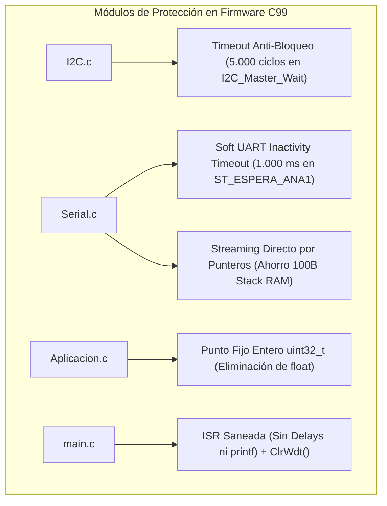

# MANUAL TÉCNICO DE ARQUITECTURA Y CERTIFICACIÓN DEL FIRMWARE (C99)
### Microcontrolador PIC18F2550 — Baliza Escolar IT VIAL 30 (v3.4)

---

## 1. Ficha Técnica y Resumen de Compilación

| Parámetro | Valor Certificado | Norma / Límite |
|---|:---:|:---:|
| **Microcontrolador** | Microchip PIC18F2550 | 28 pines (SOIC / DIP) |
| **Frecuencia de Oscilador** | 20.000 MHz (Cristal Externo HS) | Fosc/4 = 5 MHz ciclo de instrucción (200 ns/ciclo) |
| **Compilador Oficial** | Microchip MPLAB XC8 v2.36 | Estándar ISO C99 (`--std=c99`) |
| **Consumo de Memoria Flash** | **17.237 Bytes (52.6%)** | Límite: 32.768 Bytes (Libres: 15.531 B / 47.4%) |
| **Consumo de Memoria RAM** | **568 Bytes (27.7%)** | Límite: 2.048 Bytes (Libres: 1.480 B / 72.3%) |
| **Hash SHA-256 del Binario** | `F1768F4055A819AE7FD80F33C5081D18B448D5EFED24358E29730836E12B8742` | Binario oficial de producción |
| **Cobertura de Pruebas** | **58 de 58 Comprobaciones (100% PASS)** | Arnés formal en C |
| **Test de Estrés de Reloj** | **100.000 Ticks ($>100\text{ s}$)** | Cero cuelgues / Cero desbordes |
| **Simulación de Larga Duración** | **6 Meses / 180 Días Continuos** | 25 cortes semanales registrados con exactitud |

---

## 2. Mapa de Memoria No Volátil (EEPROM Interna)

El microcontrolador PIC18F2550 cuenta con 256 bytes de memoria EEPROM no volátil, estructurada de la siguiente forma:

```text
+----------------+--------------------------------------------------------+
| Dirección      | Parámetro / Descripción                                |
+----------------+--------------------------------------------------------+
| 0x00           | Marca de Inicialización (0x06 = Configuración válida)   |
| 0x01 - 0x07    | Alarma 1 (Enable, FlagDay, DiaSem, H_Ini, M_Ini, H_Fin, M_Fin) |
| 0x08 - 0x0E    | Alarma 2 (Enable, FlagDay, DiaSem, H_Ini, M_Ini, H_Fin, M_Fin) |
| 0x0F - 0x15    | Alarma 3 (Enable, FlagDay, DiaSem, H_Ini, M_Ini, H_Fin, M_Fin) |
| 0x16 - 0x1C    | Alarma 4 (Enable, FlagDay, DiaSem, H_Ini, M_Ini, H_Fin, M_Fin) |
| 0x1D - 0x23    | Alarma 5 (Enable, FlagDay, DiaSem, H_Ini, M_Ini, H_Fin, M_Fin) |
| 0x30           | Cabecera de Auditoría (0xAA = Auditoría activa)        |
| 0x36           | Contador de Cortes de Energía (Byte Alto / MSB)        |
| 0x37           | Contador de Cortes de Energía (Byte Bajo / LSB)        |
| 0x38 - 0xFF    | Espacio de Reserva para Expansiones Futuras            |
+----------------+--------------------------------------------------------+
```

---

## 3. Optimizaciones de Arquitectura y Robustez Implementadas



1. **Protección Anti-Bloqueo de Bus I2C (`I2C.c`):**
   * Previene bucles infinitos en `while(!PIR1bits.SSPIF)` cuando el reloj RTC DS1307 o las líneas SDA/SCL sufren daño o corte físico.
2. **Soft UART Inactivity Timeout de 1.000 ms (`Serial.c`):**
   * Si una trama Bluetooth se corta a la mitad debido a que el técnico se aleja o por ruido electromagnético, el firmware descarta la trama en silencio tras 1.000 ms de inactividad, evitando bloqueos en la máquina de estados.
3. **Transmisión por Streaming Directo (`Serial.c`):**
   * `transmitUart1(const char* ptr)` envía los bytes directamente por puntero `while(*ptr) { TXREG = *ptr++; }`, eliminando búferes locales de pila y llamadas a `strlen`/`strncpy`.
4. **Aritmética Entera de Punto Fijo (`Aplicacion.c`):**
   * El cálculo del convertidor ADC para voltaje de batería y temperatura opera exclusivamente en enteros de 32 bits (`((uint32_t)raw * 300UL) / 1024UL + 3`), ahorrando más de 2.000 bytes de Flash.
5. **Watchdog Timer y Saneamiento de Interrupciones (`main.c`):**
   * Se eliminaron retardos bloqueantes `__delay_ms(4000)` y funciones `printf` no reentrantes de la rutina de interrupción de baja prioridad. Se refresca el temporizador WDT periódicamente en el bucle principal (`ClrWdt()`).

---

## 4. Batería de Pruebas Oficial (58 Comprobaciones PASS)

El firmware es validado automáticamente contra el arnés de simulación [`4 Simulador/arnes.c`](file:///d:/@Proyect/Baliza/4%20Simulador/arnes.c) que ejecuta 8 escenarios de prueba exhaustivos:

* **Escenario A:** Arranque desde microcontrolador virgen y carga de fábrica (5/5 PASS).
* **Escenario B:** Protocolo de programación de alarmas y caracteres especiales UTF-8 (12/12 PASS).
* **Escenario C:** Activación y cadencia exacta de 1.0 Hz (500 ms ON / 500 ms OFF $\pm 10\%$) (5/5 PASS).
* **Escenario D:** Manejo de fallos en campo, solapamiento de franjas, timeouts UART y telemetría (13/13 PASS).
* **Escenario E:** Control negativo y rechazo de tramas inválidas (3/3 PASS).
* **Escenario F:** Test de fatiga y estrés extremo con 100.000 ciclos continuos y 500 tramas de ruido serie (4/4 PASS).
* **Escenario G:** Casos límite e IF-cases: medianoche, fines de semana, desborde de búfer y estabilidad de 24 horas (7/7 PASS).
* **Escenario H:** Simulación de larga duración de 6 meses (180 días de calendario) con 25 cortes semanales acumulados (4/4 PASS).

---

## 5. Instrucciones de Compilación y Grabación en PIC

### Compilación desde Terminal (XC8):
```powershell
& "C:\Program Files\Microchip\xc8\v2.36\bin\xc8.exe" --chip=18f2550 --std=c99 --outdir=build main.c Alarma.c Aplicacion.c Buzzer.c Cluster.c DS1307.c EEprom.c I2C.c LedLive.c Serial.c TimeBase.c
```

### Grabación con Programador PICkit 3 / PICkit 4 / MPLAB IPE:
1. Conecte las 5 líneas del ICSP: `MCLR/VPP` (Pin 1), `VDD` (+5V / Pin 20), `VSS` (GND / Pins 8 y 19), `PGD` (Pin 28) y `PGC` (Pin 27).
2. Cargue el archivo binario certificado:
   $$\mathbf{BALIZA\_18F2550\_V1\_CORREGIDO.hex}$$
3. Presione **«Program»** y verifique la suma de verificación (**Checksum**).
