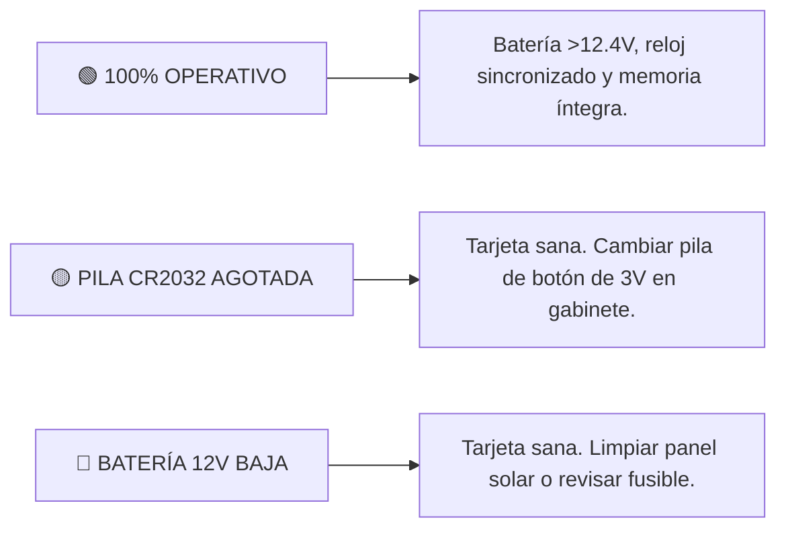

# 📱 MANUAL DE USUARIO: APLICATIVO MÓVIL IT VIAL 30 (v3.4 OFICIAL)
### Señal de Tránsito Inteligente: «30 CUANDO ACTIVADA» — Zona Escolar

---

## 📑 Tabla de Contenidos
1. [Introducción y Propósito](#1-introducción-y-propósito)
2. [Arquitectura de la Interfaz Responsiva](#2-arquitectura-de-la-interfaz-responsiva)
3. [Guía de Conexión Bluetooth](#3-guía-de-conexión-bluetooth)
4. [Programación del Horario de la Placa (Horario Escolar Oficial)](#4-programación-en-1-toque-horario-escolar-oficial)
5. [Asignación de Nombre / Ubicación por el Aire (OTA)](#5-asignación-de-nombre--ubicación-por-el-aire-ota)
6. [Motor de Autodiagnóstico y Dictamen en Campo](#6-motor-de-autodiagnóstico-y-dictamen-en-campo)
7. [Checklist de Mantenimiento Preventivo y Trazabilidad](#7-checklist-de-mantenimiento-preventivo-y-trazabilidad)
8. [Prueba Física de Foco (Mando Directo)](#8-prueba-física-de-foco-mando-directo)
9. [Exportación del Certificado de Auditoría para WhatsApp](#9-exportación-del-certificado-de-auditoría-para-whatsapp)
10. [Referencias Cruzadas del Proyecto](#10-referencias-cruzadas-del-proyecto)

---

## 1. Introducción y Propósito

La aplicación móvil **IT VIAL 30 (v3.4)** es la herramienta oficial de auditoría, calibración y diagnóstico para las señales viales de zona escolar con límite de 30 km/h. Permite a los técnicos e interventores configurar horarios, auditar el estado de la batería de 12V y la pila de respaldo CR2032, y asignar nombres a los postes a través de Bluetooth sin necesidad de cables ni escaleras.

---

## 2. Arquitectura de la Interfaz Responsiva

La interfaz ha sido diseñada bajo directivas ergonómicas para uso rudo en calle:
* **Botones con Touch Target Amplio ($\ge 48\text{ dp}$):** Permite pulsar cómodamente incluso usando guantes de trabajo.
* **Alto Contraste Bajo Luz Solar:** Fondos nítidos `#FFFFFF` y tipografías oscuras `#0F172A`.
* **Diseño Fluido:** Se adapta automáticamente a cualquier resolución de pantalla Android (320dp, 360dp, 411dp y Tablets).

---

## 3. Guía de Conexión Bluetooth

1. Active el Bluetooth en su teléfono móvil.
2. Abra la aplicación y presione el botón rojo **`DISPOSITIVO`**.
3. Seleccione el módulo Bluetooth de la baliza (ej. `JDY-31-SPP` o el nombre asignado).
4. El botón cambiará a verde indicando conexión exitosa.

---

## 4. Programación del Horario de la Placa

> ### El horario lo manda la placa, no la aplicación
>
> **No existe un horario estándar.** Cada colegio tiene el suyo, impreso en la placa metálica
> atornillada bajo la señal, y puede llevar **hasta cuatro franjas**. Lo que se programa en el
> equipo tiene que coincidir **exactamente** con lo que dice esa placa.
>
> Si no coincide, la señal afirma una cosa y hace otra delante de un colegio, y **no hay forma
> de detectarlo desde el escritorio**: la aplicación confirmará igualmente que grabó.

### 4.1 Procedimiento

1. **Lea la placa** de la señal que tiene delante y anote sus franjas y sus días.
2. En la tarjeta **HORARIO DE ESTA PLACA**, active con el interruptor las franjas que use esa
   señal y deje apagadas las que no. Hay cuatro disponibles.
3. Toque cada hora para abrir el reloj y ajustarla. El botón izquierdo es el inicio de la franja
   y el derecho el final.
4. Elija los **días** en el desplegable: lunes a viernes, todos los días, o sábado y domingo.
5. Pulse **GRABAR ESTE HORARIO EN LA BALIZA**.
6. Aparecerá una **ventana de confirmación con la lista exacta** de lo que se va a grabar.
   **Compárela con la placa antes de aceptar.** Es el último punto en el que se puede detectar
   un error sin volver al poste.
7. Al aceptar, la aplicación sincroniza el reloj del equipo con la hora del teléfono, graba las
   franjas y vuelve a leer la baliza para que usted vea cómo quedó.

### 4.2 Qué NO hace este botón

* **No toca la Alarma 5**, que queda reservada a la prueba de foco de 2 minutos (apartado 8).
* **No inventa horarios.** Si no activa ninguna franja, la señal no destellará nunca, y la
  ventana de confirmación se lo advertirá con esas palabras.

---

## 4bis. Receso Escolar (Vacaciones)

Durante las vacaciones **no hay escolares y el límite de 30 km/h no rige**. Una señal que
destella semanas enteras sin alumnos acostumbra a los conductores a ignorarla, y le resta
autoridad para cuando sí importa.

| Botón | Qué hace |
|---|---|
| **APAGAR (RECESO)** | Apaga **todas** las franjas. La señal queda sin destellar las 24 horas. |
| **REANUDAR CLASES** | Vuelve a grabar el horario que esté en pantalla. |

Los dos piden confirmación antes de actuar. Antes de apagar, **compruebe que el horario en
pantalla es el de la placa**: es el que se restaurará al reanudar.

---

## 5. Asignación de Nombre / Ubicación por el Aire (OTA)

Para identificar cada baliza en un corredor vial con múltiples señales:
1. En la tarjeta **`NOMBRE / UBICACIÓN DE LA SEÑAL`**, escriba el nombre o punto kilométrico (ej. `Col. San José - Km 4+200`).
2. Presione **`GUARDAR`**.
3. El nombre se graba de forma permanente en la memoria EEPROM física de la baliza (`0x40..0x5F`) y en su teléfono.

---

## 6. Motor de Autodiagnóstico y Dictamen en Campo

Al presionar **`LEER`**, la App ejecuta un análisis instantáneo y muestra el semáforo de dictamen técnico:



---

## 7. Checklist de Mantenimiento Preventivo y Trazabilidad

Para garantizar que los mantenimientos en campo se realicen formalmente, la app incluye un checklist obligatorio antes de generar reportes:
* `[ ] 1. Panel solar limpio y fusible 12V verificado`
* `[ ] 2. Pila de botón CR2032 (3V) verificada / cambiada`
* `[ ] 3. Borneras de 12V ajustadas contra vibración`
* `[ ] 4. Prueba física de destello ejecutada`

---

## 8. Prueba Física de Foco (Mando Directo)

* **Activar Test (2 min):** Presione `💡 Activar Test (2 min)` para encender el destello ámbar a 1.0 Hz y verificar los LEDs y el circuito de potencia.
* **Apagar Test:** Presione `⏹️ Apagar Test` para detener el destello inmediatamente.

---

## 9. Exportación del Certificado de Auditoría para WhatsApp

Presione **`📤 COMPARTIR CERTIFICADO DE AUDITORÍA`** para enviar el acta formal con dirección MAC, telemetría y checklist completado a la interventoría o al soporte de IT VIAL.

---

## 9bis. Cómo saber qué versión lleva la baliza

Al pulsar **LEER**, la primera línea del volcado indica la versión del firmware que corre en
ese equipo:

```
FW 3.4
```

Anótela en el acta de inspección. Los equipos anteriores a esta versión **no la muestran**:
si no aparece la línea, la baliza lleva un firmware antiguo y conviene reportarlo a soporte.

---

## 10. Referencias Cruzadas del Proyecto

* ⚙️ [Manual Técnico del Firmware C99](MANUAL_TECNICO_FIRMWARE_C99.md)
* 📜 [Certificado Oficial del Firmware v3.4](CERTIFICADO_FIRMWARE_v3.4.md)
* 🗺️ [Gestión de Múltiples Señales y Nombres OTA](GESTION_MULTISE%C3%91ALES_Y_NOMBRES.md)
* 🩺 [Guía de Diagnóstico y Logs para Soporte](GUIA_DIAGNOSTICO_Y_LOGS_SOPORTE.md)
* 🏛️ [Dictamen del Comité Técnico Multidisciplinario](DICTAMEN_COMITE_TECNICO_MULTIDISCIPLINARIO.md)
* 🗺️ [Mapa de Ruta de Ingeniería (Roadmap)](../ROADMAP.md)
