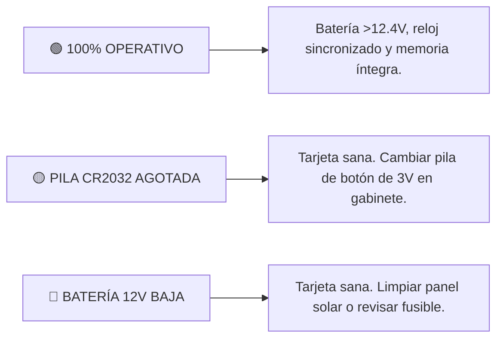

# 📱 MANUAL DE USUARIO: APLICATIVO MÓVIL IT VIAL 30 (v3.4 OFICIAL)
### Señal de Tránsito Inteligente: «30 CUANDO ACTIVADA» — Zona Escolar

---

## 📑 Tabla de Contenidos
1. [Introducción y Propósito](#1-introducción-y-propósito)
2. [Arquitectura de la Interfaz Responsiva](#2-arquitectura-de-la-interfaz-responsiva)
3. [Guía de Conexión Bluetooth](#3-guía-de-conexión-bluetooth)
4. [Programación en 1-Toque (Horario Escolar Oficial)](#4-programación-en-1-toque-horario-escolar-oficial)
5. [Asignación de Nombre / Ubicación por el Aire (OTA)](#5-asignación-de-nombre--ubicación-por-el-aire-ota)
6. [Motor de Autodiagnóstico y Dictamen en Campo](#6-motor-de-autodiagnóstico-y-dictamen-en-campo)
7. [Checklist de Mantenimiento Preventivo y Trazabilidad](#7-checklist-de-mantenimiento-preventivo-y-trazabilidad)
8. [Prueba Física de Foco (Mando Directo)](#8-prueba-física-de-foco-mando-directo)
9. [Exportación del Certificado de Auditoría para WhatsApp](#9-exportación-del-certificado-de-auditoría-para-whatsapp)
10. [Referencias Cruzadas del Proyecto](#10-referencias-cruzadas-del-proyecto)

---

## 1. Introducción y Propósito

La aplicación móvil **IT VIAL 30 (v3.4)** es la herramienta oficial de auditoría, calibración y diagnóstico para las señales viales de zona escolar con límite de 30 km/h. Permite a los técnicos e interventores configurar horarios, auditar el estado de la batería de 12V y la pila de respaldo CR2032, y asignar nombres a los postes a través de Bluetooth sin necesidad de cables ni escaleras.

---

## 2. Arquitectura de la Interfaz Responsiva

La interfaz ha sido diseñada bajo directivas ergonómicas para uso rudo en calle:
* **Botones con Touch Target Amplio ($\ge 48\text{ dp}$):** Permite pulsar cómodamente incluso usando guantes de trabajo.
* **Alto Contraste Bajo Luz Solar:** Fondos nítidos `#FFFFFF` y tipografías oscuras `#0F172A`.
* **Diseño Fluido:** Se adapta automáticamente a cualquier resolución de pantalla Android (320dp, 360dp, 411dp y Tablets).

---

## 3. Guía de Conexión Bluetooth

1. Active el Bluetooth en su teléfono móvil.
2. Abra la aplicación y presione el botón rojo **`DISPOSITIVO`**.
3. Seleccione el módulo Bluetooth de la baliza (ej. `JDY-31-SPP` o el nombre asignado).
4. El botón cambiará a verde indicando conexión exitosa.

---

## 4. Programación en 1-Toque (Horario Escolar Oficial)

Para programar la baliza con el estándar vial sin errores manuales:
1. Presione el botón azul oscuro:
   $$\mathbf{\text{⚡ Programar Horario Escolar (1 Toque)}}$$
2. La app sincroniza el reloj RTC con la hora exacta de su teléfono y graba las 3 franjas reglamentarias en la EEPROM:
   * **Franja 1 (Mañana):** `06:00` a `09:00` (Lunes a Viernes)
   * **Franja 2 (Mediodía):** `11:30` a `13:30` (Lunes a Viernes)
   * **Franja 3 (Tarde):** `15:00` a `16:30` (Lunes a Viernes)

---

## 5. Asignación de Nombre / Ubicación por el Aire (OTA)

Para identificar cada baliza en un corredor vial con múltiples señales:
1. En la tarjeta **`NOMBRE / UBICACIÓN DE LA SEÑAL`**, escriba el nombre o punto kilométrico (ej. `Col. San José - Km 4+200`).
2. Presione **`GUARDAR`**.
3. El nombre se graba de forma permanente en la memoria EEPROM física de la baliza (`0x40..0x5F`) y en su teléfono.

---

## 6. Motor de Autodiagnóstico y Dictamen en Campo

Al presionar **`LEER`**, la App ejecuta un análisis instantáneo y muestra el semáforo de dictamen técnico:

---

## 7. Checklist de Mantenimiento Preventivo y Trazabilidad

Para garantizar que los mantenimientos en campo se realicen formalmente, la app incluye un checklist obligatorio antes de generar reportes:
* `[ ] 1. Panel solar limpio y fusible 12V verificado`
* `[ ] 2. Pila de botón CR2032 (3V) verificada / cambiada`
* `[ ] 3. Borneras de 12V ajustadas contra vibración`
* `[ ] 4. Prueba física de destello ejecutada`

---

## 8. Prueba Física de Foco (Mando Directo)

* **Activar Test (2 min):** Presione `💡 Activar Test (2 min)` para encender el destello ámbar a 1.0 Hz y verificar los LEDs y el circuito de potencia.
* **Apagar Test:** Presione `⏹️ Apagar Test` para detener el destello inmediatamente.

---

## 9. Exportación del Certificado de Auditoría para WhatsApp

Presione **`📤 COMPARTIR CERTIFICADO DE AUDITORÍA`** para enviar el acta formal con dirección MAC, telemetría y checklist completado a la interventoría o al soporte de IT VIAL.

---

## 10. Referencias Cruzadas del Proyecto

* ⚙️ [Manual Técnico del Firmware C99](MANUAL_TECNICO_FIRMWARE_C99.md)
* 📜 [Certificado Oficial del Firmware v3.4](CERTIFICADO_FIRMWARE_v3.4.md)
* 🗺️ [Gestión de Múltiples Señales y Nombres OTA](GESTION_MULTISE%C3%91ALES_Y_NOMBRES.md)
* 🩺 [Guía de Diagnóstico y Logs para Soporte](GUIA_DIAGNOSTICO_Y_LOGS_SOPORTE.md)
* 🏛️ [Dictamen del Comité Técnico Multidisciplinario](DICTAMEN_COMITE_TECNICO_MULTIDISCIPLINARIO.md)
* 🗺️ [Mapa de Ruta de Ingeniería (Roadmap)](../ROADMAP.md)
