# 📱 MANUAL DE USUARIO: APLICATIVO MÓVIL IT VIAL 30 (v3.4 OFICIAL)
### Señal de Tránsito Inteligente: «30 CUANDO ACTIVADA» — Zona Escolar

---

## 📑 Tabla de Contenidos

1. [Introducción y Propósito](#1-introducción-y-propósito)
2. [Arquitectura de la Interfaz Responsiva](#2-arquitectura-de-la-interfaz-responsiva)
3. [Guía de Conexión Bluetooth](#3-guía-de-conexión-bluetooth)
4. [Programación del Horario de la Placa](#4-programación-del-horario-de-la-placa)
5. [Receso Escolar (Vacaciones)](#5-receso-escolar-vacaciones)
6. [¿«Grabar Horario de Placa» o «Programación Manual de Franja»?](#6-grabar-horario-de-placa-o-programación-manual-de-franja)
7. [Asignación de Nombre / Ubicación por el Aire (OTA)](#7-asignación-de-nombre-ubicación-por-el-aire-ota)
8. [Motor de Autodiagnóstico y Dictamen en Campo](#8-motor-de-autodiagnóstico-y-dictamen-en-campo)
9. [Prueba Física de Foco (Mando Directo)](#9-prueba-física-de-foco-mando-directo)
10. [Mantenimiento, Inspección y Acta](#10-mantenimiento-inspección-y-acta)
11. [Cómo saber qué versión lleva la baliza](#11-cómo-saber-qué-versión-lleva-la-baliza)
12. [Referencias Cruzadas del Proyecto](#12-referencias-cruzadas-del-proyecto)

---

## 1. Introducción y Propósito

> **Sobre las figuras de este manual.** Las pantallas de la aplicación son
> **ilustraciones generadas** (`generar_capturas_app.py`), no fotografías del teléfono.
> Reproducen la disposición y los textos reales, pero los colores y proporciones exactos
> pueden variar según el modelo. Las fotografías de la señal y de la placa sí son reales.


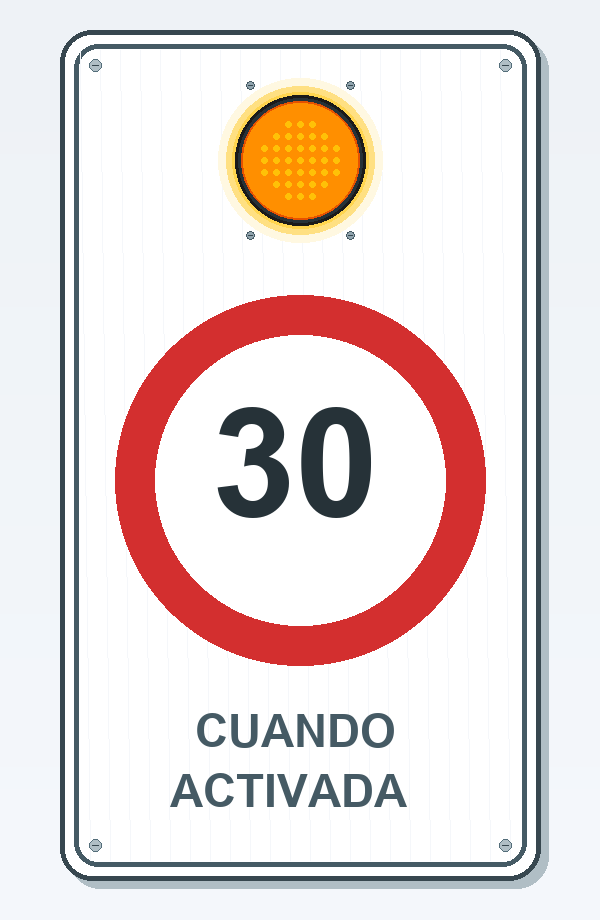

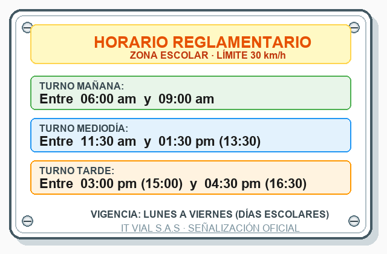


La aplicación móvil **IT VIAL 30 (v3.4)** es la herramienta oficial de auditoría, calibración y diagnóstico para las señales viales de zona escolar con límite de 30 km/h. Permite a los técnicos e interventores configurar horarios, auditar el estado de la batería de 12V y la pila de respaldo CR2032, y asignar nombres a los postes a través de Bluetooth sin necesidad de cables ni escaleras.

---

## 2. Arquitectura de la Interfaz Responsiva

La interfaz ha sido diseñada bajo directivas ergonómicas para uso rudo en calle:
* **Botones con Touch Target Amplio ($\ge 48\text{ dp}$):** Permite pulsar cómodamente incluso usando guantes de trabajo.
* **Alto Contraste Bajo Luz Solar:** Fondos nítidos `#FFFFFF` y tipografías oscuras `#0F172A`.
* **Diseño Fluido:** Se adapta automáticamente a cualquier resolución de pantalla Android (320dp, 360dp, 411dp y Tablets).

---

## 3. Guía de Conexión Bluetooth

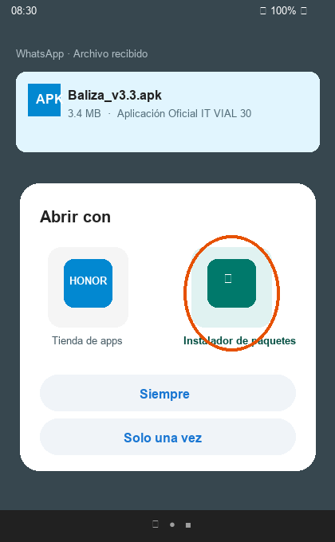

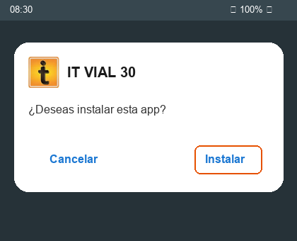

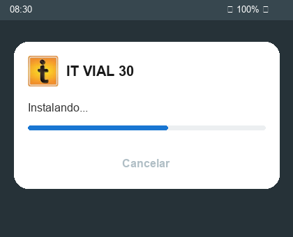

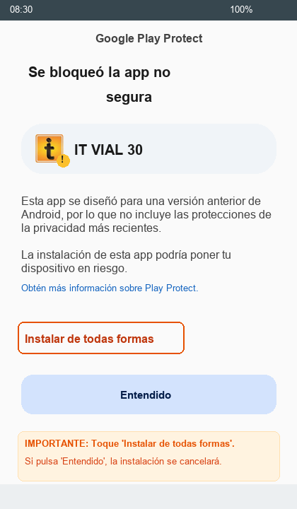

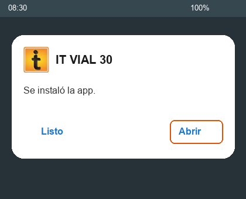

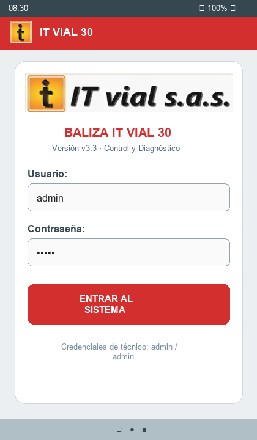

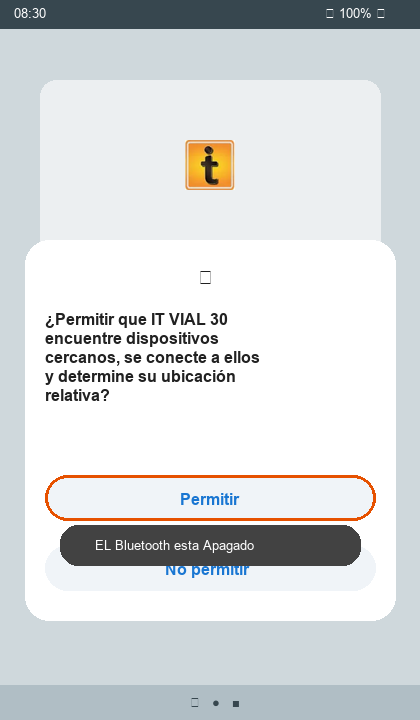

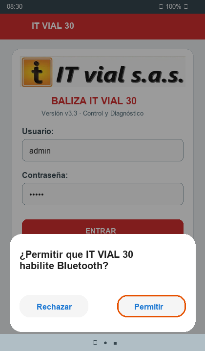

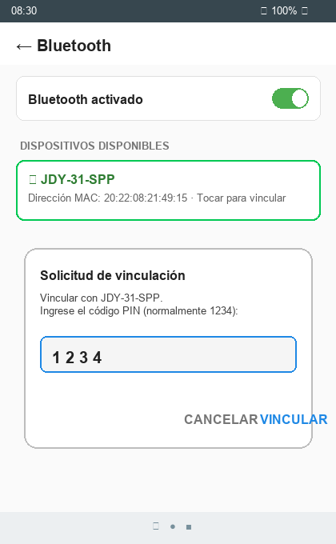

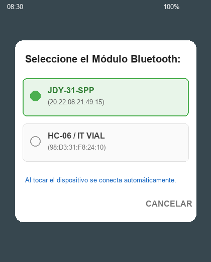

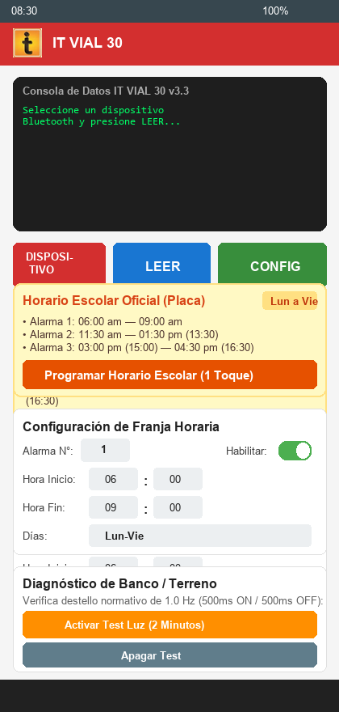


1. Active el Bluetooth en su teléfono móvil.
2. Abra la aplicación y presione el botón rojo **`CONECTAR`**.
3. Seleccione el módulo Bluetooth de la baliza (ej. `JDY-31-SPP` o el nombre asignado).
4. El botón cambiará a verde indicando conexión exitosa.

---

## 4. Programación del Horario de la Placa

> ### El horario lo manda la placa, no la aplicación
>
> **No existe un horario estándar.** Cada colegio tiene el suyo, impreso en la placa metálica
> atornillada bajo la señal, y puede llevar **hasta cuatro franjas**. Lo que se programa en el
> equipo tiene que coincidir **exactamente** con lo que dice esa placa.
>
> Si no coincide, la señal afirma una cosa y hace otra delante de un colegio, y **no hay forma
> de detectarlo desde el escritorio**: la aplicación confirmará igualmente que grabó.

### 4.1 Procedimiento

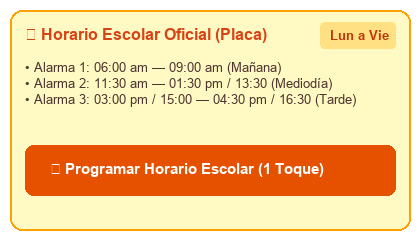


1. **Lea la placa** de la señal que tiene delante y anote sus franjas y sus días.
2. En la tarjeta **HORARIO DE ESTA PLACA**, active con el interruptor las franjas que use esa
   señal y deje apagadas las que no. Hay cuatro disponibles.
3. Toque cada hora para abrir el reloj y ajustarla. El botón izquierdo es el inicio de la franja
   y el derecho el final (mostrados con formato nítido `06:00` a `09:00`).
4. Elija los **días** en el desplegable: lunes a viernes, todos los días, o sábado y domingo.
5. Pulse **GRABAR ESTE HORARIO EN LA BALIZA**.
6. Aparecerá una **ventana de confirmación con la lista exacta** de lo que se va a grabar.
   **Compárela con la placa antes de aceptar.** Es el último punto en el que se puede detectar
   un error sin volver al poste.
7. Al aceptar, la aplicación sincroniza el reloj del equipo con la hora del teléfono, graba en lote las
   franjas (con retardo seguro de 450 ms) y vuelve a leer la baliza para que usted vea cómo quedó.

### 4.2 Qué NO hace este botón

* **No toca la Alarma 5**, que queda reservada a la prueba de foco de 2 minutos (apartado 8).
* **No inventa horarios.** Si no activa ninguna franja, la señal no destellará nunca, y la
   ventana de confirmación se lo advertirá con esas palabras.

---

## 5. Receso Escolar (Vacaciones)

Durante las vacaciones **no hay escolares y el límite de 30 km/h no rige**. Una señal que
destella semanas enteras sin alumnos acostumbra a los conductores a ignorarla, y le resta
autoridad para cuando sí importa.

| Botón | Qué hace |
|---|---|
| **APAGAR (RECESO)** | Apaga **todas** las franjas. La señal queda sin destellar las 24 horas. |
| **REANUDAR CLASES** | Vuelve a grabar el horario de la placa que esté en pantalla. |

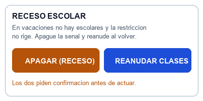


Los dos piden confirmación antes de actuar. Antes de apagar, **compruebe que el horario en
pantalla es el de la placa**: es el que se restaurará al reanudar.

---

## 6. ¿«Grabar Horario de Placa» o «Programación Manual de Franja»?

Una duda común entre técnicos es la diferencia entre estos dos métodos:

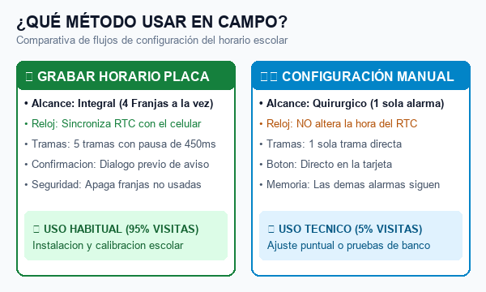

| Característica | ⚡ GRABAR HORARIO DE ESTA PLACA (Lote) | ⚙️ PROGRAMACIÓN MANUAL (Quirúrgico) |
| :--- | :--- | :--- |
| **Propósito** | Configuración **integral** de la señal al llegar al colegio. | Ajuste técnico puntual de **UNA sola alarma**. |
| **Reloj RTC** | **Sincroniza automáticamente** la fecha/hora con el teléfono móvil. | **No altera** la hora actual del reloj. |
| **Memoria** | Reescribe de forma secuencial las 4 franjas (apaga las que estén en OFF). | Modifica únicamente la alarma seleccionada (1 a 5); las demás quedan intactas. |
| **¿Guardar es Enviar?** | **Sí:** Al confirmar, se envía la secuencia por Bluetooth y se graba en EEPROM. | **Sí:** Al pulsar el botón verde **`⚡ ENVIAR Y GRABAR ESTA FRANJA`**, se despacha la trama UART y se graba inmediatamente en la EEPROM física del PIC. |

### Botón Directo de Programación Manual
Para mayor comodidad del técnico, la tarjeta **6. PROGRAMACIÓN MANUAL DE FRANJA** incluye su propio botón verde directo:

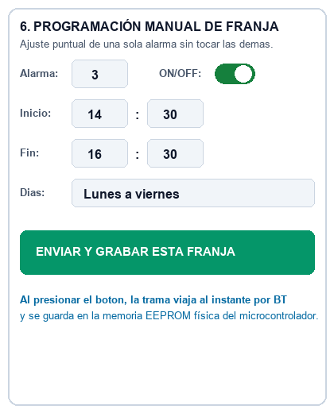

No es necesario hacer scroll hacia arriba: al pulsar este botón, la trama de la alarma seleccionada (ej. `¿A3,E1,I1430,F1630,D9,?`) viaja al microcontrolador y queda almacenada de forma permanente.

---

## 7. Asignación de Nombre / Ubicación por el Aire (OTA)

Para identificar cada baliza en un corredor vial con múltiples señales:
1. En la tarjeta **`NOMBRE / UBICACIÓN DE LA SEÑAL`**, escriba el nombre o punto kilométrico (ej. `Col. San José - Km 4+200`).
2. Presione **`GUARDAR`**.
3. El nombre se graba de forma permanente en la memoria EEPROM física de la baliza (`0x40..0x5F`) y en su teléfono.

---

## 8. Motor de Autodiagnóstico y Dictamen en Campo

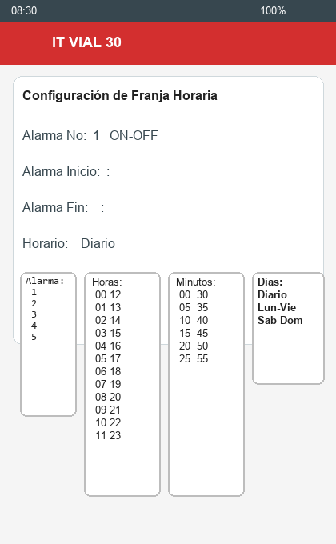


Al presionar **`LEER`**, la App ejecuta un análisis instantáneo y muestra el semáforo de dictamen técnico:

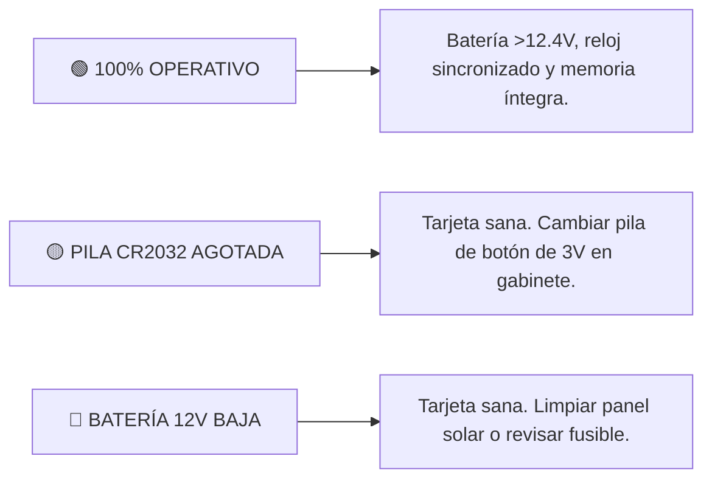

---

## 9. Prueba Física de Foco (Mando Directo)

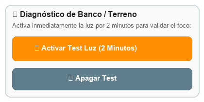


* **Activar Test (2 min):** Presione `💡 Activar Test (2 min)` para encender el destello ámbar a 1.0 Hz y verificar los LEDs y el circuito de potencia.
* **Apagar Test:** Presione `⏹️ Apagar Test` para detener el destello inmediatamente.

---

## 10. Mantenimiento, Inspección y Acta

### 10.1 Primero: quién y cómo

En la tarjeta **MANTENIMIENTO E INSPECCIÓN**, escriba su nombre y cuadrilla en el campo
**Técnico / cuadrilla**. Se escribe **una sola vez al empezar la jornada**: la aplicación lo
guarda en el teléfono y aparecerá ya puesto en todas las señales de la ruta.

> Este dato se guarda **en el teléfono**, no en la baliza. Es distinto del nombre del colegio
> (apartado 7), que sí se graba en la memoria del equipo y viaja con el poste.

### 10.2 Elija el tipo de inspección — y elíjalo bien

Es lo primero que se toca, y **cambia lo que se puede marcar debajo**.

| Modalidad | Cuándo |
|---|---|
| **A NIVEL DE SUELO** | Revisión desde la vía, con el teléfono, sin tocar el equipo |
| **EN ALTURA (poste)** | Con escalera o canasta, para el mantenimiento físico |

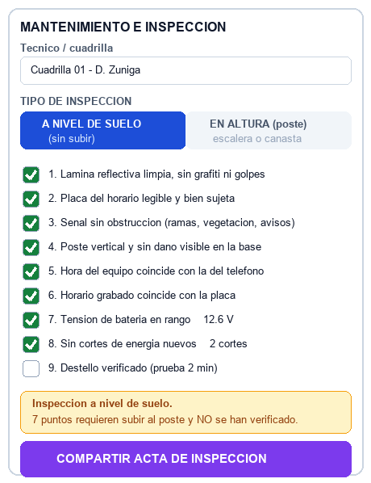

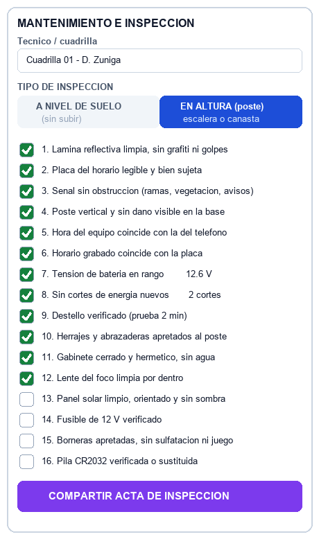

> ### Por qué los puntos de altura no aparecen desde el suelo
>
> No están en gris: **no están**. Y es a propósito.
>
> «Panel solar limpio y fusible verificado» no se puede comprobar desde abajo. Si la casilla
> estuviera ahí, se podría marcar — y el acta diría que se revisó algo que nadie miró. Una
> revisión incompleta convertida en un documento que afirma que fue completa es peor que no
> tener acta.
>
> **Si cambia de «en altura» a «a nivel de suelo», los siete puntos de altura se desmarcan
> solos.** Es intencionado: esa visita ya no los verificó.

### 10.3 Los 16 puntos

**Desde el suelo (9)** — el estado físico va primero, porque es lo que mira una interventoría
antes que nada:

1. Lámina reflectiva limpia, sin grafiti ni golpes
2. Placa del horario legible y bien sujeta
3. **Señal sin obstrucción** (ramas, vegetación, avisos)
4. Poste vertical y sin daño visible en la base
5. Hora del equipo coincide con la del teléfono
6. Horario grabado coincide con la placa
7. Tensión de batería dentro de rango
8. Sin cortes de energía nuevos
9. Destello verificado (prueba de 2 minutos)

**Subiendo al poste (7 más)**

10. Herrajes y abrazaderas apretados al poste
11. Gabinete cerrado y hermético, sin entrada de agua
12. Lente del foco limpia por dentro
13. Panel solar limpio, orientado y sin sombra
14. Fusible de 12 V verificado
15. Borneras apretadas, sin sulfatación ni juego
16. Pila CR2032 verificada o sustituida

> **El punto 3 merece atención.** La obstrucción por vegetación es el fallo más común y más
> barato de corregir en una señal escolar, y **el equipo no puede detectarlo**: la baliza
> destella perfectamente detrás de una rama. Solo lo ve una persona mirando la señal desde donde
> la mira un conductor.

### 10.4 El acta dice también lo que NO se comprobó

Al pulsar **COMPARTIR ACTA DE INSPECCIÓN** se abre el menú de compartir de Android — WhatsApp,
correo, Drive, lo que tenga instalado.

El acta incluye la modalidad, los puntos marcados, **los que quedaron sin marcar** y, si la
inspección fue a nivel de suelo, **la lista de lo que requiere subir y no se verificó**:

```
MODALIDAD:  Inspeccion A NIVEL DE SUELO (sin subir)
----------------------------------------
CHECKLIST - 8 de 9 verificados
  [X] 1. Lamina reflectiva limpia, sin grafiti ni golpes
  ...
  [ ] 9. Destello verificado (prueba 2 min)   <-- NO VERIFICADO
----------------------------------------
NO APLICA EN ESTA MODALIDAD (requiere subir al poste):
  herrajes . gabinete . lente del foco . panel solar .
  fusible 12 V . borneras . pila CR2032
----------------------------------------
INSPECCION REALIZADA POR: Cuadrilla 01 - D. Zuniga
(Atribucion declarada en el telefono, no firma acreditada.)
```

> **Un acta que enumera lo no verificado es un registro. Una que solo enumera lo hecho es una
> coartada.** Por eso el nombre va al lado de lo pendiente: quien firma, firma también lo que no
> pudo comprobar.

---

## 11. Cómo saber qué versión lleva la baliza

Al pulsar **LEER**, la primera línea del volcado indica la versión del firmware que corre en
ese equipo:

```
FW 3.4
```

Anótela en el acta de inspección. Los equipos anteriores a esta versión **no la muestran**:
si no aparece la línea, la baliza lleva un firmware antiguo y conviene reportarlo a soporte.

---

## 12. Referencias Cruzadas del Proyecto


* ⚙️ [Manual Técnico del Firmware C99](MANUAL_TECNICO_FIRMWARE_C99.md)
* 📜 [Certificado Oficial del Firmware v3.4](CERTIFICADO_FIRMWARE_v3.4.md)
* 🗺️ [Gestión de Múltiples Señales y Nombres OTA](GESTION_MULTISE%C3%91ALES_Y_NOMBRES.md)
* 🩺 [Guía de Diagnóstico y Logs para Soporte](GUIA_DIAGNOSTICO_Y_LOGS_SOPORTE.md)
* 🏛️ [Dictamen del Comité Técnico Multidisciplinario](DICTAMEN_COMITE_TECNICO_MULTIDISCIPLINARIO.md)
* 🗺️ [Mapa de Ruta de Ingeniería (Roadmap)](../ROADMAP.md)
