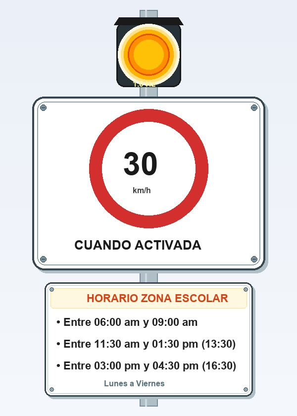
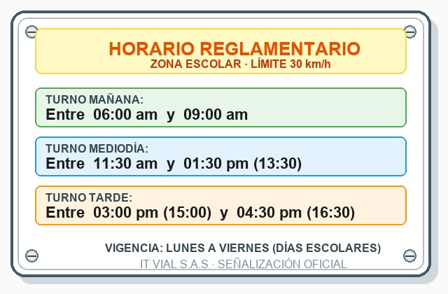
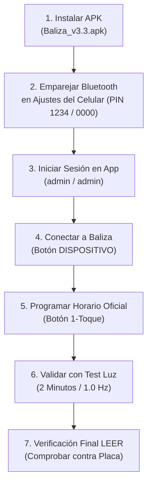
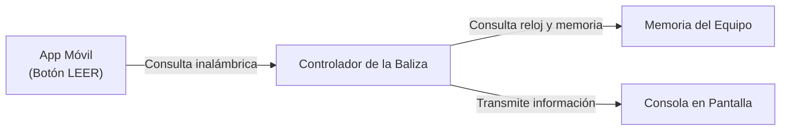
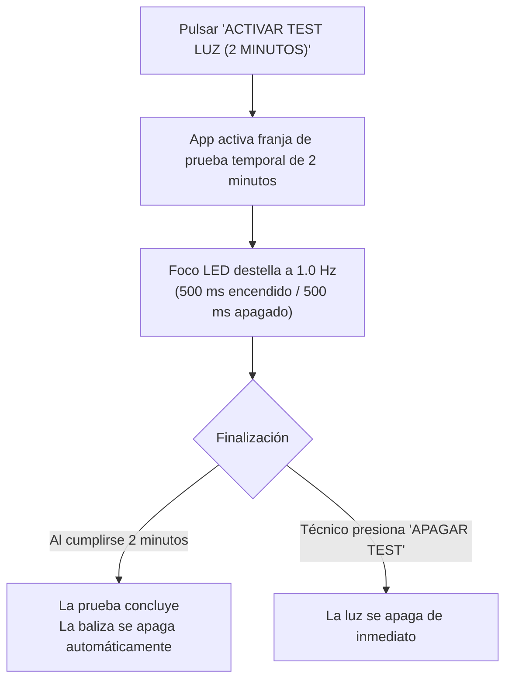
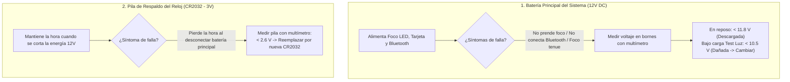

# MANUAL DE USUARIO — APLICACIÓN MÓVIL IT VIAL 30 (v3.3)
## Sistema de Control y Diagnóstico de Baliza Escolar «30 CUANDO ACTIVADA»

---

## 1. Introducción y Propósito

El presente manual describe de manera técnica y operativa la instalación, vinculación, configuración y diagnóstico del sistema de baliza vial escolar mediante la aplicación móvil oficial **IT VIAL 30 (Versión v3.3)** en teléfonos inteligentes con sistema operativo Android.

La baliza vial gobierna el destello intermitente del foco ámbar de advertencia instalado frente a zonas escolares. **Cuando la luz titila, el límite reglamentario de velocidad de 30 km/h entra en vigencia legal.**

*Figura 1: Señal vial reglamentaria «30 CUANDO ACTIVADA» instalada en poste escolar.*

---

> ### REGLA FUNDAMENTAL DEL SISTEMA
> El horario en que debe destellar la baliza **no queda a criterio del instalador**: está grabado físicamente en la placa metálica adosada a la propia señal:
>
> * **Mañana:** 06:00 am a 09:00 am
> * **Mediodía:** 11:30 am a 01:30 pm (13:30)
> * **Tarde:** 03:00 pm (15:00) a 04:30 pm (16:30)
>
> Si la programación del equipo no coincide con la placa física, la señal no cumplirá con la función de protección a los peatones en los horarios estipulados. Todo el procedimiento descrito en este manual garantiza la sincronización exacta entre la placa y la baliza.

*Figura 2: Placa física metálica con los tres horarios oficiales de zona escolar.*

---

## 2. Requisitos Previos

Antes de iniciar la configuración en campo o banco de pruebas, asegúrese de contar con:

1. **Teléfono Móvil Android:** Compatible con versiones desde Android 6.0 hasta Android 14+.
2. **Bluetooth Activado:** Con adaptador inalámbrico en funcionamiento.
3. **Instalador de la Aplicación:** Archivo instalador `Baliza_v3.3.apk` suministrado por **IT VIAL S.A.S**.
4. **Baliza Energizada:** Tarjeta y equipo conectados a su fuente de energía (12 VDC / Batería / Panel solar).
5. **Distancia de Trabajo:** Ubicarse a una distancia recomendada de entre **1 y 10 metros** del poste o gabinete para una óptima recepción.

---

## 3. Guía Paso a Paso de Instalación y Uso

---

### PASO 1: Instalación de la Aplicación (Baliza_v3.3.apk)

#### 1.1 Selección del Instalador de Paquetes
1. Reciba o descargue el archivo instalador oficial **`Baliza_v3.3.apk`** en su dispositivo móvil.
2. Toque el archivo `.apk` para iniciar el proceso de instalación de Android.
3. En la ventana emergente **«Abrir con»**, seleccione **«Instalador de paquetes»** y presione **«Solo una vez»** o **«Siempre»**.

*Figura 3: Selección del «Instalador de paquetes» de Android.*

#### 1.2 Confirmación de Instalación y Permisos
4. Si el sistema solicita autorización para instalar aplicaciones de fuentes desconocidas, ingrese a **«Ajustes»** y habilite la opción **«Permitir desde esta fuente»**.
5. En la ventana de confirmación con el logotipo de **IT VIAL 30**, ante la pregunta *«¿Deseas instalar esta app?»*, presione el botón **«Instalar»**.

*Figura 4: Ventana de confirmación de instalación de la aplicación.*

#### 1.3 Progreso de Instalación
6. Se mostrará el mensaje **«Instalando...»** con la barra de progreso correspondiente. Espere unos segundos mientras el sistema procesa el paquete.

*Figura 5: Progreso de instalación en Android.*

#### 1.4 Advertencia de Google Play Protect («Se bloqueó la app no segura»)
7. En dispositivos con Android 12, 13 o 14, el servicio de seguridad **Google Play Protect** puede desplegar una pantalla con el aviso *«Se bloqueó la app no segura»* por tratarse de un aplicativo técnico corporativo distribuido fuera de la tienda comercial.

> ### ADVERTENCIA CRÍTICA DE INSTALACIÓN
> * **Acción a realizar:** Presione el texto **«Instalar de todas formas»** (o seleccione previamente *«Más detalles»* para desplegar la opción y luego presione *«Instalar de todas formas»*).
> * **Precaución:** **No presione** el botón azul *«Entendido»*, ya que esta opción cancela la instalación.

*Figura 6: Pantalla de Google Play Protect y selección obligatoria de «Instalar de todas formas».*

#### 1.5 Finalización de Instalación y Apertura
8. El instalador confirmará la operación con el mensaje **«Se instaló la app.»**.
9. Presione el botón **«Abrir»** para iniciar la aplicación.

*Figura 7: Confirmación de instalación completada y botón de apertura.*

#### 1.6 Concesión de Permisos de Dispositivos Cercanos
10. Al iniciar la aplicación por primera vez, el sistema Android solicitará permisos de conectividad:
   * **Mensaje:** *«¿Permitir que IT VIAL 30 encuentre dispositivos cercanos, se conecte a ellos y determine su ubicación relativa?»*
   * **Acción requerida:** Presione **«Permitir»**.

*Figura 8: Diálogo de permisos de dispositivos cercanos.*

#### 1.7 Activación de Bluetooth desde la Aplicación
11. Si el Bluetooth se encuentra desactivado, la aplicación solicitará autorización directa para encenderlo:
   * **Mensaje:** *«¿Permitir que IT VIAL 30 habilite Bluetooth?»*
   * **Acción requerida:** Presione **«Permitir»** para activar el adaptador inalámbrico.

*Figura 9: Solicitud de habilitación del adaptador Bluetooth.*

---

### PASO 2: Emparejamiento Bluetooth en Ajustes del Teléfono

Antes de operar la baliza desde la aplicación, el equipo debe ser emparejado en el sistema operativo del teléfono:

1. Ingrese a **Ajustes > Bluetooth** en su dispositivo móvil y active la función Bluetooth.
2. Presione **«Buscar dispositivos»** o espere a que aparezca en la lista de *Dispositivos disponibles*.
3. Identifique el nombre del equipo:
   * **`JDY-31-SPP`** (Módulo estándar de la baliza).
   * **`HC-06`** o **`IT VIAL 30`** (Módulos alternativos o identificadores específicos).
4. Toque sobre el nombre del dispositivo para iniciar el enlace.
5. Cuando el sistema solicite el código de seguridad o clave PIN, ingrese:
   * **Clave PIN principal:** **`1234`**
   * *(O en su defecto: **`0000`**)*.
6. Confirme la vinculación y verifique que el equipo figure en la lista de *«Dispositivos vinculados»*.

*Figura 10: Ingreso del PIN de seguridad (1234 / 0000) en Ajustes de Bluetooth.*

---

### PASO 3: Acceso e Inicio de Sesión en la Aplicación (Login)

1. Abra la aplicación **IT VIAL 30** desde el menú de su teléfono.
2. En la pantalla de inicio de sesión, ingrese las credenciales de acceso técnico autorizadas:
   * **Usuario:** `admin`
   * **Contraseña:** `admin`
3. Presione el botón rojo **«ENTRAR AL SISTEMA»**.

*Figura 11: Pantalla oficial de autenticación IT VIAL 30 v3.3.*

---

### PASO 4: Conexión con la Baliza

Una vez dentro de la interfaz principal, establezca la comunicación con la baliza:

1. Presione el botón rojo **«DISPOSITIVO»** ubicado en la barra superior.
2. En la ventana emergente **«Seleccione el Módulo Bluetooth:»**, elija el dispositivo correspondiente a la baliza (ejemplo: `JDY-31-SPP`).
3. **Confirmación de conexión:**
   * El botón cambiará su texto y color a verde: **«✓ JDY-31-SPP»**.
   * Se habilitarán todos los botones de control (**LEER**, **CONFIG**, **PROGRAMAR HORARIO ESCOLAR** y **TEST DE LUZ**).
   * La aplicación realizará una lectura inicial automática del equipo.

*Figura 12: Selección del módulo Bluetooth en la lista de dispositivos vinculados.*

*Figura 13: Pantalla principal de control y diagnóstico IT VIAL 30.*

---

### PASO 5: Función del Botón «LEER» y Consola de Datos

El botón azul **«LEER»** permite consultar el estado actual de la baliza:

1. **Información presentada en la consola:**
   * **Hora y Fecha del Equipo:** Hora registrada por el reloj interno (`Hora: HH:MM:SS Fecha: DD/MM/AA-D`).
   * **Estado de las 5 Alarmas:**
     * `Ala 1: 06:00 a 09:00 - Lun-Vie [ON]`
     * `Ala 2: 11:30 a 13:30 - Lun-Vie [ON]`
     * `Ala 3: 15:00 a 16:30 - Lun-Vie [ON]`
     * `Ala 4: 00:00 a 00:00 - Diario [OFF]`
     * `Ala 5: 00:00 a 00:00 - Diario [OFF]`
2. **Aplicación práctica:**
   * Utilice esta función antes de programar para auditar el horario existente y después de programar para confirmar que los datos se almacenaron correctamente.

---

### PASO 6: Sincronización de Hora y Programación en «1 Toque»

#### Sincronización Automática de Reloj
Cada vez que se envía una programación desde la aplicación, la hora y fecha del teléfono móvil se transmiten y sincronizan automáticamente en el reloj interno de la baliza, asegurando precisión horaria continua.

*Figura 14: Tarjeta de programación rápida del horario escolar oficial.*

#### Función del Botón «PROGRAMAR HORARIO ESCOLAR (1 TOQUE)»
Este botón realiza en un solo paso la configuración estándar para zonas escolares reglamentadas:
* **Alarma 1:** `06:00` a `09:00` (Lunes a Viernes) en estado `ON` (Turno Mañana).
* **Alarma 2:** `11:30` a `13:30` (Lunes a Viernes) en estado `ON` (Turno Mediodía).
* **Alarma 3:** `15:00` a `16:30` (Lunes a Viernes) en estado `ON` (Turno Tarde).
* **Alarmas 4 y 5:** Desactivadas (`OFF`).

Esta función previene discrepancias de configuración y asegura concordancia total con la placa física de la señalización.

---

### PASO 7: Configuración Manual de Franjas y Selectores de Horario

Para ubicaciones con horarios especiales (colegios con jornada continua, sedes universitarias o eventos específicos), utilice la tarjeta **«Configuración de Franja Horaria»**:

*Figura 15: Tarjeta de configuración manual de franja horaria.*

#### Guía de Selectores Desplegables:
1. **Alarma N°:** Seleccione la posición de memoria a configurar (`1`, `2`, `3`, `4` o `5`).
2. **Interruptor ON-OFF:**
   * **Activado (Azul/Verde):** Habilita la franja horaria.
   * **Desactivado (Gris):** Deshabilita la alarma correspondiente.
3. **Hora Inicio y Hora Fin:** Menú desplegable con formato de 24 horas (`00` a `23`).
4. **Minutos Inicio y Minutos Fin:** Menú desplegable en intervalos de 5 minutos (`00, 05, 10, 15, 20, 25, 30, 35, 40, 45, 50, 55`).
5. **Horario (Días de Aplicación):**
   * **`Lun-Vie`:** Lunes a Viernes (días hábiles escolares).
   * **`Diario`:** Todos los días de la semana (Lunes a Domingo).
   * **`Sab-Dom`:** Sábados y Domingos.

*Figura 16: Menús desplegables de selección de Alarma, Horas, Minutos y Horario.*

6. **Guardar Configuración:** Tras seleccionar los parámetros deseados, presione el botón verde **«CONFIG»** en la barra superior para almacenar la información en la memoria de la baliza.

---

### PASO 8: Módulo de Diagnóstico y Modo de Test (2 Minutos)

El módulo **«Diagnóstico de Banco / Terreno»** permite verificar el funcionamiento del foco LED y la instalación eléctrica en cualquier momento del día:

*Figura 17: Tarjeta de diagnóstico y activación de prueba de luz.*

---

#### 1. Propósito Operativo
* Durante horarios en los que la señal se encuentra apagada, este comando permite forzar el encendido inmediato durante 2 minutos para validar el foco ámbar, el cableado y el suministro de energía sin alterar la programación escolar establecida.

---

#### 2. Funcionamiento de la Prueba

1. **Activación:** Presione el botón **«ACTIVAR TEST LUZ (2 MINUTOS)»**.
2. **Cadencia Reglamentaria:** La lámpara ámbar destellará a la frecuencia oficial:
   * **Tiempo encendido:** 500 milisegundos.
   * **Tiempo apagado:** 500 milisegundos.
   * **Frecuencia:** **1.0 Hz (60 destellos por minuto)** conforme a las normas de señalización vial.
3. **Cancelación o Conclusión:** Al completarse los 120 segundos la luz se apaga automáticamente. Si desea finalizar la prueba antes, presione el botón **«APAGAR TEST»**.

---

#### 3. Puntos de Control durante la Prueba

| Parámetro | Criterio de Aceptación | Acción Correctiva |
|---|---|---|
| **Intensidad Lumínica** | Foco ámbar de alta visibilidad diurna, sin fluctuaciones de brillo. | Revisar conexión de alimentación, bornes de batería o panel solar. |
| **Cadencia de Destello** | Ritmo simétrico y constante: 1 destello por segundo (1.0 Hz). | Revisar conexiones del circuito de control de luz. |
| **Retorno a Reposo** | Al concluir la prueba o presionar *Apagar Test*, la lámpara se apaga totalmente. | Realizar una lectura con el botón **LEER** para confirmar estado en reposo. |

---

---

## 4. Diagnóstico y Medición del Estado de Baterías

El sistema de baliza vial utiliza dos fuentes de energía independientes. Conocer cuál de las dos presenta fallas permite resolver rápidamente cualquier inconveniente en terreno:

---

### 4.1 Batería Principal del Sistema (12 VDC)

La batería principal suministra la potencia para el encendido del foco ámbar, el funcionamiento del controlador y la transmisión Bluetooth.

#### ¿Cómo saber si la falla es de la batería de 12V?
* **La baliza no enciende la luz:** Al pulsar el botón **«ACTIVAR TEST LUZ (2 MINUTOS)»** o durante el horario escolar programado, el foco no emite luz o destella con muy baja intensidad.
* **El Bluetooth se desconecta al activar la luz:** La app conecta normalmente, pero en el instante en que se intenta encender la luz, la conexión se cae de inmediato. Esto ocurre porque la batería no soporta la corriente del foco y el voltaje cae por debajo del mínimo operativo.
* **El módulo Bluetooth no aparece:** El equipo no figura en la lista de dispositivos disponibles del teléfono.

#### Procedimiento de Medición con Multímetro (Voltímetro DC)
Mida el voltaje continuo directamente en los bornes positivo (+) y negativo (-) de la batería:

| Condición de Prueba | Rango de Voltaje | Diagnóstico del Estado | Acción Recomendada |
|---|:---:|---|---|
| **En Reposo** (Luz apagada) | **> 12.6 V** | Batería con carga óptima (100%). | Operación normal. |
| **En Reposo** (Luz apagada) | **12.0 V a 12.4 V** | Carga media (50% a 70%). | Verificar carga del panel solar o cargador. |
| **En Reposo** (Luz apagada) | **< 11.8 V** | Batería descargada críticamente. | Poner a cargar o revisar sistema solar. |
| **Bajo Carga** (Durante Test de Luz) | **> 11.8 V** | Batería en buen estado de salud. | Soporta la carga del foco sin problema. |
| **Bajo Carga** (Durante Test de Luz) | **< 10.5 V** | Batería dañada o agotada (celda caída). | **Reemplazar la batería de 12V de inmediato.** |

---

### 4.2 Pila Botón de Respaldo del Reloj Interno (CR2032 - 3V)

Esta pila de litio está ubicada en el zócalo de la tarjeta de control y tiene como única función mantener la hora y fecha exactas cuando se corta la energía principal (por ejemplo, en noches sin carga solar o durante labores de mantenimiento).

#### ¿Cómo saber si la falla es de la pila de respaldo?
* **Síntoma característico:** El foco prende con buena intensidad y el Bluetooth conecta perfectamente, pero **cada vez que se corta la energía o al pulsar «LEER» tras un reinicio, la baliza muestra una hora desfasada o reseteada a ceros** (`00:00:00`).

#### Medición y Reemplazo:
1. Extraiga la pila del zócalo y mida el voltaje con el multímetro:
   * **Voltaje normal:** **2.9 V a 3.0 V**.
   * **Pila agotada:** **Menor a 2.6 V**.
2. **Solución:** Reemplace la pila por una nueva de **referencia comercial estándar `CR2032` (3V)** y vuelva a sincronizar la hora con el botón **«PROGRAMAR HORARIO ESCOLAR (1 TOQUE)»**.

---

## 5. Lista de Chequeo para Entrega en Campo (Checklist)

Antes de finalizar la instalación o servicio técnico en una baliza, verifique los siguientes puntos:

| N° | Verificación Obligatoria | Estado |
|:--:|---|:---:|
| **1** | ¿El voltaje de la batería de 12V se encuentra por encima de 12.4 V en reposo y > 11.5 V bajo carga? | [ ] CUMPLE |
| **2** | ¿El reloj de la baliza coincide con la hora actual del teléfono móvil al pulsar LEER? | [ ] CUMPLE |
| **3** | ¿Las alarmas 1, 2 y 3 coinciden exactamente con los horarios de la placa metálica? | [ ] CUMPLE |
| **4** | ¿Las alarmas 4 y 5 se encuentran en estado `OFF`? | [ ] CUMPLE |
| **5** | ¿Se ejecutó el Test de 2 Minutos y la lámpara destelló con buena intensidad a 1.0 Hz constante? | [ ] CUMPLE |

---

## 6. Tabla de Solución de Problemas (Troubleshooting)

| Síntoma Observado | Causa Probable | Solución Inmediata |
|---|---|---|
| **Al tocar «DISPOSITIVO» no aparece la baliza** | El módulo no ha sido emparejado previamente en los ajustes de Android o la baliza no tiene energía. | Verifique que la batería de 12V entregue al menos 12V. Ingrese a **Ajustes > Bluetooth**, busque `JDY-31-SPP` o `HC-06`, vincule con PIN / CLAVE `1234` o `0000` y vuelva a la app. |
| **La app se desconecta en el instante de activar el Test de Luz** | La batería principal de 12V está descargada o dañada y su voltaje cae drásticamente bajo carga. | Mida con multímetro el voltaje en bornes durante el encendido. Si cae por debajo de 10.5V, cargue o reemplace la batería de 12V. |
| **El botón de Test no enciende la lámpara** | Fusible de protección quemado, lámpara desconectada o batería principal sin carga (< 11.5V). | Compruebe la conexión del foco, el fusible de protección y mida el voltaje de la batería de 12V. |
| **La baliza pierde la hora al desconectar la batería principal** | La pila botón de litio (CR2032) del reloj interno está agotada o suelta. | Reemplace la pila por una nueva referencia comercial `CR2032` (3V) en el zócalo de la tarjeta y sincronice la hora con el botón *Programar Horario Escolar*. |
| **Mensaje «Permiso de Bluetooth no otorgado»** | No se otorgaron los permisos de conectividad en Android. | Ingrese a **Ajustes > Aplicaciones > IT VIAL 30 > Permisos** y habilite *Dispositivos Cercanos* y *Ubicación*. |

---

## 7. Soporte Técnico y Contacto Oficial

*Figura 18: Canales oficiales de soporte y contacto técnico IT VIAL S.A.S.*

* **Empresa:** **INFRAESTRUCTURA Y TECNOLOGÍA VIAL S.A.S (IT VIAL S.A.S)**
* **Portal Web:** [www.itvial.com](http://www.itvial.com)
* **Línea de Atención y Soporte Técnico:** Celular `318 8200400`
* **Aplicación Oficial:** `IT VIAL 30` (Versión v3.3)

---

*Manual de Usuario elaborado conforme a la versión oficial IT VIAL 30 v3.3.*

