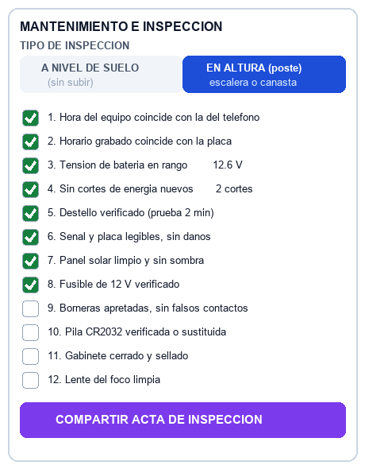

# Propuesta: inspección a nivel de suelo o en altura, y auditoría de lo hecho

**Para revisión funcional. 22-ago-2026.**

Este documento no propone una mejora estética. Propone arreglar tres cosas que hoy hacen que
**una inspección no deje constancia de nada**, y una de ellas puede hacer que la constancia sea
directamente falsa.

---

## 1. Qué hay hoy, medido

Antes de proponer, lo que existe de verdad. Comprobado leyendo el código de la app, no el
emulador ni la documentación.

| Función | En la app | Estado |
|---|---|---|
| Telemetría de batería 12 V | ✅ | **Funciona.** Canal `AN1`, factor 6 correcto |
| Contador de cortes de energía | ✅ | Funciona, persiste en EEPROM |
| Diagnóstico de pila RTC `CR2032` | ✅ | Funciona, por desfase horario |
| Nombre / ubicación por el aire | ✅ | Funciona, y se guarda por MAC en el teléfono |
| Horario de la placa, 4 franjas | ✅ | Nuevo, con confirmación previa |
| Receso escolar | ✅ | Nuevo |
| Prueba de foco de 2 minutos | ✅ | Funciona |
| Exportar el acta | ✅ | Menú de compartir de Android — WhatsApp, correo, Drive |
| **Checklist de mantenimiento** | ⚠️ | **Decorativo** — ver 1.1 |
| **Selector suelo / altura** | ❌ | **No existe en la app** — ver 1.2 |
| **Historial de inspecciones** | ❌ | **No se guarda nada** — ver 1.3 |

### 1.1 El checklist no está conectado

Las cuatro casillas existen en la pantalla (`idChkPanelSolar`, `idChkPilaRTC`, `idChkBorneras`,
`idChkTestLuz`) pero **ninguna está enlazada al código**: cero llamadas a `findViewById` sobre
ellas, y no aparecen en el acta que se exporta.

El técnico las marca, ve que quedan marcadas, y **no llegan a ningún sitio**. El acta que se
envía a soporte no dice qué se revisó.

### 1.2 El selector suelo / altura solo existe en el emulador

Está en `4 Simulador/emulador_app/index.html:407`. El commit que lo anunció —`ff40a2c`, *«añadir
selector de tipo de inspección (Suelo sin subir vs Poste con escalera)»*— **tocó un único
fichero, el del emulador**. En el APK, la palabra «escalera» no aparece.

### 1.3 No hay historial

Lo único que la app guarda es el **nombre de la baliza por dirección MAC**
(`SharedPreferences("BalizasDB")`). El resto vive en la pantalla y muere al cerrar la app.

**Consecuencia para auditoría:** hoy no se puede auditar. No hay registro de quién inspeccionó,
cuándo, ni qué comprobó. La única traza es un mensaje de WhatsApp que alguien haya conservado —
y eso no se puede consultar por señal ni por fecha.

---

## 2. Por qué el tipo de inspección no es un detalle

Es lo que decide **qué se puede verificar honestamente**.

Una inspección desde el suelo se hace con el teléfono, sin tocar el equipo. Todo lo que se
comprueba llega por Bluetooth: la hora, el horario grabado, la tensión de la batería, los cortes
registrados, y el destello —que se ve desde abajo—.

Subir al poste es **otro trabajo**: escalera o canasta, normalmente dos personas, con su equipo
de protección. Ahí es donde se limpia el panel, se revisa el fusible, se aprietan las borneras y
se cambia la pila.

> **El problema del checklist actual es que mezcla los dos.** «Panel solar limpio y fusible 12V
> verificado» **no se puede hacer desde el suelo**, pero la casilla está ahí y se puede marcar.
> Un checklist que permite afirmar lo que no se ha comprobado es peor que no tener checklist:
> convierte una revisión incompleta en un documento que dice que fue completa.

---

## 3. La pantalla completa

La jerarquía de abajo viene de la propuesta de diseño en circulación, y **se acepta tal cual**:
coincide con lo que la app ya hace y con el orden en que el técnico trabaja. Lo único que cambia
es la tarjeta 6, por lo dicho en el apartado 2.

```
┌──────────────────────────────────────────────────────────────┐
│  IT VIAL 30 (v3.4)          [DISPOSITIVO]   [LEER]           │
├──────────────────────────────────────────────────────────────┤
│ 1. CONSOLA DE TELEMETRIA   (fija arriba, monoespaciada)      │
│    FW 3.4 · RTC 12:43:02 · Bat 12.6V · Cortes 2              │
├──────────────────────────────────────────────────────────────┤
│ 2. IDENTIFICADOR DE LA SEÑAL (OTA)                           │
├──────────────────────────────────────────────────────────────┤
│ 3. AUTODIAGNOSTICO Y SALUD ENERGETICA                        │
├──────────────────────────────────────────────────────────────┤
│ 4. HORARIO DE ESTA PLACA        <-- la funcion principal     │
│    4 franjas · dias · GRABAR · RECESO · REANUDAR             │
├──────────────────────────────────────────────────────────────┤
│ 5. PRUEBA DE FOCO (2 min) con cuenta atras                   │
├──────────────────────────────────────────────────────────────┤
│ 6. MANTENIMIENTO, CHECKLIST Y ACTA    <-- lo que se propone  │
├──────────────────────────────────────────────────────────────┤
│ 7. CONFIGURACION MANUAL AVANZADA (alarmas 1 a 5)             │
└──────────────────────────────────────────────────────────────┘
```

Los criterios de campo también se comparten y ya están medidos en la app
(`comprobar_ui.py`): contraste WCAG, texto de 13sp o más, áreas táctiles de 48dp o más.
**Los tres pasan.**

### 3.0 Tres afirmaciones de esa propuesta que no se sostienen

No es reproche: es que si se dan por buenas, se planifica sobre algo que no existe.

| Afirmación | Medido |
|---|---|
| *«El certificado incluye el checklist de inspección»* | ❌ **No lo incluye.** El acta lleva telemetría, horarios y la caja negra UART. Ni una casilla |
| *«Nombre del Colegio / Ubicación GPS»* | ❌ **No hay GPS.** La app declara permisos de ubicación, pero son los que Android exige para **buscar por Bluetooth**; no hay una sola línea que lea la posición |
| *«Checklist: Panel y Fusible 12V, Borneras…»* como lista única | ⚠️ Es justo el problema del apartado 2: mezcla lo que se ve desde el suelo con lo que exige subir |

Lo que sí es cierto y conviene reconocer: **`FW 3.4` ya aparece en la consola** — se añadió hoy al
firmware, y antes ninguna baliza sabía decir qué versión llevaba.

---

## 4. La propuesta

### 4.1 Lo primero que se elige, y manda sobre el resto

```
┌────────────────────────────────────────────────────┐
│  TIPO DE INSPECCIÓN                                │
│  ┌──────────────────────┬─────────────────────────┐│
│  │  A NIVEL DE SUELO    │   EN ALTURA (poste)     ││
│  │  (sin subir)         │   escalera o canasta    ││
│  └──────────────────────┴─────────────────────────┘│
└────────────────────────────────────────────────────┘
```

Un control de dos posiciones, grande, arriba de la tarjeta de mantenimiento. No es un
desplegable escondido: es lo primero que se toca y cambia lo que se ve debajo.

### 4.2 El checklist cambia con la elección





**A nivel de suelo** — solo lo verificable sin tocar el equipo:

```
☐ 1. Hora del equipo coincide con la del teléfono
☐ 2. Horario grabado coincide con la placa atornillada
☐ 3. Tensión de batería dentro de rango        [ 12.6 V ]
☐ 4. Sin cortes de energía nuevos              [ 2 cortes ]
☐ 5. Destello verificado con la prueba de 2 minutos
☐ 6. Señal y placa legibles, sin daños ni obstrucción
```

**En altura** — los seis anteriores, **más** los físicos:

```
☐ 7. Panel solar limpio y sin sombra
☐ 8. Fusible de 12 V verificado
☐ 9. Borneras apretadas, sin falsos contactos
☐ 10. Pila CR2032 verificada o sustituida
☐ 11. Gabinete cerrado y sellado, sin entrada de agua
☐ 12. Lente del foco limpia
```

**Los puntos que no aplican no se muestran en gris: no se muestran.** Si no están en pantalla,
no se pueden marcar por descuido. Y debajo, una línea que evita el malentendido:

> *Inspección a nivel de suelo. **6 puntos adicionales requieren subir al poste** y no se han
> verificado en esta visita.*

### 4.3 Esa frase entra en el acta

El acta exportada tiene que decir **qué no se comprobó**, no solo qué sí. Propuesta:

```
MODALIDAD:  Inspección a nivel de suelo (sin subir al poste)
----------------------------------------
CHECKLIST — 5 de 6 verificados
  [X] Hora del equipo coincide con la del teléfono
  [X] Horario grabado coincide con la placa
  [X] Tensión de batería dentro de rango (12.6 V)
  [X] Sin cortes de energía nuevos (2 cortes)
  [X] Destello verificado (prueba de 2 minutos)
  [ ] Señal y placa legibles          <-- NO VERIFICADO
----------------------------------------
NO APLICA EN ESTA MODALIDAD (requiere subir al poste):
  panel solar · fusible 12 V · borneras · pila CR2032 ·
  sellado del gabinete · lente del foco
```

Un acta que enumera lo no verificado es la diferencia entre un registro y una coartada.

### 4.4 Dónde se guarda

Propuesta mínima que ya resuelve la auditoría, sin servidor ni conectividad:

* Cada inspección se guarda en el teléfono como un registro con **fecha, MAC, nombre de la
  señal, modalidad, checklist completo y la telemetría de ese momento**.
* Se indexan **por MAC**, que es lo único que identifica físicamente a una baliza.
* Al conectar con una señal, la app muestra **«Última inspección: 12-ago-2026, a nivel de
  suelo»**, para que el técnico sepa qué se hizo la vez anterior y si toca subir.
* El acta se sigue compartiendo por el menú de Android, y además **se puede exportar el historial
  completo** de una señal.

Con eso una auditoría puede responder: *¿cuándo se inspeccionó esta señal por última vez, quién,
qué comprobó y qué quedó sin comprobar?* Hoy no puede responder ninguna de las cuatro.

---

## 5. Lo que hace falta decidir antes de implementar

No lo decide quien programa:

1. **¿Los 12 puntos son los correctos?** Los he derivado de la tarjeta y del manual actual, pero
   quien mantiene estas señales sabrá si falta alguno o sobra.
2. **¿Cada cuánto toca subir?** Si la norma o el contrato fijan una periodicidad para el
   mantenimiento físico, la app puede avisar: *«última inspección en altura hace 8 meses»*.
3. **¿Hace falta identificar al técnico?** Un acta sin firma no acredita quién la hizo. Si se
   necesita, hay que decidir cómo — usuario y clave, o un campo de nombre y cédula.
4. **¿El historial se queda en el teléfono o tiene que salir?** Si el teléfono se pierde o se
   cambia, el historial se va con él. Exportarlo periódicamente resuelve el caso simple.
5. **¿Quién consulta esto?** De la respuesta depende el formato: no es lo mismo para el técnico
   en el poste que para una auditoría externa.

---

## 6. El emulador web es la causa de fondo, y hay que decidir qué se hace con él

Varias funciones se «vieron funcionando» en las demos sin existir nunca en el APK, porque lo que
se enseñaba era **el emulador web** (`4 Simulador/emulador_app/index.html`), no la aplicación. El
selector suelo/altura es el caso claro: su commit tocó ese único fichero.

Ahora la divergencia va en sentido contrario — el emulador se quedó con el 1-Toque viejo y no
tiene ni las cuatro franjas ni el receso.

Hay dos salidas y conviene elegir una a conciencia:

1. **Mantenerlo sincronizado** con la app. Da una pantalla cómoda para enseñar y para probar
   contra el firmware sin teléfono, pero **duplica el trabajo en cada cambio** y la divergencia
   volverá en cuanto alguien tenga prisa.
2. **Degradarlo a banco de pruebas del protocolo**, sin pretensión de parecerse a la app: sirve
   para ejercitar tramas contra el firmware, y se deja de usar para enseñar la interfaz.

Sea cual sea, **la regla que falta es la misma**: una función no está hecha hasta que está en el
APK. El emulador no cuenta como implementación, y las demos deberían hacerse sobre el APK.

---

## 7. Coste

Todo lo anterior es **de la aplicación**. **No requiere tocar el firmware ni volver a grabar
ningún PIC**: la baliza ya entrega la telemetría que hace falta.

---

## Referencias

* Base normativa: [`NORMATIVA.md`](NORMATIVA.md)
* Manual de campo: [`MANUAL_USUARIO_APP.md`](MANUAL_USUARIO_APP.md)
* Estado y pendientes: [`../ROADMAP.md`](../ROADMAP.md)
