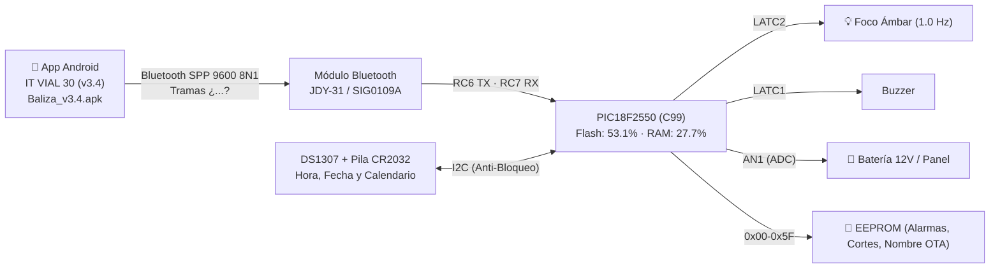

# Baliza — Señal Vial «30 CUANDO ACTIVADA» (v3.4 Oficial)

Control inteligente de la **luz intermitente de una señal de tránsito** instalada frente a zonas escolares.
Cuando la luz titila a **1.0 Hz** (500 ms ON / 500 ms OFF), el límite de **30 km/h está vigente legalmente**. El resto del día la señal permanece apagada.

El horario en el que debe titilar **está grabado físicamente en la placa metálica de la señal**:
* **Mañana:** 06:00 am a 09:00 am
* **Mediodía:** 11:30 am a 01:30 pm (13:30)
* **Tarde:** 03:00 pm (15:00) a 04:30 pm (16:30)

---

## 🏗️ Arquitectura del Sistema



| Parámetro | Especificación de Producción |
|---|---|
| **Microcontrolador** | **Microchip PIC18F2550** a 20.0 MHz (HS) |
| **Compilador Firmware** | **MPLAB XC8 v2.36** en **C99** (`--std=c99`) |
| **Memoria Flash PIC** | **17.407 Bytes (53.1%)** (Libres: 15.361 B / 46.9%) |
| **Memoria RAM PIC** | **568 Bytes (27.7%)** (Libres: 1.480 B / 72.3%) |
| **Binario Universal PIC** | [`1 Firmware/BALIZA_18F2550_V1_CORREGIDO.hex`](1%20Firmware/BALIZA_18F2550_V1_CORREGIDO.hex) |
| **Mapa de Memoria Simbólico** | [`1 Firmware/BALIZA_18F2550_V1_CORREGIDO.map`](1%20Firmware/BALIZA_18F2550_V1_CORREGIDO.map) |
| **Hash SHA-256 (.hex)** | `048856FC78E858A97FB831B34EE6032CE0CC4594D101F9E40A6EFFD4E68EC419` |
| **Instalador Android (APK)** | [`7 sw apk/Baliza_IT_VIAL_30_v3.4.apk`](7%20sw%20apk/Baliza_IT_VIAL_30_v3.4.apk) |
| **Hash SHA-256 (.apk)** | `55E208611E66EF9D0D4383B3346CE8C284677B975CE4745D1D9D3DE8890A3E0C` |
| **Cobertura de Pruebas** | **58 de 58 Comprobaciones (100% PASS)** + **100.000 Ciclos Estrés** + **6 Meses Simulación** |

---

## 🌟 Novedades y Funcionalidades v3.4

1. **Binario Universal Único:** Se graba el mismo archivo `.hex` idéntico en todos los microcontroladores en fábrica y nunca más se vuelve a tocar. El chip se auto-inicializa en el primer arranque.
2. **Instalador APK Android Listo para Campo:** Compilado con JDK 11 y Android SDK, optimizado para celulares Android 7.0 hasta Android 14.
3. **Nombre y Ubicación por el Aire (OTA):** El técnico asigna el nombre del colegio (ej. `Col. San José - Km 4+200`) desde la App, y el PIC lo graba en su EEPROM interna (`0x40..0x5F`).
4. **Telemetría Dual Inteligente:**
   * Canal ADC `AN1`: Voltímetro en tiempo real de la batería de 12V y panel solar.
   * Detección de pila de botón RTC CR2032 (3V) agotada por desfase horario.
5. **Contador de Cortes de Energía en EEPROM (`0x36-0x37`):** Registro histórico de reinicios para auditoría y detección de falsos contactos.
6. **App Android v3.4 100% Responsiva:** Diseño ergonómico adaptado a cualquier pantalla con Touch Targets $\ge 48\text{ dp}$ y alto contraste solar.
7. **Caja Negra y Certificado Oficial para WhatsApp:** Botón para generar y enviar reportes técnicos completos con dirección MAC en 1 clic.

---

## 🧪 Pruebas, Simulación y Emulador Web

Para verificar la compuerta de calidad o correr el simulador interactivo:

```bash
# 1. Arnés de 58 pruebas unitarias, estrés de 100k ciclos y 6 meses continuos:
python "4 Simulador/correr.py"

# 2. Suite automatizada End-to-End paso a paso (Headless):
python "4 Simulador/test_suite_e2e.py"

# 3. Emulador Web Interactivo conectado al Microcontrolador en C:
python "4 Simulador/servidor_interactivo.py"
# Abrir en el navegador: http://localhost:8080
```

---

## 📚 Documentación Oficial y Manuales

* 📱 **Instalador APK Android:** [`7 sw apk/Baliza_IT_VIAL_30_v3.4.apk`](7%20sw%20apk/Baliza_IT_VIAL_30_v3.4.apk)
* 📖 **Manual de Usuario de la App v3.4:** [`Manuales/MANUAL_USUARIO_APP.md`](Manuales/MANUAL_USUARIO_APP.md)
* ⚙️ **Manual Técnico del Firmware C99:** [`Manuales/MANUAL_TECNICO_FIRMWARE_C99.md`](Manuales/MANUAL_TECNICO_FIRMWARE_C99.md)
* 📜 **Certificado Oficial de Calibración y Pruebas:** [`Manuales/CERTIFICADO_FIRMWARE_v3.4.md`](Manuales/CERTIFICADO_FIRMWARE_v3.4.md)
* 🗺️ **Gestión de Múltiples Señales y Nombres OTA:** [`Manuales/GESTION_MULTISEÑALES_Y_NOMBRES.md`](Manuales/GESTION_MULTISE%C3%91ALES_Y_NOMBRES.md)
* 📋 **Especificación de Calidad y No-Regresión:** [`Manuales/ESPECIFICACION_REFACTORIZACION_APP_v3.4.md`](Manuales/ESPECIFICACION_REFACTORIZACION_APP_v3.4.md)
* 🩺 **Guía de Diagnóstico y Logs de Soporte:** [`Manuales/GUIA_DIAGNOSTICO_Y_LOGS_SOPORTE.md`](Manuales/GUIA_DIAGNOSTICO_Y_LOGS_SOPORTE.md)
* 🏛️ **Dictamen del Comité Técnico:** [`Manuales/DICTAMEN_COMITE_TECNICO_MULTIDISCIPLINARIO.md`](Manuales/DICTAMEN_COMITE_TECNICO_MULTIDISCIPLINARIO.md)
* 🗺️ **Hoja de Ruta (Roadmap):** [`ROADMAP.md`](ROADMAP.md)
