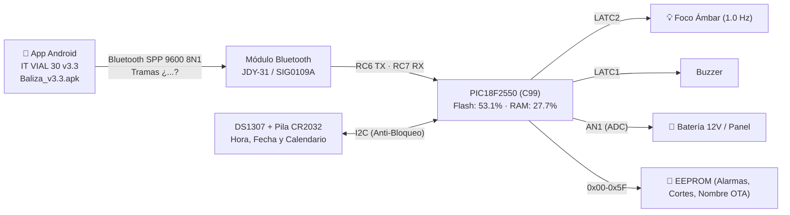

# Baliza — Señal Vial «30 CUANDO ACTIVADA» (v3.3)

Control inteligente de la **luz intermitente de una señal de tránsito** instalada frente a zonas escolares.
Cuando la luz titila a **1.0 Hz** (500 ms ON / 500 ms OFF), el límite de **30 km/h está vigente legalmente**. El resto del día la señal permanece apagada.

El horario en el que debe titilar **está grabado físicamente en la placa metálica de la señal**:
* **Mañana:** 06:00 am a 09:00 am
* **Mediodía:** 11:30 am a 01:30 pm (13:30)
* **Tarde:** 03:00 pm (15:00) a 04:30 pm (16:30)

---

## 🏗️ Arquitectura del Sistema



## La v3.3 es una pareja, y solo vale junta

**La v3.3 son dos ficheros que se probaron juntos contra una señal real.** Confirmado por el
responsable el 22-ago-2026. No se mezclan con nada de otra procedencia:

| | Fichero | Tamaño | SHA-256 |
|---|---|---|---|
| **Firmware** | [`1 Firmware/Doc mplabx/build_xc8/main.hex`](1%20Firmware/Doc%20mplabx/build_xc8/main.hex) | 59.577 B | `c14b4350d960ce46c716d398f357acdee21f05660ef47c0ea61a7d513b8539c5` |
| **App** | [`1 Firmware/Baliza_v3.3.apk`](1%20Firmware/Baliza_v3.3.apk) | 3.859.625 B | `9c37d599deb995b0fa606d65b5e7fa7e813a08314535f9ba1959b3524d391a87` |

> ### ⚠️ Hay otro `.hex` con nombre de entregable que NO es este
>
> `BALIZA_18F2550_V1_CORREGIDO.hex` —tanto el de `1 Firmware/` como **el que hay dentro de
> `Release_v3.3/Binarios/`**— es un binario **distinto**: 49.068 B, `048856fc…`. No es el que
> funcionó. El nombre engaña justo donde más caro sale, porque está dentro de la carpeta de
> release y cualquiera lo tomaría por el bueno. **Antes de grabar, se comprueba el SHA-256, no
> el nombre del fichero.**

| Parámetro | Valor |
|---|---|
| **Microcontrolador** | **Microchip PIC18F2550** a 20.0 MHz (HS) |
| **Compilador Firmware** | **C99** (`--std=c99`). ⚠️ **La versión exacta de XC8 de este binario no está registrada**: la carpeta `build_xc8/` no conserva el `.map`. Ver ROADMAP, pendiente 5 |
| **Binario que corre HOY en la calle** | Sin confirmar — ver ROADMAP, pendiente 3 |
| **Cobertura de Pruebas** | **78 de 78 · PASS**, medido el **22-ago-2026** con `python "4 Simulador/correr.py"` |
| **Comprobación de interfaz** | **PASS** — contraste WCAG, áreas táctiles, responsive y **controles muertos**, con `comprobar_ui.py`. **No sustituye a verla en un teléfono** |

---

## Las mejoras de hoy: candidatas a la proxima version

Sobre la v3.3 hay **40 commits del 22-ago-2026** con trabajo real: saneamiento de la ISR,
aritmetica de punto fijo en vez de float, timeouts en I2C y UART, telemetria de bateria,
contador de cortes, nombre por el aire (OTA), autodiagnostico en la App y exportacion del
certificado. De ahi salen otros dos binarios:

| | Fichero | Tamano | SHA-256 (12) |
|---|---|---|---|
| Firmware | `1 Firmware/BALIZA_18F2550_V1_CORREGIDO.hex` | 49.201 B | `61e0441df8ce` |
| App | `7 sw apk/Baliza_IT_VIAL_30_v3.4.apk` | 4.570.184 B | `d159bbb4e76d` |

**Son la base de la proxima version, no una version.** Tres cosas tienen que pasar antes de
que puedan llamarse v3.4 y salir a campo:

1. **Funcional tiene que revisar las funciones nuevas.** Ninguna lo ha hecho todavia.
2. ~~Incrementar el `versionCode`.~~ **HECHO el 22-ago-2026.** `build.gradle` esta en
   `versionCode 34` / `versionName "3.4"` y el APK se **recompilo**, asi que ahora se declara
   de verdad como 3.4 y Android si ofrece la actualizacion sobre una v3.3 instalada.
   (El APK bajo de 6.066.074 a 3.869.517 B: mismas 695 entradas y mismo contenido
   descomprimido, solo mejor comprimido. No se perdio nada.)
3. **Hay que probar la pareja junta contra una senal real**, como se hizo con la v3.3. El
   firmware nuevo y la App nueva no se han validado juntos en campo.

Mientras tanto, **lo que se instala en campo es la v3.3**, y las dos cosas no se mezclan: la
App v3.3 con el `.hex` de la v3.3.

## Funcionalidades de la v3.3

Segun `Release_v3.3/LEEME_RELEASE_v3.3.md`, la v3.3 lleva:

**Firmware** (`main.hex`, 59.577 B)

1. **Cadencia reglamentaria de 1.0 Hz** - 500 ms encendido / 500 ms apagado.
2. **Mapeo de pines corregido:** buzzer en `RC1`, foco LED en `RC2`, pulsador en `RC0`.
3. **Parser serie protegido** contra tramas truncadas y caracteres NUL.
4. **Telemetria de bateria 12 V** por el canal ADC `AN1`.
5. **Contador de cortes de energia en EEPROM** (`0x36-0x37`).

**App** (`Baliza_v3.3.apk`, 3.859.625 B)

6. **1-Toque** que graba tres franjas FIJAS (06:00-09:00, 11:30-13:30, 15:00-16:30 L-V) — las de un colegio concreto. Sustituido en la candidata por la tarjeta «Horario de esta placa».
7. **Test de luz de 2 minutos** a 1.0 Hz con apagado rapido.
8. **Tema oscuro de alto contraste** para visibilidad diurna bajo sol.

> **Lo que NO esta en la v3.3:** el nombre por el aire (OTA), el certificado por WhatsApp y el
> semaforo de autodiagnostico. Esas son funciones de la compilacion de trabajo llamada «v3.4»
> y **no han pasado por funcional**. Si algun manual las describe como disponibles, el manual
> va por delante de lo aprobado.

---

## 🧪 Pruebas, Simulación y Emulador Web

Para verificar la compuerta de calidad o correr el simulador interactivo:

```bash
# 1. Arnés de 58 pruebas unitarias, estrés de 100k ciclos y 6 meses continuos:
python "4 Simulador/correr.py"

# 2. Suite automatizada End-to-End paso a paso (Headless):
python "4 Simulador/test_suite_e2e.py"

# 3. Emulador Web Interactivo conectado al Microcontrolador en C:
python "4 Simulador/servidor_interactivo.py"
# Abrir en el navegador: http://localhost:8080
```

---

### Qué NO cubren esas comprobaciones

El arnés compila los `.c` reales del firmware y los ejercita en el PC, pero **no toca un solo
pin**. Verde aquí no es entregable y no autoriza a grabar. En concreto no dice nada de:

* **El ADC.** Desde el 22-ago-2026 **sí lo cubre en parte** (bloque `I` del arnés), y lo
  primero que midió es que **la baliza no mide la temperatura**: el estado que la lee es
  código muerto, nadie transiciona a él. **La telemetría de batería (`AN1`) no está afectada
  y funciona.** Detalle en [`ROADMAP.md`](ROADMAP.md).
* **El I²C y el DS1307.** El reloj simulado siempre responde. Una pila `CR2032` agotada o unas
  pull-ups mal no existen en el simulador.
* **Que el módulo Bluetooth empareje.** Al arnés se le meten las tramas directamente.
* **Que el horario grabado coincida con la chapa atornillada a esa señal.** Esto es lo que más
  importa y **solo lo puede comprobar una persona con la señal delante**.

---

## 📚 Documentación Oficial y Manuales

* 📱 **Instalador de campo (v3.3, el aprobado):** [`1 Firmware/Baliza_v3.3.apk`](1%20Firmware/Baliza_v3.3.apk)
* 🔧 **Compilacion de trabajo (NO aprobada):** [`7 sw apk/Baliza_IT_VIAL_30_v3.4.apk`](7%20sw%20apk/Baliza_IT_VIAL_30_v3.4.apk)
* 🔧 **Compilar la app (cadena, dependencias, trampas):** [`Manuales/COMPILAR_APP.md`](Manuales/COMPILAR_APP.md)
* 📖 **Manual de Usuario de la App:** [`Manuales/MANUAL_USUARIO_APP.md`](Manuales/MANUAL_USUARIO_APP.md)
* ⚙️ **Manual Técnico del Firmware C99:** [`Manuales/MANUAL_TECNICO_FIRMWARE_C99.md`](Manuales/MANUAL_TECNICO_FIRMWARE_C99.md)
* 📜 **Certificado Oficial de Calibración y Pruebas:** [`Manuales/CERTIFICADO_FIRMWARE_v3.4.md`](Manuales/CERTIFICADO_FIRMWARE_v3.4.md)
* 🗺️ **Gestión de Múltiples Señales y Nombres OTA:** [`Manuales/GESTION_MULTISEÑALES_Y_NOMBRES.md`](Manuales/GESTION_MULTISE%C3%91ALES_Y_NOMBRES.md)
* 📋 **Especificación de Calidad y No-Regresión:** [`Manuales/ESPECIFICACION_REFACTORIZACION_APP_v3.4.md`](Manuales/ESPECIFICACION_REFACTORIZACION_APP_v3.4.md)
* 🩺 **Guía de Diagnóstico y Logs de Soporte:** [`Manuales/GUIA_DIAGNOSTICO_Y_LOGS_SOPORTE.md`](Manuales/GUIA_DIAGNOSTICO_Y_LOGS_SOPORTE.md)
* 🏛️ **Dictamen del Comité Técnico:** [`Manuales/DICTAMEN_COMITE_TECNICO_MULTIDISCIPLINARIO.md`](Manuales/DICTAMEN_COMITE_TECNICO_MULTIDISCIPLINARIO.md)
* ⚖️ **Base normativa (Manual de Señalización Vial):** [`Manuales/NORMATIVA.md`](Manuales/NORMATIVA.md)
* 🗺️ **Hoja de Ruta (Roadmap):** [`ROADMAP.md`](ROADMAP.md)
