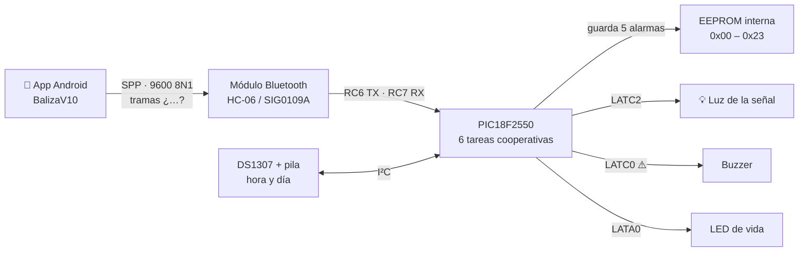

# Baliza — señal vial «30 CUANDO ACTIVADA»

Control de la **luz intermitente de una señal de tránsito** instalada frente a un colegio.
Cuando la luz titila, el límite de **30 km/h está vigente** para todo el que pasa. El resto
del día la señal está apagada y el límite no rige.

El horario en el que debe titilar **no lo elige el equipo ni el operario**: va impreso en una
placa atornillada a la propia señal. La de referencia dice:

```
Entre 6:00 am y 9:00 am
Entre 11:30 am y 1:30 pm
Entre 3:00 pm y 4:30 pm
```

> **La consecuencia que gobierna todo este proyecto:** si lo que se programa por Bluetooth no
> coincide exactamente con lo que dice esa placa, la señal afirma una cosa y hace otra, delante
> de un colegio, y nadie lo detecta desde el escritorio. Cada comprobación de este repositorio
> existe por eso.

Fotos del equipo en [`3 Imagen/`](3%20Imagen/).

---

## El sistema, de un vistazo



| | |
|---|---|
| Microcontrolador | **PIC18F2550** a 20 MHz (`FOSC = HS`) |
| Compilador | **MPLAB X 5.45** + **XC8**, obligatoriamente en **C99** |
| Arquitectura | protothreads cooperativos sobre un tick de Timer0 |
| Alarmas | **5**, cada una con hora de inicio, hora de fin y días |
| Comunicación | serie **9600 8N1 fija** sobre Bluetooth SPP |
| Persistencia | EEPROM interna del PIC, 36 bytes usados |
| Autor original | Ing. Freiman Parga, octubre–noviembre de 2022 |

---

## Estado hoy

**El simulador pasa entero: 33 → 37 comprobaciones, las 37 en verde.** Los defectos que hacían
que la señal mintiera están arreglados y **verificados por inyección de defecto** — se rompió
cada arreglo a mano y el arnés lo cazó.

| | qué se arregló | dónde |
|---|---|---|
| ✅ | **La luz parpadea a 1 Hz**: 500 ms encendida, 500 ms apagada. Cadencia confirmada por el funcional el 21-ago-2026, y es la que piden los manuales de señalización para zona escolar (50–60 destellos/min) | `Cluster.c` |
| ✅ | **Arrancar dentro de una franja ya enciende la luz.** Se evalúa pertenencia al intervalo en vez de igualdad exacta de minuto, así que un corte de luz a las 06:30 ya no deja la señal apagada toda la mañana | `Alarma.c` |
| ✅ | **Las franjas solapadas ya no se apagan entre ellas**: `ap.flagAlarm` es el OR de las cinco alarmas | `Alarma.c` |
| ✅ | **Una trama malformada ya no tumba el firmware**: `strstr()` comprobado contra `NULL` y copias acotadas | `Serial.c` |
| ✅ | **El buzzer está en RC1**, que es donde lo tiene la tarjeta, y RC0 vuelve a ser entrada del pulsador | `Buzzer.h` / `Buzzer.c` |
| ✅ | **Sincronización RTC DS1307 Validada en Banco**: Comando `¿R[HHMM],C[DDMMAA-D]?` probado en hardware real con PIC18F2550 + JDY-31. Ajuste al segundo con la hora celular | Banco Físico / DS1307 |
| ✅ | **App Móvil v2.8 Liberada**: Soporte total de temas Claro y Oscuro (Night Mode) con texto negro y cajas contrastadas en todas las marcas de celular, panel de **Test de Luz Inmediato (2 Min)** y sesión Bluetooth blindada | `Baliza_v2.8.apk` |

Compila con XC8 en **21.147 de 32.768 bytes (64,5 %)** y 688 de 2.048 de datos.

> **Binarios Oficiales Listos para Banco y Terreno:**
> * **Firmware PIC:** [`1 Firmware/BALIZA_18F2550_V1_CORREGIDO.hex`](1%20Firmware/BALIZA_18F2550_V1_CORREGIDO.hex)
> * **App Android:** [`1 Firmware/Baliza_v2.8.apk`](1%20Firmware/Baliza_v2.8.apk)

La cifra viva está en **[`ESTADO.md`](ESTADO.md)**; lo que queda por hacer, en
**[`ROADMAP.md`](ROADMAP.md)**.

> **La tarjeta ya está fabricada y es un dato fijo.** Cuando el firmware y la placa no
> coincidan, se cambia el firmware. No se rediseña el hardware.

---

## Los documentos

| documento | para qué |
|---|---|
| [`ESTADO.md`](ESTADO.md) | qué corre hoy y qué está roto. Se reescribe cada sesión |
| [`ROADMAP.md`](ROADMAP.md) | en qué orden arreglar, y por qué ese orden |
| [`Manuales/FIRMWARE.md`](Manuales/FIRMWARE.md) | el firmware módulo a módulo, con sus defectos y su línea |
| [`Manuales/HARDWARE.md`](Manuales/HARDWARE.md) | la tarjeta: componentes, netlist y el mapeo real de pines |
| [`Manuales/APP_MOVIL.md`](Manuales/APP_MOVIL.md) | la app Android y el contrato de tramas |
| [`Manuales/BLUETOOTH.md`](Manuales/BLUETOOTH.md) | por qué el módulo nuevo no funciona y cómo probarlo |
| [`Manuales/MANUAL_FUNCIONAL_BLUETOOTH.md`](Manuales/MANUAL_FUNCIONAL_BLUETOOTH.md) | la hoja que sigue el funcional para configurar y validar cada módulo |
| [`Manuales/COMPILAR_Y_GRABAR.md`](Manuales/COMPILAR_Y_GRABAR.md) | cómo compilar lo que se modifique y cómo grabarlo |

---

## Las carpetas

```
1 Firmware/
  Doc mplabx/
    18f2550_baliza_ V1.X/      código C del PIC  ← lo que se modifica
    18f2550_baliza__V1.X.production.hex   binario en producción hoy
  Doc Aplicativo Movil/
    BalizaV10/                 app Android (Gradle + Java nativo)
    Apk/Baliza.apk             instalador para el móvil
2 Hardware tarjeta/            KiCad, gerbers y lista de componentes
3 Imagen/                      fotos de la señal y de su placa de horarios
4 Simulador/                   el banco de pruebas de PC  ← se corre antes de grabar
5 HW bluetooth/                documentación del módulo nuevo
6 Sw pic/                      instaladores de MPLAB X y XC8
```

⚠️ Las rutas llevan espacios, y la carpeta del proyecto tiene un espacio antes de `V1.X`.
Entrecomilla siempre.

---

## Antes de grabar nada: el simulador

```bash
cd "D:/@Proyect/Baliza/4 Simulador" && python correr.py
```

Compila los `.c` **reales** del firmware con gcc contra unos stubs de `<xc.h>` y los ejercita:
arranque, protocolo de tramas, EEPROM, alarmas y la cadencia de la luz. Permite **hacer que
sean las 6:00 de la mañana** sin esperar a que amanezca.

Códigos de salida: **`0` PASS · `1` FALLA · `2` ABORTADO**.

`ABORTADO` gana sobre `FALLA`: si el instrumento no pudo correr, no ha medido nada y no puede
acusar al firmware.

**Lo que el simulador NO dice:** que un pin encienda su carga, que el DS1307 conserve la hora,
que el módulo Bluetooth empareje, ni que el horario grabado coincida con la placa de esa
señal. **Verde ahí no autoriza a grabar.**

Cómo está construido y cómo añadirle un escenario:
[`.claude/skills/simulador/`](.claude/skills/simulador/SKILL.md).

---

## Compilar el firmware

```bash
cd "D:\@Proyect\Baliza\1 Firmware\Doc mplabx\18f2550_baliza_ V1.X"
"C:\Program Files\Microchip\xc8\v2.36\bin\xc8.exe" --chip=18f2550 --std=c99 \
  --outdir=<salida> main.c Alarma.c Aplicacion.c Buzzer.c Cluster.c DS1307.c \
  EEprom.c I2C.c LedLive.c Serial.c TimeBase.c
```

Ocupa **21.309 de 32.768 bytes de programa (65 %)** y 687 de 2.048 de datos.

Dos cosas que hay que saber antes de intentarlo, las dos comprobadas:

- **`--std=c99` no es opcional.** En C90 el firmware **no compila**: `DS1307.c:66` inicializa un
  array `const` local con los parámetros de la función, que es legal en C99 y no en C90. No se
  toca el código: se compila en C99.
- **`File > Open Project` no va a funcionar.** La carpeta del firmware **no tiene `nbproject/`**,
  así que MPLAB X no la reconoce como proyecto. Hay que crear uno nuevo y añadir los fuentes
  existentes.

El detalle completo, y cómo grabar el PIC, en [`Manuales/COMPILAR_Y_GRABAR.md`](Manuales/COMPILAR_Y_GRABAR.md).

---

## El protocolo, en una línea

```
¿A3,E1,I0830,F1745,D9,?      programa la alarma 3 de 08:30 a 17:45, lunes a viernes
¿A2,E0,?                     apaga la alarma 2
¿R1130,C210826-4?            pone en hora: 11:30 del 21/08/26, jueves
¿L?                          pide el volcado de la configuración
```

Días: **8** diario · **9** lunes a viernes · **10** fin de semana.

El `¿` de apertura es en realidad el **byte 0xBF**, y la app lo manda en UTF-8 (**dos** bytes,
`0xC2 0xBF`). Funciona por casualidad, porque el firmware busca subcadena. Antes de tocar
`Serial.c` o la app, la skill
[`verificar-protocolo`](.claude/skills/verificar-protocolo/SKILL.md).

**La app no espera acuse de recibo:** escribe «Mensaje Enviado!!» sin que el equipo haya
confirmado nada. La única forma de saber que un horario quedó grabado es pedir el volcado con
`¿L?` y compararlo, campo por campo, con la placa atornillada a esa señal.

---

## Skills del repositorio

En [`.claude/skills/`](.claude/skills/), para quien trabaje aquí con Claude Code:

| skill | cuándo |
|---|---|
| [`verificar`](.claude/skills/verificar/SKILL.md) | correr el simulador y leer el resultado sin tragarse falsos verdes |
| [`simulador`](.claude/skills/simulador/SKILL.md) | tocar el banco de pruebas o añadirle un escenario |
| [`verificar-protocolo`](.claude/skills/verificar-protocolo/SKILL.md) | tocar `Serial.c` o la app, o afirmar que un horario quedó programado |
| [`entregar`](.claude/skills/entregar/SKILL.md) | preparar lo que sale hacia el responsable, el funcional o campo |

Y el agente [`firmware-pic`](.claude/agents/firmware-pic.md) para los cambios en el firmware.
