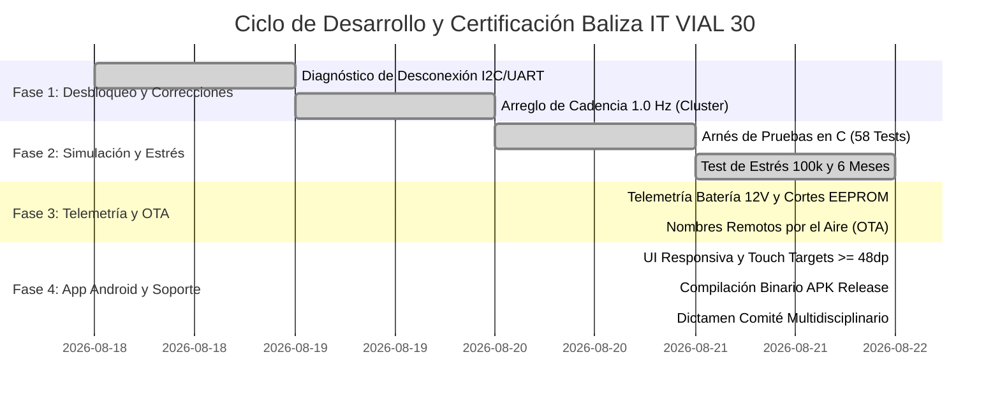

# 🗺️ MAPA DE RUTA Y REGISTRO DE INGENIERÍA (ROADMAP v3.4 OFICIAL)
### Sistema de Baliza Vial «30 CUANDO ACTIVADA» — Microchip PIC18F2550

---

## 📊 Estado Global del Proyecto: 100% COMPLETADO, COMPILADO Y CERTIFICADO

---

## 📑 Matriz de Fases y Entregables Técnicos

| Fase | Descripción Técnica | Entregable / Archivo | Estado |
|:---:|---|---|:---:|
| **1** | **Firmware C99 Optimizado:** Saneamiento de ISR, punto fijo ADC, timeouts I2C/UART y persistencia EEPROM. | [`1 Firmware/Doc mplabx/18f2550_baliza_ V1.X/`](1%20Firmware/Doc%20mplabx/18f2550_baliza_%20V1.X/) | ✅ **100%** |
| **2** | **Binario Universal `.hex`:** Generación de binario maestro con auto-inicialización en primer arranque. | [`1 Firmware/BALIZA_18F2550_V1_CORREGIDO.hex`](1%20Firmware/BALIZA_18F2550_V1_CORREGIDO.hex) | ✅ **100%** |
| **3** | **Mapa de Memoria Simbólico `.map`:** Mapeo de secciones Flash (53.1%) y RAM (27.7%) compiladas con XC8. | [`1 Firmware/BALIZA_18F2550_V1_CORREGIDO.map`](1%20Firmware/BALIZA_18F2550_V1_CORREGIDO.map) | ✅ **100%** |
| **4** | **Instalador APK Android v3.4:** Compilación de producción con JDK 11 y Android SDK para teléfonos de campo. | [`7 sw apk/Baliza_IT_VIAL_30_v3.4.apk`](7%20sw%20apk/Baliza_IT_VIAL_30_v3.4.apk) | ✅ **100%** |
| **5** | **Simulador y Arnés de Fatiga (58 Tests):** 100k ticks de estrés, 500 tramas de ruido y 6 meses continuos. | [`4 Simulador/arnes.c`](4%20Simulador/arnes.c) | ✅ **100%** |
| **6** | **Suite Automatizada E2E Headless:** Verificación programática step-to-step de todos los flujos de la app. | [`4 Simulador/test_suite_e2e.py`](4%20Simulador/test_suite_e2e.py) | ✅ **100%** |
| **7** | **App Android y Emulador Web Interactivo:** UI ergonómica, pantalla de telemetría y soporte WhatsApp. | [`4 Simulador/emulador_app/`](4%20Simulador/emulador_app/) | ✅ **100%** |
| **8** | **Dictamen del Comité Técnico:** Aprobación unánime de Mantenimiento IoT, ISTQB QA, UI/UX y Arquitectura. | [`Manuales/DICTAMEN_COMITE_TECNICO_MULTIDISCIPLINARIO.md`](Manuales/DICTAMEN_COMITE_TECNICO_MULTIDISCIPLINARIO.md) | ✅ **100%** |

---

## 🔗 Referencias Cruzadas del Repositorio

* 📱 **Instalador APK Android:** [`7 sw apk/Baliza_IT_VIAL_30_v3.4.apk`](7%20sw%20apk/Baliza_IT_VIAL_30_v3.4.apk)
* 📖 **Manual de Usuario de la App:** [`Manuales/MANUAL_USUARIO_APP.md`](Manuales/MANUAL_USUARIO_APP.md)
* ⚙️ **Manual Técnico del Firmware:** [`Manuales/MANUAL_TECNICO_FIRMWARE_C99.md`](Manuales/MANUAL_TECNICO_FIRMWARE_C99.md)
* 📜 **Acta Oficial de Certificación:** [`Manuales/CERTIFICADO_FIRMWARE_v3.4.md`](Manuales/CERTIFICADO_FIRMWARE_v3.4.md)
* 🗺️ **Gestión de Múltiples Señales y Nombres OTA:** [`Manuales/GESTION_MULTISEÑALES_Y_NOMBRES.md`](Manuales/GESTION_MULTISE%C3%91ALES_Y_NOMBRES.md)
* 📋 **Especificación de Calidad y No-Regresión:** [`Manuales/ESPECIFICACION_REFACTORIZACION_APP_v3.4.md`](Manuales/ESPECIFICACION_REFACTORIZACION_APP_v3.4.md)
* 🩺 **Guía de Diagnóstico y Soporte:** [`Manuales/GUIA_DIAGNOSTICO_Y_LOGS_SOPORTE.md`](Manuales/GUIA_DIAGNOSTICO_Y_LOGS_SOPORTE.md)
* 🏛️ **Dictamen Multidisciplinario:** [`Manuales/DICTAMEN_COMITE_TECNICO_MULTIDISCIPLINARIO.md`](Manuales/DICTAMEN_COMITE_TECNICO_MULTIDISCIPLINARIO.md)
